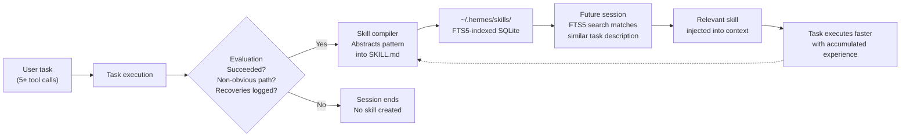
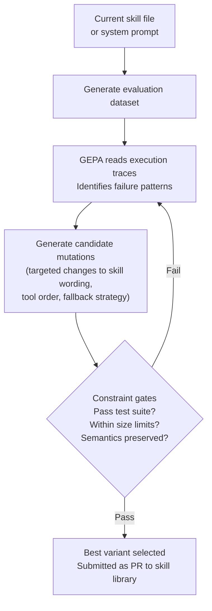

## The Forgetting Machine Problem

Every time you close an AI agent session, a small tragedy happens: everything the model worked out in that conversation vanishes. If it spent an hour debugging an obscure Python environment conflict and finally cracked it, the next session starts from scratch. No memory of the fix. No instinct to try the same approach first. No operational knowledge accumulated from the work.

This isn't a bug in the usual sense — it's a structural property of how most LLMs are deployed. Stateless inference engines process tokens, return a response, and discard context. The model weights stay fixed. Each session is a blank slate.

For single questions that's fine. For the kind of complex, multi-step work agents are increasingly asked to handle — setting up monitoring dashboards, wrangling legacy codebases, automating repetitive workflows — it's a serious limitation. A human collaborator who worked with you for a month would accumulate operational knowledge: your naming conventions, your preferred tools, the edge cases your environment regularly hits. Most AI agents don't.

**Hermes Agent**, an open-source framework released by Nous Research in February 2026, directly targets this problem. Its central mechanism is a **skill compilation loop**: a closed cycle that observes successful task executions, extracts reusable reasoning patterns, and writes them to persistent skill files the agent retrieves in future sessions. In four months it accumulated over 140,000 GitHub stars and became the most-used open-source agent on OpenRouter — a strong signal that the problem it solves is one many developers recognise.

---

## What a Skill Actually Is

Before getting into architecture, it helps to be concrete about what Hermes calls a "skill."

A skill is a plain Markdown file stored at `~/.hermes/skills/`. It records, in natural language the agent can later read and act on:

- What category of task this skill covers
- The approach that worked, step by step
- The pitfalls encountered along the way and how they were handled
- Which tools to reach for first

This is deliberately human-readable. You can open any skill file, understand what it says, edit it if your setup has changed, or delete it if it's wrong. There are no embeddings, no compiled binaries, no opaque blobs. Skills are structured notes — and they're portable. They conform to the **agentskills.io** open standard, which means skills built in Hermes are also recognised by Claude Code, OpenAI Codex CLI, Gemini CLI, and GitHub Copilot. Write a skill once; it travels across tools.

The Hermes skill library ships with 166 community-contributed skills across 26+ categories, covering domains from developer environment setup to data pipeline debugging. Users extend and share these through the agentskills.io registry.

---

## The Closed Learning Loop

When Hermes Agent completes a task involving five or more tool calls, it enters an evaluation phase. It asks itself: did this succeed? Was the path non-obvious? Were there recovery steps that would be worth documenting?

If the answers cross a threshold, the agent abstracts the reasoning pattern into a new skill file. Nous Research calls the full cycle the **"closed learning loop"**: solve → document → retrieve → improve → repeat.

The loop has a natural improvement mechanism. When the agent encounters a task similar to an existing skill, it executes using the stored approach — but also evaluates whether that approach still held. If a consistently better path emerges over multiple sessions, the skill document gets patched. Skills aren't frozen documentation; they evolve with the agent's experience.

An autonomous **Curator** component runs on a 7-day cycle: it reviews all agent-created skills, consolidates overlapping entries, archives ones that haven't been used recently, and protects manually-pinned skills from modification. This prevents the skill library from accumulating noise as it grows.

---

## A Three-Tier Memory Architecture

Skills are one layer in a broader memory system. Hermes maintains three distinct tiers:

| Tier | Storage | What it holds |
|---|---|---|
| **Working memory** | `USER.md` (≤2,500 chars) + `MEMORY.md` (≤3,000 chars) | High-signal state loaded into every session: your preferences, active projects, key constraints |
| **Episodic memory** | SQLite with FTS5 | Full conversation history, keyword-indexed and LLM-summarized before injection |
| **Procedural memory** | Skill files in `~/.hermes/skills/` | Reusable task-specific reasoning and decision patterns |

The three tiers serve different purposes. Working memory is always present — the agent's live model of who you are and what you're currently doing. Episodic memory is searched on demand when you need to pull context from a specific past conversation ("remember that API key issue from last week?"). Procedural memory — the skills — fires when the agent recognises a task pattern it has solved before.

Together these give the agent a form of persistent operational intelligence that compounds over time, without retraining the model. The weights stay fixed; the knowledge that wraps them grows.

One technical detail worth understanding: skills are retrieved via **SQLite FTS5 full-text search** against the user's current task description, not by broadcasting every skill into every prompt. An early-stage GitHub issue in the project highlighted that naive skill injection consumed roughly 4,500 tokens per turn across 167 skills — most of them irrelevant to the current task. The FTS5 retrieval approach pins the top 10 most-used skills and surfaces the top 5 contextually matched skills, capping total injection at 15 skills per turn regardless of library size.

---

## The Self-Evolution Layer

Beyond the runtime skill loop, Nous Research ships a companion system called **hermes-agent-self-evolution**, built on two complementary tools: **DSPy** and **GEPA**.

**DSPy** is a framework for prompt optimization — structuring the problem of "make this prompt work better" as a machine learning task rather than manual tuning.

**GEPA** stands for *Genetic-Pareto Prompt Evolution*. Where most optimization frameworks evaluate whether a variant succeeded, GEPA reads execution traces to understand *why* variants failed — analyzing the specific reasoning steps that went wrong rather than treating the outcome as a black box. The distinction matters because it generates much more targeted improvement proposals.

The optimization cycle works like this:

This costs roughly **$2–10 per optimization run** and requires no GPU — it operates entirely through API calls to the inference provider. The current implementation targets skill files (Phase 1); planned phases will extend to tool descriptions, system prompt sections, and eventually tool implementation code.

The reflective analysis is the key insight. Prompt optimization that only asks "did it work?" misses the texture of why a particular approach consistently fails on edge cases. Reading the trace — seeing which tool call produced ambiguous output, which disambiguation step the model took, where it went wrong — gives the optimizer leverage to propose mutations that actually address the failure mode rather than randomly exploring the space.

---

## Running It Locally — and Why That Matters

Hermes runs on anything from a $5 VPS to a local GPU cluster, and supports **400+ models across 25+ inference providers** via a unified `hermes model` command. Switching inference providers doesn't touch the skill or memory system — accumulated knowledge is model-agnostic. You can migrate from a hosted Claude endpoint to a local Qwen instance and your skill library travels with you unchanged.

The local-first design reflects a deliberate privacy stance. All session data — conversations, memory files, skill files, the SQLite database — stays on the user's machine. No telemetry, no cloud lock-in, no third-party retention of your operating context. For users running agents on sensitive codebases or proprietary workflows, that's not a minor feature.

NVIDIA highlighted the DGX Spark as a natural hardware pairing: a compact standalone machine designed for sustained all-day agentic work, where Tensor Cores accelerate inference enough that the agent's skill refinement steps run in seconds rather than minutes. The performance case for local inference on dedicated hardware gets stronger as the agent runs continuously and the skill library grows.

---

## The Measured Payoff

Nous Research's published benchmark claim is concrete: agents with 20 or more self-created skills complete similar future tasks **40% faster** than fresh agent instances without accumulated skills. That gap widens as the skill count grows.

The mechanism is straightforward. A skill file short-circuits the planning and tool-selection phase. Instead of the agent reasoning from scratch about which tools to try, in what order, with what fallback strategies, it reads a documented approach that already worked. Inference budget goes toward executing, not exploring.

The 40% figure measures task completion time, not token usage. Token cost per session may be marginally higher when skills are injected — but wall-clock time drops substantially, and error rates on familiar task categories fall. The compounding effect is the more interesting property: each new skill has a chance to benefit every future task in that category.

---

## Why This Architecture Is Worth Watching

Most AI capability progress comes from two places: making the base model smarter, or building better scaffolding around it. Hermes represents a third path — the agent accumulates its own operational knowledge as it works, independently of both model updates and manual engineering effort.

This matters because real agent usage isn't uniformly distributed. Any developer running an agent daily encounters the same narrow slice of problem types: their specific stack, their specific workflows, their specific environment quirks. A skill library tuned to that slice — built by the agent from its own experience — delivers a form of personalisation that neither fine-tuning nor prompt engineering easily replicates. It's operational knowledge in the exact shape of how you actually work.

The open standard is also significant. With agentskills.io adopted by Claude Code, Codex CLI, Gemini CLI, and GitHub Copilot, there's a plausible future where shared skill libraries emerge for common task domains — the way npm or pip accumulated reusable code, but for procedural reasoning. The 166 community-contributed skills already in Hermes are an early signal of that trajectory.

Hermes Agent reached version 0.17.0 on June 19, 2026. The self-evolution system is still expanding. The loop — solve, document, retrieve, improve — is simple enough to explain in a sentence and deep enough to keep compounding for years.

---

## Sources

- [NousResearch/hermes-agent — GitHub](https://github.com/nousresearch/hermes-agent)
- [NousResearch/hermes-agent-self-evolution — GitHub (DSPy + GEPA optimizer)](https://github.com/NousResearch/hermes-agent-self-evolution)
- [Feature: Semantic Skill Retrieval with SQLite FTS5 (Issue #17649) — GitHub](https://github.com/NousResearch/hermes-agent/issues/17649)
- [mudrii/hermes-agent-docs — Community architecture documentation — GitHub](https://github.com/mudrii/hermes-agent-docs)
- [Hermes Unlocks Self-Improving AI Agents, Powered by NVIDIA RTX PCs and DGX Spark — NVIDIA Blog](https://blogs.nvidia.com/blog/rtx-ai-garage-hermes-agent-dgx-spark/)
- [MUSE-Autoskill: Self-Evolving Agents via Skill Creation, Memory, Management, and Evaluation — arXiv 2605.27366](https://arxiv.org/abs/2605.27366)
- [Trajectory-Informed Memory Generation for Self-Improving Agent Systems — arXiv 2603.10600](https://arxiv.org/abs/2603.10600)
- [Open-Source AI June 2026: New Models, Agents & Papers — devFlokers](https://www.devflokers.com/blog/open-source-ai-roundup-june-2026)
- [Self-Improving AI Agents: The 2026 Guide — o-mega.ai](https://o-mega.ai/articles/self-improving-ai-agents-the-2026-guide)
