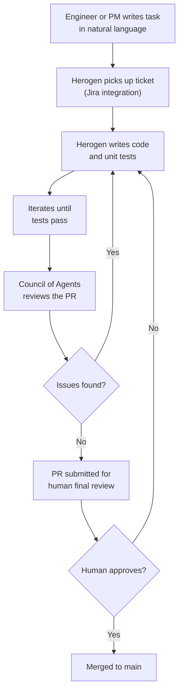
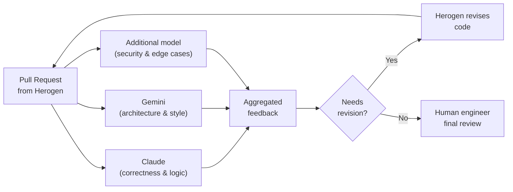

## A Food Delivery App, Not a Tech Giant

When you think of cutting-edge AI engineering deployments, you probably picture OpenAI, Google, or Meta — companies for whom AI is literally the product. So it was surprising when the company to unveil one of 2026's most impressive real-world agentic coding systems turned out to be **Delivery Hero**: a Berlin-headquartered food and quick commerce platform that operates in around 65 countries.

On April 26, 2026, Delivery Hero announced **Herogen**, an in-house autonomous software delivery agent that the company says already produces the equivalent annual coding output of **130 senior engineers**. It autonomously merges more than 100 code changes per day. It has freed up an estimated 250,000 hours of manual coding per year. And at the time of the announcement, it had only reached 18% adoption across the engineering team.

The story of Herogen is worth unpacking — not just because the numbers are remarkable, but because the architecture behind it offers a clear window into how large software organizations are beginning to restructure around AI agents rather than just alongside them.

---

## From Pair Programmer to Autonomous Colleague

For most of 2024 and early 2025, AI coding tools worked like a very smart autocomplete. GitHub Copilot, Cursor, and their peers would suggest the next line or the next function. The developer still held the wheel — they accepted or rejected suggestions, reviewed the output, and drove the work forward.

Herogen represents a different model. It is not a coding **assistant**. It is a coding **agent** — a system that takes a task description and independently executes the entire software delivery lifecycle end to end.

Here is how a typical Herogen workflow runs:

An engineer or product manager writes a task — in plain English — and assigns it via Jira. Herogen picks it up, writes the implementation, writes the tests, runs them, and iterates until they pass. It then submits a pull request. Before any human sees it, a **council of agents** made up of multiple large language models reviews the code from different technical angles. Only then does a human do a final check.

The vast majority of tasks require zero or one interaction with a human in the loop. The 85% success rate — measured as the proportion of pull requests that are accepted and merged — reflects a system that is genuinely producing production-quality code at scale.

---

## The Council of Agents: Why One Model Is Not Enough

The most architecturally interesting aspect of Herogen is what Delivery Hero calls the **council of agents** review stage.

Rather than relying on a single model to both write and review code, Herogen routes each completed pull request through a panel of models from different providers — including both Claude and Gemini — each examining the code from a different perspective. The rationale is straightforward: every large language model has blind spots baked into its training. A model that consistently misses a particular class of security issue will miss it on every PR it reviews. Using multiple models from different providers diversifies those blind spots.

Think of it like a peer review process. A single reviewer brings their own assumptions and experience. A panel of reviewers — especially ones with different backgrounds — is far more likely to catch what any individual would miss.

Herogen's primary coding model is **Claude Opus 4.5**, which handles the generation and iteration loop. The council then brings in additional models for the review pass. The human engineer at the end is not a safety theater — they retain genuine accountability — but they are reviewing polished, pre-vetted code rather than raw AI output.

---

## The Numbers in Context

**130 engineers** sounds like a large claim. Let's unpack what it actually means.

Delivery Hero says Herogen generates coding output equivalent to what 130 senior engineers would produce annually. The operative word is *output* — measured in merged pull requests and working features, not lines of code. By merging over 100 code change requests per day autonomously, it accumulates roughly **36,500 merges per year**.

At the time of the announcement, 18% of Delivery Hero's engineering organization had adopted Herogen, and those users were already accounting for **9% of all code change requests** across the company. The company has a stated goal of reaching 20% of all code change requests handled by Herogen by the end of 2026.

These numbers land differently when placed against the broader industry picture:

- GitHub reported in early 2026 that over **51% of code committed to its platform** was either generated or substantially assisted by AI
- A McKinsey survey of 4,500 developers across 150 enterprises found that AI coding tools reduce time spent on routine coding tasks by an average of **46%**
- Code review cycles across the industry have shortened by roughly **35%** with AI assistance
- Job postings requiring AI coding tool experience grew by **340%** between January 2025 and January 2026

Delivery Hero is ahead of the curve, but it is on the same curve as everyone else.

---

## Why Delivery Hero Built This In-House

The decision to build Herogen internally rather than buy a commercial coding agent reflects a specific strategic situation. Delivery Hero is in the middle of transforming from a pure food delivery platform into what it calls an **Everyday App** — a super-app covering food, groceries, quick commerce, and eventually more verticals.

That transformation requires shipping a large volume of features rapidly across a complex, globally distributed codebase. CTO **Benjamin Mann** framed the business case directly in the announcement: "As Delivery Hero builds the Everyday App for its customers, Herogen allows the company to deliver much bigger output with the same elite team. Engineers can delegate their coding work to Herogen to focus on the big picture and feature ideation."

The strategic logic is that Herogen is not a cost-reduction tool — it is a **scope-expansion tool**. The same engineering headcount can now pursue more features, enter more product areas, and sustain more simultaneous initiatives than would be physically possible with humans writing every line.

---

## What Changes for Software Engineers

It is worth being precise about what Herogen actually changes for the humans on the team, because the framing of "130 engineers" naturally raises the question of displacement.

Delivery Hero's current position is that Herogen supplements rather than replaces. The human engineers who used to write a feature now review the feature that Herogen wrote. The work shifts from **implementation** to **direction and judgment** — deciding what to build, setting the right acceptance criteria, and making the final call on whether the code is safe to ship.

This is a real change in job content, and not everyone will experience it as purely positive. Writing code is often where engineers develop intuition about systems — about how a change propagates, what breaks unexpectedly, where the hidden coupling lives. A team that delegates all first-pass implementation to an agent needs to be deliberate about maintaining that intuition through architecture reviews, postmortems, and the kind of deeper system-level thinking that agents cannot yet reliably do.

The more optimistic interpretation — and probably the more accurate one for high-output teams right now — is that the most tedious, lowest-leverage coding work gets absorbed, and the genuinely interesting problems get more human attention.

---

## The Shape of What's Coming

Herogen is not a one-off. It is an early, well-documented instance of a pattern that is playing out across software organizations at different speeds.

The 2026 Anthropic Agentic Coding Trends Report identifies the key shift clearly: frontier models can now sustain **long-running, multi-step workflows** — invoking tools, interpreting results, and iterating over time — rather than responding to single prompts. That capability, combined with integration into the project management and CI/CD infrastructure that engineering teams already use, is what turns a language model into something that can actually deliver software.

Delivery Hero's Herogen is the clearest public evidence yet that this shift is not theoretical. A company with real production code, real customers, and real deadlines has deployed an autonomous agent that handles nearly 10% of its software changes — and is scaling it up.

The era where AI wrote one function at a time is ending. The era where AI ships whole features is here.

---

## Sources

- [Delivery Hero Unveils Herogen – Autonomous AI Agent Unlocks 130-Person Engineering Output](https://www.deliveryhero.com/newsroom/delivery-hero-unveils-herogen-autonomous-ai-agent-unlocks-130-person-engineering-output/) — Delivery Hero Newsroom
- [Delivery Hero launches Herogen autonomous software delivery agent as part of everyday app push](https://retailtechinnovationhub.com/home/2026/4/26/delivery-hero-launches-herogen-autonomous-software-delivery-agent-as-part-of-everyday-app-push) — Retail Technology Innovation Hub
- [Delivery Hero Unveils Herogen – Autonomous AI Agent Unlocks 130-Person Engineering Output](https://www.marketscreener.com/news/delivery-hero-unveils-herogen-a-autonomous-ai-agent-unlocks-130-person-engineering-output-ce7f59dfdf8bf525) — MarketScreener
- [Delivery Hero Accelerates Q1 GMV Growth, Driven by Everyday App Strategy](https://www.deliveryhero.com/newsroom/delivery-hero-accelerates-q1-gmv-growth-driven-by-everyday-app-strategy-and-quick-commerce-momentum/) — Delivery Hero Newsroom
- [2026 Agentic Coding Trends Report](https://resources.anthropic.com/2026-agentic-coding-trends-report) — Anthropic
- [We Read Anthropic's 2026 Agentic Coding Trends Report. Here's What It Actually Means for Engineering Teams.](https://hivetrail.com/blog/anthropic-2026-agentic-coding-report/) — HiveTrail
- [AI Coding Assistant Statistics & Trends 2026](https://www.getpanto.ai/blog/ai-coding-assistant-statistics) — Panto
- [The impact of AI on software engineers in 2026: key trends](https://newsletter.pragmaticengineer.com/p/the-impact-of-ai-on-software-engineers-2026) — The Pragmatic Engineer
- [AI Agent Herogen Boosts Delivery Hero Engineering Output, Automating Work Of 130 Engineers](https://www.yuyjo.com/archives/63064) — Yuyjo
