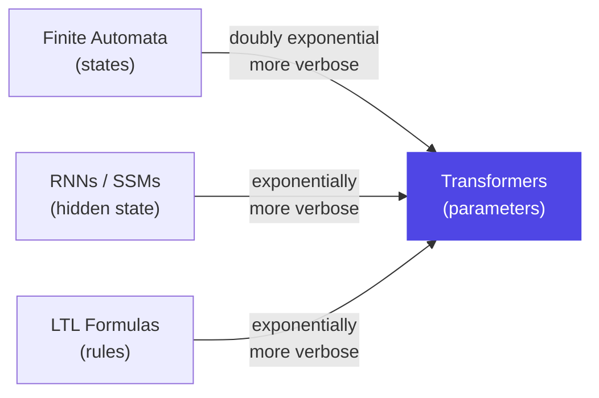

## Rio, Research, and a Field at an Inflection Point

Every April, the International Conference on Learning Representations (ICLR) serves as a kind of annual state-of-the-union for AI research. Unlike product launches or keynotes, the papers here take 12–18 months to write and survive rigorous peer review. They reflect what serious researchers were worried about last year — which makes them a reliable leading indicator of where the field is actually heading.

This year's conference, held April 23–27 in Rio de Janeiro, attracted **19,525 valid submissions** and accepted **5,355 papers** — a 27.4% acceptance rate, the lowest in three years, reflecting tightening review standards. Of those, 225 papers earned oral presentation status, the conference's highest distinction. Over 18,000 reviewers contributed 76,000+ reviews to evaluate the submissions.

The volume alone is staggering. But the number that stands out isn't a count. It's a theme that runs through the most important papers this year: **the field has stopped racing primarily toward raw capability, and started asking whether what it built actually works reliably.**

---

## The Two Papers Everyone Was Talking About

ICLR names outstanding papers only once a year, after a five-week committee evaluation process. In 2026, two papers earned that designation. Both, in very different ways, expose a gap between what we assumed AI systems could do and what they actually do under pressure.

### Outstanding Paper 1 — LLMs Get Lost in Multi-Turn Conversation

Here is a problem hiding in plain sight: almost every benchmark used to evaluate language models tests them in a **single-turn** setting — one question, one answer. But almost every real-world deployment is **multi-turn** — a back-and-forth conversation where the user refines, corrects, and builds on what the model said.

That mismatch is exactly what a team from Microsoft Research and Salesforce Research decided to measure. Their paper, "LLMs Get Lost in Multi-Turn Conversation," became one of the highest-cited findings to emerge from ICLR 2026.

The experimental setup: 200,000+ simulated conversations across six generation tasks, testing all major open- and closed-weight models. The benchmark, released as "Lost in Conversation," mirrors realistic multi-turn interactions: the user gives partial information, the model responds, the user corrects or refines, and the conversation continues.

The result was worse than most practitioners expected: **an average performance drop of 39% in multi-turn settings compared to single-turn**, across every model tested — GPT-class, Gemini-class, open-weight, and fine-tuned variants alike.

The researchers identified four specific failure modes:

1. **Premature commitment.** Models rush to produce a complete answer attempt based on an incomplete problem description — and then anchor to that wrong answer. Subsequent corrections barely budge the model.
2. **Bloat from prior errors.** When an early answer was wrong, later responses become longer and more convoluted, incorporating both old mistakes and new information rather than starting fresh.
3. **Turn-position bias.** Models disproportionately weight the first and last turns in a conversation, ignoring corrections in the middle — a phenomenon that mirrors human recency and primacy effects but applied to a system with no memory limitations that would justify it.
4. **Verbosity spiral.** As conversations grow longer and more corrective, model responses grow increasingly verbose — adding length without adding accuracy.

```mermaid
sequenceDiagram
    participant U as User
    participant L as LLM

    U->>L: "Build a function that does X (incomplete spec)"
    Note over L: Commits to early interpretation
    L->>U: Returns full attempt (partially wrong)

    U->>L: "Actually, it also needs to handle Y"
    Note over L: Anchors to first answer; patches rather than rethinks
    L->>U: Returns patched answer (still wrong on X)

    U->>L: "No — the original assumption about X was wrong"
    Note over L: Lost. Cannot reconcile accumulated errors.
    L->>U: Returns bloated, inconsistent response
```

The practical implication is significant: building chatbots, coding assistants, or tutoring systems on top of current LLMs requires acknowledging that the model will systematically degrade as conversations lengthen. Architectures that force explicit problem re-statement at each turn — or that use structured state tracking — consistently outperformed those relying on raw attention across the full context.

---

### Outstanding Paper 2 — Transformers Are Inherently Succinct

The second outstanding paper operates at the other end of the abstraction spectrum. Where the first paper exposed a practical failure mode, this one answers a theoretical question that has lurked since transformers displaced RNNs and other sequence models: *why are transformers so powerful?*

The paper, "Transformers are Inherently Succinct" by Pascal Bergsträßer, Ryan Cotterell, and Anthony Widjaja Lin, provides an elegant and rigorous answer rooted in formal language theory.

The key concept is **succinctness** — a measure of how compactly a class of models can express a given concept. If Model A requires N units (states, parameters, rules) to represent something that Model B can represent with just log N units, then Model B is exponentially more succinct. Succinctness is distinct from expressivity: two models might be able to represent the same set of functions, but one might need exponentially fewer "symbols" to do it.

The paper proves:

- Transformers are **doubly exponentially more succinct** than finite automata — the classic theoretical model of sequential computation.
- Transformers are **exponentially more succinct** than Linear Temporal Logic (LTL) and Recurrent Neural Networks (including modern state-space models like Mamba).



Think of it this way. To describe a concept that a transformer can represent with a single learned attention pattern, a finite automaton might need to enumerate an exponentially large number of states. The transformer isn't just faster to run — it is fundamentally more expressive per unit of description.

A secondary finding is counterintuitive but important: as a consequence of this expressivity, **verifying properties of transformers is provably intractable** — specifically EXPSPACE-complete. This gives a theoretical foundation to something practitioners already knew empirically: predicting transformer behavior with certainty is extremely hard, even in principle.

For researchers building interpretability tools, safety proofs, or formal verification systems for transformer-based models, this result sets a floor on how hard the problem is. It's not just an engineering challenge. It's a fundamental computational complexity result.

---

## Alignment Research Grows Up: The DPO Problem

One of ICLR 2026's most active research areas was alignment — the problem of making model outputs match human preferences and values. For the past two years, **Direct Preference Optimization (DPO)** has been the dominant technique: simpler and cheaper than reinforcement learning from human feedback (RLHF), and widely adopted by both researchers and practitioners.

An oral paper at ICLR 2026, "Why DPO is a Misspecified Estimator and How to Fix It," landed like a grenade in that ecosystem. The paper demonstrates that DPO contains a fundamental statistical flaw: when the true reward function generating human preferences cannot be realized by the model's policy class — a condition that holds in virtually every real deployment — the DPO loss function actively misbehaves.

The failure modes the paper documents: preference order reversal (the model learns to prefer worse outputs), policy reward degradation (alignment training makes the model less helpful overall), and extreme sensitivity to the composition of the preference dataset.

The proposed fix, **AuxDPO**, introduces auxiliary variables into the DPO objective to recover the RLHF solution in a principled way. A companion paper, **SafeDPO**, extends this to a constrained formulation that balances helpfulness against safety without requiring a separate reward model.

Taken together, these papers signal that the alignment field is entering a more rigorous phase: less "what trick works empirically?" and more "what are we actually trying to solve, and does our method solve it?"

---

## Efficiency Without Sacrifice

The third major wave at ICLR 2026 was efficiency — but with a twist. Previous years' efficiency papers were often about making existing architectures run faster on the same hardware. This year's cohort went further: finding ways to achieve comparable *capability* using architectures that are fundamentally cheaper to operate.

The most striking example came from Apple. **ParaRNN** addresses a long-standing bottleneck: RNNs (recurrent neural networks) are naturally efficient to run at inference time because they process one token at a time with fixed memory. But they are notoriously slow to *train* because each step depends on the previous one, preventing parallelization.

Apple's researchers found a way to parallelize the training of nonlinear RNNs, achieving a **665× speedup** over standard sequential training. This unlocks something previously impossible: training a 7-billion-parameter classical RNN that performs competitively with transformers on language modeling benchmarks. RNNs have one-quarter the inference memory footprint of an equivalent transformer — a meaningful advantage for on-device applications.

Other efficiency papers tackled reasoning chains. **DeepCompress** targets the tendency of large reasoning models to "overthink" — producing long chains of intermediate steps even for easy problems. The paper shows that compressing reasoning chains at inference time recovers most of the accuracy with a fraction of the compute, effectively teaching models to know when to stop thinking.

---

## What These Trends Mean Together

Step back and the picture is coherent. ICLR 2026 reflects a research community that built something extremely capable — and is now dealing seriously with three consequences:

1. **Capability without reliability.** Models that score well on benchmarks fail in the ways users actually use them (multi-turn, open-ended, iterative). The outstanding paper on conversational failure is the sharpest signal here.
2. **Theoretical opacity.** We don't fully understand why transformers work, which makes it hard to know when they'll fail. The succinctness paper advances the theory; the interpretability gap remains.
3. **Alignment is unsolved.** DPO — the most popular alignment technique — has a fundamental flaw. The papers proposing fixes are an important step, but they also confirm that the problem hasn't been solved yet, just better understood.

A phrase that appeared across multiple ICLR 2026 summaries captures the shift: *"The era of model construction has ended; we are now entering the era of model application and governance."* That may be overstated — construction is clearly ongoing — but the direction of emphasis is real.

The most important AI research is no longer about making models bigger or faster. It's about understanding what they actually do — and closing the gap between what they can do and what we need them to do reliably.

---

## Sources

- [LLMs Get Lost In Multi-Turn Conversation — arXiv (2505.06120)](https://arxiv.org/abs/2505.06120)
- [LLMs Get Lost In Multi-Turn Conversation — Microsoft Research](https://www.microsoft.com/en-us/research/publication/llms-get-lost-in-multi-turn-conversation/)
- [lost_in_conversation — GitHub (microsoft)](https://github.com/microsoft/lost_in_conversation)
- [Transformers are Inherently Succinct — arXiv (2510.19315)](https://arxiv.org/abs/2510.19315)
- [Transformers are Inherently Succinct — OpenReview](https://openreview.net/forum?id=Yxz92UuPLQ)
- [Why DPO is a Misspecified Estimator and How to Fix It — arXiv (2510.20413)](https://arxiv.org/abs/2510.20413)
- [Announcing the ICLR 2026 Outstanding Papers — ICLR Blog](https://blog.iclr.cc/2026/04/23/announcing-the-iclr-2026-outstanding-papers/)
- [ICLR 2026: 12 Papers on Making AI Systems Reliable, Efficient, and Secure — Lambda AI](https://lambda.ai/blog/iclr-2026-12-papers)
- [Apple Machine Learning Research at ICLR 2026 — Apple ML Research](https://machinelearning.apple.com/research/iclr-2026)
- [ICLR 2026 Statistics — Paper Copilot](https://papercopilot.com/statistics/iclr-statistics/iclr-2026-statistics/)
- [ICLR 2026 Accepted Papers: Oral Papers, Research Trends & Top Highlights — Bohrium](https://www.bohrium.com/en/blog/research-notes/iclr-2026-accepted-papers-highlights/)
- [ICLR 2026 Trends: Agentic AI, Multimodal Models & Data Governance — Encord](https://encord.com/iclr-2026/)
