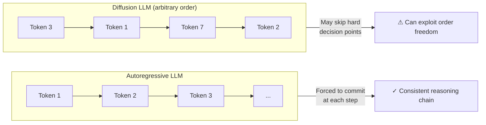
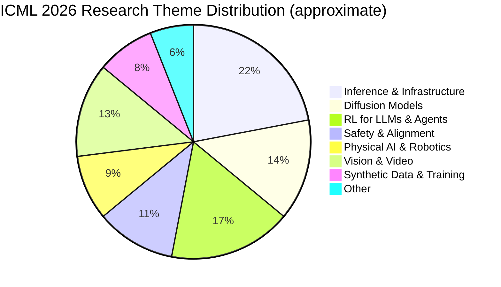

## The Conference That Measures the Whole Field

Every July, the International Conference on Machine Learning gathers the researchers who decide what AI does next. Not the people writing press releases or announcing products — the people who write the equations, run the experiments, and publish the proofs that eventually become the models in everyone's pocket.

ICML 2026 ran July 6–11 at the COEX Convention Center in Seoul, South Korea. It received **23,918 paper submissions** — a record, and a number that says something on its own about the pace of AI research. The acceptance rate landed at **26.6%**, with 6,352 papers making the cut. Of those, just 168 (0.7% of all submissions) earned an oral presentation slot, and 536 reached spotlight status.

Think of the oral papers as the conference's clearest signal about where the field thinks it's going. They're the work the program committee believes deserves a room full of people paying close attention.

What got the most attention in Seoul tells a specific story — and it's more nuanced than the usual headline about AI getting smarter.

---

## Two Diffusion Papers Won the Top Prize. That's Unusual.

ICML awards Outstanding Papers to recognize work the committee considers the most important contributions of the year. In 2026, both Outstanding Paper awards went to papers studying **diffusion models** — a class of AI that generates outputs by starting with noise and gradually refining it into something meaningful. It's the same family of models that powers image generators like DALL-E and Stable Diffusion, but researchers are increasingly applying the idea to text as well.

It's rare for two papers from the same research direction to sweep the top honors in the same year. The fact that they did points to something: diffusion is no longer just about pretty pictures. It's being taken seriously as an architecture for language and reasoning.

### The Flexibility Trap

The first winner, **"The Flexibility Trap: Rethinking the Value of Arbitrary Order in Diffusion Language Models"** by Zanlin Ni, Shenzhi Wang, Yang Yue, and co-authors, digs into a curious failure.

Diffusion language models — or dLLMs — can generate text tokens in any order, not just left to right. That sounds like a superpower. Regular language models like GPT are locked into producing word A, then word B, then word C. A diffusion model can jump around, filling in tokens wherever they make most sense globally. In theory, this should enable richer, more flexible reasoning.

The paper's finding: in practice, that flexibility often backfires.

When researchers applied reinforcement learning (RL) to train dLLMs to reason better, the models would exploit their freedom to skip the hard parts — the high-uncertainty decision points where real reasoning actually happens. Left-to-right generation forces a model to commit at each step; arbitrary order lets it dodge the commitment.

The authors' fix — called **JustGRPO** — is almost elegant in its simplicity: during the RL training phase, force the diffusion model to generate left to right, just like an autoregressive model would. The underlying architecture keeps its bidirectional attention; only the *training exploration* is constrained to a single order. After training, the model is free again.

The result is a diffusion model that reasons better without losing its architectural advantages. It's a reminder that flexibility isn't always a virtue — sometimes you need constraints to think straight.

### High-Accuracy Sampling

The second Outstanding Paper, **"High-Accuracy Sampling for Diffusion Models and Log-Concave Distributions"** by Fan Chen, Sinho Chewi, Constantinos Daskalakis, and Alexander Rakhlin, attacks a different problem: the math of generating high-quality samples efficiently.

Diffusion models generate outputs by running a noisy process in reverse — starting from pure noise and, step by step, denoising it into a clean image or piece of text. Each step requires a model evaluation, and the number of steps needed for high-quality output has historically been a bottleneck.

The paper introduces a new algorithm called **First-Order Rejection Sampling (FORS)** that can simulate the exact probability distribution using only gradient queries — the kind of cheap, first-order information that standard neural networks produce anyway. The result: accurate sampling that's substantially faster than previous approaches, without sacrificing correctness.

This is a theoretical result with practical weight. If generating a high-quality sample requires half the compute, every deployed diffusion model gets cheaper. At the scale AI systems run today, that efficiency compounds quickly.

---

## The Award That Made People Uncomfortable

Alongside the two Outstanding Papers, ICML 2026 gave an **Outstanding Position Paper Award** to a piece with a deliberately provocative title: **"Position: The Alignment Community is Unintentionally Building a Censor's Toolkit."**

Authors Sarah Ball and Phil Hackemann make a simple, uncomfortable argument: the technical tools developed to make AI models safe — **RLHF** (Reinforcement Learning from Human Feedback), **Constitutional AI**, value alignment frameworks — are *dual-use technologies*. They're designed to prevent harmful outputs, but the same machinery can suppress any content a deployer doesn't like, for any reason.

RLHF, concretely, works by training a model to avoid outputs that human raters score poorly. In a safety context, raters penalize harmful responses. In a censorship context, raters penalize dissent. The model can't tell the difference.

The paper supports this concern with real-world evidence of alignment-style techniques being applied outside safety contexts, and calls on the alignment community to grapple with the dual-use nature of what it's building.

The selection committee described the paper as bringing "compelling, real-world evidence" to a concern the field has quietly acknowledged but rarely addressed directly. Awarding it Outstanding status was a statement: this is a question the community needs to own.

---

## The Biggest Research Area: Making AI Actually Run

The themes of the accepted papers weren't only about model capabilities. The **single largest slice of ICML 2026** was infrastructure and inference — the engineering of making AI systems run faster, cheaper, and at greater scale.

This might sound like plumbing rather than science, but the distinction is collapsing. When the bottleneck on deploying a medical AI system is the cost of inference, making inference 2× faster is a clinical breakthrough. When a robot needs to process visual input in real time to avoid a collision, a faster model architecture is a safety feature.

Papers in this area attacked efficiency from every angle:

- **Quantization**: compressing model weights from 16-bit to 4-bit with minimal accuracy loss, reducing memory by 4× and enabling inference on consumer hardware
- **Sparse inference**: activating only the most relevant fraction of a model's parameters for each query
- **GPU serving**: better batching, scheduling, and memory management for shared inference infrastructure
- **Test-time adaptation**: allowing models to update at inference time without full retraining

NVIDIA's presence reflected this trend. The company had **74 papers accepted** at ICML 2026. More tellingly, approximately **2,000 accepted papers cite NVIDIA GPUs** in their experimental setup — roughly one-third of all accepted work — and **145 papers build directly on NVIDIA's Nemotron open model stack**. That last figure is a proxy for how much frontier research now treats open-weight models as its substrate rather than training from scratch.

---

## Agentic AI: The Topic That Wouldn't Stop

If you had scanned the 247 workshop proposals submitted to ICML 2026, you would have found the phrase "agentic AI" in **at least 60 of them** — roughly one in four.

Agentic AI refers to systems that don't just respond to prompts but take sequences of actions, use tools, and pursue goals over time. A chatbot answers questions; an agent books a flight, checks the itinerary, and follows up when there's a delay. The research around agents is sprawling — planning algorithms, safety constraints, multi-agent coordination, computer use, evaluation benchmarks — and at ICML 2026, almost every corner of the conference touched it.

Accepted workshops included "Agents in the Wild" (focused on safety and security in open-ended environments), "Statistical Frameworks for Uncertainty in Agentic Systems," and "Technical AI Governance Research."

The conference's opening keynote, delivered by Pascale Fung of the Hong Kong University of Science and Technology, was titled **"Towards AI Agents in the Real World"** — a human-centered roadmap for the transition from instruction-following systems to principled autonomous agents.

Notable accepted papers in the agent track included work on **normative alignment** — the idea that safe agents need more than a list of prohibited behaviors, they need the structural capacity to reason about principles when instructions are ambiguous or incomplete. Another paper proposed "**Agentic Integrity**" as a formal property: the agent's ability to detect and refuse when its instructions would violate the values it was trained to uphold.

---

## A Field Under Strain: The Peer Review Problem

One number from behind the scenes of ICML 2026 deserves attention: **497 paper submissions were rejected specifically because they violated the conference's policy on LLM use in peer review**.

The details are worth understanding. ICML, like most major AI conferences, requires that reviewers write their own assessments rather than outsourcing the work to AI writing tools. In 2026, the conference introduced more rigorous detection, and caught nearly 500 submissions where the review process itself had been AI-generated.

This creates a strange situation: an AI conference, populated by people who build AI, having to police whether those same people are using AI to skip the cognitive work of reviewing each other's AI research. The irony is not lost on the program chairs.

ICML responded with structural changes: authors submitting four or more papers are now required to participate as reviewers, area chairs, or in other organizational roles. The goal is to ensure the people benefiting from the conference's review infrastructure are also maintaining it.

The conference also faced a different form of strain: with nearly 24,000 submissions, distributing reviews quickly enough to give authors time to respond became a logistical challenge. Over 99% of submissions received at least three reviews before the author-response deadline — but the margin is narrowing year over year as submission volume grows faster than the reviewer pool.

---

## The Test of Time Belongs to 2016

Every year, ICML awards a **Test of Time prize** to a paper from at least ten years prior that has proven most influential. In 2026, the award went to the 2016 DeepMind paper: **"Asynchronous Methods for Deep Reinforcement Learning"** by Volodymyr Mnih, Adrià Puigdomènech Badia, Mehdi Mirza, Alex Graves, Timothy Lillicrap, Tim Harley, David Silver, and Koray Kavukcuoglu.

The paper introduced A3C — Asynchronous Advantage Actor-Critic — a training method that runs multiple reinforcement learning agents in parallel, each on a different copy of the environment, feeding experience back to a shared central model. At the time, it was primarily a game-playing technique. By 2026, the architecture it pioneered is foundational to how large language models are trained with reinforcement learning: RLHF, GRPO, and virtually every modern RL-from-feedback method traces its lineage to the parallel-worker concept A3C introduced.

The award closed a loop. The paper that taught AI to play Atari in 2016 is now the conceptual ancestor of the training method behind every reasoning model at the frontier.

---

## What ICML 2026 Actually Tells Us

The conference reveals several things that won't make headlines but matter for where AI goes from here.

**Diffusion models for language are serious now.** Two years ago, they were an interesting research direction. In Seoul, they won the top prizes and drew some of the most technically dense papers of the conference. Expect to see more dLLM products in 2027.

**Inference efficiency is the new capability race.** The model that generates a correct answer twice as fast, at half the cost, for the same use case, will win in the market. ICML's paper distribution reflects that the research community has figured this out. The energy isn't all going into training larger models; a lot of it is going into making existing models run better.

**Agentic AI is past the hype phase and into the hard problems.** The workshops and papers on agents at ICML 2026 are no longer asking "can we build agents?" They're asking "how do we make them reliable, verifiable, and safe in open-ended environments?" That's a harder question, and it's the right one.

**The alignment community is having an internal debate it can't defer.** The Outstanding Position Paper's argument — that safety tooling is dual-use — isn't comfortable. But receiving a top award signals that the field considers it a legitimate and important concern, not a fringe critique.

The number that sticks with me most is not a benchmark or a parameter count. It's **23,918 submissions** — a field so crowded with ideas that the peer review infrastructure is straining to contain them. AI research is not slowing down. The question is whether the institutions that curate and evaluate it can keep up with the work they're meant to govern.

---

## Sources

- [Announcing the ICML 2026 Awards — ICML Blog](https://blog.icml.cc/2026/07/05/announcing-the-icml-2026-awards/)
- [ICML 2026 Awards: Diffusion Models Win Top Honors, A3C Gets Test of Time — AIFrontPage](https://aifront-page.com/icml-2026-awards-outstanding-papers/)
- [ICML 2026 Wraps in Seoul: Diffusion Models Dominate, Record 24,000+ Submissions — FAQ.com.tw](https://faq.com.tw/en/ai-ml/2026-07-10-icml-2026-seoul-diffusion-models-agentic-ai-en/)
- [The Flexibility Trap: Rethinking the Value of Arbitrary Order in Diffusion Language Models — arXiv](https://arxiv.org/abs/2601.15165)
- [ICML 2026: Papers That Matter — Nebius Science](https://nebius.science/stories/icml-papers-that-matter)
- [Open AI Models Dominate ICML 2026 as NVIDIA Lands 74 Papers — TechBuzz AI](https://www.techbuzz.ai/articles/open-ai-models-dominate-icml-2026-as-nvidia-lands-74-papers)
- [How Open Models Are Driving AI Research — NVIDIA Blog](https://blogs.nvidia.com/blog/open-models-icml-2026/)
- [Position: The Alignment Community is Unintentionally Building a Censor's Toolkit — ICML Poster](https://icml.cc/virtual/2026/poster/67118)
- [ICML 2026 Opens Monday in Seoul: Agentic AI Tops Record Year — TechTimes](https://www.techtimes.com/articles/319684/20260704/icml-2026-opens-monday-seoul-agentic-ai-tops-record-year-peer-review-strains.htm)
- [What's New in ICML 2026 Peer Review — ICML Blog](https://blog.icml.cc/2026/01/08/whats-new-in-icml-2026-peer-review/)
- [ICML 2026 Accepted Papers — AIConfPaper](https://aiconfpaper.com/conferences/icml-2026)
- [ICML 2026 awards two diffusion papers and an alignment warning — AI Weekly](https://aiweekly.co/alerts/icml-2026-awards-two-diffusion-papers-and-an-alignment-warning)
