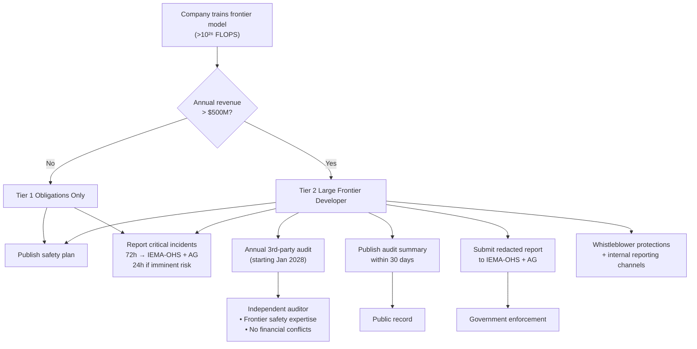
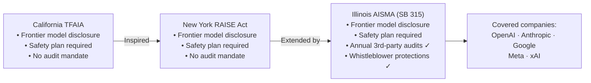

## The Quiet Milestone That Just Rewrote American AI Governance

On July 6, 2026, Illinois Governor JB Pritzker put his signature on Senate Bill 315 — the Artificial Intelligence Safety Measures Act — and America's AI regulatory landscape shifted.

Illinois became the first US state to mandate **annual, independent, third-party safety audits** for developers of the most powerful AI systems. Not self-assessments. Not voluntary pledges. External auditors, with demonstrated frontier-safety expertise and strict independence requirements, evaluating whether companies are actually doing what they say they're doing.

The law passed the Illinois House unanimously and cleared the Senate with near-unanimous support. Governor Pritzker called it "the most protective AI safety law in the country." OpenAI — one of the companies likely covered by it — endorsed it as "one of the strongest frontier AI safety laws in the country" and acknowledged that California, New York, and Illinois "are beginning to create a de facto national framework."

That sentence, from a company with a direct financial stake in how strictly AI gets regulated, is worth letting sink in.

---

## What Is a "Frontier Model" Anyway?

Before unpacking what the law does, it helps to understand what it's targeting.

The Artificial Intelligence Safety Measures Act defines a **frontier model** as a foundation model trained using more than **10²⁶ floating-point operations** (FLOPS). That number — a hundred septillion operations — is not arbitrary. It's approximately the threshold above which current research suggests qualitatively new capabilities can emerge: complex multi-step reasoning, expert-level domain knowledge, the ability to assist with tasks that would previously have required a trained human.

Think of it like horsepower regulations for vehicles. Below a certain threshold, you're driving a car. Above it, you're operating something closer to an aircraft, with different responsibilities and different risks.

As of mid-2026, the models that sit at or above this frontier include GPT-5.6, Claude Fable 5, Gemini Omni, Grok 4.5, and a handful of others. The compute threshold isn't a moving target baked into the law — it's fixed at 10²⁶, which means as models grow, more systems will fall under it over time.

**Large frontier developers** — the second critical definition — are frontier model companies with annual gross revenue exceeding **$500 million**. This tier faces the heaviest obligations, including the audit requirement. It effectively covers OpenAI, Anthropic, Google DeepMind, Meta AI, and xAI.

---

## What the Law Actually Requires

The Act creates a two-tier structure depending on revenue:

### All Frontier Developers

Every company training a frontier-scale model must:

- **Publish and maintain a safety plan** that describes how the company identifies, assesses, and mitigates the model's potential for catastrophic harm
- **Report critical safety incidents** to the Illinois Emergency Management Agency and Office of Homeland Security (IEMA-OHS) and the Illinois Attorney General within **72 hours** of discovery — or within **24 hours** if the incident poses imminent risk of death or serious physical injury

The safety plan requirement is the law's backbone. Companies can't just assert safety in a press release; they have to document their methodology, publish it, and adhere to it.

### Large Frontier Developers (>$500M Revenue)

The larger tier of companies — those with the most resources and the most powerful systems — face three additional obligations:

**1. Annual independent audits.** Starting January 1, 2028, covered companies must retain an independent auditor each year to evaluate whether their safety plans and internal controls actually meet the Act's requirements. Auditors must have demonstrated frontier-model safety expertise and must be free from financial conflicts of interest with the company being audited.

**2. Public disclosure of audit findings.** Within 30 days of receiving the audit report, companies must publish a high-level summary of the findings and submit a redacted version to both IEMA-OHS and the Illinois AG. This isn't an internal exercise — the results go public.

**3. Whistleblower protections.** The Act prohibits covered companies from retaliating against employees who raise AI safety concerns and requires companies to maintain internal anonymous reporting channels specifically for safety disclosures.

---

## What Counts as "Catastrophic Risk"?

The law defines catastrophic risk carefully. A covered company faces obligations specifically around risks that could "materially contribute to the death of, or serious injury to, **more than 50 people**" — or more than **$1 billion in property damage** — arising from a single incident.

Critically, the law spells out specific catastrophic scenarios: an AI system providing "expert-level assistance in the creation or release of a chemical, biological, radiological, or nuclear weapon" is the clearest example. The scope is deliberately focused on tail risks — not the everyday harms of biased hiring algorithms or chatbot hallucinations, but the scenarios where an AI system could contribute to mass-casualty events.

This focus on catastrophic and biological/CBRN risk mirrors the framing used by the UK's AI Safety Institute and the EU's AI Act's "prohibited use" categories — a sign that international safety vocabulary is beginning to converge.

---

## Why Illinois? Why Now?

The timing and geography of this law are not accidental.

At the federal level, the United States has no single comprehensive AI statute. Executive actions from the Biden and Trump administrations shaped voluntary commitments and procurement policies, but binding private-sector obligations on AI developers have remained largely absent from Washington. With federal consensus elusive, states have moved.

California's **Transparency in Frontier AI Act (TFAIA)** established disclosure requirements for frontier developers. New York's **Responsible AI Safety and Education Act (RAISE Act)** extended those requirements further. Illinois studied both laws and did something neither had done: it added the audit mandate.

The structure of Illinois SB 315 was explicitly modeled on California's TFAIA and New York's RAISE Act, using the same 10²⁶ FLOP threshold and the same $500M revenue cutoff. But the audit requirement makes Illinois categorically stricter — not just "publish your safety plan" but "have an external expert verify your safety plan every year."

Think of it like the difference between a restaurant posting its own health rating versus a government inspector showing up to verify the kitchen. The restaurant may be telling the truth either way. The inspector changes the incentive structure.

Governor Pritzker framed the signing in blunt terms, saying the law aimed to "rein in the tech bros" and ensure that "as AI gets more powerful, it answers to the public, not just to shareholders."

---

## Enforcement: Who Has the Power?

The Illinois Attorney General has **exclusive enforcement authority** under the Act. There is no private right of action — individuals who feel harmed by a frontier AI system cannot sue a developer under AISMA directly. Enforcement lives at the state level.

Penalties scale with severity:
- **Up to $1 million** for a first violation
- **Up to $3 million** for subsequent violations

Violations that can trigger penalties include failing to publish required reports or disclosures, making false or misleading statements about catastrophic risks or compliance, failing to obtain required audits, and failing to report critical safety incidents.

The civil penalty ceiling of $3 million per violation sounds modest next to the balance sheets of companies like Google or OpenAI. But the reputational and regulatory calculus is different: a public finding of non-compliance from a state AG, tied to a published audit that revealed safety shortfalls, is the kind of event that triggers congressional hearings, investor pressure, and international scrutiny simultaneously.

---

## The State AI Patchwork: Feature or Bug?

Illinois is the **third state** to enact comprehensive frontier AI transparency and governance obligations, joining California and New York. A growing number of analysts and industry participants — OpenAI explicitly among them — are noting that these three states are constructing something that functions like a national framework, even absent federal legislation.

That creates a genuine compliance challenge for AI developers. A company training frontier models that serves users in California, New York, and Illinois is now subject to three overlapping but not identical sets of requirements. The thresholds align (10²⁶ FLOPS, $500M revenue) but the specific obligations, enforcement agencies, and audit requirements differ in their details.

Some legal analysts argue this patchwork is inefficient and will ultimately push for federal preemption — that Congress will eventually pass a national law that supersedes state rules, partly because national companies with nationwide user bases cannot practically operate under 50 different frameworks. Others argue the opposite: that state-level experimentation is how the US regulatory system is supposed to discover what works before committing it to federal law.

Illinois's bet is that the audit requirement is the right intervention — that accountability without external verification is just accountability theater.

---

## What Happens Next

The law takes effect **January 1, 2027**. Most substantive compliance obligations — the published safety plans, incident reporting protocols, internal whistleblower channels — kick in then. The **annual audit requirement** begins January 1, 2028, or within 90 days of a company crossing the "large frontier developer" threshold, whichever comes later.

That gives covered companies roughly 18 months to identify auditors with frontier-model safety expertise, design audit methodologies, and build the internal systems to support external scrutiny. For an industry that moves in three-month release cycles, 18 months sounds long. For building the institutional infrastructure to credibly evaluate the safety of a system trained on more data than all human writing combined, it is very short.

A few questions that will shape how this plays out:

**Who can actually be a qualified auditor?** The law requires auditors to have "demonstrated frontier-model safety expertise." That expertise is currently concentrated inside the labs themselves, at a handful of research institutions, and in government AI safety offices. An external auditing ecosystem for frontier AI doesn't yet exist at scale. Building it is now legally mandated.

**Will other states follow?** Texas, Massachusetts, and Colorado have all seen frontier AI legislation introduced in 2026. If Illinois's law survives legal challenge — industry groups may argue federal preemption under the Commerce Clause — it is likely to inspire similar requirements elsewhere.

**What about federal preemption?** The Frontier AI Goes Federal Act, proposed in the US Senate in early 2026, would establish a national framework that explicitly preempts stricter state laws. If it passes, Illinois's audit mandate could be nullified. If it doesn't, the state framework will continue to expand.

---

## Why This Matters Beyond Illinois

Illinois's AI Safety Measures Act is significant not just for what it requires, but for what it assumes.

It assumes that frontier AI systems are categorically different from previous software — different enough to require mandatory professional certification of safety practices, in the same way nuclear plants require safety reviews, aircraft require airworthiness certification, and food manufacturers require FDA inspection.

It assumes that voluntary safety commitments from AI labs are insufficient. The companies that signed voluntary AI safety pledges in 2023 and 2024 did so without external accountability. Illinois is saying: your word isn't enough.

And it assumes that the 10²⁶ FLOP threshold is the right place to draw the line — that above it, the potential for catastrophic harm is serious enough to justify external oversight, even at significant compliance cost.

Whether those assumptions hold, and whether the audit requirement will generate genuine safety improvements or largely function as compliance paperwork, depends almost entirely on the quality of the auditing ecosystem that gets built in response.

One law can't answer that. But it can force the question — and force it while the technology is still early enough to shape.

---

## Sources

- [Illinois Enacts AI Safety Law, Becoming First State to Mandate Independent Third-Party Audits — Skadden](https://www.skadden.com/insights/publications/2026/07/illinois-enacts-ai-safety-law-becoming-first-state)
- [Illinois becomes first state to require third-party audit of AI models — The Hill](https://thehill.com/policy/technology/5955442-illinois-ai-safety-bill/)
- [Illinois AI Safety Measures Act SB 315: What Frontier AI Developers Must Do Before January 2028 — Crowell & Moring](https://www.crowell.com/en/insights/client-alerts/illinois-imposes-transparency-and-safety-obligations-on-frontier-ai-systems)
- [Pritzker signs landmark AI regulation bill that aims to mitigate risks — Capitol News Illinois](https://capitolnewsillinois.com/news/pritzker-signs-landmark-ai-regulation-bill-that-aims-to-mitigate-risks/)
- [Illinois governor signs AI safety law requiring audits of frontier models — StateScoop](https://statescoop.com/illinois-ai-safety-law-audits-frontier-models/)
- [Illinois AI Safety Measures Act reflects the growing patchwork of state-level AI regulations — Hooper Lundy](https://hooperlundy.com/illinois-ai-safety-measures-act-reflects-the-growing-patchwork-of-state-level-ai-regulations/)
- [Illinois Enacts AI Safety and Transparency Law for Frontier AI Developers — Wilson Sonsini](https://www.wsgr.com/en/insights/illinois-enacts-ai-safety-and-transparency-law-for-frontier-ai-developers.html)
- [Strict AI Safety Rules Coming to Illinois: 5 Key Takeaways for Businesses — Fisher Phillips](https://www.fisherphillips.com/en/insights/insights/strict-ai-safety-rules-coming-to-illinois)
- [Illinois Legislature passes historic AI bill that would require third-party safety audits — NBC News](https://www.nbcnews.com/tech/tech-news/illinois-legislature-passes-historic-ai-bill-rcna347191)
- [Illinois SB 315: Pioneering AI Safety Regulations and the Future of Responsible AI Governance — Buchanan Ingersoll & Rooney](https://www.bipc.com/illinois-sb-315-pioneering-ai-safety-regulations-and-the-future-of-responsible-ai-governance)
- [Gov. Pritzker Signs Nation-Leading Artificial Intelligence Safety Law — Illinois Governor's Newsroom](https://gov-pritzker-newsroom.prezly.com/gov-pritzker-signs-nation-leading-artificial-intelligence-safety-law)
- [Illinois SB 315: A State Strategy for Enduring National AI Safety Standards — Akerman LLP](https://www.akerman.com/en/perspectives/illinois-sb-315-a-state-strategy-for-enduring-national-ai-safety-standards.html)
