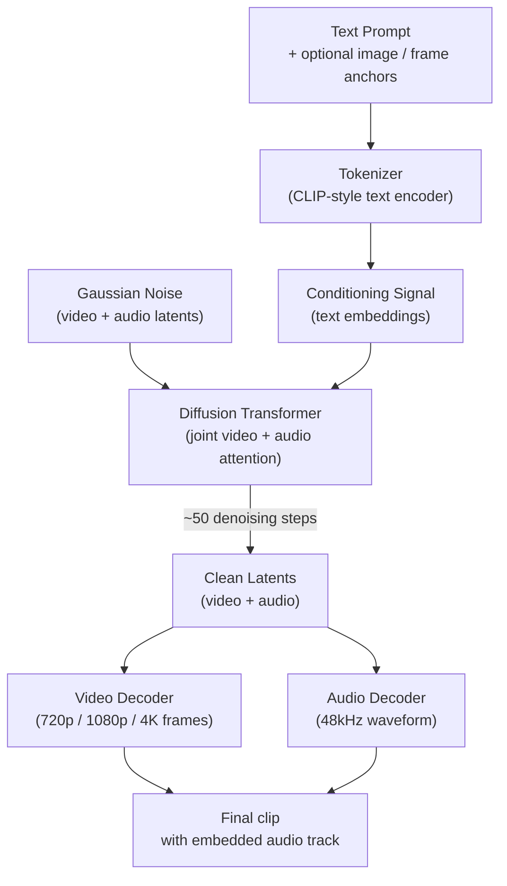
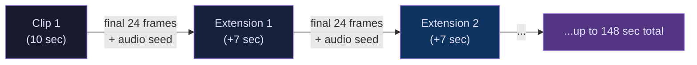

## The Problem With Mute Video

When text-to-video models first reached mainstream creators in 2023 and 2024, they shared a peculiar limitation: the footage they generated was completely silent. You'd get a strikingly realistic clip of a storm rolling over a city, but no thunder. A musician playing piano with no sound. Characters clearly speaking, mouths moving, no words coming out.

This wasn't just an annoyance for creators. It revealed something deeper about how those models worked — they had learned to synthesize the visual world, but audio and video were treated as separate problems. You'd generate your clip in one system, then bolt on sound in a different tool, hoping the sync was close enough.

Google Veo 3.1 takes a fundamentally different approach. It generates synchronized audio alongside video in a single model pass — not as a post-processing step, not from a bolted-on second model, but as a joint output of the same neural network that draws the frames. For certain applications, this changes what it means to "generate a video."

---

## What Veo 3.1 Actually Does

The short version: you provide a text prompt (and optionally a reference image or a first/last frame), and Veo 3.1 returns a video clip — up to 10 seconds per generation — with a complete audio track already embedded. The audio includes:

- **Ambient sound** matching the visual environment (rain, crowd noise, engine hum)
- **Sound effects** synchronized with on-screen events (a door closing, an object hitting a surface)
- **Dialogue** with lip-sync accurate enough that characters' mouth movements match the generated speech frame-for-frame
- **Background music** where contextually appropriate

Beyond audio, the model supports 4K resolution, native vertical (9:16) framing for mobile platforms, and a Scene Extension feature that lets you chain clips into narratives running past two minutes.

The model family ships in three tiers — Veo 3.1 (flagship), Veo 3.1 Fast (balanced speed/quality), and Veo 3.1 Lite (cost-efficient, $0.05/second on Vertex AI) — so you can match compute cost to your use case.

---

## Architecture: Video as Sequences of Spacetime Patches

To understand why Veo 3.1 can generate audio and video together, it helps to understand the architecture underneath.

Veo 3.1 uses a **Diffusion Transformer (DiT)** — a neural network architecture that has largely replaced older convolutional and recurrent approaches for high-fidelity generation tasks. The key insight is in how the model represents video internally.

Older video generation systems often processed videos as sequences of 2D image frames: generate frame 1, then frame 2, hoping the transitions are coherent. Veo 3.1 instead processes video as a continuous sequence of **spatio-temporal patches** in a compressed latent space. Think of a video clip as a 3D block — two spatial dimensions (width, height) plus one time dimension. The model carves this block into small overlapping chunks, converts each to a compact token, and runs a transformer over all those tokens at once.

This matters for audio because audio is itself a time series that can be tokenized the same way. During training, Google paired video with detailed audio annotations — ambient descriptions, transcriptions, timing markers — and trained the model to jointly attend to visual and audio tokens. The result is a network where generating the video and generating its audio are not separate tasks but two outputs of the same attention process.

Training data for this model was substantial: millions of hours of paired audiovisual content, captioned in detail by Gemini models. The captions describe not just what is visible but what can be heard — dialogue, sound effects, atmosphere — which gives the model a richer signal for learning audiovisual correlations than visual captions alone could provide.

---

## Native Audio: What "Synchronized" Really Means

Frame-accurate lip-sync sounds like a marketing claim until you look at the numbers. Veo 3.1 achieves audio-visual synchronization with approximately 10ms latency between the audio waveform and the corresponding video frame — well below the ~20ms threshold that human perception can reliably detect as a mismatch.

A few details that make this practically useful:

- **Sample rate**: The audio is output at 48kHz, which is the standard for professional post-production. You can bring Veo-generated clips into a professional editing workflow without format conversion.
- **Multi-person dialogue**: The model handles conversations between multiple on-screen speakers, modulating each voice to match the speaker's mouth movements independently.
- **Environmental coupling**: Audio responds correctly to visual context. Footsteps on gravel sound different from footsteps on carpet. Sound bounces from close walls differently than from open spaces. These relationships were learned from the training data rather than hard-coded.

The practical implication: for many short-form production workflows (social media, product demos, explainer videos), you no longer need to separately commission or synthesize a sound design. The audio ships with the video.

---

## Scene Extension: Chaining Clips Into Narratives

The 10-second per-generation ceiling is a real constraint for longer content. Scene Extension is how Veo 3.1 works around it.

The mechanism is precise: when you trigger an extension, the model analyzes the **final second (24 frames)** of your existing clip and uses those frames as a "seed" for the next segment. It does the same for the audio — the last second of audio is read to establish the continuing sonic environment. Each new segment adds up to 7 seconds, and you can chain segments to produce clips up to **148 seconds** in total.

Because each extension seeds from the visual and audio state of the previous clip — rather than starting fresh from the prompt — transitions are visually and acoustically continuous. The model maintains character appearance, lighting conditions, and ambient audio across the extension boundary. You can also steer the extension with a modified prompt to introduce new elements while preserving established scene context.

The other useful composition tool is **first-and-last frame interpolation**: supply a starting image and an ending image, and the model generates the in-between motion. This makes Veo 3.1 usable as an animation tool — you design the keyframes, the model fills the motion.

---

## The Three-Tier Model Family

Google offers Veo 3.1 in three variants, all sharing the same native audio architecture but differentiated by latency and cost:

| Tier | Best For | Approximate Cost |
|---|---|---|
| **Veo 3.1** | Production-quality final cuts, flagship quality | Highest |
| **Veo 3.1 Fast** | Standard production workflows | Mid |
| **Veo 3.1 Lite** | High-volume APIs, rapid iteration | ~$0.05 / second |

Veo 3.1 Lite, which launched in public preview on Vertex AI on March 31, 2026, is the entry point for developers building at scale. At $0.05 per second of generated video, it is currently the cheapest tier among the major AI video platforms — undercutting comparable Kling tiers at $0.07 per second — while still delivering native audio generation.

Google also added a standalone **Veo Upscaling** capability: a separate model that takes any video (Veo-generated, another AI model's output, or traditionally filmed footage) and upscales it to 1080p or 4K. This works independently of the generative model — useful for enhancing existing assets without regenerating them.

---

## The 2026 AI Video Landscape

The AI video market in 2026 looks very different from two years ago. What began with two or three serious players now has more than a dozen frontier models, and native synchronized audio has shifted from differentiator to baseline expectation. The real competition now is on audio quality, lip-sync precision, narrative coherence across long clips, and price.

One notable development in early 2026: OpenAI shut down consumer access to Sora on March 24, 2026, citing compute economics — the product was reportedly running at a loss of roughly $15 million per day against minimal revenue. The underlying Sora 2 model remains accessible via API, but OpenAI has deprioritized consumer video in favor of agent products. This left a gap in the Western market that Veo 3.1 has partially filled.

On the leaderboard side, the top positions on third-party video quality benchmarks (like the Artificial Analysis Video Arena) are increasingly held by Chinese models from ByteDance (Seedance), Kuaishou (Kling), and Alibaba. Veo 3.1's advantages are strongest in scene consistency, prompt adherence, and its tight integration with Google's ecosystem — Vertex AI, YouTube creator tools, Google Workspace Vids, and the experimental Flow video editing environment — making it the default choice for teams already invested in Google Cloud.

---

## How to Access Veo 3.1 Today

There are several entry points depending on your use case:

- **Gemini App** — the easiest consumer path; free for Google account holders
- **Google AI Studio** — free API access for experimentation, with Veo 3.1 Lite available
- **Vertex AI** — production-grade API with SLA, usage-based pricing, and direct Cloud Storage integration
- **Google Vids** — Workspace-integrated video creation with Veo 3.1's "Ingredients to Video" feature
- **Flow** — Google's experimental video editing environment, built around Veo-generated assets

For developers integrating via API, the model identifier is `veo-3.1-generate-001` on Vertex AI, with request parameters for resolution, aspect ratio, clip duration, and whether to enable audio generation (it is on by default).

---

## Why This Architecture Choice Matters

Generating audio and video jointly rather than sequentially is not just a product decision — it reflects a deeper bet about how multimodal AI should work. A model that learns to correlate sight and sound during training builds a richer representation of the world than one that treats them as separate modalities to be stitched together after the fact.

The same principle generalizes. Models that learn to reason about multiple sensory streams simultaneously tend to produce more internally consistent outputs, because the constraints between modalities act as a form of self-verification. A lip-sync error, for instance, represents a mismatch between the visual and audio streams that a jointly trained model has learned to penalize during training.

Whether this architecture continues to scale as video generation pushes toward longer form, higher resolution, and interactive control remains an open research question. But Veo 3.1's current capabilities — four-second to two-minute clips with production-quality synchronized audio, available at cents per second — mark a real threshold in what off-the-shelf AI video generation can deliver.

---

## Sources

- [Veo 3.1 Lite and a new Veo upscaling capability on Vertex AI — Google Cloud Blog](https://cloud.google.com/blog/products/ai-machine-learning/veo-3-1-lite-and-a-new-veo-upscaling-capability-on-vertex-ai)
- [Veo 3.1 — Google DeepMind](https://deepmind.google/models/veo/)
- [Introducing Veo 3.1 and new creative capabilities in the Gemini API — Google Developers Blog](https://developers.googleblog.com/introducing-veo-3-1-and-new-creative-capabilities-in-the-gemini-api/)
- [Google Workspace Updates: Ingredients to Video in Veo 3.1 now supports portrait-sized clips in Google Vids](https://workspaceupdates.googleblog.com/2026/01/ingredients-to-video-portrait-vids.html)
- [Google's update for Veo 3.1 lets users create vertical videos through reference images — TechCrunch](https://techcrunch.com/2026/01/13/googles-update-for-veo-3-1-lets-users-create-vertical-videos-through-reference-images)
- [Best AI Video Generators 2026: Veo 3.1, Kling, Sora 2, Seedance & More Compared — AI/ML API Blog](https://aimlapi.com/blog/best-ai-video-generators-2026-veo-3-1-kling-sora-2-seedance-more-compared)
- [AI Video Generation 2026: Sora 2 vs Veo 3.1 vs Kling 3.0 Compared — Lushbinary](https://lushbinary.com/blog/ai-video-generation-sora-veo-kling-seedance-comparison/)
- [Veo 3.1: Google's AI Video Model Explained — Picasso IA Blog](https://blog.picassoia.com/veo-3-1-google-ai-video-model)
- [August 2026 AI Mega-Update: Every Major Breakthrough & Launch — AIapps](https://www.aiapps.com/blog/august-2026-ai-mega-update-major-breakthroughs-launches/)
- [Google Veo 3 and Veo 3.1: AI video with audio and lip sync — Key Value Systems](https://www.keyvalue.systems/blog/veo-models-at-a-glance/)
