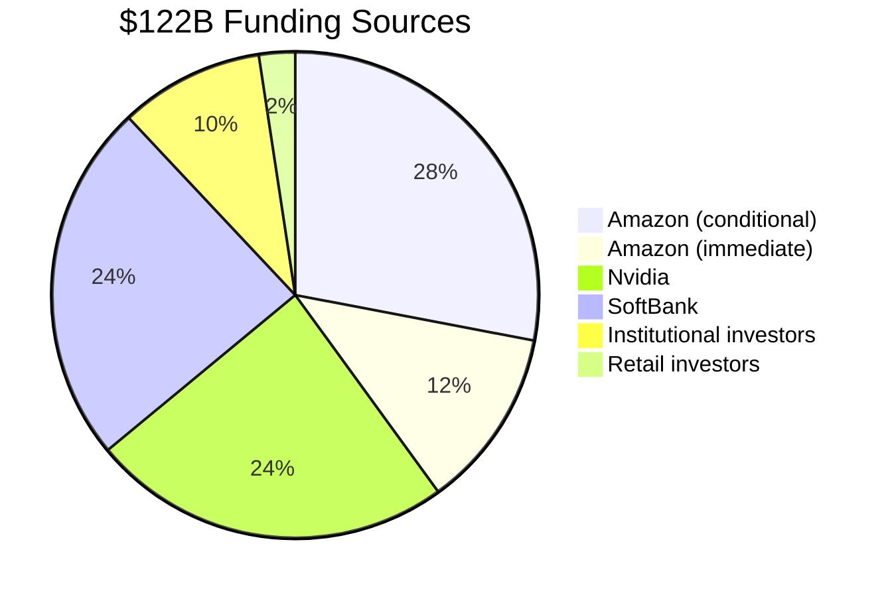
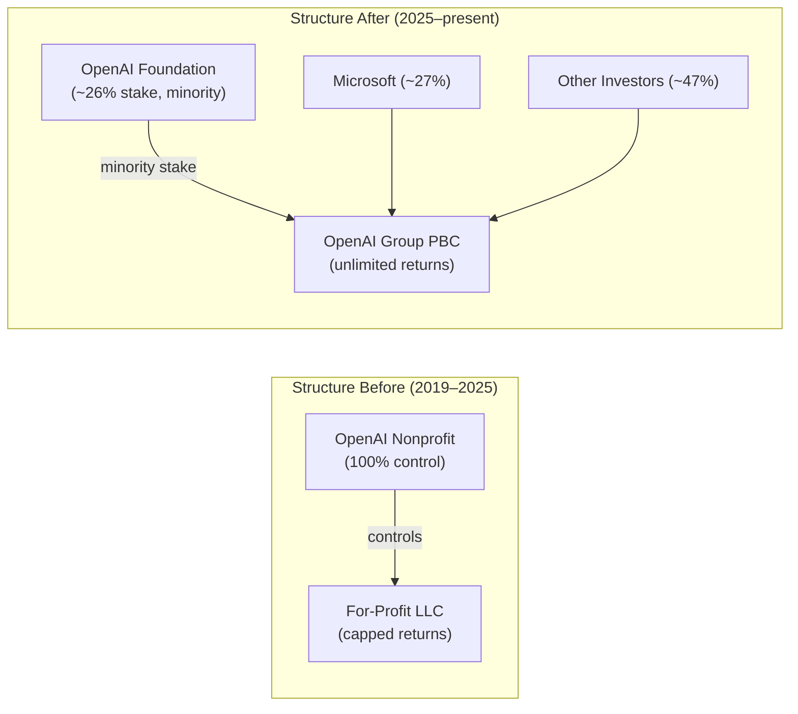
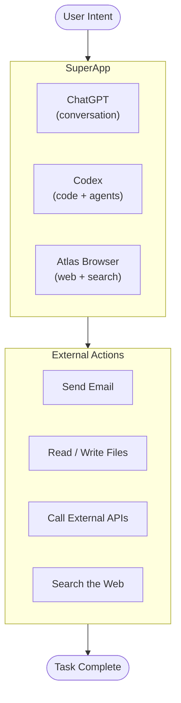

## A Number That Rewrites the Rules

On March 31, 2026, OpenAI closed a $122 billion funding round — the largest private financing deal in the history of Silicon Valley — at a post-money valuation of **$852 billion**.

To put that in perspective: when Google went public in 2004, it was valued at roughly $23 billion. When Facebook IPO'd in 2012, it was worth about $104 billion. OpenAI, still a private company, is now approaching the scale of the world's largest public technology companies before it has filed a single prospectus.

The round cements OpenAI as the most valuable venture-backed company in US history and sets up an IPO that most analysts expect to arrive in 2027. But the money is only half the story. The other half is what OpenAI is building with it — and the uncomfortable questions about what it gave up to get here.

---

## Who Wrote the Checks

The round was anchored by three of the biggest names in tech:

- **Amazon**: up to $50 billion, of which $35 billion is contingent on OpenAI completing an IPO by end of 2028 or achieving AGI
- **Nvidia**: $30 billion
- **SoftBank**: $30 billion

The remaining $12 billion came from institutional investors including Andreessen Horowitz, D.E. Shaw, TPG, and MPX. In an unusual move, OpenAI also raised approximately **$3 billion from retail investors** through bank channels — a sign of how much demand exists from ordinary investors who have no other way to own a piece of the company before it goes public.

Amazon's conditional $35 billion is worth pausing on. The condition — either an IPO by 2028 or an "AGI milestone" — functions as a de facto forcing mechanism. It ties a massive check to a timeline, giving investors something rare in a company whose founder has consistently resisted precise delivery commitments: a hard deadline.

The cap table after closing reveals the full ownership picture. Microsoft, which has been investing since 2019, holds approximately 26.8% ($228 billion). The OpenAI Foundation — the nonprofit that launched the company — holds about 25.8% ($219 billion). The rest is distributed among employees and the new institutional investors.

---

## The Structural Transformation Nobody's Talking About

The funding didn't happen in a vacuum. It came on the heels of a major corporate restructuring that changed OpenAI's legal and ethical foundations.

In October 2025, OpenAI's for-profit subsidiary converted from an LLC to a **Delaware Public Benefit Corporation (PBC)** — a legal structure that allows it to pursue profit while being formally obligated to balance the interests of shareholders with a stated public mission. The nonprofit parent was renamed the OpenAI Foundation and retained a minority stake.

Crucially, this restructuring removed two features that had defined OpenAI's unusual structure for years:

1. **The capped-profit mechanism**, which had limited investor returns to a fixed multiple, was eliminated entirely — allowing theoretically unlimited returns for shareholders.
2. **The nonprofit's controlling stake**, which had historically given the OpenAI Foundation the power to dismiss executives, was reduced to a minority position with no operational veto.

In February 2026, OpenAI removed the word **"safely"** from its primary mission statement.

The backlash was swift. In April 2026, a letter signed by former OpenAI employees and Nobel laureates argued that the restructuring "would undermine the Attorneys General's ability to protect the public's interests as OpenAI develops its technology." Critics point out that a PBC, while legally distinct from a standard corporation, has never been stress-tested in a context involving technology of potentially existential consequence — and that the removal of the profit cap represents the final severance of OpenAI from its founding ethos as a safety-first research organization.

OpenAI's position is that the restructuring was necessary to raise the capital required to compete at frontier scale, and that the Foundation's retained equity stake — worth over $200 billion — will fund long-term public benefit work in education, health research, and AI safety.

---

## What $122 Billion Actually Buys

The money flows into three broad areas: compute infrastructure, consumer products, and hardware.

### Stargate: The Half-Trillion-Dollar Bet on Compute

The centerpiece is **Project Stargate**, a joint infrastructure initiative with SoftBank and Oracle that has committed up to $500 billion in AI data center spending over four years. By April 2026, Stargate has moved well beyond press releases:

- The flagship Abilene, Texas campus is live with 1.2 GW of Oracle Cloud Infrastructure
- Construction is underway at sites in Michigan, Wisconsin, Wyoming, Pennsylvania, and multiple additional Texas locations
- The program's total planned capacity has grown to nearly **7 gigawatts**
- OpenAI has committed to a $300 billion, five-year cloud partnership with Oracle

To put 7 GW in perspective: the entire US data center industry consumed roughly 35 GW of power in 2024. Stargate alone could represent a 20% addition to that total — an infrastructure buildout with no precedent in the tech industry's history.

The $122B round specifically funds OpenAI's contribution to Stargate: 3 GW of Nvidia inference capacity, 2 GW of training on Nvidia Vera Rubin systems, and 2 GW of AWS Trainium compute.

### The Superapp: One Window for Everything

On the product side, OpenAI is building what it calls a **superapp** — a unified interface that merges ChatGPT, its Codex coding platform, and its AI-powered browser (Atlas) into a single desktop experience. The vision is an agent-first operating layer: instead of switching between a browser, a code editor, a productivity suite, and a chat interface, a user would interact with a single system that orchestrates across all of them.

On April 23, 2026, OpenAI released **GPT-5.5**, which Sam Altman described as "the last major milestone before AGI." The model benchmarks at 96.4% on MMLU, runs 40% faster than GPT-4o, and holds a million-token context window — fusing the fluency of the GPT lineage with the structured reasoning architecture from OpenAI's o1 series.

### Hardware: An AI-First Phone

The longest-range bet is hardware. Multiple reports indicate OpenAI is developing a smartphone in collaboration with MediaTek, Qualcomm, and Luxshare — a device designed around AI agents rather than traditional app stores. Rather than opening Spotify or Maps as standalone apps, the envisioned experience would have a persistent AI agent that understands your intent and coordinates across functions without explicit app-switching.

OpenAI's Chief Global Affairs Officer has confirmed that the company is on track to announce its first hardware product in the second half of 2026.

---

## The Revenue Picture: Real, But Not Yet Profitable

The $852 billion valuation would be untenable without a compelling revenue story. OpenAI now reports:

- **$2 billion in monthly revenue** — roughly $24 billion annualized
- **900 million weekly active users**
- **Enterprise revenue** making up more than 40% of the total, growing toward parity with consumer

That revenue growth rate — reportedly four times faster than Google or Meta at comparable stages — is the headline for investors. The fine print is that OpenAI is still burning significant cash. Compute costs, safety research, talent, and the Stargate commitment make profitability a 2028 or later story for most analyst projections.

---

## The Competitive Consequence

The round reshapes the competitive landscape in two ways.

First, it creates a **concentration of compute** that is difficult for competitors to match. When Amazon and Nvidia co-invest in your infrastructure at this scale, they are not merely writing a check — they are anchoring their own platforms to your success. AWS and Nvidia's future revenue becomes partially dependent on OpenAI's growth, giving OpenAI preferential access to the most constrained resource in AI: GPUs and data center capacity.

Second, it accelerates the gap between frontier and open-source. While DeepSeek, Z.ai, and others are producing capable open-source models for a fraction of the cost, the models being trained on 7-gigawatt compute clusters represent a qualitative jump that is increasingly difficult to replicate without equivalent infrastructure. The gap between "frontier" and "competitive" is widening precisely as it becomes more expensive to maintain.

---

## What to Watch Next

Three things will determine whether the $852 billion valuation looks prescient or inflated by 2028:

1. **IPO execution**: Amazon's $35B is contingent on going public by 2028. OpenAI's Q4 2026 filing target means the S-1 process begins later this year. The IPO reception will be the market's first real-time verdict on whether the private valuation holds.

2. **Superapp adoption**: The ChatGPT app with 900 million weekly active users is already the fastest-growing consumer software product in history. Whether the superapp consolidation drives deeper engagement — and higher average revenue per user — is the key consumer growth metric.

3. **The safety-governance question**: The April 2026 opposition letter represents a growing coalition of researchers and policymakers who argue that OpenAI's structural changes have removed the guardrails that justified its original privileged access to frontier AI development. How regulators respond — especially as the EU AI Act's August 2026 enforcement deadline approaches — will shape whether OpenAI can deploy its most capable systems freely in key markets.

The math of the round is extraordinary. What's less clear is whether the structure that enabled it will survive the scrutiny that comes next.

---

## Sources

- [OpenAI raises $122 billion to accelerate the next phase of AI — OpenAI](https://openai.com/index/accelerating-the-next-phase-ai/)
- [OpenAI closes funding round at an $852 billion valuation — CNBC](https://www.cnbc.com/2026/03/31/openai-funding-round-ipo.html)
- [OpenAI, not yet public, raises $3B from retail investors in monster $122B fund raise — TechCrunch](https://techcrunch.com/2026/03/31/openai-not-yet-public-raises-3b-from-retail-investors-in-monster-122b-fund-raise/)
- [OpenAI Valued at $852 Billion After Completing $122 Billion Round — Bloomberg](https://www.bloomberg.com/news/articles/2026-03-31/openai-valued-at-852-billion-after-completing-122-billion-round)
- [Evolving OpenAI's structure — OpenAI](https://openai.com/index/evolving-our-structure/)
- [OpenAI restructures as for-profit PBC, sparking ethics and IPO debates — WebProNews](https://www.webpronews.com/openai-restructures-as-for-profit-pbc-sparking-ethics-and-ipo-debates/)
- [OpenAI Quietly Removes 'Safely' From Mission Statement Amid For-Profit Restructuring — creati.ai](https://creati.ai/ai-news/2026-02-23/openai-removes-safely-mission-statement-for-profit-restructuring/)
- [Group that opposed OpenAI's restructuring raises concerns about new revamp plan — Reuters / Investing.com](https://www.investing.com/news/stock-market-news/group-that-opposed-openais-restructuring-raises-concerns-about-new-revamp-plan-4048267)
- [OpenAI, Oracle, and SoftBank expand Stargate with five new AI data center sites — OpenAI](https://openai.com/index/five-new-stargate-sites/)
- [OpenAI releases GPT-5.5, bringing company one step closer to an AI 'super app' — TechCrunch](https://techcrunch.com/2026/04/23/openai-chatgpt-gpt-5-5-ai-model-superapp/)
- [OpenAI could be making a phone with AI agents replacing apps — TechCrunch](https://techcrunch.com/2026/04/27/openai-could-be-making-a-phone-with-ai-agents-replacing-apps/)
- [OpenAI IPO 2026 — $852B Valuation, Q4 Filing Target — ZestLab](https://zestlab.io/en/trends/openai-ipo-2026)
