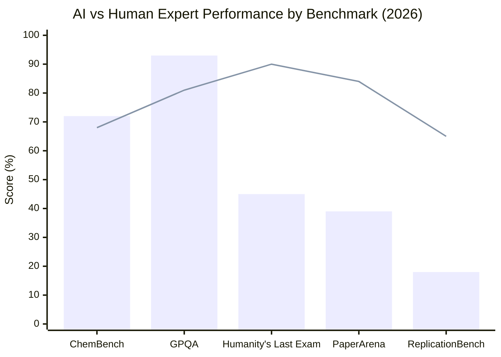
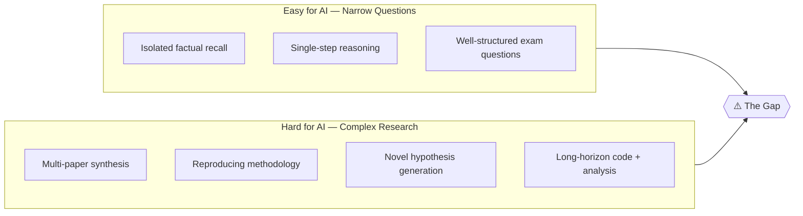
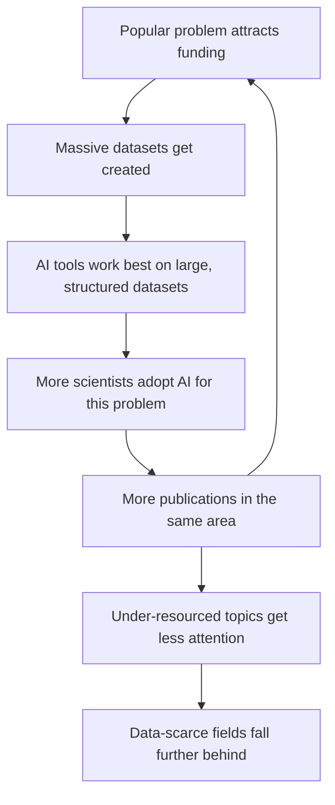

## Two Experiments, One Confusing Picture

In early 2026, two research groups ran experiments that seem to contradict each other.

The first: a team pitted frontier AI models against human chemists on more than 2,700 chemistry questions. The AI won. Models like Claude and GPT-5 scored higher than human expert averages on ChemBench, a benchmark designed to test graduate-level chemical knowledge.

The second: a different team asked those same AI systems to replicate the findings of published astrophysics papers — not to answer questions about them, but to reproduce the methodology, run the analysis, and get the same results. On ReplicationBench, the best AI models scored below 20%. Human researchers typically succeed far more often.

Same generation of frontier models. Wildly different outcomes. What's going on?

---

## The "Jagged Frontier" of AI Capability

The Stanford Human-Centered AI Institute coined the phrase **"jagged frontier"** in its 2026 AI Index Report, released in April. It captures a phenomenon that benchmark researchers keep rediscovering: AI performance is not uniformly distributed. It looks like a mountain range, not a plateau — with dramatic peaks on some tasks and unexpected valleys on others.

The report's science chapter tracks this phenomenon across half a dozen research domains, and the pattern holds everywhere: AI can be simultaneously superhuman and subhuman, depending on what you ask it to do.

*Bar = best AI model score. Line = human expert baseline. Sources: Stanford AI Index 2026, PaperArena paper, Humanity's Last Exam leaderboard.*

The bars tell a complicated story. Where the task resembles a high-stakes exam — isolated questions with correct answers — AI has often reached or exceeded human performance. Where the task requires the full research cycle — forming hypotheses, navigating messy real-world data, writing reproducible code, and generating novel insight — the gap remains wide.

---

## What the Benchmarks Actually Measure

To understand why the gap exists, it helps to look at what each benchmark is actually asking.

**GPQA (Graduate-Level Google-Proof Q&A)** presents difficult, PhD-level questions in biology, chemistry, and physics — the kind that can't be answered by a simple web search. The "Google-proof" part matters: these questions require reasoning, not retrieval. Even so, the best models now hit 93%, surpassing the human validator baseline of 81.2%. This is roughly the kind of performance that would make you confident asking an AI to help study for a qualifying exam.

**Humanity's Last Exam** is harder still: 2,500 questions developed by more than 1,000 subject-matter experts, spanning esoteric corners of mathematics, science, and humanities. When first released, GPT-4o scored 2.7%. As of May 2026, Gemini 3.1 Pro leads at 44.7% — a remarkable improvement in about a year, but still far below the ~90% human expert baseline on the same questions.

**PaperArena** is where things get genuinely hard. The benchmark gives AI agents a research question that requires reading and reasoning across multiple scientific papers simultaneously, calling external tools like PDF parsers and web search, and synthesizing a grounded answer. It is designed to mimic how a researcher might actually engage with a body of literature. The best result so far? Gemini 2.5 Pro in a multi-agent setup, at **38.78%**. PhD experts score **83.5%** — more than double.

**ReplicationBench** is harder still. It breaks down 19 peer-reviewed astrophysics papers into 107 discrete tasks, each co-written with the original paper's authors, testing whether an AI can faithfully reproduce the methodology and arrive at the same results. Best AI scores: **below 20%**.

The pattern is consistent: **AI excels at compression** — taking a body of knowledge and answering targeted questions about it. It struggles with **expansion** — generating new scientific knowledge, reproducing the full process a researcher follows, or doing work that has never been done before.

---

## Why Replication Is So Much Harder

The ReplicationBench result is worth pausing on. Replication is, in theory, not creative science — you already know the answer. You just have to follow the method. So why does AI fail at it at roughly a 4-in-5 rate?

A few reasons emerge from the benchmark's design:

1. **Methods sections are ambiguous.** Scientific papers routinely omit details that the original authors considered obvious. Human researchers fill these gaps with domain intuition built over years. AI systems face the same gaps without the same background knowledge.

2. **The environment is messy.** Replicating real research means downloading data from aging repositories, handling undocumented file formats, debugging code written for outdated library versions, and making judgment calls about edge cases. This is not a crisp problem with a clear solution path.

3. **Errors compound.** In a 20-step workflow, a small mistake in step 3 can corrupt everything downstream. Long-horizon tasks are qualitatively different from short ones. Humans notice when something "feels wrong" and backtrack; current AI agents often do not.

This is essentially the same finding as in RE-Bench (Research Engineering Benchmark), an earlier study by METR that compared human ML researchers to AI agents on open-ended ML engineering tasks. When given a strict two-hour window, AI agents outperformed humans — speed and recall are clear advantages. But as the time budget extended to eight hours, **humans overtook the best agents** and continued to improve. The more latitude researchers had to iterate, reflect, and revise their approach, the more their human edge showed.

---

## A Parallel Paradox: AI Supercharges Individual Scientists, Shrinks Science Collectively

While benchmark researchers were measuring AI's raw capability, a different group of researchers was studying what happens to science at a systemic level when researchers adopt AI tools. Their findings, published in *Nature* in early 2026, are striking in a different way.

Analyzing **41.3 million research papers** across the natural sciences — spanning eras before and after AI tools became widely available — the team found that scientists using AI tools published **3.02× more papers** and received **4.84× more citations** than their peers who didn't. They also became research project leaders 1.37 years earlier on average.

By every individual metric, AI makes scientists dramatically more productive.

But then the researchers zoomed out. Looking at the corpus of science as a whole, they found that AI adoption was quietly narrowing the field. AI-augmented research covered **4.63% less scientific territory** than conventional work. It sparked **22% less engagement** between papers — a sign that research clusters are becoming isolated rather than cross-pollinating.

The mechanism is a feedback loop:

The authors call the result **"lonely crowds"**: densely populated research areas where many labs are publishing on the same topics, but with less genuine interaction — and a corresponding wilderness of neglected questions in data-poor domains.

The irony is precise: AI makes *you* more productive while making *science* less exploratory. It is as if everyone in a city started optimizing their personal route to work, and the result was a massive traffic jam on three highways while entire neighborhoods went unvisited.

---

## Where This Leaves the Research Community

The Nature article that summarized these findings in April 2026 drew a deliberately cautious headline: "Human scientists trounce the best AI agents on complex tasks." That phrasing signals something important — it is not a dismissal of AI in science, but a corrective to overclaiming.

Frontier AI systems are now **genuine research accelerators** in specific contexts:

- **Literature review**: AI can summarize, cross-reference, and surface relevant papers at scales no human team could match.
- **Code generation for standard analyses**: Common statistical workflows, visualization code, and data cleaning tasks that once took hours take minutes.
- **Narrow domain Q&A**: For well-structured questions with verifiable answers, AI has crossed the human expert threshold in several domains.

They are **not reliable replacements** for human judgment in:

- **Novel experimental design**: Deciding what to test, and why, requires understanding that comes from being embedded in a research community.
- **Reproducing complex methodology**: The tacit knowledge embedded in a research process exceeds what is written in methods sections.
- **Long-horizon agentic tasks**: Tasks requiring many sequential steps, environmental interaction, and iterative revision still favor human researchers given sufficient time.

The policy implication from the Evans et al. Nature paper is also worth flagging: **funders and institutions need to actively incentivize research in data-poor areas**, because AI tools will naturally pull researchers toward data-rich ones. If research incentives don't compensate, important fields may get structurally neglected — not because no one cares, but because the tools make neighboring problems more tractable.

---

## The Measurement Problem Underneath It All

There is a meta-issue running through all of this. As MIT Technology Review noted in March 2026, AI benchmarks increasingly measure the wrong things. Systems that score 93% on GPQA get deployed in research settings with the implicit expectation that they will handle research tasks — a much broader and harder category.

The specific benchmarks that expose this gap, like PaperArena and ReplicationBench, are recent and not yet widely known outside the AI research community. If the evaluation infrastructure doesn't keep pace, the field risks over-indexing on good benchmark numbers while missing the capability gaps that matter most in practice.

In that sense, the benchmarks themselves — not just the models — are where the important work is happening right now.

---

## Sources

- [Human scientists trounce the best AI agents on complex tasks — Nature (April 2026)](https://www.nature.com/articles/d41586-026-01199-z)
- [Science | The 2026 AI Index Report — Stanford HAI](https://hai.stanford.edu/ai-index/2026-ai-index-report/science)
- [PaperArena: An Evaluation Benchmark for Tool-Augmented Agentic Reasoning on Scientific Literature — arXiv](https://arxiv.org/abs/2510.10909)
- [ReplicationBench: Can AI Agents Replicate Astrophysics Research Papers? — arXiv](https://arxiv.org/abs/2510.24591)
- [Artificial intelligence tools expand scientists' impact but contract science's focus — Nature](https://www.nature.com/articles/s41586-025-09922-y)
- [AI has supercharged scientists—but may have shrunk science — Science / AAAS](https://www.science.org/content/article/ai-has-supercharged-scientists-may-have-shrunk-science)
- [What Stanford's HAI Report Says About AI in Science — BigDATAwire / HPCwire](https://www.hpcwire.com/bigdatawire/2026/04/17/what-stanfords-hai-report-says-about-ai-in-science/)
- [RE-Bench: Evaluating Frontier AI R&D Capabilities of Language Model Agents Against Human Experts — arXiv / METR](https://arxiv.org/abs/2411.15114)
- [Humanity's Last Exam Benchmark Leaderboard — Artificial Analysis](https://artificialanalysis.ai/evaluations/humanitys-last-exam)
- [AI benchmarks are broken. Here's what we need instead. — MIT Technology Review](https://www.technologyreview.com/2026/03/31/1134833/ai-benchmarks-are-broken-heres-what-we-need-instead/)
- [Stanford HAI 2026 AI Index: AI posts gains in science and medicine while often struggling to read a clock — RD World Online](https://www.rdworldonline.com/stanford-hai-2026-ai-index-ai-posts-gains-in-science-and-medicine-while-often-struggling-to-read-a-clock/)
