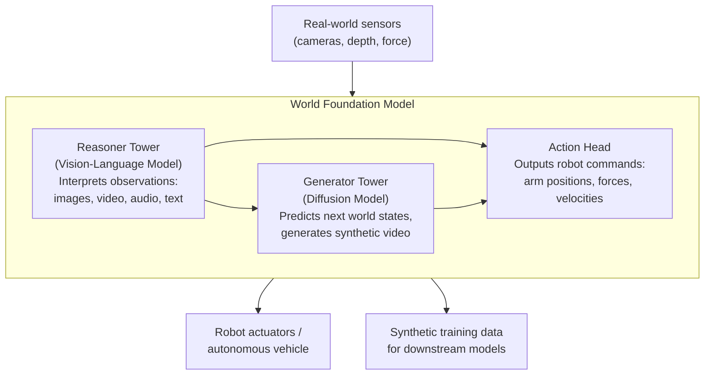
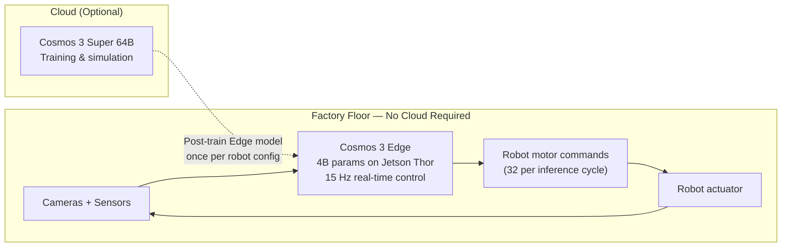

## The Announcement That Moved Markets

On July 16, 2026, NVIDIA disclosed something unusual: ten of Japan's most storied industrial companies — FANUC, Fujitsu, Hitachi, Kawasaki Heavy Industries, Kubota, NEC, SoftBank Corp., Sony Group Corporation, Yaskawa Electric, and AIRoA — were formally joining the NVIDIA Cosmos Coalition to help build open frontier physical AI models.

FANUC's Tokyo shares jumped 18% in a single session. Yaskawa's weren't far behind.

The market reaction wasn't just about a partnership announcement. It was about a bet being placed on an idea that is still a little hard to articulate in plain language but may turn out to be the most consequential shift in industrial technology since programmable logic controllers arrived on factory floors in the 1970s. That idea is **physical AI**.

---

## What Makes AI "Physical"?

Most of the AI you interact with is what you might call digital AI. It processes language, generates images, writes code, and summarizes documents. It lives in the realm of symbols. Ask it what happens when you drop a glass on a concrete floor and it can tell you — but it has never dropped anything. It doesn't have hands. It doesn't understand inertia or surface tension or the acoustic signature of a fracture.

**Physical AI** is the attempt to close that gap. It refers to AI systems that perceive the real world through sensors, reason about objects and motion in space, and generate actions — motor commands, trajectories, decisions — that affect the physical environment. The targets are robots, autonomous vehicles, and machine vision systems in factories, farms, hospitals, and roads.

The challenge isn't just compute. It's that the physical world is messy in ways that language is not. A sentence has grammar. A factory floor has friction, vibration, variable lighting, parts that don't arrive exactly as expected, and workers who sometimes reach into frame. Teaching a system to function reliably in that environment requires a different kind of model — one that understands how the world behaves, not just how language works.

---

## World Foundation Models: The Key Idea

The technical breakthrough enabling physical AI is the **world foundation model** (WFM). The idea is straightforward in principle, difficult in practice: instead of training a model purely on text, you train it on video — vast quantities of video showing how objects move, how forces interact, how scenes change over time. The model learns to simulate the future. Given a sequence of observations, it can predict what will happen next.

This matters for robotics because simulation is the cheapest way to train and test physical behavior. If you have a good world model, you can run a robot through thousands of hours of experience in a physics-aware virtual environment before it ever touches real hardware. You can expose it to rare failure modes that would take years to encounter in production. You can validate its behavior against edge cases on Monday and have it on the factory floor by Friday.

---

## NVIDIA Cosmos 3: The Open Platform

NVIDIA launched **Cosmos 3** on June 1, 2026 — the third major iteration of its world foundation model platform and the first it describes as a fully open omnimodel. The architecture is unusual: a **mixture-of-transformers** design that pairs two specialized towers.

The **Reasoner Tower** is a vision-language model. It takes in multimodal observations — images, video frames, audio, text — and builds a scene understanding using an autoregressive architecture. It interprets object identities, spatial relationships, motion trajectories, and physical constraints.

The **Generator Tower** is a diffusion model. Given the scene understanding from the Reasoner, it predicts future world states as video and generates action trajectories for robot control.

Both towers share multimodal attention layers. That sharing is what lets a single set of weights handle reasoning, world generation, and action prediction in one forward pass, rather than running three separate models.

Cosmos 3 ships in three size tiers:

| Variant | Parameters | Active Params | Primary use |
|---------|-----------|---------------|-------------|
| **Super** | 64B | 32B | Large-scale simulation, synthetic data |
| **Nano** | 16B | 8B | Workstation and server robot training |
| **Edge** | 4B | 2B | On-device, real-time robot control |

The full family is available under an open model license on NVIDIA's Hugging Face collection, with commercial use permitted. That openness is the foundation of the coalition model.

---

## Cosmos 3 Edge: AI That Doesn't Need a Cloud

The July 16 announcement landed alongside the debut of **Cosmos 3 Edge** (released July 15 at SIGGRAPH 2026). This is where the story gets practically interesting for factory deployments.

Cosmos 3 Edge is a 4-billion-parameter model built to run entirely on **NVIDIA Jetson Thor** edge hardware. At 4B parameters it fits on a Jetson Thor T3000 (865 FP4 TFLOPS, 32 GB LPDDR5X) or an entry-level T2000 (400 FP4 TFLOPS, 16 GB). There is no required cloud connection. The model runs its full reasoning-and-action pipeline on the device itself.

In practice, this means a factory robot running Cosmos 3 Edge can see a worker reach into frame, reason about the obstruction, and adjust its motion plan — all in the time it would take a cloud-dependent system to complete a single round-trip to a remote data center.

Cosmos 3 Edge delivers real-time robot control at **15 Hz**, generating 32 action commands per inference cycle at a 640×360 observation resolution. It supports up to 29 action dimensions for humanoid robots, 10D for single-arm robots, and 9D for autonomous vehicle control. Developers can adapt the model to a specific robot body and sensor configuration in roughly **one day** of post-training on domain data.

The on-device constraint matters beyond latency. Many factory environments have strict network policies or are intentionally air-gapped for security reasons. A model that requires no cloud connectivity can be deployed in settings where a cloud-dependent alternative simply cannot go.

---

## The Japan Alliance: Who's Involved and What They're Building

The ten Japanese companies joining the Cosmos Coalition represent nearly every major sector of Japan's industrial economy. The coalition isn't structured as a single project — each company brings a different application domain, and collectively they will contribute data, models, and domain expertise back to the shared platform.

**Fujitsu** is taking on the coordination role, leading development of a **collaborative control platform** that connects FANUC, Yaskawa Electric, and Kawasaki Heavy Industries. The platform is designed to integrate NVIDIA Cosmos technologies for AI model development, digital twin creation, robot simulation, and pre-deployment validation. By building on a shared simulation layer, a model fine-tuned for FANUC arms can share learned representations with Yaskawa's motion controllers — reducing the duplicated effort each company would otherwise incur building its own foundational simulation stack.

Application focus areas break down roughly as follows:

- **Manufacturing** — Fujitsu and FANUC, targeting precision machining and assembly
- **Retail and distribution** — Yaskawa Electric, targeting warehouse picking and logistics
- **Healthcare** — Kawasaki Heavy Industries, targeting surgical assist and patient handling
- **Agriculture** — Kubota, targeting field robots and precision harvesting
- **Telecommunications and connectivity** — SoftBank Corp., providing network infrastructure for connected robot fleets
- **Sensing and imaging** — Sony Group, contributing imaging and audio sensor expertise

Companies further out on the broader ecosystem — Honda R&D, GROOVE X, OMRON, Mitsui & Co, Shimizu Corporation, and Telexistence — are building on the Cosmos stack independently without formalizing coalition membership.

---

## Why Japan, and Why Now

Japan is simultaneously the world's most robotics-dense country and one of the countries with the most acute labor crisis.

Japan's manufacturing sector has **419 robot units per 10,000 workers** — among the highest in the world, reflecting decades of automation investment. Yet the country still faces an estimated **11-million-worker shortfall**, with 84% of employers reporting difficulty filling positions. In some sectors the imbalance is extreme: construction and civil engineering posts 6.68 job openings per applicant. Nearly **29% of the Japanese population is 65 or older**, and the OECD projects the working-age population will fall a further 31% by 2060.

Automation has been Japan's response to demographic pressure for decades. But current industrial robots are brittle in a specific way: they excel at precisely defined, repetitive tasks in tightly controlled environments. Move a part five centimeters off its marked position, vary the lighting, or introduce a novel component, and a conventional robot either fails or halts for manual reprogramming.

Physical AI — robots that can reason about unfamiliar situations rather than pattern-match against a fixed program — is the proposed solution to that brittleness. The Japan coalition is, at its core, a structured effort to bring that capability to the factory floor at industrial scale.

---

## Open Models as Industrial Infrastructure

What makes the Cosmos Coalition structurally interesting — beyond the individual companies involved — is the open-model approach.

NVIDIA's typical business model is to sell hardware. Giving away Cosmos 3 under a permissive open license might seem to undercut that model. But the logic is the same as what drove the open-source database and Linux ecosystem: when you lower the barrier to building applications, you grow the ecosystem that runs on your hardware. More factories running physical AI means more Jetson Thor modules, more DGX Cloud training runs, more H200s and B200s in data centers running synthetic data generation.

For industrial companies, the open model removes a different barrier. Previously, building the kind of world model that could simulate a Kawasaki robot arm in a realistic factory environment required either licensing expensive proprietary software or building the entire simulation stack in-house. The Cosmos Coalition lets companies contribute domain data and specialized evaluation — the things they actually have — while sharing the cost of the foundational model infrastructure.

Whether that exchange scales into the kind of open-ecosystem effect that made Linux a default in data centers remains to be seen. But the structural bet is clear: no single company can collect enough physical-world training data to make physical AI reliable across the full breadth of industrial environments. The only way to cover that breadth is a coalition.

---

## What to Watch

The July 16 announcement is a starting pistol, not a finish line. Several things will determine how quickly this coalition translates into deployed capability:

- **Data quality and contribution**: World models improve with diverse, high-quality physical data. How freely each coalition member shares proprietary sensor and operation data will determine how fast the shared models improve.
- **The Cosmos 3 Edge deployment timeline**: The on-device model is available now, but integrating it into production lines at FANUC's and Yaskawa's scale requires hardware refresh cycles that play out over years, not months.
- **Competing platforms**: Boston Dynamics and Google DeepMind's Gemini Robotics 2, launched July 30, 2026, targets the same humanoid robot space with a proprietary approach. How open and closed ecosystems perform in this market will be a defining data point for the industry.
- **Japan's regulatory environment**: Japan's government has moved quickly to support physical AI adoption, but safety standards for robots operating near humans are still evolving.

The 18% FANUC pop was a market putting a number on a possibility. The question over the next two years is whether the simulation cycles and collaborative model-building that Cosmos Coalition promises will translate into robots that make Japanese factories — and eventually factories everywhere — more resilient, more flexible, and dramatically easier to program than the ones that exist today.

---

## Sources

- [Japan's Robotics and Manufacturing Leaders Build on NVIDIA Cosmos to Advance Physical AI Frontier — NVIDIA Newsroom](https://nvidianews.nvidia.com/news/japans-robotics-and-manufacturing-leaders-build-on-nvidia-cosmos-to-advance-physical-ai-frontier)
- [Japan's Robotics and Manufacturing Leaders Build on NVIDIA Cosmos — GlobeNewswire](https://www.globenewswire.com/news-release/2026/07/16/3328205/0/en/Japan-s-Robotics-and-Manufacturing-Leaders-Build-on-NVIDIA-Cosmos-to-Advance-Physical-AI-Frontier.html)
- [NVIDIA Launches Cosmos 3, the Open Frontier Foundation Model for Physical AI — NVIDIA Newsroom](https://nvidianews.nvidia.com/news/nvidia-launches-cosmos-3-the-open-frontier-foundation-model-for-physical-ai)
- [NVIDIA Releases Cosmos 3 Edge: A 4B-Parameter Open World Model That Reasons and Generates Robot Actions On-Device — MarkTechPost](https://www.marktechpost.com/2026/07/21/nvidia-releases-cosmos-3-edge-a-4b-parameter-open-world-model-that-reasons-and-generates-robot-actions-on-device/)
- [NVIDIA Cosmos Powers Japan's Physical AI Leaders in Robotics & Manufacturing — The Fast Mode](https://www.thefastmode.com/technology-solutions/49674-nvidia-cosmos-powers-japan-s-physical-ai-leaders-in-robotics-manufacturing-innovation)
- [Fujitsu partners with FANUC, Yaskawa and Kawasaki to advance physical AI using NVIDIA technology — Robotics and Automation News](https://roboticsandautomationnews.com/2026/07/18/fujitsu-partners-with-fanuc-yaskawa-and-kawasaki-to-advance-physical-ai-using-nvidia-technology/103488/)
- [Nvidia builds Japan physical AI coalition with Fujitsu, FANUC — Quartz](https://qz.com/nvidia-japan-physical-ai-coalition-fujitsu-fanuc-071626)
- [NVIDIA Brings Robot AI On-Device as Japan's Top Manufacturers Join Cosmos Coalition — TechTimes](https://www.techtimes.com/articles/320801/20260717/nvidia-brings-robot-ai-device-japans-top-manufacturers-join-cosmos-coalition.htm)
- [Why FANUC Is Up 18.0% After Announcing NVIDIA-Powered "Physical AI" Robot Partnership — Simply Wall St](https://simplywall.st/stocks/jp/capital-goods/tse-6954/fanuc-shares/news/why-fanuc-tse6954-is-up-180-after-announcing-nvidia-powered/amp)
- [What Is Physical AI? World Models and the Next Wave of Industrial Intelligence — Overview.ai](https://www.overview.ai/blog/what-is-physical-ai-world-models/)
- [Japan Robotics Market 2026: World's #1 Robot Density, FANUC, Yaskawa — SVRC](https://www.roboticscenter.ai/robotics-market-japan)
- ['No one's raising their hand': Japan's labor crisis is making the case for robots — Fortune](https://fortune.com/2026/04/06/japan-labor-shortage-robots-ai-robotics-humanoid/)
- [NVIDIA Cosmos 3 Edge: 4B Model for On-Device Robotics — Quasa.io](https://quasa.io/media/nvidia-cosmos-3-edge-brings-physical-ai-reasoning-to-jetson)
- [Cosmos 3 Technical Report — NVIDIA Research (arXiv)](https://research.nvidia.com/labs/cosmos-lab/cosmos3/technical-report.pdf)
