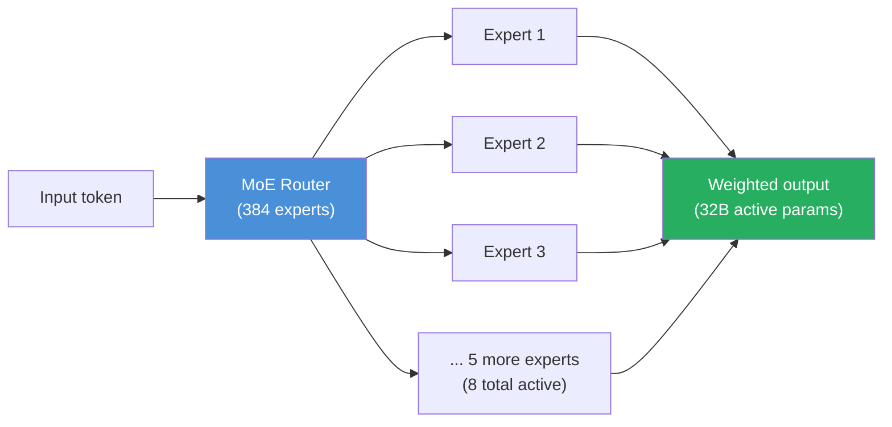
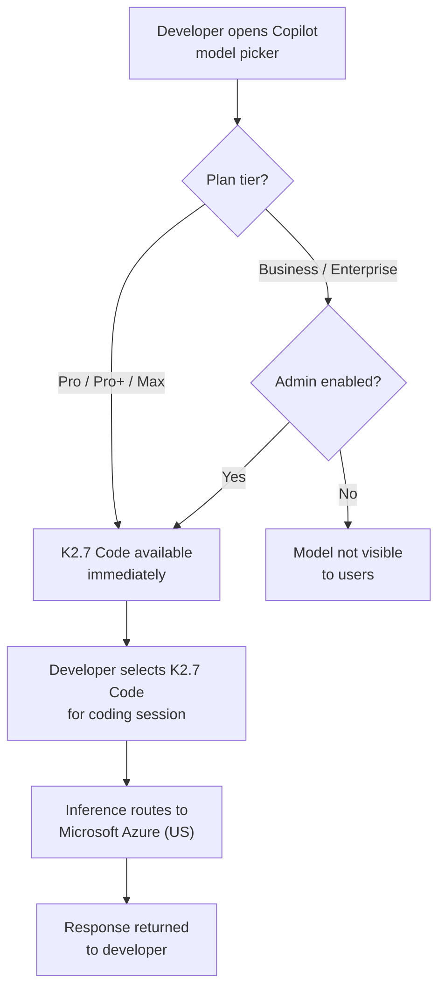

## A Quiet Milestone, Then Loud Questions

On July 1, 2026, GitHub flipped a switch that changed something structural about how AI coding assistants work. Moonshot AI's **Kimi K2.7 Code** became generally available inside Copilot's model picker — and with it, the platform admitted its first ever open-weight model.

That distinction matters more than it might appear. Every model GitHub Copilot had offered before — GPT-5.3 Codex, Claude Sonnet 4.6, Gemini 3.5 Flash, and others — was a closed, proprietary system. You could use them, but you couldn't inspect, audit, or self-host them. Kimi K2.7 Code breaks that pattern entirely: its one trillion parameters are publicly available on Hugging Face under a Modified MIT license. Anyone can download them, study them, fine-tune them, or run them on their own infrastructure.

What GitHub effectively did was turn Copilot from a single-vendor managed service into something closer to a model marketplace. That shift has consequences for developers, for enterprise security teams, and for the broader question of who gets to set the rules of AI-assisted software development.

---

## What Kimi K2.7 Code Actually Is

Kimi K2.7 Code is the coding-specialist release from Moonshot AI, the Beijing-based startup that has been releasing a steady stream of capable open-weight models throughout 2025 and 2026. Released on June 12, 2026, it's a **Mixture-of-Experts (MoE)** model with a headline of one trillion total parameters — but the more operationally relevant number is the **32 billion parameters it activates per token**.

MoE architectures work by routing each input token to a subset of specialized "expert" sub-networks rather than activating the entire network every time. Think of it like a hospital: a hospital with 500 doctors doesn't send every patient to all 500 doctors simultaneously. It routes each patient to the right specialist. K2.7 Code has 384 expert sub-networks, and for each token it selects 8 of them. The result is a model that reasons with the depth of a trillion-parameter system while consuming compute roughly proportional to a 32-billion-parameter one.

The context window is 256,000 tokens — long enough to hold a sizeable codebase in a single prompt. The model always operates in "thinking" mode, meaning it generates an internal chain of reasoning before producing its final output. Unlike some reasoning models that let you toggle thinking off for faster responses, K2.7 Code doesn't offer that option; reasoning is always on.

Compared to its predecessor K2.6, the 2.7 version shows a 30% reduction in reasoning token consumption — meaning the thinking steps are more efficient, not just shorter. On coding benchmarks internal to Moonshot, K2.7 Code shows a +21.8% improvement on Kimi Code Bench v2, +11% on Program Bench, and +31.5% on MLS Bench Lite.

---

## The Price Difference That Rewrites the Calculation

The most immediately practical fact about Kimi K2.7 Code's arrival in Copilot is its price.

| Model | Input (per 1M tokens) | Output (per 1M tokens) |
|---|---|---|
| Kimi K2.7 Code | $0.95 | $4.00 |
| Claude Opus 4.8 | $5.00 | $25.00 |
| GPT-5.5 | $5.00 | $30.00 |
| Gemini 3.5 Flash | ~$0.75 | ~$3.00 |

At $0.95 input and $4.00 output per million tokens, K2.7 Code undercuts GPT-5.5 by roughly 5x on input and 7.5x on output. Compared to Claude Opus 4.8, you're looking at 5x cheaper input and over 6x cheaper output.

For a developer running quick completions, the per-session cost difference might be negligible. But for teams running **agentic loops** — where a coding agent invokes tools, reads files, generates diffs, reruns tests, and iterates autonomously across hundreds of thousands of tokens — the math changes dramatically. A long autonomous session that consumes 200,000 input tokens and 50,000 output tokens costs roughly $15.90 on GPT-5.5 and $14.00 on Claude Opus 4.8. On K2.7 Code, the same session costs about $0.39.

That gap doesn't just save money. It changes which workflows are economically viable in the first place. Tasks that were previously reserved for high-priority work — comprehensive test-suite generation, automated documentation passes, large-scale refactors — become affordable enough to run routinely.

---

## How It Works in Copilot Today

GitHub structured the rollout in two stages. On July 1, Kimi K2.7 Code became available immediately in the model picker for **Copilot Pro, Pro+, and Max** subscribers. A week later, on July 7, it became available for **Business and Enterprise** plans — but with a critical difference in default behavior.

For Business and Enterprise organizations, Kimi K2.7 Code is **off by default**. An administrator must explicitly enable it in Copilot settings before any member of the organization can select it. GitHub also built in granular controls: model access can be scoped to specific teams, organizations, or repositories. For organizations with sensitive code, this lets security teams isolate the model to low-sensitivity contexts while keeping higher-trust environments restricted to models with different compliance profiles.

One architectural detail worth understanding: when Copilot routes a request to K2.7 Code, that request goes to **Microsoft Azure's US infrastructure**, not to Moonshot AI's own servers. GitHub is running a hosted copy of the model weights, not a proxy to Moonshot's API. That changes the data-flow picture at inference time.

---

## The Open-Weight Difference: Why It Matters for Audits

The term "open weight" gets used loosely, but it has a specific technical meaning that carries real consequences for enterprise security.

A **closed model** like GPT-5.5 or Claude Opus 4.8 is a black box at the weight level. You can observe its outputs, run red-team tests, and read the vendor's trust and safety documentation — but you cannot directly inspect the model itself. You are, in effect, extending trust to the vendor's attestations.

An **open-weight model** like K2.7 Code makes the parameters themselves public. Security and compliance teams can download the weights, run their own evaluation suites, commission third-party audits of the model's behavior on sensitive prompts, or deploy it in a fully air-gapped environment where no traffic ever leaves the perimeter. For organizations in regulated industries — healthcare, finance, defense contracting, critical infrastructure — that's not just a preference; in some jurisdictions it's a legal requirement to demonstrate you know what model is touching your data.

This is also what enables self-hosting. A team working on proprietary codebases that can't send source code to any external API can run K2.7 Code on their own compute. The Modified MIT license permits commercial use. For organizations with data-residency requirements, this is the first time a frontier-capable coding model has been available at this permissiveness level.

---

## The Sovereignty Question

Not everyone greeted this news without reservations.

Moonshot AI is a Beijing-based company, and like all companies incorporated in China, it operates under the **National Intelligence Law (2017)**, the **Data Security Law (2021)**, and the **Cybersecurity Law (2017)**. These statutes can require Chinese companies to cooperate with Chinese intelligence and security agencies.

Azure hosting changes where prompts flow at inference time — they don't touch Moonshot's infrastructure when Copilot runs them. But it does not change Moonshot's legal obligations with respect to the model itself, future model updates, or information about how the model was trained. For organizations in sensitive sectors, this is a distinct consideration that Azure hosting alone doesn't resolve.

GitHub has made the governance decision here explicit rather than hiding it: the Business and Enterprise default-off setting, combined with the admin enablement requirement, acknowledges that this is a policy decision, not just a feature preference. Organizations are being asked to affirmatively choose to bring K2.7 Code inside their Copilot environment, rather than having it appear silently.

For most development teams working on commercial software without specialized data-residency constraints, the sovereignty question is likely not a blocker. For government contractors, healthcare providers managing PHI, or financial institutions with strict data-handling rules, it's a question that deserves a deliberate answer before anyone enables the model.

---

## Copilot as a Model Marketplace

The broader significance here is less about Kimi K2.7 Code specifically and more about what its inclusion signals for Copilot's trajectory.

Until now, Copilot's model picker was a curated list of models from a small set of Western AI labs — all closed, all running on infrastructure controlled by those labs or Microsoft, and all subject to the same category of trust relationship. Kimi K2.7 Code is the first model in the picker with:

- Open weights (publicly auditable)
- A non-Western country of origin (China)
- A significantly lower price point

Those three properties together mark a structural shift. GitHub is signaling that Copilot intends to be a general-purpose platform for AI coding assistance — with model diversity, price competition, and the governance complexity that comes with both.

For administrators, this means the model picker is no longer a preference menu. It's a policy surface. Deciding which models your organization is allowed to use, under what conditions, and with what level of oversight is now part of what it means to manage a software development platform.

That's not a bad thing. But it's a new thing.

---

## What Comes Next

Kimi K2.7 Code's arrival in Copilot opens the door to questions that will only become more pressing as more open-weight models reach frontier-level performance:

- Will Copilot add more models with non-US provenance? Will administrators get more granular controls as a result?
- As model quality among open-weight alternatives narrows the gap with closed flagships, does the pricing advantage alone become sufficient justification for most use cases?
- For teams that want to self-host — running K2.7 Code on their own cloud or on-premise infrastructure with the same weights Copilot uses — the path is now technically clear. Will tooling emerge to make that seamless?

The open-weight model entering GitHub Copilot isn't the end of a trend. It's the beginning of one. The question of which models enterprises trust, under what conditions, and on whose infrastructure is going to be one of the defining operational questions for software teams over the next few years.

July 1, 2026 is when that question became concrete.

---

## Sources

- [Kimi K2.7 Code is generally available in GitHub Copilot — GitHub Changelog](https://github.blog/changelog/2026-07-01-kimi-k2-7-is-now-available-in-github-copilot/)
- [Kimi K2.7 now available for Copilot Business and Enterprise — GitHub Changelog](https://github.blog/changelog/2026-07-07-kimi-k2-7-now-available-for-copilot-business-and-enterprise/)
- [Open-Weight AI Enters GitHub Copilot: Kimi K2.7 Code Costs Less, Audits Differently — TechTimes](https://www.techtimes.com/articles/319556/20260702/open-weight-ai-enters-github-copilot-kimi-k27-code-costs-less-audits-differently.htm)
- [Moonshot's open model Kimi K2.7 Code undercuts GPT-5.5 and Claude by up to 12x on price — The Decoder](https://the-decoder.com/moonshots-open-model-kimi-k2-7-code-undercuts-gpt-5-5-and-claude-by-up-to-12x-on-price-per-token/)
- [GitHub Copilot Adds Moonshot AI's Kimi K2.7, Its First Open-Weight Model — AlphaSignal](https://alphasignal.ai/news/github-copilot-adds-moonshot-ai-s-kimi-k2-7-its-first-open-weight-model)
- [Kimi K2.7 Code: Benchmarks, Architecture, Pricing & Access — CometAPI](https://www.cometapi.com/what-is-kimi-k2-7-code/)
- [Kimi AI releases open-source K2.7 Code model with 1 trillion parameters — CryptoBriefing](https://cryptobriefing.com/kimi-k2-7-code-open-source-release/)
- [moonshotai/Kimi-K2.7-Code — Hugging Face](https://huggingface.co/moonshotai/Kimi-K2.7-Code)
