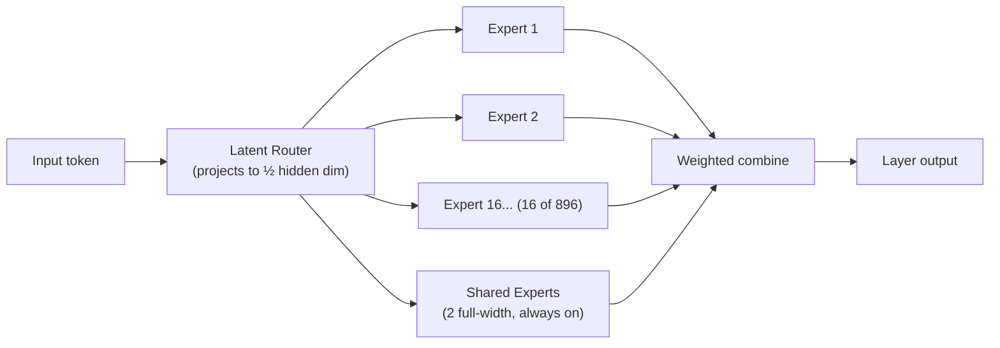
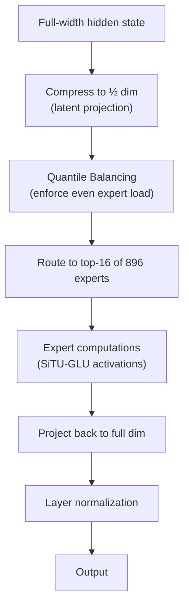
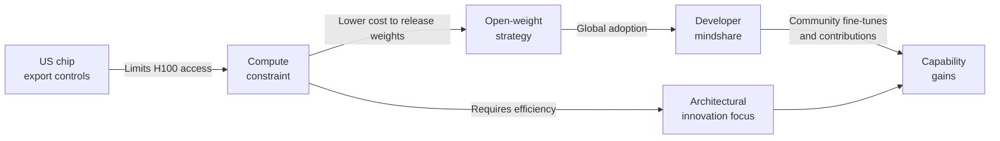

## An Open Model at Frontier Scale

For most of AI's recent history, there was an unspoken assumption: models that could compete at the absolute frontier — beating everything else on coding, reasoning, and multimodal tasks — would be proprietary. You could access them through an API, but you could not download, inspect, or modify them. Open-weight models were powerful, but clearly a tier below.

Kimi K3 broke that assumption.

Released on July 16, 2026 by Beijing-based Moonshot AI, Kimi K3 is a 2.8-trillion-parameter mixture-of-experts model with a 1-million-token context window and native multimodal input. A week later, on July 26, Moonshot released the full model weights under a Modified MIT license — making 1.561 terabytes of parameters freely downloadable from Hugging Face.

The numbers that followed were more striking than the download itself. On the Artificial Analysis Intelligence Index v4.1, Kimi K3 scored 57.1, landing third overall — behind only Claude Fable 5 and GPT-5.6 Sol. On the independent Frontend Code Arena, it ranked first with an Elo of 1,679, surpassing Claude Fable 5 (1,631) and GPT-5.6 Sol (1,618). On coding agent benchmarks specifically, it beat every frontier model, open or closed.

For a model you can download and run yourself, for free, those numbers are remarkable.

---

## What 2.8 Trillion Parameters Actually Means

The parameter count is simultaneously the most attention-grabbing and least important fact about Kimi K3.

Mixture-of-experts (MoE) models do not use all their parameters on every inference. Kimi K3 has 896 experts, but only 16 are activated for any given token. Add 2 full-width "shared" experts that always run, and you get roughly 104 billion active parameters per token — about the same compute cost per inference as a dense 100-billion-parameter model.

Think of it like a building with 896 specialized offices, but any employee only visits 18 of them to complete a task. The building is enormous, but the person doing the work is not.

The total parameter count still matters because a larger expert pool means more specialized knowledge encoded in the weights. But the compute-per-token is what determines inference speed and cost, and K3's is competitive rather than astronomical.

---

## Three Architectural Bets

What makes Kimi K3 interesting as an engineering artifact is not its size — it is the three novel components Moonshot built into the architecture, each addressing a real scaling problem.

### Kimi Delta Attention

Standard transformer attention has a problem at long contexts: the key-value cache grows with sequence length, consuming memory linearly. For a 1-million-token context, that cache becomes enormous.

Kimi Delta Attention (KDA) replaces full attention in most layers with a linear-attention mechanism based on the delta rule. Each layer maintains a **fixed-size state** updated incrementally — rather than a cache that grows with the conversation. Per-channel forget gates control how quickly older information decays, letting the model "decide" which past context to preserve.

The trade-off is that KDA sacrifices the ability to retrieve arbitrary past tokens in exchange for bounded memory at any context length. Moonshot handles this by interleaving KDA layers with standard Gated Multi-head Latent Attention (MLA) layers at regular intervals, preserving global interaction where it matters most.

### Attention Residuals

In a standard transformer, each layer receives only the output of the layer immediately before it. Information from early layers reaches deep layers only through sequential composition — it must survive every transformation in between.

Attention Residuals (AttnRes) change this. Each layer can selectively attend to representations from **any preceding layer**, not just the one above it. The model applies a form of attention not only across tokens in a sequence, but also across the depth levels of the network.

This gives deeper layers direct access to early-layer representations when they are relevant, without requiring that information to survive unchanged through a dozen intermediate transformations.

### Stable LatentMoE

Scaling a mixture-of-experts model to 896 experts — while keeping only 16 active per token — creates optimization instability. Routers can collapse (routing everything to a handful of experts), experts can become underspecialized, and gradients can diverge at extreme sparsity.

Moonshot's Stable LatentMoE addresses this with several stabilization techniques working together:

- Tokens are projected into a compact **latent space at half the hidden dimension** before routing, reducing routing computation while preserving enough signal for good decisions
- **Quantile Balancing** prevents load collapse, enforcing sufficiently uniform token distributions across experts during training
- **SiTU-GLU** activations and careful normalization prevent gradient instability at extreme sparsity ratios

The result, Moonshot reports, is a 2.5× improvement in overall scaling efficiency over Kimi K2 — largely credited to the stability gains at the MoE level.

---

## The Benchmark Story

Kimi K3's benchmark results tell a nuanced story that rewards close reading.

| Benchmark | Kimi K3 | Claude Fable 5 | GPT-5.6 Sol |
|---|---|---|---|
| Frontend Code Arena (Elo) | **1,679 (#1)** | 1,631 | 1,618 |
| Terminal-Bench | **88.3** | 84.6 | — |
| SWE Marathon | **42.0** | 35.0 | — |
| SWE-Bench Verified | 76.8% | — | — |
| GPQA Diamond | **93.5%** | — | — |
| HLE-Full (hardest reasoning) | 43.5 | **53.3** | 44.5 |
| Artificial Analysis AI Index | 57.1 (#3) | ~60 (#1) | ~59 (#2) |

The story here is **specialization**: Kimi K3 dominates on coding and agentic coding tasks — the kind where a model executes a multi-step workflow, runs code, observes the output, and iterates. It trails on HLE-Full, which tests the hardest reasoning tasks across mathematics, science, and knowledge depth.

For a developer building a coding agent, K3 is currently the best model available by benchmark. For a researcher needing deep reasoning over difficult scientific problems, Fable 5 still leads.

The 93.5% on GPQA Diamond is worth pausing on: this is the strongest open-weight score ever published on that benchmark, which tests graduate-level questions in physics, chemistry, and biology at a level designed to stump most PhD students. That is not a coding trick — it reflects genuine depth of encoded knowledge.

---

## The Geopolitical Subtext

Kimi K3 did not land in a neutral context. Moonshot AI operates under US export controls restricting China's access to the most advanced AI chips — the hardware that dominates data centers in the US and Europe. Those restrictions were explicitly designed to slow frontier AI development in China.

Kimi K3 is evidence that the strategy's effect has been partial at best.

When the weights were released, US officials and Anthropic alleged that Moonshot had used **model distillation** — training K3 on outputs generated by Anthropic's Claude models — to achieve its performance without equivalent first-principles compute. Moonshot denied the allegations. The question is unresolved and, in some ways, beside the point: whatever techniques produced K3, the result is a model that competes at the frontier and is now in the hands of anyone who wants it.

Rest of World noted that China's embrace of open-weight approaches came partly out of necessity: with constrained access to cutting-edge compute, releasing model weights costs Moonshot less than it would cost OpenAI or Anthropic, while winning global developer mindshare in return.

The pattern echoes DeepSeek's earlier strategy — and the same debate follows: is this evidence that compute restrictions are ineffective, or that China has found clever routes around them? The honest answer is: probably both.

---

## What This Means If You Build with AI

**For practitioners building coding agents:** K3 is immediately useful. On SWE-Marathon and Terminal-Bench, it beats every proprietary model, including ones you pay per token. If you can host 1.5 TB of weights on your own infrastructure, Kimi K3 is the current state of the art at zero licensing cost. Via API, it is available at $3 per million input tokens and $15 per million output tokens — competitive with mid-tier proprietary options.

**For organizations with data privacy requirements:** Open-weight models can be deployed entirely on your own infrastructure, with no data leaving your environment. For healthcare, finance, or legal applications where sending data to a third-party API creates compliance risk, K3 gives access to frontier-level coding capability on-premises.

**For the open-source AI community:** The gap between open-weight and proprietary models has been closing for two years, but K3 is the first time an open-weight model has held the #1 position on a major live benchmark. That is a shift in the center of gravity, not a blip. The community can fine-tune K3, quantize it for lower-end hardware, build derivative models, and publish results — none of which is possible with a proprietary API.

**For those watching the China-US AI race:** The distillation allegations versus the reality of demonstrated performance represent a recurring tension that neither side has resolved. Whatever produced K3, it is now available globally, under a permissive license, for anyone to extend. Capability that exists in the world is harder to contain than capability that exists only in a data center.

The largest model you can freely download just beat the best models in the world on the coding tasks that matter most for software agents. Whether you care about the geopolitics, the architecture, or just the benchmarks — K3 is worth paying attention to.

---

## Sources

- [China's Moonshot AI Releases Kimi K3, the Largest Open-Source Model Ever, Rivaling Top U.S. Systems — VentureBeat](https://venturebeat.com/technology/chinas-moonshot-ai-releases-kimi-k3-the-largest-open-source-model-ever-rivaling-top-u-s-systems)
- [KIMI K3: Open Frontier Intelligence — Technical Report (arXiv 2607.24653)](https://arxiv.org/pdf/2607.24653)
- [moonshotai/Kimi-K3 — Hugging Face](https://huggingface.co/moonshotai/Kimi-K3)
- [Kimi K3 Tech Blog — Kimi.ai](https://www.kimi.ai/blog/kimi-k3)
- [Kimi K3: 2.8-Trillion-Parameter Model Released for Free — Tom's Hardware](https://www.tomshardware.com/tech-industry/artificial-intelligence/moonshot-releases-2-8-trillion-parameter-kimi-k3)
- [China Narrows U.S. AI Gap With Moonshot AI's Kimi K3 — Foreign Policy](https://foreignpolicy.com/2026/07/23/china-ai-race-moonshot-kimi-k3-alibaba-qwen-deepseek-openai-anthropic/)
- [With Moonshot's Free Kimi K3, China Changes the Sovereign AI Playbook — Rest of World](https://restofworld.org/2026/china-moonshot-kimi-k3-free-sovereign-ai/)
- [Kimi K3 Benchmark Analysis: Where the Open 2.8T Model Beats Claude and GPT — SevenTnewS](https://www.seventnews.com/en/articles/where-kimi-k3-beats-the-frontier-a-benchmark-by-benchmark-look-at-the-open-28t-model)
- [Kimi K3 AI Model Architecture Breakdown — Medium](https://medium.com/@tahirbalarabe2/kimi-k3-ai-model-architecture-breakdown-7dde96e5a424)
- [Beyond Bigger MoE: How Kimi K3 Scales Context, Depth, and Agents — Andrey Lukyanenko](https://andlukyane.com/blog/paper-review-kimik3)
- [Moonshot Open-Sources Kimi K3 as U.S.-China AI Tensions Intensify — Caixin Global](https://www.caixinglobal.com/2026-07-29/moonshot-open-sources-kimi-k3-as-us-china-ai-tensions-intensify-102468927.html)
