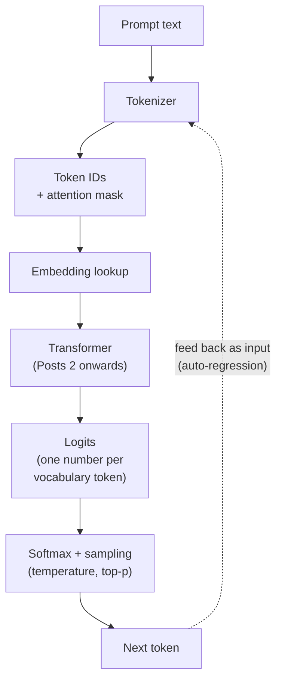
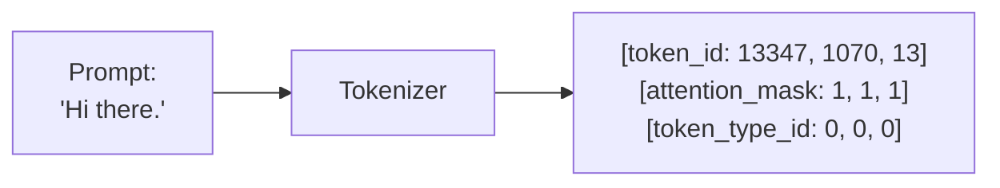
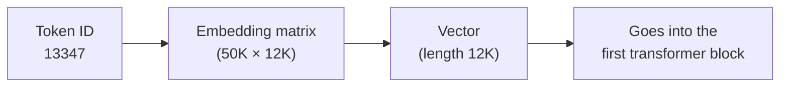

## Before you start

This is the first post of **The LLM Internals Course** — a 15-part series adapted from my own notes on how modern LLMs work end-to-end. The audience is engineers who already have a passing acquaintance with neural networks and transformers.

If you've never seen a transformer up close, spend an afternoon with these first; this series will make a lot more sense afterwards.

- Andrej Karpathy, **["Let's build GPT: from scratch, in code, spelled out."](https://www.youtube.com/watch?v=kCc8FmEb1nY)** — the most useful two hours you'll spend on transformers.
- Andrej Karpathy, **["Let's build the GPT Tokenizer."](https://www.youtube.com/watch?v=zduSFxRajkE)** — companion to today's post.
- 3Blue1Brown, **["But what is a GPT? — Visual intro to transformers."](https://www.youtube.com/watch?v=wjZofJX0v4M)** — if you're more visual than code-driven.
- Jay Alammar, **["The Illustrated Transformer."](https://jalammar.github.io/illustrated-transformer/)** — the canonical written explainer.

The mental model you need: text becomes a sequence of token IDs, each ID looks up a vector (embedding), the model transforms those vectors layer by layer until the last one becomes a probability distribution over the vocabulary, and we sample the next token from it. Then we repeat.

This post is about the two ends of that pipe — what happens before the model and what happens after. The next post opens the model itself.

## From text to tokens

A model can't see characters. It sees integers. Tokenization is the layer that turns text into integers, and a *tokenizer* is a piece of software that does it.

What surprises most people on first contact: tokens are not words. They aren't characters either. Modern tokenizers use **subword tokenization** — a token is whatever frequent fragment of text earned its own ID during the tokenizer's training run. `Tokenization` might be one token. `Tokenizing` might be two: `Token` and `izing`. `Awesomeeee` becomes `Awesom`, `m`, `m`, `e`. The split is whatever the tokenizer's algorithm — usually byte-pair encoding (BPE) — decided was worth a vocabulary slot.

<TokenizerDemo />
<Text variant="label-default-xs" onBackground="neutral-weak" align="center">
  Live tokenization with the GPT-4o tokenizer. Edit the text above to see how splits change. For more, the <SmartLink href="https://platform.openai.com/tokenizer">OpenAI Tokenizer playground</SmartLink> covers older OpenAI models too.
</Text>

The most important fact about tokenization is the one that's easiest to forget: **each model has its own tokenizer**, and the integers it emits are only meaningful to that model. If you tokenize `"hello"` with GPT-4o's tokenizer and feed the IDs to Llama-3, the model will see gibberish. Always tokenize with the same tokenizer the model was trained with.

## The three numbers per token

When a tokenizer processes text, it usually emits more than just token IDs. Two extra signals ride along:

- **`token_id`** — the integer index into the model's vocabulary.
- **`attention_mask`** — `1` for "real" tokens, `0` for padding. When you batch sequences of different lengths together, you pad the short ones to match the longest. The mask tells the model "this position isn't a real token, ignore it."
- **`token_type_id`** (sometimes called segment ID) — a `0`/`1` flag that marks boundaries between distinct chunks: question vs. answer, prompt vs. response, speaker A vs. speaker B. Many modern LLMs don't use this anymore — they encode boundaries with explicit chat-template tokens like `<|user|>` and `<|assistant|>` instead — but you'll still see it in classical encoders.

## Why subword? Vocab size and unknown words

Why not just one token per word, or one token per character? Both extremes break in opposite ways.

**Word-level tokenization** would need a vocabulary of millions of entries to cover everything humans actually type — every conjugation, every plural, every typo, every brand name, every URL. Worse, it has no story for words it has never seen. `Loveeee` is a different word from `Love` to a word-level tokenizer; it gets the dreaded `<unk>` token and the model loses the entire signal.

**Character-level tokenization** has the opposite problem. Vocabulary stays tiny (a few hundred), but every word becomes 5–10 tokens, and the model has to relearn from scratch which character clusters mean what. Sequences blow up, attention costs explode.

Subword splits the difference. `Jump`, `Jumps`, `Jumper`, `Jumping` don't all need their own slots — store `Jump` once and add subword suffixes `s`, `er`, `ing` that combine with anything. Vocabularies stay around 30K–200K. Typos and made-up words still tokenize, just into more, smaller pieces. Nothing ever becomes `<unk>`.

<Media src="/images/blog/llm-internals-01-tokenization-embeddings-sampling/hf-bpe-subword.svg" alt="Diagram showing how byte-pair encoding splits a word into subword tokens" />
<Text variant="label-default-xs" onBackground="neutral-weak" align="center">
  Source: <SmartLink href="https://huggingface.co/learn/llm-course/en/chapter2/4">Hugging Face LLM Course, Chapter 2.4 — Tokenization</SmartLink>.
</Text>

## From IDs to embeddings

Once you have integer IDs, the very first thing the model does is convert each one into a dense vector. This is not "magic" — it's a literal lookup table called the **embedding matrix**.

The matrix has shape `(vocab_size, d_model)`. For GPT-3, that was `50,257 × 12,288` — about 617 million parameters just to map tokens to starting vectors. Each row is the embedding for one token ID.

The vector that comes out has *no context*. It's the same vector every time `13347` appears, no matter where it sits in the prompt. Context is what the transformer's attention layers add on top — that's the next post.

What's beautiful is what those embeddings capture. After training, semantically similar tokens land near each other in the vector space, and analogies become arithmetic: `king − man + woman ≈ queen`.

<Media src="/images/blog/llm-internals-01-tokenization-embeddings-sampling/jay-alammar-word2vec-king-analogy.png" alt="Visualization of king/queen/man/woman embedding analogy in vector space" />
<Text variant="label-default-xs" onBackground="neutral-weak" align="center">
  Source: <SmartLink href="https://jalammar.github.io/illustrated-word2vec/">Jay Alammar, "The Illustrated Word2Vec"</SmartLink>. The shape of the space carries the meaning.
</Text>

## A brief detour: how RAG reuses embeddings

> Skim this section. RAG is its own large topic, and a real treatment is outside the scope of this series. The point here is just to note where else you've already met embeddings if you've shipped any AI features. If this section doesn't fully click, that's fine — nothing later in the course depends on it.

Most engineers' first encounter with embeddings isn't building an LLM — it's building **Retrieval-Augmented Generation**. RAG works like this: you have a pile of documents (a wiki, a product catalog, your own notes). You break each document into *chunks*, run each chunk through an embedding model, and store the resulting vectors in a vector database. At query time, you embed the user's question with the same model, find the chunks whose vectors are closest (usually by cosine similarity), and stuff those chunks into the LLM's context as background.

Same vector space, same arithmetic, completely different application. The chunking strategy — paragraph-level? sliding-window with overlap? structured by headings? — is most of the engineering. The embedding model is usually a small purpose-trained one, not the LLM itself, and it's almost never the same tokenizer as the generative model. Different models, separate concerns.

That's all you need from RAG for the rest of the series. We're going back to generation.

## Auto-regression: generation is a loop

LLM generation is **auto-regressive**: the model predicts one token at a time, and each new token gets fed back in to predict the next.

In training, this is what self-supervised learning means at the data level — given `"The world is"`, learn to predict `"beautiful"`. Given `"The world is beautiful"`, learn to predict `.`. The transformer's *causal masking* lets it learn all those positions in parallel from one sentence (we'll cover causal masking properly in Post 2 and Post 7), but at inference time the loop is sequential: emit a token, append it to the input, run the model again.

<Media src="/images/blog/llm-internals-01-tokenization-embeddings-sampling/jay-alammar-gpt3-sliding-window.png" alt="Sliding-window training examples showing input context and the next token to predict" />
<Text variant="label-default-xs" onBackground="neutral-weak" align="center">
  Source: <SmartLink href="https://jalammar.github.io/how-gpt3-works-visualizations-animations/">Jay Alammar, "How GPT3 Works — Visualizations and Animations"</SmartLink>.
</Text>

The reason the KV cache exists (Post 2 and Post 4 both lean on it) is exactly this: most of the work of processing the prompt only happens once, on the first forward pass. After that, each new token reuses what's already cached and only computes its own slice.

## From logits to tokens: sampling

What does the model actually output? At every position in the sequence, after all the transformer blocks have run, the final hidden state gets multiplied by the un-embedding matrix (essentially the embedding matrix turned around). The result is a vector of length `vocab_size` — one number per token in the vocabulary. These numbers are called **logits**, and they are *not* probabilities. They can be negative, very large, distributed however the model felt like producing them.

To turn logits into probabilities we apply **softmax**:

<Column horizontal="center" fillWidth>
  <Media src="/images/blog/llm-internals-01-tokenization-embeddings-sampling/eq-softmax.svg" alt="Softmax equation: probability of token i is exp of logit i divided by sum of exp logits" style={{ maxWidth: "360px", width: "100%" }} />
</Column>
<Text variant="label-default-xs" onBackground="neutral-weak" align="center">
  Softmax converts logits z into a probability distribution p over the vocabulary V. Exponentiation makes everything positive; the denominator normalises so probabilities sum to 1.
</Text>

Now we have a distribution over the next token. Generation comes down to: how do we *pick* a token from that distribution?

The simplest answer is **greedy decoding** — always pick the highest-probability token. It's deterministic and often a sensible default for math, code, or extraction tasks. It's also boring. Greedy quickly falls into loops (`"the the the"`) and produces the same response every time you run a prompt. For anything with a creative dimension we want stochasticity, and we want *control* over it. That's what the next two knobs do.

## Temperature

**Temperature** is a single scalar `T` that you divide the logits by *before* applying softmax:

<Column horizontal="center" fillWidth>
  <Media src="/images/blog/llm-internals-01-tokenization-embeddings-sampling/eq-temperature.svg" alt="Temperature-adjusted softmax equation" style={{ maxWidth: "400px", width: "100%" }} />
</Column>
<Text variant="label-default-xs" onBackground="neutral-weak" align="center">
  Dividing logits by temperature T before softmax. T &lt; 1 sharpens the distribution toward the top tokens; T &gt; 1 flattens it.
</Text>

Geometrically: when `T < 1`, you're stretching the gaps between logits, so the highest one dominates even more after softmax — the distribution becomes peaky. When `T > 1`, you're squashing the gaps, so the distribution flattens out and the model is more willing to pick less-likely tokens.

<Column gap="12" fillWidth marginTop="8" marginBottom="16">
  <Column gap="4">
    <Text variant="label-default-xs" onBackground="neutral-weak" align="center">
      No temperature: random sampling from the raw distribution. Many candidates have meaningful probability — outputs are diverse but can drift.
    </Text>
    <Media src="/images/blog/llm-internals-01-tokenization-embeddings-sampling/hf-sampling-no-temp.png" alt="Probability distribution from raw sampling — many tokens with similar probability" />
  </Column>
  <Column gap="4">
    <Text variant="label-default-xs" onBackground="neutral-weak" align="center">
      With temperature &lt; 1: the same distribution sharpens. The top few tokens take most of the probability mass, low-probability tokens fade.
    </Text>
    <Media src="/images/blog/llm-internals-01-tokenization-embeddings-sampling/hf-temperature-sampling.png" alt="Same distribution sharpened by a temperature less than 1" />
  </Column>
</Column>
<Text variant="label-default-xs" onBackground="neutral-weak" align="center">
  Source: <SmartLink href="https://huggingface.co/blog/how-to-generate">Patrick von Platen, Hugging Face blog — "How to generate text"</SmartLink>. Two snapshots of the same logits, with and without temperature applied before softmax.
</Text>

In practice, the ranges look like this:

- `T = 0` — degenerate case, equivalent to greedy. Use for math, code, structured extraction.
- `T = 0.1–0.5` — focused, conservative. Good for summarisation, reformulation, anything where you want minor stylistic variation but no surprises.
- `T = 0.7–1.0` — the sweet spot for general conversation and creative writing.
- `T = 1.2–1.5` — very creative, but the model starts losing logical thread.
- `T > 1.5` — gibberish.

## Top-p (nucleus sampling)

Temperature reshapes the distribution but doesn't truncate it. Even with low temperature, the long tail of "weird tokens with probability 0.0001" is still technically reachable — and once in a while you draw one and the response derails.

**Top-p sampling** (also called *nucleus sampling*, from Holtzman et al. 2019) is a sharper instrument. Sort all tokens by probability, walk down the list summing probabilities, and stop the moment the running sum crosses your threshold `p`. That smallest set of tokens is the **nucleus** — and you sample from those tokens only, ignoring everything else.

<Column horizontal="center" fillWidth>
  <Media src="/images/blog/llm-internals-01-tokenization-embeddings-sampling/eq-top-p.svg" alt="Top-p set definition: smallest subset whose probabilities sum to at least p, then renormalise" style={{ maxWidth: "560px", width: "100%" }} />
</Column>
<Text variant="label-default-xs" onBackground="neutral-weak" align="center">
  V_p is the smallest subset of the vocabulary whose probabilities sum to at least p; we renormalise within V_p and sample from there.
</Text>

<Media src="/images/blog/llm-internals-01-tokenization-embeddings-sampling/hf-top-p-sampling.png" alt="Visualisation of nucleus sampling: cumulative probability bar showing the cutoff" />
<Text variant="label-default-xs" onBackground="neutral-weak" align="center">
  Source: <SmartLink href="https://huggingface.co/blog/how-to-generate">Patrick von Platen, Hugging Face blog — "How to generate text"</SmartLink>. The shape of the kept set adapts to how peaky the distribution is.
</Text>

The clever thing about top-p is that the size of the kept set adapts. When the model is *confident* (one token has p ≈ 0.9), the nucleus is one token. When the model is *uncertain* (probability is spread across hundreds of options), the nucleus is large. You filter the noise without locking the model into a fixed-size choice.

Practical ranges:

- `p = 1.0` — no filtering. Equivalent to plain temperature sampling.
- `p = 0.9–0.95` — the default in most production stacks. Cuts the long tail of garbage tokens, keeps creative options open.
- `p = 0.5–0.8` — heavily filtered, very safe.
- `p < 0.1` — effectively greedy.

You'll see **top-k** in the wild too — same idea but with a fixed integer cap (`keep the K most-likely tokens, ignore the rest`). Top-k is the older, blunter version. Top-p mostly replaced it because the adaptive nucleus size handles peaky and flat distributions better. Many APIs let you set both at once, applied in sequence.

## Zero-shot, few-shot — the one-paragraph definitions

You'll see "zero-shot" and "few-shot" thrown around. These are not algorithmic settings — they're descriptions of how much *example* you put in the prompt before the actual question.

**Zero-shot:** you give the model the task and nothing else. `"Translate to French: 'I am hungry.'"` Modern instruction-tuned models (Post 9 covers this) are surprisingly good at this.

**Few-shot:** you include a handful of input/output pairs in the prompt before the real one. `"English: hi. French: salut. English: thanks. French: merci. English: I am hungry. French:"` The model picks up the pattern from the examples and continues it. Useful when zero-shot isn't quite landing, or for tasks too narrow to have been instruction-tuned for.

Both happen entirely at inference time — no fine-tuning involved. The word "shot" is a reference to one-shot/few-shot learning from older ML literature.

## Coming up next

Now that we know what goes into the model and what comes out, the next post opens the box. Post 2 traces a single forward pass through a transformer block: how Q, K, V are computed and combined, what the FFN actually does, why residuals make backprop work, and the introduction of the KV cache that makes everything else in this series possible.

---

<FurtherReading>
  <Column gap="4">
    <Text variant="label-strong-s" onBackground="neutral-weak">From my study notes</Text>
    <Text variant="body-default-s" onBackground="neutral-medium">
      Hugging Face LLM Course, Chapter 2 — Tokenization. <SmartLink href="https://huggingface.co/learn/llm-course/en/chapter2/4">huggingface.co/learn/llm-course</SmartLink>
    </Text>
  </Column>

  <Column gap="4">
    <Text variant="label-strong-s" onBackground="neutral-weak">Prerequisite primer</Text>
    <Text variant="body-default-s" onBackground="neutral-medium">
      Karpathy, "Let's build GPT: from scratch, in code, spelled out." <SmartLink href="https://www.youtube.com/watch?v=kCc8FmEb1nY">youtube.com</SmartLink>
    </Text>
    <Text variant="body-default-s" onBackground="neutral-medium">
      Karpathy, "Let's build the GPT Tokenizer." <SmartLink href="https://www.youtube.com/watch?v=zduSFxRajkE">youtube.com</SmartLink>
    </Text>
    <Text variant="body-default-s" onBackground="neutral-medium">
      3Blue1Brown, "But what is a GPT? — Visual intro to transformers." <SmartLink href="https://www.youtube.com/watch?v=wjZofJX0v4M">youtube.com</SmartLink>
    </Text>
    <Text variant="body-default-s" onBackground="neutral-medium">
      Jay Alammar, "The Illustrated Transformer." <SmartLink href="https://jalammar.github.io/illustrated-transformer/">jalammar.github.io</SmartLink>
    </Text>
  </Column>

  <Column gap="4">
    <Text variant="label-strong-s" onBackground="neutral-weak">Tokenization &amp; embeddings</Text>
    <Text variant="body-default-s" onBackground="neutral-medium">
      OpenAI Tokenizer playground. <SmartLink href="https://platform.openai.com/tokenizer">platform.openai.com/tokenizer</SmartLink>
    </Text>
    <Text variant="body-default-s" onBackground="neutral-medium">
      tiktokenizer.vercel.app — third-party multi-model tokenizer playground. <SmartLink href="https://tiktokenizer.vercel.app">tiktokenizer.vercel.app</SmartLink>
    </Text>
    <Text variant="body-default-s" onBackground="neutral-medium">
      Jay Alammar, "The Illustrated Word2Vec." <SmartLink href="https://jalammar.github.io/illustrated-word2vec/">jalammar.github.io</SmartLink>
    </Text>
  </Column>

  <Column gap="4">
    <Text variant="label-strong-s" onBackground="neutral-weak">Sampling, temperature, top-p</Text>
    <Text variant="body-default-s" onBackground="neutral-medium">
      Holtzman et al. 2019, "The Curious Case of Neural Text Degeneration." <SmartLink href="https://arxiv.org/abs/1904.09751">arxiv.org/abs/1904.09751</SmartLink>
    </Text>
    <Text variant="body-default-s" onBackground="neutral-medium">
      Patrick von Platen, Hugging Face blog, "How to generate text." <SmartLink href="https://huggingface.co/blog/how-to-generate">huggingface.co/blog/how-to-generate</SmartLink>
    </Text>
    <Text variant="body-default-s" onBackground="neutral-medium">
      Lilian Weng, "Controllable Neural Text Generation." <SmartLink href="https://lilianweng.github.io/posts/2021-01-02-controllable-text-generation/">lilianweng.github.io</SmartLink>
    </Text>
  </Column>
</FurtherReading>
