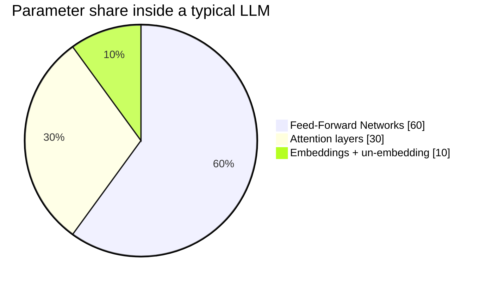
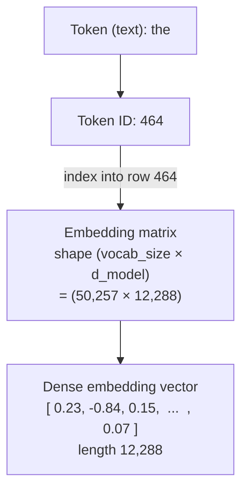
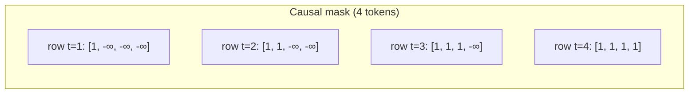

## Where the parameters live

Post 1 ended just before the model. This post is the model — one forward pass through one transformer block, in detail. It is the load-bearing post of the inference half of this series; almost every optimisation in Posts 3, 4, and 5 references something here.

Before we open it up, here's a useful framing for what's inside. A typical decoder-only LLM's parameters break down roughly like this:

Two-thirds of the model's brain is the FFN. Attention is what gets all the attention (sorry) in the literature, but it's actually the smaller component. This matters when we get to optimisations: most "make inference faster" tricks target the attention, but most "make the model fit" tricks target the FFN. Keep that in mind as we go.

A transformer is a stack of these blocks — usually 32, 40, 80, sometimes 100+ — each containing one attention layer and one FFN layer, and we run our token sequence through every block in order.

## The lookup: embedding layer

The first thing the model does is take the token IDs from Post 1 and look up their dense vectors. The embedding matrix has shape `(vocab_size, d_model)` — for GPT-3 that's `50,257 × 12,288`. Each row is a token's starting vector.

The mechanic is dead simple: a token ID is just an integer index. We use it to grab one row of the embedding matrix.

The vector that comes out has *no context*. The same token at position 5 and position 500 looks up the exact same embedding row. Context is what the next layers — attention — add on top. (The position information itself is also injected somewhere around here, but we'll cover positional encoding in Post 6 because it's its own world. For now, assume position is "in there somewhere".)

## Attention: Q, K, V demystified

Attention is the layer where tokens look at each other and pull in context. The mechanic is actually pretty intuitive once you stop treating Q, K, V as math jargon.

Take a sentence like *"The animal didn't cross the street because it was too tired."* When the model is processing the token `it`, what does `it` refer to — the *animal* or the *street*? You and I know it's the animal. The model has to figure that out from raw vectors.

Here's how. Each token gets multiplied by three small matrices — `W_Q`, `W_K`, `W_V` — to produce three new vectors:

- **Query (Q)** — the *question* this token is asking. For `it`, the query encodes something like "I am a pronoun, what noun do I refer to?"
- **Key (K)** — the *label* this token offers in response. For `animal`, the key encodes "I am a noun and could be the antecedent of a pronoun." For `street`, similar but slightly different.
- **Value (V)** — the *content* this token will share if asked. The information this token contributes if it gets attended to.

To find which tokens `it` should attend to, we take its query vector and compare it against every other token's key vector. The comparison is just a dot product — a measure of similarity. High dot product = good match.

<Column horizontal="center" fillWidth>
  <Media src="/images/blog/llm-internals-02-inside-the-transformer-at-inference-time/ja-self-attention-viz.png" alt="Self-attention example showing 'it' attending strongly to 'the animal'" style={{ maxWidth: "460px", width: "100%" }} />
</Column>
<Text variant="label-default-xs" onBackground="neutral-weak" align="center">
  Source: <SmartLink href="https://jalammar.github.io/illustrated-transformer/">Jay Alammar, "The Illustrated Transformer"</SmartLink>. The thicker line is higher attention weight.
</Text>

## The attention math

The full per-head computation in one expression:

<Column horizontal="center" fillWidth>
  <Media src="/images/blog/llm-internals-02-inside-the-transformer-at-inference-time/eq-attention.svg" alt="Scaled dot-product attention equation" style={{ maxWidth: "480px", width: "100%" }} />
</Column>
<Text variant="label-default-xs" onBackground="neutral-weak" align="center">
  Scaled dot-product attention. Q·Kᵀ produces a similarity score for every token pair; dividing by √d_k stops the dot products from growing too large at higher dimensions; softmax converts scores into a probability distribution; then we use those probabilities to take a weighted sum of all V vectors.
</Text>

That's *one head*. Real transformers run many heads in parallel — GPT-3 had 96 heads per layer. Each head has its own small `W_Q`, `W_K`, `W_V` (typically 64- or 128-dim each) and learns to attend to a different *kind* of relationship. One head might learn syntactic agreement, another semantic similarity, another long-range references.

<Column horizontal="center" fillWidth>
  <Media src="/images/blog/llm-internals-02-inside-the-transformer-at-inference-time/eq-multihead.svg" alt="Multi-head attention equation: concatenate head outputs and project" style={{ maxWidth: "620px", width: "100%" }} />
</Column>
<Text variant="label-default-xs" onBackground="neutral-weak" align="center">
  Multi-head attention runs h independent attention heads in parallel, concatenates their outputs, and projects back to model dimension via W^O.
</Text>

A cleaner redrawn view of the same machinery — each token's vector hits *h* sets of (W_Q, W_K, W_V) projections, producing *h* parallel attention computations:

<Media src="/images/blog/llm-internals-02-inside-the-transformer-at-inference-time/ja-multi-head-qkv.png" alt="Multi-head attention: input vectors fan out into h independent Q, K, V projections" />
<Text variant="label-default-xs" onBackground="neutral-weak" align="center">
  Source: <SmartLink href="https://jalammar.github.io/illustrated-transformer/">Jay Alammar, "The Illustrated Transformer"</SmartLink>. Each colour is a different attention head with its own learned projections.
</Text>

After multi-head attention runs, every token has a new vector that mixes its own value with weighted contributions from every other token in the sequence — its context-aware representation.

## Causal masking

There's one detail we glossed over: in *decoder-only* LLMs (GPT-style — almost all modern LLMs), a token at position `t` is only allowed to attend to tokens at positions ≤ `t`. The model cannot peek at the future during training, otherwise next-token prediction becomes trivial cheating.

The way this is enforced is dead simple: before applying softmax to the attention scores, we set every `(i, j)` entry where `j > i` to `-∞`. After softmax, those positions become exactly 0 — zero attention weight on future tokens.

Causal masking is what lets the model train on a whole sequence in parallel — every position learns its own next-token prediction simultaneously, without the future leaking back. We'll see it again in Post 7 from the training perspective.

## FFN: where the model actually thinks

After attention, every token's vector goes through a Feed-Forward Network. This is where the FFN's 60% of parameters earn their keep.

The FFN is small but wide. For each token's vector, we project up to a much larger dimension (typically 4× the model dimension — for GPT-3 that's 12,288 → 49,152), apply a non-linearity (ReLU originally, GeLU in modern LLMs, SwiGLU in some), then project back down to the original dimension. Three operations: up-projection, non-linearity, down-projection. The FFN's parameter count comes from those two big projection matrices.

The FFN operates on each token *independently* — there is no cross-token interaction here. Attention is where tokens talk to each other; the FFN is where each token, alone, decides what to do with its newfound context. If attention is *gathering*, FFN is *thinking*.

The going intuition (rough but useful) is that FFN layers store the model's knowledge — facts, associations, learned patterns — in their weights, and the up-projection / down-projection lets each token query that knowledge using its context vector as a key. This is also why MoE works (Post 5): you can swap in a different FFN per token without breaking the rest.

## Residuals and Add-and-Norm

Stacking 80 transformer blocks should not work. Naively, every block transforms its input and the original signal would get washed out by layer 80. The trick that makes deep transformers trainable — borrowed from ResNet (He et al. 2015) — is the **residual connection**:

<Column horizontal="center" fillWidth>
  <Media src="/images/blog/llm-internals-02-inside-the-transformer-at-inference-time/eq-residual.svg" alt="Residual connection: y equals LayerNorm of x plus SubLayer of x" style={{ maxWidth: "420px", width: "100%" }} />
</Column>
<Text variant="label-default-xs" onBackground="neutral-weak" align="center">
  Each sub-layer (attention or FFN) outputs a *delta* that's added back to its input, then normalised. The original signal is preserved through addition all the way from input to output.
</Text>

Visually, every attention and every FFN gets wrapped like this:

<Column horizontal="center" fillWidth>
  <Media src="/images/blog/llm-internals-02-inside-the-transformer-at-inference-time/ja-residual-layernorm.png" alt="Residual connection and layer norm wrapping each sub-layer" style={{ maxWidth: "520px", width: "100%" }} />
</Column>
<Text variant="label-default-xs" onBackground="neutral-weak" align="center">
  Source: <SmartLink href="https://jalammar.github.io/illustrated-transformer/">Jay Alammar, "The Illustrated Transformer"</SmartLink>.
</Text>

The residual matters during *backprop* even more than during forward. Because addition's derivative is 1, the gradient signal flows backward through the addition unchanged — bypassing the sub-layer's potentially exploding/vanishing path. Without residuals, we couldn't train transformers past a handful of layers.

> **Pre-norm vs post-norm.** The equation above shows post-norm (`LayerNorm(x + SubLayer(x))`) which is what the original 2017 paper used. Modern LLMs use *pre-norm*: `x + SubLayer(LayerNorm(x))`. Pre-norm is more stable at scale because the residual stream stays unnormalised, which keeps gradients well-conditioned through deep stacks. The intuition above doesn't change; just remember the variant when reading paper code.

## From last block to logits

After we've run our sequence through all 80-or-whatever transformer blocks, every position has a final hidden state vector. To produce the next-token prediction we focus on the last position, run it through one more LayerNorm, and multiply by the un-embedding matrix (essentially the embedding matrix transposed — same `(vocab_size, d_model)` shape). The result is a logit vector: one number per token in the vocabulary.

<Media src="/images/blog/llm-internals-02-inside-the-transformer-at-inference-time/ja-decoder-output-softmax.png" alt="Final hidden state projected to vocabulary-sized logits and softmaxed to probabilities" />
<Text variant="label-default-xs" onBackground="neutral-weak" align="center">
  Source: <SmartLink href="https://jalammar.github.io/illustrated-transformer/">Jay Alammar, "The Illustrated Transformer"</SmartLink>.
</Text>

From here the rest is Post 1's territory: softmax, temperature, top-p, sample, append, repeat.

## The KV cache: history, not dictionary

We've described what one forward pass does — but at inference time we don't run a full forward pass on the whole sequence for every new token. That would be wasteful: most of the work is identical from one step to the next. Enter the **KV cache**.

There are two phases of generation:

- **Prefill** — when the prompt arrives, run one full forward pass over all prompt tokens. For every layer, save K and V for every token position. This is the expensive step; it scales with prompt length.
- **Decode** — for each new generated token, only compute Q/K/V for *that one new token*. Append the new K and V to the cache. Then attention compares the new Q against the *cached* K vectors of all past tokens (and itself).

<Media src="/images/blog/llm-internals-02-inside-the-transformer-at-inference-time/hf-kv-cache-2.png" alt="KV cache lifecycle showing prefill writing all K/V then decode appending one at a time" />
<Text variant="label-default-xs" onBackground="neutral-weak" align="center">
  Source: <SmartLink href="https://huggingface.co/blog/not-lain/kv-caching">Hugging Face blog, "KV Caching Explained"</SmartLink>.
</Text>

We don't cache Q because Q is only used by the current token at the current step — once attention is computed, Q is thrown away. We don't cache the attention output either; that's contextual and changes every step.

This is the single most important inference optimisation. Without the KV cache, every new token would require re-running the full forward pass over the entire sequence — O(N²) total work for an N-token output. With the KV cache, decode is O(N) total. Almost everything in Post 4 is about making this cache smaller, faster, or shareable.

## Why the KV cache is a history, not a dictionary

A common misconception: *"if I see the same token again, can I reuse its cached K and V?"* No — and the reason is positional encoding.

The K and V for a token are not just functions of the token; they're functions of the token *and its position in the sequence*. The same word `the` at position 5 has different K/V from `the` at position 500, because positional information is baked into the vectors before attention runs. (Post 6 covers RoPE, the modern way this gets injected.)

So the cache is not a dictionary keyed by token; it is a *history* of every position in this specific sequence. That's the central constraint that everything in Post 4 has to work around — and also why prefix caching (Post 3) works: identical *prefixes* in the same order have identical positional encodings, so their K/V is genuinely reusable.

## Coming up next

That's the model. One block: embed → attention → residual → FFN → residual → next block. Stack 80 of them. Last position out, un-embed to logits, softmax, sample. Cache your K and V.

Post 3 zooms back out to the systems layer: how production inference servers like vLLM, TGI, and Ollama orchestrate all this — schedulers, streaming, batching, and the SageMaker-style multi-model serving patterns that pack many fine-tuned models onto one GPU.

---

<FurtherReading>
  <Column gap="4">
    <Text variant="label-strong-s" onBackground="neutral-weak">From my study notes</Text>
    <Text variant="body-default-s" onBackground="neutral-medium">
      3Blue1Brown, "Attention in transformers, step-by-step." <SmartLink href="https://www.youtube.com/watch?v=eMlx5fFNoYc">youtube.com</SmartLink>
    </Text>
    <Text variant="body-default-s" onBackground="neutral-medium">
      3Blue1Brown, "How might LLMs store facts (MLP layer)." <SmartLink href="https://www.youtube.com/watch?v=9-Jl0dxWQs8">youtube.com</SmartLink>
    </Text>
    <Text variant="body-default-s" onBackground="neutral-medium">
      "How does the KV Cache work?" — YouTube. <SmartLink href="https://www.youtube.com/watch?v=9tvJ_GYJA-o">youtube.com</SmartLink>
    </Text>
  </Column>

  <Column gap="4">
    <Text variant="label-strong-s" onBackground="neutral-weak">Foundational paper</Text>
    <Text variant="body-default-s" onBackground="neutral-medium">
      Vaswani et al. 2017, "Attention Is All You Need." <SmartLink href="https://arxiv.org/abs/1706.03762">arxiv.org/abs/1706.03762</SmartLink>
    </Text>
  </Column>

  <Column gap="4">
    <Text variant="label-strong-s" onBackground="neutral-weak">Visual explainers</Text>
    <Text variant="body-default-s" onBackground="neutral-medium">
      Jay Alammar, "The Illustrated Transformer." <SmartLink href="https://jalammar.github.io/illustrated-transformer/">jalammar.github.io</SmartLink>
    </Text>
    <Text variant="body-default-s" onBackground="neutral-medium">
      Lilian Weng, "Attention? Attention!" <SmartLink href="https://lilianweng.github.io/posts/2018-06-24-attention/">lilianweng.github.io</SmartLink>
    </Text>
    <Text variant="body-default-s" onBackground="neutral-medium">
      Karpathy, "Let's build GPT: from scratch, in code, spelled out." <SmartLink href="https://www.youtube.com/watch?v=kCc8FmEb1nY">youtube.com</SmartLink>
    </Text>
  </Column>

  <Column gap="4">
    <Text variant="label-strong-s" onBackground="neutral-weak">KV cache deep dives</Text>
    <Text variant="body-default-s" onBackground="neutral-medium">
      Hugging Face, "KV Caching Explained." <SmartLink href="https://huggingface.co/blog/not-lain/kv-caching">huggingface.co</SmartLink>
    </Text>
    <Text variant="body-default-s" onBackground="neutral-medium">
      Aleksa Gordić, "From Attention to Modern Inference (vLLM internals)." <SmartLink href="https://www.aleksagordic.com/blog/vllm">aleksagordic.com</SmartLink>
    </Text>
  </Column>

  <Column gap="4">
    <Text variant="label-strong-s" onBackground="neutral-weak">Residual connections (background)</Text>
    <Text variant="body-default-s" onBackground="neutral-medium">
      He et al. 2015, "Deep Residual Learning for Image Recognition" — the original residual block. <SmartLink href="https://arxiv.org/abs/1512.03385">arxiv.org/abs/1512.03385</SmartLink>
    </Text>
  </Column>
</FurtherReading>
