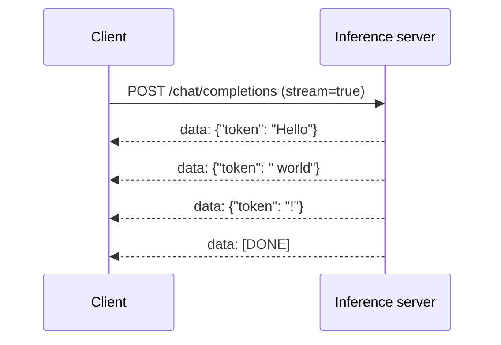
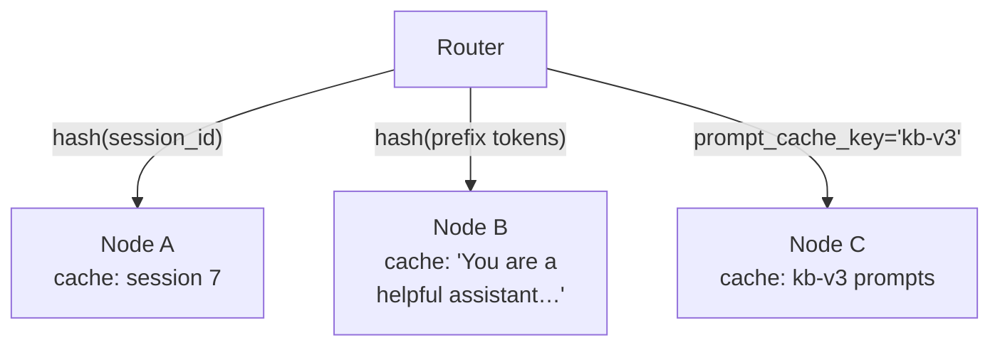

## From a model file to a user

Posts 1 and 2 stayed inside the model. This post zooms back out: the model is a tensor of weights and a Python `forward()` method. Production inference is everything that wraps it — request scheduling, batching, tokenisation, the KV cache, streaming the tokens out, recovering from dropped connections, autoscaling across nodes, and packing many models onto one box.

You don't write any of that yourself. You pick an inference server. There are three names worth knowing.

## The three big inference servers

| Server | Best for | Backend | Notable features |
|---|---|---|---|
| **vLLM** | Production throughput, broad model support | Python + C++/CUDA | PagedAttention, continuous batching, chunked prefill, prefix caching, speculative decoding, P/D disaggregation. The default for serious deployments. |
| **TGI** (Hugging Face) | HF-ecosystem teams who want stability and Rust | Rust + C++ | PagedAttention, continuous batching, slightly lower peak throughput than vLLM, simpler ops story. |
| **Ollama** | Local development, small models, Apple silicon | C++ (wraps `llama.cpp`) | Docker-style model registry, GGUF format, quantization-friendly. Not built for high throughput. |

vLLM is what most production stacks pick. TGI is excellent if your team already lives inside Hugging Face. Ollama is the one you put on your laptop when you want to try a model in five minutes — not the one you put behind a load balancer.

## The OpenAI-compatible API standard

One under-appreciated reason any of these are usable: they all expose an **OpenAI-compatible API**. Both vLLM and Ollama can serve `POST /v1/chat/completions` with the same request/response shape as the OpenAI API. So can TGI's newer messages endpoint.

This means client code doesn't need to know which server it's talking to. You change a base URL, the rest of your application is unchanged. That's not a small thing — it's why "swap the model" is now a config change, not a re-implementation.

## Inside vLLM: a request's life in three steps

Pick vLLM and look at what happens to one request once it lands. There are three phases to every iteration of the engine loop:

1. **Schedule** — pick which requests run in this step. Could be a chunked prefill, a decode for an in-flight request, or a mix.
2. **Forward pass** — run the chosen tokens through the model and sample a next token for each running request.
3. **Postprocess** — append the sampled token IDs to each request, detokenise, check stop conditions. If the request is done, evict it from the batch and return.

<Column horizontal="center" fillWidth>
  <Media src="/images/blog/llm-internals-03-serving-llms-in-production/aleksa-engine-loop.png" alt="vLLM engine loop showing schedule then forward pass then postprocess in sequence" style={{ maxWidth: "440px", width: "100%" }} />
</Column>
<Text variant="label-default-xs" onBackground="neutral-weak" align="center">
  Source: <SmartLink href="https://www.aleksagordic.com/blog/vllm">Aleksa Gordić, "From Attention to Modern Inference (vLLM internals)"</SmartLink>.
</Text>

The non-obvious part is step 1. The scheduler is the engine's brain. Throughput, latency, fairness, KV-cache memory pressure — they all live in scheduling decisions. Almost every optimisation in Post 4 is implemented as a scheduler change.

## Prefill vs decode: two different beasts

The single most useful framing for inference is that there are two completely different workloads happening simultaneously inside one server:

- **Prefill requests** — process all prompt tokens in one forward pass. The whole prompt's Q/K/V is computed and the K/V is cached. The output is one sampled token (the first one). Prefill is **compute-bound**: you're doing heavy matrix multiplications across hundreds or thousands of tokens at once. Bigger prompts = more arithmetic.
- **Decode requests** — for an already-running request, run a forward pass over just the *one* new token. All earlier K/V is in cache. The output is the next sampled token. Decode is **memory-bandwidth-bound**: you have to load the entire model weights *and* the cached K/V to do work that produces a single token.

<Column horizontal="center" fillWidth>
  <Media src="/images/blog/llm-internals-03-serving-llms-in-production/aleksa-roofline.png" alt="Roofline diagram showing prefill on the compute side and decode on the memory bandwidth side" style={{ maxWidth: "560px", width: "100%" }} />
</Column>
<Text variant="label-default-xs" onBackground="neutral-weak" align="center">
  Source: <SmartLink href="https://www.aleksagordic.com/blog/vllm">Aleksa Gordić, "vLLM internals"</SmartLink>. Same hardware, two workloads, two bottlenecks.
</Text>

Why does this matter? Because they don't share resources gracefully. A long prefill can monopolise GPU compute and starve decodes (which makes user-facing latency spike). A swarm of decodes can saturate memory bandwidth and starve prefills (which makes time-to-first-token climb). The scheduler's job is to interleave them sensibly, and Post 5 will show how some deployments go further and put prefill and decode on *separate* hardware altogether (Prefill/Decode Disaggregation).

<Column horizontal="center" fillWidth>
  <Media src="/images/blog/llm-internals-03-serving-llms-in-production/aleksa-prefill-decode.png" alt="vLLM scheduler interleaving prefill and decode in a continuous batch" style={{ maxWidth: "480px", width: "100%" }} />
</Column>
<Text variant="label-default-xs" onBackground="neutral-weak" align="center">
  Source: <SmartLink href="https://www.aleksagordic.com/blog/vllm">Aleksa Gordić, "vLLM internals"</SmartLink>. The scheduler weaves prefill chunks and decodes into one batch.
</Text>

## The optimisation landscape (preview)

Almost every named optimisation you've heard of in the LLM-serving world is some way of cheating one of the bottlenecks above. Here's the shortlist, grouped by which bottleneck each one attacks; we'll dig into them in Post 4 and Post 5:

<Column
  fillWidth
  gap="16"
  border="neutral-alpha-medium"
  background="neutral-alpha-weak"
  padding="24"
  radius="l"
  marginTop="12"
  marginBottom="20"
>
  <Text variant="label-strong-m" onBackground="brand-medium" align="center">
    Inference optimisations
  </Text>

  <Column gap="12">
    <Column gap="4">
      <Text variant="label-strong-s">KV cache · <Text as="span" variant="label-default-s" onBackground="neutral-weak">Post 4</Text></Text>
      <Text variant="body-default-s" onBackground="neutral-medium">
        PagedAttention &nbsp;·&nbsp; MQA / GQA &nbsp;·&nbsp; FlashAttention &nbsp;·&nbsp; Prefix caching
      </Text>
    </Column>

    <Column gap="4">
      <Text variant="label-strong-s">Scheduling · <Text as="span" variant="label-default-s" onBackground="neutral-weak">Post 4</Text></Text>
      <Text variant="body-default-s" onBackground="neutral-medium">
        Continuous batching &nbsp;·&nbsp; Chunked prefill &nbsp;·&nbsp; Prefill / Decode disaggregation
      </Text>
    </Column>

    <Column gap="4">
      <Text variant="label-strong-s">Multi-GPU · <Text as="span" variant="label-default-s" onBackground="neutral-weak">Post 5</Text></Text>
      <Text variant="body-default-s" onBackground="neutral-medium">
        Tensor / Pipeline / Data parallelism &nbsp;·&nbsp; Mixture-of-Experts routing
      </Text>
    </Column>

    <Column gap="4">
      <Text variant="label-strong-s">Speculative · <Text as="span" variant="label-default-s" onBackground="neutral-weak">Post 5</Text></Text>
      <Text variant="body-default-s" onBackground="neutral-medium">
        Speculative decoding
      </Text>
    </Column>
  </Column>
</Column>

You don't need to memorise this. You'll meet each one in context.

## Streaming: SSE, not WebSockets

Now back to the user side. The model produces tokens one at a time over hundreds of milliseconds — sometimes seconds for long outputs. We don't want users to wait for the full response; we want to stream tokens as they come.

The standard for this is **Server-Sent Events (SSE)**, not WebSockets. Why?

- **SSE is one-way**: server → client, over plain HTTP. Perfect for token streaming, where the client only sends the request once and then sits there receiving tokens.
- **WebSocket is two-way**: bidirectional, persistent. Useful when the client is also sending data continuously — e.g., voice input during a call (Post 14). But for chat, it's overkill.
- **SSE survives standard web infrastructure**. Load balancers, proxies, and CDNs almost universally understand HTTP keep-alive; they don't always handle WebSocket upgrades cleanly.

Each chunk is a small JSON object on its own line, prefixed by `data:` per the SSE spec.

If the connection drops mid-stream — phone goes through a tunnel, laptop sleeps, cell tower hiccup — the client can include the original `request_id` and the `last_event_id` it received and the server can resume from that token. The server has to cache enough response state to make that possible.

## Routing for prefix caching

Once you have multiple inference nodes behind a load balancer, *which node a request lands on* starts to matter — not for correctness, but for performance.

Why? Because of **prefix caching** (we'll cover the mechanism in Post 4). When two requests share a long prefix — `"You are a helpful assistant…"` followed by user-specific content — the server can reuse the K/V it computed for the shared prefix instead of running prefill again. But this only works if both requests land on the same node, because that's where the cache lives.

Three common strategies:

1. **Session stickiness.** Load balancer hashes the session ID and always routes the same session to the same node. Simple, cheap, works for chat.
2. **Prefix-aware routing.** The router itself hashes the first ~few hundred tokens of the prompt and routes by that hash. vLLM and Ray Serve support this. Higher cache hit rates across users with shared system prompts.
3. **Explicit `prompt_cache_key`.** The client sends a key in the request; the router uses it for routing. OpenAI's API supports this; gives the application explicit control.

Note: this only matters across nodes. *Within* a single instance running tensor parallelism (Post 5), the cache is shared across GPUs, so any prefix-aware routing is purely an inter-node concern.

## Audio and video: WebRTC, not WebSocket

A small detour for the multimodal posts later. When you build a real-time voice or video LLM call (Post 14, Post 15), you'll find that WebSocket is also wrong for that use case. The standard is **WebRTC**.

The reason is the protocol. WebSocket runs on TCP, which retransmits any lost packet — fine for chat, terrible for audio. A retransmitted audio packet that arrives 200ms late is worse than no packet at all; you get a robotic effect. WebRTC runs on UDP and accepts a tiny bit of loss in exchange for low jitter, plus it has built-in echo cancellation, noise suppression, and audio/video sync. Use WebRTC for voice calls, WebSocket for tool-augmented agents that stream both ways without audio, SSE for plain text streaming.

## Multi-model serving: SageMaker Inference Components

Last topic for this post. In production, you rarely run one model on one box. You run many — a base model with several LoRA adapters for different customers, or one model per task across a fleet.

AWS SageMaker exposes this as **Inference Components (ICs)**. An IC is an abstraction over "a model deployment" decoupled from the underlying compute. You define the model artefacts, the container image, and the resource requirements (e.g., 1 GPU, 16 GB VRAM, 4 vCPU). Then you deploy multiple ICs onto a single endpoint.

<Media src="/images/blog/llm-internals-03-serving-llms-in-production/aws-ic-architecture.jpg" alt="One SageMaker endpoint hosting multiple inference components on shared compute" />
<Text variant="label-default-xs" onBackground="neutral-weak" align="center">
  Source: <SmartLink href="https://aws.amazon.com/blogs/machine-learning/reduce-model-deployment-costs-by-50-on-average-using-sagemakers-latest-features/">AWS Machine Learning Blog, "Reduce model deployment costs by 50% using SageMaker's latest features"</SmartLink>.
</Text>

What you get:

- **Independent autoscaling per IC.** Hot model gets more copies; cold model scales to zero.
- **Shared underlying instances.** Pack many small models onto one large box, recover the cost.
- **Rolling updates.** Roll forward a new model version one batch of copies at a time, no double capacity required.
- **CloudWatch metrics per IC** — `InvocationsPerCopy`, `GPUUtilizationNormalized` — for sane oncall.

The pattern that makes this really shine is **LoRA adapter packing**. You have one base model (say, Llama 3 70B) and dozens of LoRA adapters (one per customer fine-tune). Instead of running 30 separate fully-loaded model deployments, you run *one* base model IC and host the adapters as smaller, swappable artefacts attached to it.

<Media src="/images/blog/llm-internals-03-serving-llms-in-production/aws-ic-lora.jpg" alt="One base model IC hosting many LoRA adapters with per-request adapter selection" />
<Text variant="label-default-xs" onBackground="neutral-weak" align="center">
  Source: <SmartLink href="https://aws.amazon.com/blogs/machine-learning/reduce-model-deployment-costs-by-50-on-average-using-sagemakers-latest-features/">AWS Machine Learning Blog</SmartLink>. Same base model, dozens of fine-tunes, one bill.
</Text>

We'll get to LoRA itself in Post 10. For now, just notice: production multi-tenant LLM serving is mostly a packing problem, and the IC abstraction is what makes the packing efficient.

## Coming up next

We've now seen what an inference server does at the system level. Post 4 zooms back into the engine and unpacks the KV-cache optimisations themselves: PagedAttention, MQA/GQA, FlashAttention, continuous batching, chunked prefill, prefix caching. That's the densest post of the inference half — bring coffee.

---

<FurtherReading>
  <Column gap="4">
    <Text variant="label-strong-s" onBackground="neutral-weak">From my study notes</Text>
    <Text variant="body-default-s" onBackground="neutral-medium">
      Aleksa Gordić, "vLLM internals." <SmartLink href="https://www.aleksagordic.com/blog/vllm">aleksagordic.com</SmartLink>
    </Text>
    <Text variant="body-default-s" onBackground="neutral-medium">
      Martín Iglesias Goyanes, "Anatomy of TGI for LLM Inference." <SmartLink href="https://medium.com/@martiniglesiasgo/anatomy-of-tgi-for-llm-inference-i-6ac8895d903d">medium.com</SmartLink>
    </Text>
    <Text variant="body-default-s" onBackground="neutral-medium">
      Hugging Face blog, "LLM Inference at Scale with TGI." <SmartLink href="https://huggingface.co/blog/martinigoyanes/llm-inference-at-scale-with-tgi">huggingface.co</SmartLink>
    </Text>
  </Column>

  <Column gap="4">
    <Text variant="label-strong-s" onBackground="neutral-weak">Inference servers</Text>
    <Text variant="body-default-s" onBackground="neutral-medium">
      vLLM project documentation. <SmartLink href="https://docs.vllm.ai/">docs.vllm.ai</SmartLink>
    </Text>
    <Text variant="body-default-s" onBackground="neutral-medium">
      Hugging Face TGI documentation. <SmartLink href="https://huggingface.co/docs/text-generation-inference">huggingface.co/docs/text-generation-inference</SmartLink>
    </Text>
    <Text variant="body-default-s" onBackground="neutral-medium">
      Ollama documentation. <SmartLink href="https://github.com/ollama/ollama/tree/main/docs">github.com/ollama/ollama</SmartLink>
    </Text>
    <Text variant="body-default-s" onBackground="neutral-medium">
      llama.cpp project. <SmartLink href="https://github.com/ggerganov/llama.cpp">github.com/ggerganov/llama.cpp</SmartLink>
    </Text>
  </Column>

  <Column gap="4">
    <Text variant="label-strong-s" onBackground="neutral-weak">Streaming &amp; routing</Text>
    <Text variant="body-default-s" onBackground="neutral-medium">
      MDN, "Server-Sent Events." <SmartLink href="https://developer.mozilla.org/en-US/docs/Web/API/Server-sent_events">developer.mozilla.org</SmartLink>
    </Text>
    <Text variant="body-default-s" onBackground="neutral-medium">
      WebRTC API on MDN. <SmartLink href="https://developer.mozilla.org/en-US/docs/Web/API/WebRTC_API">developer.mozilla.org</SmartLink>
    </Text>
    <Text variant="body-default-s" onBackground="neutral-medium">
      Ray Serve docs (prefix-aware routing). <SmartLink href="https://docs.ray.io/en/latest/serve/">ray.io/en/latest/serve</SmartLink>
    </Text>
  </Column>

  <Column gap="4">
    <Text variant="label-strong-s" onBackground="neutral-weak">Multi-model serving</Text>
    <Text variant="body-default-s" onBackground="neutral-medium">
      AWS Machine Learning Blog, "Reduce model deployment costs by 50% using SageMaker's latest features." <SmartLink href="https://aws.amazon.com/blogs/machine-learning/reduce-model-deployment-costs-by-50-on-average-using-sagemakers-latest-features/">aws.amazon.com</SmartLink>
    </Text>
    <Text variant="body-default-s" onBackground="neutral-medium">
      AWS docs, "SageMaker Inference Components." <SmartLink href="https://docs.aws.amazon.com/sagemaker/latest/dg/inference-components.html">docs.aws.amazon.com</SmartLink>
    </Text>
  </Column>
</FurtherReading>
