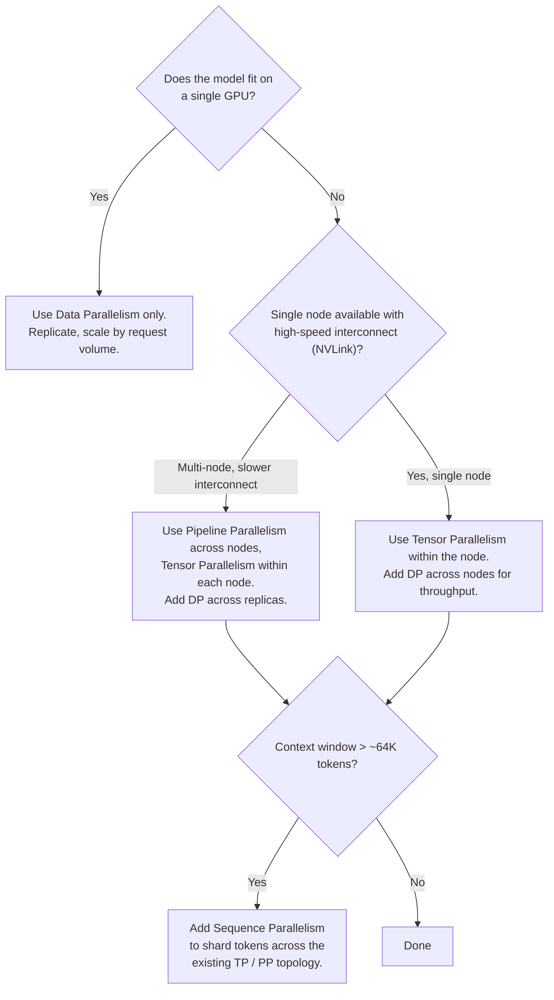
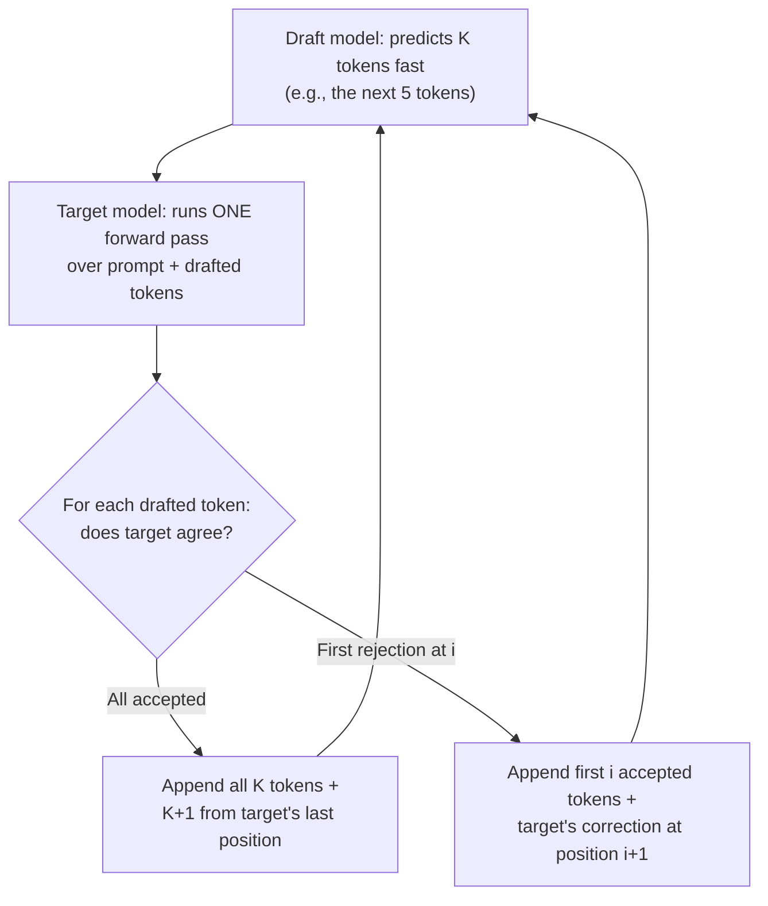

## One GPU isn't enough

Post 4 squeezed every drop of performance out of one GPU. This post is about scaling out.

Three things force you off a single GPU at modern scale: model weights (a 70B-parameter model in FP16 needs ~140 GB just for the weights — no single consumer GPU has that), KV cache (Post 4's expression — easily 80 GB at production batch sizes), and compute throughput (a single GPU can't service thousands of concurrent users at acceptable latency).

The toolkit is roughly:

- **Four parallelism strategies** (DP, PP, TP, SP) that split *the work or the model* across multiple GPUs. They compose; real frontier deployments use 2–3 of them at once.
- **Speculative decoding**, which uses a small "draft" model to predict ahead and a big "target" model to verify K tokens per pass.
- **Prefill / decode disaggregation**, which runs the two phases on different hardware tuned for each.
- **Mixture-of-Experts**, which keeps the model big but only fires a fraction of parameters per token.

## Data Parallelism (DP / DDP)

The simplest. Replicate the entire model on every GPU. Split the *requests* (not the model) across them. Each GPU runs its own batch independently; they only synchronise when training. For inference, each GPU is essentially a self-contained server.

The constraint is brutal: the whole model has to fit in one GPU's memory. With 70B+ models, DP alone is no longer a tool — you need it combined with one of the others.

Where DP shines is *throughput*. If your model fits, doubling the GPU count via DP roughly doubles requests-per-second. No coordination overhead per request.

## Pipeline Parallelism (PP)

Split the model **by layers** across GPUs. Layers 1–10 live on GPU 0, layers 11–20 on GPU 1, and so on. A request flows through the GPUs in sequence: GPU 0 finishes its work, hands off the activations to GPU 1, GPU 0 starts the next request.

The good news: each GPU only needs memory for its own layer slice plus its KV cache, so you can fit much bigger models. The bad news is the **pipeline bubble** — for the very first token of a sequence, GPUs further down the pipeline sit idle until their input arrives. Same on the way back.

<Media src="/images/blog/llm-internals-05-parallelism-speculative-decoding-moe/hf-pp-bubble.png" alt="Pipeline parallelism with bubbles: each GPU is idle while waiting for upstream activations, creating dead time at start and end of each batch" />
<Text variant="label-default-xs" onBackground="neutral-weak" align="center">
  Source: <SmartLink href="https://huggingface.co/docs/transformers/v4.15.0/parallelism">Hugging Face, "Model Parallelism"</SmartLink>. Grey cells are idle GPU time — the pipeline bubble.
</Text>

The bubble is mitigated with **interleaved schedules** (1F1B — one forward, one backward — and variants), where each GPU is doing forward work for one micro-batch while doing backward work for an earlier one. Pipeline bubbles never quite disappear but shrink to a few percent of total time at production batch sizes.

PP is the right answer when your interconnect between nodes is **slow** (e.g., Ethernet rather than NVLink). PP only sends activations once per layer-block, not per layer, so its communication is light.

## Tensor Parallelism (TP)

Split each individual layer **across GPUs**. The Q/K/V projection matrix in an attention layer might be 12,288 × 12,288 — TP shards it column-wise across, say, 4 GPUs, so each GPU computes 1/4 of the heads. Same idea for the FFN's up/down projections.

<Media src="/images/blog/llm-internals-05-parallelism-speculative-decoding-moe/hf-tp-self-attention.png" alt="Tensor parallelism on self-attention: heads split across GPUs, all-reduce after attention" />
<Text variant="label-default-xs" onBackground="neutral-weak" align="center">
  Source: <SmartLink href="https://huggingface.co/docs/transformers/v4.15.0/parallelism">Hugging Face, "Model Parallelism"</SmartLink>. Each GPU handles a subset of attention heads; outputs concatenate via all-reduce.
</Text>

TP requires **per-layer all-reduce** communication: every GPU's partial result has to be summed/concatenated with everyone else's before the next layer can run. This is bandwidth-heavy, which is why TP almost always runs *within a single node* connected by NVLink (NVIDIA's high-speed GPU-to-GPU fabric, ~600 GB/s on H100). Try TP across slow Ethernet and the all-reduces become the bottleneck.

The win: **lowest latency per request**. Every GPU works on the same request simultaneously; no idle time, no bubble. TP is the right answer when you're optimising for time-to-first-token (TTFT) and you have NVLink available.

## Sequence Parallelism (SP)

Useful when contexts get genuinely huge — 128K, 1M tokens — and a single GPU cannot fit the activations or KV cache for one full sequence.

SP shards the **token sequence** itself across GPUs. GPU 0 handles tokens 1–32K, GPU 1 handles 32K–64K, etc. They pass partial K/V activations forward like a relay race, so each GPU only ever holds the slice of KV it's currently working with.

This is the youngest of the four (Korthikanti et al. 2022) and only matters at the long-context frontier — most production deployments don't need it. But for any LLM call where the input is "here's a 200K-token book, summarise it", SP (or a chunked-prefill variant of it) is what makes that tractable.

## 3D parallelism

In real frontier-scale training and serving, you don't pick one — you compose them.

<Media src="/images/blog/llm-internals-05-parallelism-speculative-decoding-moe/deepspeed-3d-parallelism.png" alt="3D parallelism: tensor parallelism within nodes, pipeline parallelism between nodes, data parallelism across replicas" />
<Text variant="label-default-xs" onBackground="neutral-weak" align="center">
  Source: <SmartLink href="https://huggingface.co/docs/transformers/v4.15.0/parallelism">Hugging Face / DeepSpeed</SmartLink>. The three axes (TP × PP × DP) compose to form a 3D topology. SP is sometimes called the fourth axis.
</Text>

A typical large-model deployment looks like this. Pick a node size (8 GPUs is standard), use **TP within the node** to split each layer (NVLink keeps the all-reduces cheap). Then use **PP across nodes** to split the model's layers — slow inter-node bandwidth is fine for PP because it only sends activations between layer boundaries. Finally, **DP across replicas** of the whole pipeline so the system can serve more concurrent requests.

For a 70B model on 64 GPUs: 4-way TP within each 8-GPU node, 2-way PP across nodes, 4-way DP across replicas → `4 × 2 × 4 = 32` workers, each holding 1/8 of the model. (The remaining factor of 2 fits because each node has 8 GPUs and TP is 4-way.)

3D parallelism is the standard pattern in 2026 production. The numbers stretch (Megatron-Turing NLG 530B used `8 × 35 × 2`; some Llama 3 70B production stacks use `4 × 1 × N` with no PP), but the structure is the same: TP closest to the metal, PP next, DP outermost.

## Picking your parallelism: a decision tree

Most of the time you don't have to think about all four. Here's the call:

In other words: TP is your single-node hammer; PP appears the moment you cross node boundaries; SP only appears at long-context frontier; DP is always there to scale throughput.

## Speculative decoding

Now to the cleverer tricks.

Decode is **memory-bandwidth-bound** (Post 3): each new token forces us to load the entire model and the entire KV cache to do a tiny amount of compute. Most of the GPU's compute cores sit idle, waiting for memory.

Speculative decoding (Leviathan et al., 2022; Chen et al., 2023) exploits that idle compute. The idea:

1. A small **draft model** (often a 1B model paired with a 70B target) generates K tokens speculatively, very fast.
2. The **target model** runs *one* forward pass over the prompt + the K drafted tokens, computing logits for all K+1 positions in parallel.
3. For each drafted token, compare the target's probability to the draft's. Accept the token if the target agrees (within a probability threshold); reject the first one that doesn't match.
4. If the target accepts all K tokens, it also gets the K+1th token "for free" from the same forward pass (transformers always produce the next-position logits anyway).

Why this is a free lunch: that single target forward pass uses memory bandwidth no more than a regular decode step would (we already had to load the model weights). All those cores that would have been idle during a single-token decode are now doing K+1 tokens' worth of work at once. If the draft model is well-tuned and accepts most of the time, you get an effective 2–3× decode speedup with no quality loss whatsoever.

The catch: you need a draft model that produces output similar enough to the target's that acceptance rates are high. In practice, this means training a small model on the same data distribution (often via logit distillation from the target — see Post 11). Anthropic, OpenAI, and most modern serving stacks use this technique by default.

## Prefill / decode disaggregation

Prefill and decode are not just different sized — they have different *bottlenecks*. Prefill is compute-bound (lots of tokens, few iterations); decode is memory-bandwidth-bound (one token per step, but lots of steps with cache reads). Mixing them on the same hardware means neither runs optimally.

<Column horizontal="center" fillWidth>
  <Media src="/images/blog/llm-internals-05-parallelism-speculative-decoding-moe/distserve-fig1.png" alt="DistServe architecture: separate worker pools for prefill and decode, KV cache transferred between them over high-speed network" style={{ maxWidth: "420px", width: "100%" }} />
</Column>
<Text variant="label-default-xs" onBackground="neutral-weak" align="center">
  Source: <SmartLink href="https://arxiv.org/abs/2401.09670">Zhong et al. 2024, "DistServe"</SmartLink>, Figure 1. Prefill workers (compute-tuned) generate KV cache; decode workers (bandwidth-tuned) consume it.
</Text>

The structural fix is to **disaggregate**: a pool of prefill workers (tuned for compute throughput, possibly with smaller memory) and a separate pool of decode workers (tuned for memory bandwidth, with the bulk of KV-cache memory). When a request finishes prefill, its KV cache is shipped over a high-speed network (InfiniBand, RoCE, or NVLink within rack) to a decode worker, which takes over generation.

Wins: each pool can be sized independently based on workload (lots of long prompts = more prefill workers; lots of long generations = more decode workers); each pool uses hardware tuned for its bottleneck; scheduler doesn't have to interleave incompatible workloads.

This is a relatively recent technique (DistServe 2024, vLLM disaggregation in 2024–2025) but it's becoming standard for high-volume production serving where the prompt/generation ratio is uneven.

## Mixture-of-Experts (MoE)

The last trick is the most paradigm-shifting. Standard ("dense") models route every token through every parameter. MoE models route each token through a small fraction.

The mechanic: replace each FFN layer with a set of N parallel FFNs called **experts**, plus a small **router** network that decides which experts process each token. For Mixtral 8x7B: 8 expert FFNs per layer, top-2 routing — each token uses only 2 of the 8 FFNs in any given layer.

<Media src="/images/blog/llm-internals-05-parallelism-speculative-decoding-moe/hf-switch-layer.png" alt="MoE routing: a router selects which experts process each token, only chosen experts run" />
<Text variant="label-default-xs" onBackground="neutral-weak" align="center">
  Source: <SmartLink href="https://huggingface.co/blog/moe">Hugging Face blog, "Mixture of Experts Explained"</SmartLink>. The router is a small linear layer; each token goes through only its top-K selected experts.
</Text>

The math, simplified for top-K routing:

<Column horizontal="center" fillWidth>
  <Media src="/images/blog/llm-internals-05-parallelism-speculative-decoding-moe/eq-moe-router.svg" alt="MoE output: weighted sum over top-K experts selected by router" style={{ maxWidth: "440px", width: "100%" }} />
</Column>
<Text variant="label-default-xs" onBackground="neutral-weak" align="center">
  G(x) is the router's gate output (a softmax over experts). For each token x, only the top-K experts contribute to the output, weighted by their gate scores.
</Text>

What you get: **decoupled total parameters from active parameters**. Mixtral 8x7B has ~47B total parameters but only ~13B active per token. You get the capacity of a 47B-parameter model at the inference cost of a 13B model — for compute. Memory is a different story.

Three real-world catches:

- **All experts must be loaded in VRAM.** Memory cost is full-model. MoE wins compute, not memory.
- **Routing is hard to train.** The router can collapse to always picking the same 1–2 experts, leaving others starved (the "expert collapse" problem). Training needs auxiliary load-balancing losses.
- **Fine-tuning is fiddly.** The same instabilities show up at fine-tune time. PEFT methods (Post 10) interact awkwardly with MoE routing.

Despite these, MoE has become standard at the frontier in 2026: Mixtral, DeepSeek-V3, and most recent open-weight large models are MoE. The reasoning is straightforward — you can train a model with 5× the capacity at roughly 1× the inference compute, and capacity is what scaling laws care about.

## Coming up next

We've now covered everything that makes one model run fast. Post 6 takes a focused detour into how positional information gets baked into vectors at all — RoPE and YaRN — the trick that let modern LLMs reach 128K, 1M, and beyond context windows.

---

<FurtherReading>
  <Column gap="4">
    <Text variant="label-strong-s" onBackground="neutral-weak">From my study notes</Text>
    <Text variant="body-default-s" onBackground="neutral-medium">
      Yashvardhan Ghuse, "Core Optimisations in LLMs (MoE section)." <SmartLink href="https://medium.com/@ygsh0816/core-optimisations-in-llms-paged-attention-mixture-of-experts-and-flash-attention-310295fb91e5">medium.com</SmartLink>
    </Text>
  </Column>

  <Column gap="4">
    <Text variant="label-strong-s" onBackground="neutral-weak">Parallelism</Text>
    <Text variant="body-default-s" onBackground="neutral-medium">
      Hugging Face, "Model Parallelism" guide. <SmartLink href="https://huggingface.co/docs/transformers/v4.15.0/parallelism">huggingface.co</SmartLink>
    </Text>
    <Text variant="body-default-s" onBackground="neutral-medium">
      Shoeybi et al. 2019, "Megatron-LM" (TP). <SmartLink href="https://arxiv.org/abs/1909.08053">arxiv.org/abs/1909.08053</SmartLink>
    </Text>
    <Text variant="body-default-s" onBackground="neutral-medium">
      Narayanan et al. 2021, "Efficient Large-Scale Language Model Training on GPU Clusters" (3D parallelism). <SmartLink href="https://arxiv.org/abs/2104.04473">arxiv.org/abs/2104.04473</SmartLink>
    </Text>
    <Text variant="body-default-s" onBackground="neutral-medium">
      Korthikanti et al. 2022, "Reducing Activation Recomputation" (Sequence Parallelism). <SmartLink href="https://arxiv.org/abs/2205.05198">arxiv.org/abs/2205.05198</SmartLink>
    </Text>
  </Column>

  <Column gap="4">
    <Text variant="label-strong-s" onBackground="neutral-weak">Speculative decoding</Text>
    <Text variant="body-default-s" onBackground="neutral-medium">
      Leviathan et al. 2022, "Fast Inference from Transformers via Speculative Decoding." <SmartLink href="https://arxiv.org/abs/2211.17192">arxiv.org/abs/2211.17192</SmartLink>
    </Text>
    <Text variant="body-default-s" onBackground="neutral-medium">
      Chen et al. 2023, "Accelerating Large Language Model Decoding with Speculative Sampling." <SmartLink href="https://arxiv.org/abs/2302.01318">arxiv.org/abs/2302.01318</SmartLink>
    </Text>
    <Text variant="body-default-s" onBackground="neutral-medium">
      Hugging Face blog, "Assisted Generation." <SmartLink href="https://huggingface.co/blog/assisted-generation">huggingface.co</SmartLink>
    </Text>
  </Column>

  <Column gap="4">
    <Text variant="label-strong-s" onBackground="neutral-weak">Prefill / decode disaggregation</Text>
    <Text variant="body-default-s" onBackground="neutral-medium">
      Zhong et al. 2024, "DistServe." <SmartLink href="https://arxiv.org/abs/2401.09670">arxiv.org/abs/2401.09670</SmartLink>
    </Text>
    <Text variant="body-default-s" onBackground="neutral-medium">
      vLLM blog, "Disaggregated Prefill in vLLM." <SmartLink href="https://blog.vllm.ai/">blog.vllm.ai</SmartLink>
    </Text>
  </Column>

  <Column gap="4">
    <Text variant="label-strong-s" onBackground="neutral-weak">Mixture of Experts</Text>
    <Text variant="body-default-s" onBackground="neutral-medium">
      Mistral AI, "Mixtral of Experts." <SmartLink href="https://arxiv.org/abs/2401.04088">arxiv.org/abs/2401.04088</SmartLink>
    </Text>
    <Text variant="body-default-s" onBackground="neutral-medium">
      Fedus et al. 2021, "Switch Transformers." <SmartLink href="https://arxiv.org/abs/2101.03961">arxiv.org/abs/2101.03961</SmartLink>
    </Text>
    <Text variant="body-default-s" onBackground="neutral-medium">
      Hugging Face blog, "Mixture of Experts Explained." <SmartLink href="https://huggingface.co/blog/moe">huggingface.co</SmartLink>
    </Text>
  </Column>
</FurtherReading>
