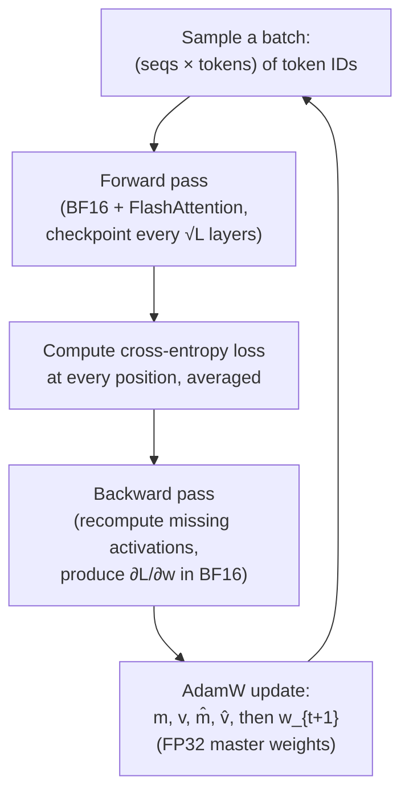

## Self-supervised: where the labels come from

Pre-training looks miraculous from outside — a model reads "the internet" and learns language. The mechanism is much simpler than the result. Every sentence in the training corpus is its own multi-pack of labelled examples, and the labels come from the sentence itself. That's what *self-supervised* means: no human annotation, just the data shifted by one position.

Take the sentence **"the world is beautiful"** (5 tokens including a start marker). The training signal is:

| Input (context) | Target (next token) |
|---|---|
| `<bos>` | `the` |
| `<bos> the` | `world` |
| `<bos> the world` | `is` |
| `<bos> the world is` | `beautiful` |

Four labelled examples from one short sentence. Scale this to trillions of internet tokens and you have all the supervision a transformer ever needs.

The clever bit is that the transformer learns all four examples in a **single forward pass**. The trick is the **causal mask**: in self-attention, position `t` can only attend to positions `≤ t`. So when the model produces logits at position 2 ("the world"), those logits depend only on `<bos>` and "the" — not on "world" or anything that came after. The output at every position is therefore a legitimate prediction conditioned only on what came before, and we can train against the next-token target at every position simultaneously.

One sentence → many training examples → one forward pass. That density is why pre-training scales.

## The forward pass during training

The forward pass is mechanically the same as inference prefill (Post 2): a batch of token IDs goes in, gets embedded, flows through the transformer blocks, and comes out as a logits tensor of shape `(batch, sequence, vocab)`. What's different is scale.

A typical pre-training step processes a batch of, say, **2 million tokens** (e.g., 1024 sequences × 2048 tokens). Every token in that batch produces logits — and every token (except the very last in each sequence) has a target: the next token in the same sequence. So one forward pass yields close to 2 million labelled predictions to train on.

The loss is computed at every position and averaged. Then we backprop and step the optimizer. That's one training iteration. Frontier pre-training runs millions of these.

## The loss: cross-entropy

We want the model to put high probability on the correct next token. The natural loss is the **negative log-probability** of the true target:

<Column horizontal="center" fillWidth>
  <Media src="/images/blog/llm-internals-07-how-llms-are-trained/eq-cross-entropy.svg" alt="Cross-entropy loss equals negative one over T times the sum from t equals one to T of log probability of x_t given x_less-than-t under the model parameters theta" style={{ maxWidth: "560px", width: "100%" }} />
</Column>
<Text variant="label-default-xs" onBackground="neutral-weak" align="center">
  Negative log-probability of the correct next token, averaged over positions. p_θ is the softmax over the vocabulary at position t. If the model assigns probability 1 to the right token, log 1 = 0 and the loss vanishes; the further it is from 1, the larger the loss.
</Text>

A few intuitions worth holding:

- **Why log?** Log turns the multiplicative chain `p(x_1) · p(x_2) · ...` into a sum, which plays nicely with gradients. It also has a nice property: the gradient of `-log p` is large when `p` is small (the model is very wrong) and small when `p` is near 1 (the model is nearly right). Self-correcting.
- **Why negative?** We minimise a loss; log-probability is negative; flipping the sign gives a positive number to drive toward zero.
- **Why average?** So loss values are comparable across batch sizes and sequence lengths.

This loss is everywhere — pre-training, supervised fine-tuning, and (in a modified form, see Post 10) preference fine-tuning. Once you've got `L`, the rest is mechanical: differentiate it with respect to every weight in the model, then step.

## Backprop, in two minutes

Backprop is the chain rule applied bottom-up. You computed `L` at the top of the graph; you want `∂L/∂w` for every weight `w` in the model.

Walk the graph in **reverse topological order**. At each node, you already have the gradient with respect to that node's output (`∂L/∂out`); you need to produce the gradient with respect to its inputs (`∂L/∂in`) and its weights (`∂L/∂w`). Local rule, applied at every node. By the time you reach the input, every weight has its gradient.

The whole game in one line: **gradient at a layer = (gradient from above) × (local Jacobian of that layer)**. Repeat 96 times for a 96-layer transformer.

If you've never done a chain-rule derivation through softmax + cross-entropy, the punch line is that the gradient simplifies to **`predicted_probs - one_hot_target`** at the logits — a beautiful result that makes the implementation trivial. Past that point, every layer has its own Jacobian, but PyTorch's autograd handles them.

## The basic update

Once we have `∂L/∂w` for every weight, the simplest possible update is:

<Column horizontal="center" fillWidth>
  <Media src="/images/blog/llm-internals-07-how-llms-are-trained/eq-sgd-update.svg" alt="w at step t plus 1 equals w at step t minus eta times gradient of L with respect to w at step t" style={{ maxWidth: "380px", width: "100%" }} />
</Column>
<Text variant="label-default-xs" onBackground="neutral-weak" align="center">
  Plain SGD: subtract a small step in the direction that reduces loss. η is the learning rate.
</Text>

This works for small networks. At LLM scale it's a disaster. Three problems show up immediately:

- **Inconsistent gradients.** Across mini-batches, gradients for the same weight wiggle a lot. Each step pulls the weight in a different direction. Convergence is jittery.
- **Vanishing or exploding gradients in different parts of the model.** Some weights get gradients of magnitude 0.001; others get 100. A single learning rate can't serve both.
- **No memory of past gradients.** SGD treats every step as if it's the first. Information about what direction was "trending" is thrown away every iteration.

The fix is **AdamW**.

## AdamW: momentum and variance, per parameter

AdamW (Loshchilov & Hutter, 2017) is the default optimizer for almost every LLM trained today. It maintains, *per weight*, two running averages: a mean of recent gradients (momentum) and a mean of squared recent gradients (variance).

<Column horizontal="center" fillWidth>
  <Media src="/images/blog/llm-internals-07-how-llms-are-trained/eq-adamw.svg" alt="AdamW update equations: m_t is a running mean of gradients, v_t is a running mean of squared gradients, m_hat and v_hat are bias-corrected versions, and the weight update divides m_hat by the square root of v_hat plus epsilon, with weight decay term lambda times w" style={{ maxWidth: "620px", width: "100%" }} />
</Column>
<Text variant="label-default-xs" onBackground="neutral-weak" align="center">
  m_t tracks the running mean of recent gradients (momentum). v_t tracks the running mean of squared gradients (per-parameter scale). The bias-correction step (m̂, v̂) compensates for both being initialised at zero. The final update divides momentum by the square root of variance, so weights with large recent gradients take smaller steps and weights with small recent gradients take larger ones — automatically per-parameter.
</Text>

What this buys us, scenario by scenario:

- **Consistent gradients in the same direction:** `m_t` accumulates them; momentum drives faster movement along clearly downhill directions.
- **Wildly varying gradient magnitudes:** `v_t` records the recent variance per weight; dividing by `√v_t` shrinks the effective step for noisy weights and grows it for stable ones.
- **Sparse / rarely-active parameters:** their `v_t` stays small, so when a gradient does arrive, the update isn't drowned out.

The "W" stands for **decoupled weight decay**: instead of mixing the L2 regularisation term into the gradient (as plain Adam does, which interacts badly with the variance scaling), AdamW applies it directly to the weight in the final update — `+ λ · w_t` outside the `m̂/√v̂` ratio. This small change is why AdamW generalises noticeably better than Adam at the scale we train LLMs.

The cost: AdamW stores **two extra full-size float tensors per weight** (`m` and `v`). That's about to bite hard.

## The memory blow-up

Naïvely, you'd think training a 70B-parameter model needs ~140 GB (for FP16 weights). The real bill is at least 4×–8× that. Here's why:

<Column horizontal="center" fillWidth>
  <Media src="/images/blog/llm-internals-07-how-llms-are-trained/eq-memory-budget.svg" alt="Memory budget: 2 psi for weights in BF16 plus 2 psi for gradients in BF16 plus 4 psi plus 4 psi plus 4 psi for Adam master weights, m, and v in FP32, equalling 16 psi bytes" style={{ maxWidth: "640px", width: "100%" }} />
</Column>
<Text variant="label-default-xs" onBackground="neutral-weak" align="center">
  Ψ = number of parameters. With mixed precision (BF16 forward/backward + FP32 master copy), the per-parameter cost is 16 bytes. For a 70B model, that's 1.12 TB just for weights + grads + optimizer state — before activations.
</Text>

The canonical visualisation, from the ZeRO paper:

<Media src="/images/blog/llm-internals-07-how-llms-are-trained/zero-fig1-memory-breakdown.png" alt="ZeRO Figure 1: stacked memory consumption on each GPU showing parameters in blue, gradients in orange, and optimizer states in green. Top row labelled Baseline shows all three components stacked at full size on every GPU, totalling 120 GB for a 7.5 billion parameter model. Lower rows show progressive sharding strategies that we will return to in the next post." />
<Text variant="label-default-xs" onBackground="neutral-weak" align="center">
  Source: <SmartLink href="https://arxiv.org/abs/1910.02054">Rajbhandari et al. 2019, "ZeRO"</SmartLink>, Figure 1. Focus on the top row (Baseline) — that's what one GPU has to hold for a vanilla data-parallel training run: parameters (blue) + gradients (orange) + optimizer states (green) = 120 GB for a 7.5B model. The lower rows are ZeRO's sharding strategies; we cover those in Post 8.
</Text>

For a 70B model, the baseline row scales to over 1 TB. No single GPU has that much memory. This is why distributed training (Post 8) exists — and why even the *single-GPU* training story has to lean hard on memory tricks before it gives up and goes multi-GPU.

## Activations, the second memory monster

Weights + grads + optimizer state is half the story. The other half is **activations**.

<Media src="/images/blog/llm-internals-07-how-llms-are-trained/vanilla-backprop.png" alt="Vanilla backpropagation diagram. Top row shows forward operators f at each layer producing activations between layers. Bottom row shows backward operators b at each layer consuming the saved activations to produce gradients. Every forward activation is stored to be used by the corresponding backward operator." />
<Text variant="label-default-xs" onBackground="neutral-weak" align="center">
  Source: <SmartLink href="https://github.com/cybertronai/gradient-checkpointing">OpenAI / Salimans &amp; Bulatov, "gradient-checkpointing"</SmartLink>. Top row: forward pass produces an activation tensor at every layer. Bottom row: backward pass needs every one of those activations to compute its gradient. So for an L-layer model, we store L activation tensors on top of weights/grads/optimizer.
</Text>

To do backprop, every layer's **output activation must be kept around** so the backward pass can compute its local Jacobian. That means: store the embedding output, store layer-1 output, store layer-2 output, ..., store layer-L output. At training-realistic batch sizes and sequence lengths, the total activation memory often exceeds the model weights.

A rough number: a 70B model with 80 layers, batch 8, sequence 2048, BF16 — activations alone come out to ~100+ GB even before counting attention's intermediate `softmax(Q·Kᵀ)` matrices, which are quadratic in sequence length and add tens more GB at long context.

## Three memory tricks

This is the trio every serious training stack uses.

### 1. Gradient checkpointing

If activations are the bottleneck, the obvious move is: don't store all of them. Store only every Nth layer's output (the *checkpoints*); during backward, recompute the missing ones on demand from the nearest preceding checkpoint.

<Media src="/images/blog/llm-internals-07-how-llms-are-trained/checkpoint-vs-backprop.png" alt="Gradient checkpointing diagram. The forward graph is the same horizontal chain of nodes, but only one node in the middle is highlighted as a checkpoint with a double-circle border. During backward, activations between checkpoints are recomputed from the most recent checkpoint rather than read from memory." />
<Text variant="label-default-xs" onBackground="neutral-weak" align="center">
  Source: <SmartLink href="https://github.com/cybertronai/gradient-checkpointing">OpenAI / Salimans &amp; Bulatov, "gradient-checkpointing"</SmartLink>. The double-circled node is a saved checkpoint. During the backward pass, intermediate activations between checkpoints are recomputed forward from the checkpoint rather than read from memory.
</Text>

The classical recipe (Chen et al., 2016) saves activations every `√L` layers, giving O(√L) memory and one extra forward pass worth of compute — about 33% more compute for a typical 70%+ memory saving on activations. Modern transformer training takes this further with **selective recomputation** (recompute only the cheap-to-redo bits, like dropout and layer norm; keep the expensive ones, like attention).

### 2. FlashAttention

The attention matrix `softmax(Q · Kᵀ)` is `(seq × seq)`. At seq=8192, that's 64 M entries per head per layer — huge, and it's stored at training time so backprop can use it.

FlashAttention (Tri Dao, 2022) sidesteps this by **never materialising the full matrix**. It computes attention in tiles small enough to fit in fast on-chip SRAM, fuses the softmax with the matmul, and only writes the final output back to HBM. Memory drops from `O(seq²)` to `O(seq)` for the attention buffer. For backward, FlashAttention recomputes the attention matrix tile-by-tile from the saved Q/K/V — a deliberate compute-for-memory trade.

By 2026 every major training stack uses FlashAttention or a descendant (FlashAttention-2, FlashAttention-3, xformers' memory-efficient attention). It's no longer a research trick; it's the default kernel.

### 3. Mixed precision

Storing every weight, activation, and gradient in 32-bit floats is overkill. Almost all of training works fine in **BFloat16** — which has the same exponent range as FP32 (so no overflow issues) but half the precision (and half the memory).

The complete recipe (Micikevicius et al., 2017):

<Media src="/images/blog/llm-internals-07-how-llms-are-trained/mixed-precision-iteration.png" alt="Mixed-precision training iteration diagram. Master weights are kept in F32 and converted to F16 by float2half. Forward, backward-activation, and backward-weight all run in F16, producing F16 weight gradients. The final weight update step is performed in F32 to maintain numerical stability before producing updated F32 master weights." />
<Text variant="label-default-xs" onBackground="neutral-weak" align="center">
  Source: <SmartLink href="https://arxiv.org/abs/1710.03740">Micikevicius et al. 2017, "Mixed Precision Training"</SmartLink>, Figure 1. Forward, backward-activation, and backward-weight all run in 16-bit. The optimizer keeps a 32-bit master copy of the weights and does the update step in 32-bit, then casts back. This preserves numerical fidelity in the place that needs it (the update) while saving memory and bandwidth everywhere else.
</Text>

For modern stacks the 16-bit format is BF16, not FP16 — BF16 has more exponent bits, which is why it doesn't need the loss-scaling tricks that early FP16 setups required. NVIDIA H100 and later GPUs have BF16 matmul hardware that runs ~2× faster than FP32, on top of the memory savings.

These three tricks compose: gradient checkpointing + FlashAttention + BF16 mixed precision is roughly the table stakes for any serious training run in 2026.

## One full training step, end-to-end

Putting it all together — what one optimisation step looks like:

Each piece in this diagram either solves a memory problem or a stability problem. Forward + cross-entropy + backward gives us learning signal; AdamW gives us stable, per-parameter step sizes; mixed precision halves memory and bandwidth; checkpointing trades a small amount of recompute for a large activation-memory saving; FlashAttention removes the quadratic attention buffer.

Even with all of these in place, one GPU is not enough for any modern frontier model. The optimizer state alone (`m + v + master weights = 12Ψ` bytes) is bigger than a single H100's 80 GB once you cross ~6 B parameters. That's where Post 8 picks up.

## Coming up next

Post 8 is the training-side mirror of Post 5: **distributed training**. Same parallelism axes (DP, TP, PP), but now we also have to shard the optimizer state. We'll walk through ZeRO and FSDP — what gets sharded at each stage, what communication that adds — and end with how 3D parallelism composes for 1000-GPU pre-training runs.

---

<FurtherReading>
  <Column gap="4">
    <Text variant="label-strong-s" onBackground="neutral-weak">From my study notes</Text>
    <Text variant="body-default-s" onBackground="neutral-medium">
      "From Tokens to Transformers — Chapters 3–7" playlist. <SmartLink href="https://www.youtube.com/playlist?list=PLZHQObOWTQDNU6R1_67000Dx_ZCJB-3pi">youtube.com</SmartLink>
    </Text>
    <Text variant="body-default-s" onBackground="neutral-medium">
      "How LLM Training Actually Works" — YouTube. <SmartLink href="https://www.youtube.com/watch?v=EFXiQSxa4d8">youtube.com</SmartLink>
    </Text>
  </Column>

  <Column gap="4">
    <Text variant="label-strong-s" onBackground="neutral-weak">Foundational papers</Text>
    <Text variant="body-default-s" onBackground="neutral-medium">
      Loshchilov &amp; Hutter 2017, "Decoupled Weight Decay Regularization" (AdamW). <SmartLink href="https://arxiv.org/abs/1711.05101">arxiv.org/abs/1711.05101</SmartLink>
    </Text>
    <Text variant="body-default-s" onBackground="neutral-medium">
      Chen et al. 2016, "Training Deep Nets with Sublinear Memory Cost" (gradient checkpointing). <SmartLink href="https://arxiv.org/abs/1604.06174">arxiv.org/abs/1604.06174</SmartLink>
    </Text>
    <Text variant="body-default-s" onBackground="neutral-medium">
      Tri Dao et al. 2022, "FlashAttention." <SmartLink href="https://arxiv.org/abs/2205.14135">arxiv.org/abs/2205.14135</SmartLink>
    </Text>
    <Text variant="body-default-s" onBackground="neutral-medium">
      Micikevicius et al. 2017, "Mixed Precision Training." <SmartLink href="https://arxiv.org/abs/1710.03740">arxiv.org/abs/1710.03740</SmartLink>
    </Text>
    <Text variant="body-default-s" onBackground="neutral-medium">
      Rajbhandari et al. 2019, "ZeRO" (memory breakdown). <SmartLink href="https://arxiv.org/abs/1910.02054">arxiv.org/abs/1910.02054</SmartLink>
    </Text>
  </Column>

  <Column gap="4">
    <Text variant="label-strong-s" onBackground="neutral-weak">Tutorials &amp; code</Text>
    <Text variant="body-default-s" onBackground="neutral-medium">
      Karpathy, "Let's build GPT: from scratch, in code, spelled out." <SmartLink href="https://www.youtube.com/watch?v=kCc8FmEb1nY">youtube.com</SmartLink>
    </Text>
    <Text variant="body-default-s" onBackground="neutral-medium">
      Karpathy, "nanoGPT." <SmartLink href="https://github.com/karpathy/nanoGPT">github.com/karpathy/nanoGPT</SmartLink>
    </Text>
    <Text variant="body-default-s" onBackground="neutral-medium">
      Sebastian Raschka, "Build a Large Language Model (From Scratch)." <SmartLink href="https://github.com/rasbt/LLMs-from-scratch">github.com/rasbt/LLMs-from-scratch</SmartLink>
    </Text>
    <Text variant="body-default-s" onBackground="neutral-medium">
      PyTorch Mixed Precision (AMP) docs. <SmartLink href="https://pytorch.org/docs/stable/amp.html">pytorch.org</SmartLink>
    </Text>
  </Column>

  <Column gap="4">
    <Text variant="label-strong-s" onBackground="neutral-weak">Optimizer intuition</Text>
    <Text variant="body-default-s" onBackground="neutral-medium">
      Sebastian Ruder, "An overview of gradient descent optimization algorithms." <SmartLink href="https://www.ruder.io/optimizing-gradient-descent/">ruder.io</SmartLink>
    </Text>
    <Text variant="body-default-s" onBackground="neutral-medium">
      Lilian Weng, "Optimization Algorithms for Deep Learning." <SmartLink href="https://lilianweng.github.io/posts/2020-09-25-train-large/">lilianweng.github.io</SmartLink>
    </Text>
  </Column>
</FurtherReading>
