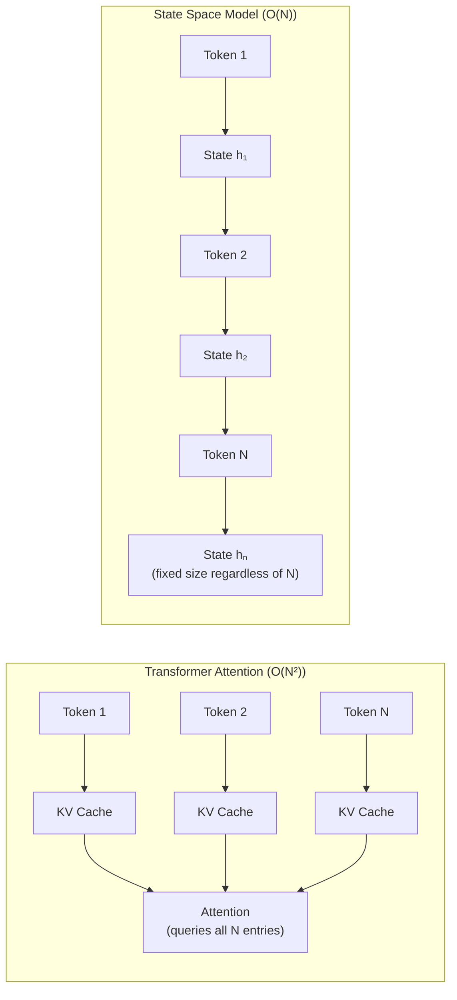
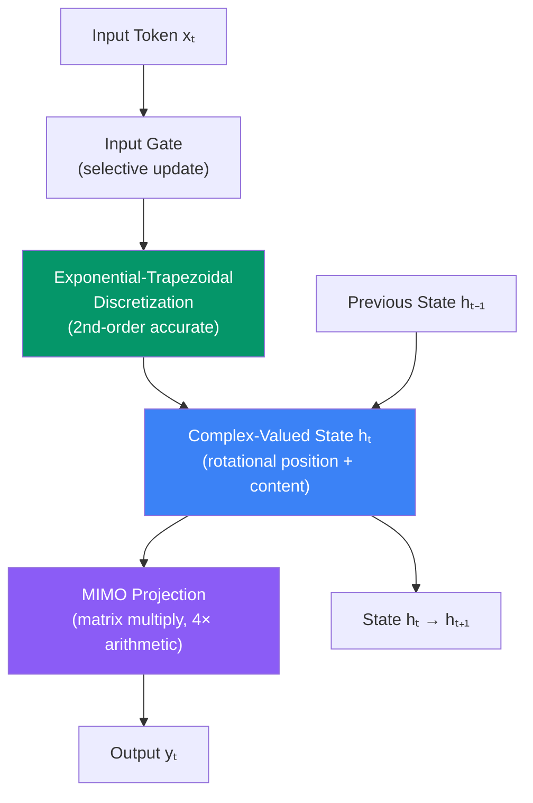
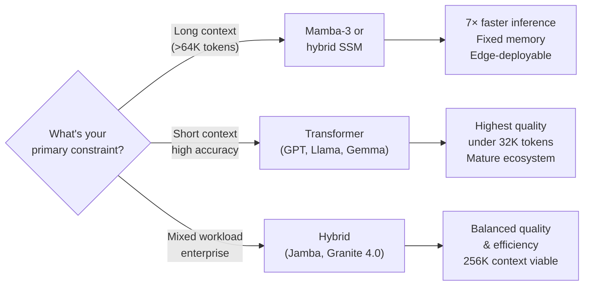

## The Tax You Pay Every Time You Think

Every large language model pays a hidden compute tax. The moment a transformer attends to its context, it has to compare every token to every other token. That's fine at 1,000 tokens. At 16,000 tokens, the attention matrix has 256 million entries. At 128,000 tokens, it has 16 billion.

The cost scales with the **square** of the context length — quadratic complexity, in the jargon. More practically: doubling the context means four times the compute and memory for the attention layer, regardless of how much of that context is actually relevant.

This bottleneck didn't matter when models processed short passages. It matters enormously now, when agents are expected to hold hour-long conversations, ingest entire codebases, or reason over thousands of documents without losing the thread.

Mamba-3, presented at **ICLR 2026** in May and released under Apache 2.0 on March 17, 2026, is the latest attempt to replace that quadratic tax with something linear. At 16,000 tokens on an H100 GPU, it finishes prefill and decode in **140 seconds** compared to **976 seconds** for a comparable Llama-3.2-1B running on vLLM — a 7× speedup that grows wider as context length increases.

---

## What a State Space Model Actually Is

Before understanding what Mamba-3 improves, it helps to understand what it is and how it differs from a transformer.

A transformer keeps a **key-value cache** of every past token. When generating the next token, it queries that cache to find what's relevant. The cache grows with context length, which is why long contexts eat GPU memory and slow down inference.

A state space model (SSM) instead compresses the entire past into a **fixed-size state vector** that gets updated one token at a time. Think of it like a river: the river processes everything that flows into it, but at any point it only carries a summary — direction, speed, the accumulated memory of tributaries upstream. The river doesn't need to store every drop it has ever touched.

The tradeoff is selective forgetting: the SSM must learn what to keep and what to discard, while the transformer keeps everything. Mamba's key insight (introduced in 2023) was making the state update **input-dependent** — the model learns to selectively remember information based on the current token, which is what distinguishes it from earlier SSMs that used fixed transitions.

Mamba-3 inherits this selectivity and addresses three specific weaknesses in Mamba and Mamba-2.

---

## Three Improvements That Changed the Equation

### 1. Trapezoidal Discretization: A Better Approximation

SSMs are defined in continuous mathematics but run on digital hardware that processes discrete time steps. To go from continuous to discrete, you need a numerical approximation — a **discretization scheme**.

Mamba and Mamba-2 used the **Euler method**: the simplest first-order approximation, analogous to estimating a curve with a series of flat steps. It works, but it accumulates small errors, and those errors force the model to use a larger state to compensate.

Mamba-3 upgrades to the **exponential-trapezoidal method**, a second-order approximation that averages the slope at the beginning and end of each step. It is more accurate at the same computational cost, which means the model can achieve equal quality with a **state that is half the size** of Mamba-2's. Smaller states mean less memory and faster transitions.

### 2. MIMO: Making Modern GPUs Work Harder

Traditional SSMs, including Mamba-2, use a **single-input, single-output (SISO)** formulation: each element of the recurrent state is updated by a scalar operation. Modern GPUs, however, are built to maximize **matrix multiplication throughput**. They have vastly more arithmetic capacity than memory bandwidth — and SISO operations leave most of that arithmetic idle.

Mamba-3 introduces a **multi-input, multi-output (MIMO)** formulation that replaces scalar updates with matrix multiplications. Each recurrence step now performs up to **4× more arithmetic operations** per memory read, better matching GPU capabilities. The result is higher effective throughput without increasing decode latency — the hardware was already capable, it just wasn't being used.

### 3. Complex-Valued States with RoPE

The third improvement is both the most mathematically elegant and the most practically impactful.

Earlier SSMs used **real-valued state vectors**, which limited their ability to represent rotational or periodic structure. This is why Mamba-2 struggled on tasks requiring precise positional awareness — things like remembering which token was in position 47 rather than just that it existed.

Transformers solved this problem with **Rotary Position Embeddings (RoPE)**, which encode token positions as rotations in a complex vector space. Mamba-3 draws a formal mathematical bridge between complex-valued SSMs and RoPE, showing they are equivalent representations. By adopting complex-valued states, Mamba-3 can directly encode rotational position information into its recurrence — closing a key gap with attention that had made earlier Mamba variants weak at positional tasks.

---

## The Numbers

The combined effect of these three changes appears in the benchmarks:

| Metric | Mamba-3 | Mamba-2 | Transformer |
|--------|---------|---------|-------------|
| Language modeling (downstream accuracy) | **+1.8 pp** vs. next-best | Baseline | −1.8 pp |
| Prefill + decode at 16K tokens (H100) | **140s** | ~similar | 976s |
| State size | Half of Mamba-2 | 2× Mamba-3 | N/A (KV cache grows) |
| Memory at 128K context | Fixed ~2–4 GB | Fixed | Tens of GB |
| License | Apache 2.0 | Apache 2.0 | Varies |

At 16,384-token sequences, Mamba-3 runs in 140 seconds total prefill and decode, versus 976 seconds for Llama-3.2-1B on vLLM — the same 7× speedup that becomes a **10× or 20× advantage** as context grows further, because transformer cost is quadratic while Mamba-3's is linear.

---

## When You Should Actually Use This

Mamba-3 is not a universal transformer replacement. The tradeoffs are real.

**SSMs win when:**
- Context windows are very long (64K tokens and beyond)
- Memory budget is fixed and constrained — embedded devices, on-device inference
- Workload involves streaming processing where sequence length is effectively unbounded
- Time-series or audio tasks with long temporal dependencies

**Transformers still win when:**
- Context is under ~32K tokens (attention is heavily optimized here)
- Tasks demand precise long-range recall of arbitrary details (transformers forget nothing)
- Instruction-following quality is the top priority

**Hybrid architectures may be the practical answer.** AI21 Labs' Jamba models interleave Mamba and transformer layers, using attention where it's most impactful and SSM layers elsewhere. IBM's Granite 4.0, released in 2026, uses a majority Mamba-2 architecture with a small number of transformer attention layers — reducing memory requirements substantially while retaining competitive instruction-following performance on enterprise workloads.

---

## The Bigger Picture: Architecture Plurality

For most of 2023–2025, the default assumption in AI engineering was "transformer, unless there's a very specific reason not to." The attention mechanism was so dominant, so heavily optimized, and so deeply integrated into tooling that alternatives were academically interesting but practically marginal.

2026 is changing that calculus.

Mamba-3 joins SubQ (which launched in May 2026 with a 12M-token context using sub-quadratic sparse attention), MiniMax M3 (June 2026, with 1M-token context at 1/20th the per-token compute), and multiple hybrid models as evidence that the field is moving from a single dominant architecture toward a menu of purpose-built options.

The underlying dynamic is economics. Inference, not training, now dominates AI cost at scale. Every GPU-hour spent on quadratic attention is a GPU-hour not available for more requests. As context windows grow — from 128K to 1M to 10M tokens — the cost advantage of linear-scaling architectures compounds. Mamba-3's 7× speed advantage at 16K tokens becomes a **qualitatively different** economic proposition at 1M tokens.

For engineers building systems today, Mamba-3's Apache 2.0 release means the option is real: pull the weights from Hugging Face, benchmark your specific workload, and decide based on data rather than defaults. The infrastructure (vLLM integration, Ollama support, Triton kernels) is maturing rapidly.

Whether SSMs ultimately displace transformers, complement them, or fuse into hybrids is still an open question. What Mamba-3 demonstrates clearly is that the architectural diversity we now have is a feature, not a distraction — and that the efficiency gains are real enough to matter in production.

---

## Sources

- [arXiv:2603.15569 — Mamba-3: Improved Sequence Modeling using State Space Principles](https://arxiv.org/abs/2603.15569)
- [ICLR 2026 Poster — Mamba-3 (OpenReview)](https://openreview.net/forum?id=HwCvaJOiCj)
- [Mamba-3 blog post — Together AI](https://www.together.ai/blog/mamba-3)
- [Mamba-3 Part 2: Methodological Deep Dive — Tri Dao / Goomba Lab](https://goombalab.github.io/blog/2026/mamba3-part2/)
- [Princeton Language and Intelligence — Mamba-3 release post](https://pli.princeton.edu/blog/2026/mamba-3-improved-sequence-modeling-using-state-space-principles)
- [New Mamba-3 AI Model Beats Transformers by 4%, Runs 7× Faster — Winbuzzer](https://winbuzzer.com/2026/03/18/open-source-mamba-3-arrives-to-surpass-transformer-xcxwbn/)
- [Meet Mamba-3: 2× Smaller States, Enhanced MIMO Decoding — MarkTechPost](https://www.marktechpost.com/2026/03/18/meet-mamba-3-a-new-state-space-model-frontier-with-2x-smaller-states-and-enhanced-mimo-decoding-hardware-efficiency/)
- [Mamba-3 and State Space Models on GPU Cloud — Spheron Blog](https://www.spheron.network/blog/mamba-3-state-space-model-gpu-cloud-deployment/)
- [IBM Granite 4.0: Hybrid Mamba/Transformer Models for Enterprise — IBM](https://www.ibm.com/new/announcements/ibm-granite-4-0-hyper-efficient-high-performance-hybrid-models)
- [The Architecture Wars Are Back: Mamba-3 Challenges Transformers — DEV Community](https://dev.to/taskconcierge/the-architecture-wars-are-back-mamba-3-challenges-transformers-while-nvidia-fights-to-keep-them-fag)
