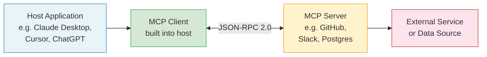
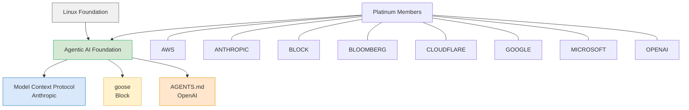

## The Problem That Made MCP Inevitable

Before MCP, building an AI agent that could actually *do* things — search the web, query a database, open a GitHub issue, send a Slack message — was a custom integration project every single time. If you built a Claude-powered coding assistant, you wrote glue code from Claude's API to GitHub's API. When you wanted to add Jira support, you wrote more glue code. When you switched to GPT-4, you rewrote all of it.

This is the classic **N × M integration problem**. With N AI models and M tools, you need up to N × M bespoke connectors. Every integration is one-off, fragile, and model-specific. The combinatorial math means that as the number of models and tools grows, the maintenance burden explodes.

Model Context Protocol (MCP) turns N × M into N + M. Each AI system implements an MCP client once. Each tool or data source implements an MCP server once. They interoperate out of the box. The analogy that's stuck in the developer community is apt: MCP is the USB-C port for AI. Before USB-C, every laptop had its own charger shape; now one cable runs everything. MCP is that cable for AI agents and their tools.

## What MCP Actually Is

MCP is an **open protocol** — a formalized contract for how AI agents discover and invoke external capabilities. It was created by Anthropic engineers David Soria Parra and Justin Spahr-Summers, released in November 2024 with open-source SDKs for Python and TypeScript, and is now governed by the Agentic AI Foundation under the Linux Foundation.

The design deliberately borrows from a proven predecessor: Microsoft's **Language Server Protocol (LSP)**. LSP solved the same N × M problem for code editors — rather than every editor needing a custom plugin for every programming language, LSP defines a universal protocol so that any LSP-compliant editor works with any LSP-compliant language server. MCP applies the same insight one level up, to AI agents and the world of services they need to reach.

Technically, MCP is transported over **JSON-RPC 2.0**. All communication is structured as JSON requests and responses — readable, debuggable, and language-agnostic. The architecture has four roles:

- **Host**: the user-facing application — a coding assistant, a chatbot, an enterprise copilot
- **MCP Client**: a library embedded in the host that handles the protocol; it connects to one or more servers
- **MCP Server**: a lightweight adapter that wraps an external service and exposes its capabilities
- **External Service**: the actual tool — a database, a REST API, a filesystem, a calendar

When the MCP client connects to a server, it starts with capability discovery: "what can you do?" The server responds with a machine-readable schema of every available **tool**, like `list_pull_requests(author)` or `create_issue(title, body)`, complete with typed inputs and expected outputs. The AI model never needs to know what tools exist in advance — it discovers them at runtime.

Beyond tools, MCP servers can also expose **resources** (read-only data like files or database records) and **prompts** (reusable prompt templates). The November 2025 spec revision added **tasks** — an abstraction for long-running server-side work that the client can track asynchronously — plus a full OAuth 2.1 authorization framework for enterprise deployments.

## From 100K to 97 Million in 16 Months

The growth curve for MCP is unusual even by AI standards:

- **November 2024**: Anthropic releases MCP with Python/TypeScript SDKs. Monthly downloads: ~100,000. A few hundred enthusiasts build proof-of-concept servers.
- **February 2025**: Monthly downloads cross 5 million as Cursor, VS Code extensions, and early enterprise tooling adopts MCP as the default agent integration layer.
- **March 26, 2025**: OpenAI announces full MCP support across its Agents SDK, Responses API, and ChatGPT desktop app. Sam Altman's post — "People love MCP and we are excited to add support across our products" — is a watershed moment. A competitor endorsing a rival's protocol signals that MCP has transcended its origin. Monthly downloads: 22 million within weeks.
- **July 2025**: Microsoft integrates MCP into Copilot Studio. Monthly downloads: 45 million.
- **December 2025**: Anthropic donates MCP to the newly-formed Agentic AI Foundation under the Linux Foundation. Monthly downloads reach 97 million. The MCP ecosystem counts over 10,000 active public servers and more than 300 MCP client implementations.
- **March 2026**: The 97 million figure is cited as the canonical milestone — the fastest adoption curve for any AI infrastructure protocol in history, faster than most developer protocols reach in their first five years.

Google DeepMind confirmed MCP support in Gemini models in April 2025. By mid-2026, every major AI provider ships MCP-compatible tooling as the default, not an option.

## Why It Won

Several technical and social factors accelerated MCP's dominance:

**Timing.** MCP launched precisely as agentic AI was transitioning from demos to production. Developers building real agents immediately hit the integration problem MCP solves. There was no incumbent protocol to displace — MCP was first into a vacuum.

**Simplicity.** The core protocol is narrow and well-specified. An MCP server is not complex to build — in many frameworks it's a few dozen lines of code. Low barrier to contribution means the server ecosystem grew fast.

**Openness.** Apache 2 / MIT licensing, open governance from day one, and SDKs in Python and TypeScript — the two languages where most AI tooling is written. No vendor lock-in anxiety.

**The OpenAI signal.** OpenAI adopting an Anthropic protocol is the kind of interoperability move that rarely happens among competing AI labs. It told the broader ecosystem that MCP wasn't a proprietary play — it was infrastructure. That signal collapsed the wait-and-see window for enterprise buyers.

**LSP as a template.** The developer community understood the USB-C/LSP analogy immediately. Engineers who had watched LSP transform the editor ecosystem already knew what this meant: write the integration once, deploy everywhere.

## The Governance Turn: AAIF and the Linux Foundation

On December 9, 2025, Anthropic, Block, and OpenAI co-founded the **Agentic AI Foundation (AAIF)**, a directed fund under the Linux Foundation. Anthropic donated MCP as the foundation's anchor project. Block contributed its open-source agent framework **goose**. OpenAI contributed **AGENTS.md**, a standard for how AI coding agents discover project-specific guidance (since adopted by over 60,000 open-source repositories).

Platinum members of the AAIF include AWS, Anthropic, Block, Bloomberg, Cloudflare, Google, Microsoft, and OpenAI — a list that reads like the guest list for any significant web infrastructure initiative.

Donating MCP to a foundation is not just symbolic. It means no single company controls the spec, the roadmap is governed by a broader steering committee, and enterprises with long procurement cycles can rely on the protocol not being pulled, pivoted, or acquired away. It's the move that transforms a protocol from "Anthropic's thing" to "industry infrastructure" — the same path HTTP, Linux, and Kubernetes all followed.

## What This Means in Practice

For **developers building agents**, the calculus has shifted: the right default is now to build MCP servers rather than custom integrations. If your tool exposes an MCP server, every MCP-compatible agent — Claude, GPT-4, Gemini, Copilot, Cursor — can use it. You write the integration once.

For **enterprises**, the 2026 roadmap addresses the production pain points: audit trails, SSO-integrated auth, gateway behavior, and configuration portability. Forrester predicts that 30% of enterprise app vendors will ship their own MCP servers in 2026. The conversation has shifted from "should we support MCP" to "when do we ship our MCP server."

For **AI product teams**, MCP decouples capability from model choice. An agent's toolset is now a configuration concern, not an architecture concern. Swapping out the underlying model doesn't break your integrations. Adding new capabilities doesn't require changes to the host application.

The deeper implication is that the **tool layer** is becoming a commodity. When every AI model speaks the same protocol and every enterprise service publishes an MCP server, the moat for AI applications shifts away from proprietary integrations and toward orchestration, trust, and domain expertise.

## What's Next

The 2026 MCP roadmap is focused on four areas:

- **Transport scalability**: better support for high-throughput and streaming use cases
- **Agent-to-agent communication**: primitives for one agent to call another via MCP, enabling multi-agent workflows
- **Governance maturation**: audit logging, policy enforcement, and access control built into the protocol itself
- **Enterprise readiness**: standardized credential management, configuration portability, and gateway patterns

The most consequential of these is agent-to-agent communication. MCP was designed for the human-agent-tool triangle. The emerging reality is multi-agent systems where one orchestrator delegates to specialized sub-agents, each with their own tool access. MCP v2 is quietly becoming the substrate for that communication layer too.

The 97 million download milestone is a number, but what it represents is more significant: the moment when AI agent infrastructure stopped being each team's private problem and became shared public infrastructure. That shift — from proprietary glue code to open protocol — is how computing ecosystems typically mature. MCP appears to have crossed that threshold.

---

## Sources

- [Anthropic's Model Context Protocol Hits 97 Million Installs on March 25 — AI Unfiltered](https://www.arturmarkus.com/anthropics-model-context-protocol-hits-97-million-installs-on-march-25-mcp-transitions-from-experimental-to-foundation-layer-for-agentic-ai/)
- [Anthropic's MCP Protocol Crosses 97 Million Installs — It's Now the Standard for AI Agent Integration](https://www.affiliatebooster.com/anthropic-mcp-protocol-97-million-installs/)
- [Donating the Model Context Protocol and establishing the Agentic AI Foundation — Anthropic](https://www.anthropic.com/news/donating-the-model-context-protocol-and-establishing-of-the-agentic-ai-foundation)
- [OpenAI Adopts Rival Anthropic's Standard for Connecting AI Models to Data — TechCrunch](https://techcrunch.com/2025/03/26/openai-adopts-rival-anthropics-standard-for-connecting-ai-models-to-data/)
- [Linux Foundation Announces the Formation of the Agentic AI Foundation — Linux Foundation](https://www.linuxfoundation.org/press/linux-foundation-announces-the-formation-of-the-agentic-ai-foundation)
- [OpenAI co-founds the Agentic AI Foundation under the Linux Foundation — OpenAI](https://openai.com/index/agentic-ai-foundation/)
- [Block, Anthropic, and OpenAI Launch the Agentic AI Foundation — Block](https://block.xyz/inside/block-anthropic-and-openai-launch-the-agentic-ai-foundation)
- [MCP Ecosystem in 2026: From Experiment to 97 Million Installs — Effloow](https://effloow.com/articles/mcp-ecosystem-growth-100-million-installs-2026)
- [The 2026 MCP Roadmap — Model Context Protocol Blog](https://blog.modelcontextprotocol.io/posts/2026-mcp-roadmap/)
- [MCP Adoption Statistics 2026 — MCP Manager](https://mcpmanager.ai/blog/mcp-adoption-statistics/)
- [Why the Model Context Protocol Won — The New Stack](https://thenewstack.io/why-the-model-context-protocol-won/)
- [Model Context Protocol (MCP): The USB-C for AI — The Model Context Protocol: Why It's the "USB-C Moment" for AI](https://medium.com/@shehzadmunir.dev/the-model-context-protocol-mcp-why-its-the-usb-c-moment-for-ai-47989f878ed8)
- [Model Context Protocol — GitHub](https://github.com/modelcontextprotocol/modelcontextprotocol)
