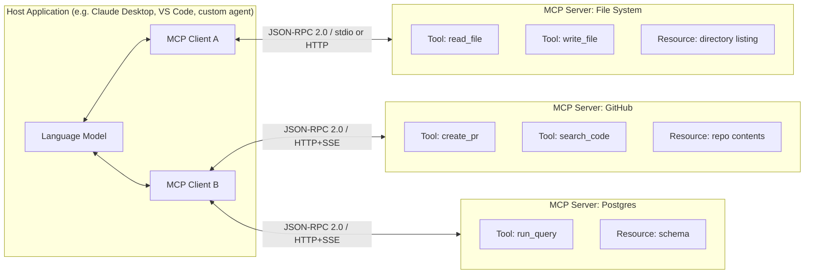
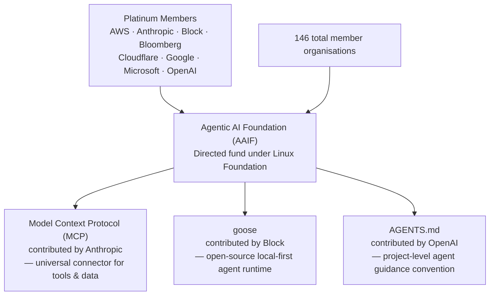
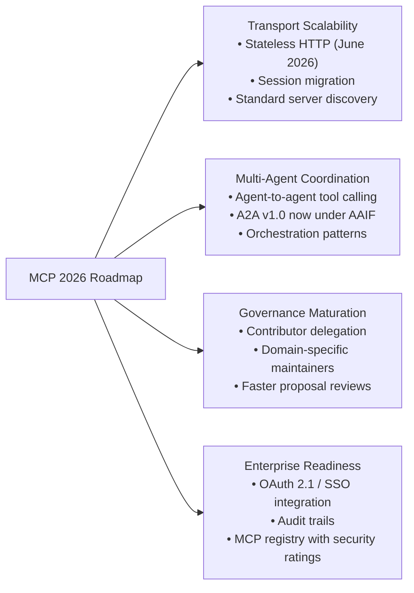

## The Glue Nobody Talks About

Every AI agent demo looks the same: a language model reads a file, queries a database, calls an API, runs a search, and synthesises the results into an answer. The magic is in the reasoning. But the plumbing — the part that actually connects the model to those tools and data sources — barely gets a mention.

For most of 2024, that plumbing was a patchwork. Each AI platform had its own integration format. Each tool vendor shipped its own adapter. If you wanted Claude to query your Postgres database and also search your Confluence wiki, you wrote two separate glue layers, and they shared nothing. Multiply that across the industry and you end up with an ecosystem that looks less like the web and more like the early PC era: powerful, but incompatible.

That started to change in November 2024, when Anthropic open-sourced the **Model Context Protocol** (MCP). By December 2025, rivals OpenAI and Block had joined Anthropic to hand MCP and two companion projects to the Linux Foundation, forming the **Agentic AI Foundation (AAIF)**. By March 2026, MCP had hit **97 million monthly SDK downloads** — a 4,750% increase in 16 months. The question is no longer whether MCP will become the standard. It already has.

---

## What Is MCP?

Think of MCP as the USB-C port of AI. USB-C replaced a drawer full of proprietary cables — micro-USB, Lightning, barrel connectors — with a single universal socket. Your laptop doesn't need to know in advance which monitor, dock, or drive will plug into it. The port speaks one protocol; the device implements that protocol; the rest is handled by negotiation at connection time.

MCP does the same thing for AI models and external capabilities. Before MCP, if you wanted an LLM to call your weather API, you wrote bespoke code that knew how to talk to that specific API and format results for that specific model. Add a second tool and you doubled the integration code. MCP breaks that coupling: the model's host connects to an MCP server through one standard interface; the MCP server wraps whatever it wants to expose (a REST API, a file system, a database) and describes its capabilities in a machine-readable format the model can discover and use.

The protocol runs on **JSON-RPC 2.0** — the same message format that inspired the Language Server Protocol powering every modern code editor. A host spawns one MCP client per server it wants to connect to. Each client-server pair negotiates what capabilities are available, and the host passes the list of available tools into the model's context window. The model decides which tools to call; the client ferries requests and responses; the server does the actual work.

---

## The Four Primitives

MCP servers expose capabilities through four building blocks:

**Tools** are functions the model can invoke — `search_web`, `run_sql_query`, `send_email`. They're the most common primitive and the one developers reach for first. A tool call has a name, a JSON Schema for its input parameters, and a return value the model reads.

**Resources** are read-only data sources. Where a tool *does* something, a resource *is* something: the current contents of a file, a list of rows from a table, an image. Resources are fetched once and injected into context, like pasting a document into the conversation.

**Prompts** are reusable templates that guide model behaviour for specific workflows. A server might offer a `code_review` prompt that injects a particular set of instructions whenever the user wants to review code, giving teams a way to standardise how the model approaches routine tasks.

**Sampling** is the most unusual primitive — it runs in the opposite direction. Where the model normally sends a request to the server, sampling lets the *server* request an LLM completion from the model. This enables recursive agent patterns: a server-side orchestrator that spawns sub-tasks and uses the language model to reason about the results, without the user having to wire that logic into the host.

---

## From Anthropic's Lab to the Linux Foundation

When Anthropic open-sourced MCP in November 2024, it retained governance. That was fine at first — the community needed Anthropic's guidance to bootstrap the ecosystem — but it became a structural problem as adoption grew. Enterprises don't build core infrastructure on protocols controlled by a single vendor. Every company considering MCP had to ask: what if Anthropic changes the rules?

Anthropic answered that question definitively on **December 9, 2025**, by donating MCP to the **Agentic AI Foundation (AAIF)**, a directed fund under the Linux Foundation. The Linux Foundation's track record here is unimpeachable: it stewards the Linux kernel, Kubernetes, Node.js, PyTorch, and dozens of other projects that became neutral infrastructure for the entire tech industry.

Two other companies co-founded the AAIF at the same time. **OpenAI** contributed **AGENTS.md**, a lightweight markdown convention that gives AI coding agents project-specific guidance — which tools to use, which paths are off-limits, coding style expectations — in a file checked into the repo. **Block** (Jack Dorsey's company) contributed **goose**, an open-source, local-first AI agent framework built on top of MCP. The three projects arrived together at a new independent home.

The governing board is chaired by David Nalley of AWS, with 146 member organisations. By handing MCP to an independent body, Anthropic removed the single biggest enterprise objection to adoption: the fear that the protocol's owner could change the rules whenever it suited them.

---

## The Numbers

The growth story is hard to overstate. MCP launched in November 2024 with roughly **2 million monthly SDK downloads**. By March 2026 — just 16 months later — that figure had crossed **97 million**. For comparison, Kubernetes took nearly four years to reach comparable deployment density across the enterprise software landscape.

More than **10,000 published MCP servers** now cover the full spectrum of developer tooling: GitHub, Jira, Notion, Slack, AWS services, PostgreSQL, Google Analytics, hundreds of REST API wrappers, and specialised servers for verticals from healthcare to finance. The protocol is supported natively by Anthropic, OpenAI, and Google DeepMind, meaning any model those providers ship can consume MCP tools out of the box.

**AGENTS.md**, the newer convention, has been adopted by more than **60,000 open-source repositories** since OpenAI released it in August 2025. Like the `.editorconfig` file for coding style, it's small enough that adding it to a repo takes minutes and valuable enough that most AI-native tools now look for it automatically.

---

## The 2026 Roadmap: What Gets Fixed Next

MCP at 97 million downloads is not the same problem as MCP at 2 million. Scaling reveals seams. The AAIF's published 2026 roadmap focuses on four areas that have surfaced as production pain points.

**Transport scalability** is the most urgent fix. Current MCP sessions are stateful — the server maintains session state for each connected client. That works fine on a single machine, but it fights with cloud load balancers that route requests across multiple server instances. The roadmap's answer is **MCP 1.8.0**, shipping in June 2026, which adds a stateless transport mode where sessions can be created, resumed, and migrated across server restarts and scale-out events. This is what operators need before deploying MCP-backed services at enterprise scale.

**Multi-agent coordination** is the forward-looking pillar. MCP was originally designed for a single model talking to tools. Production agent architectures are more complex: orchestrator agents spawn specialist sub-agents, sub-agents have their own tool access, and results flow back up the hierarchy. The 2026 spec adds formal primitives for agent-to-agent calls via MCP. Google's **A2A (Agent-to-Agent)** protocol — which handles the complementary problem of agents calling *each other* rather than calling tools — has also moved under AAIF governance, formalising the two standards as complementary rather than competing.

**Enterprise readiness** covers the checklist every security team produces before approving a new protocol: OAuth 2.1 support, enterprise identity provider integration, audit trails, and an MCP registry that publishes security ratings for community servers.

---

## What Happened at the Dev Summit

The AAIF's first **MCP Dev Summit North America** took place in New York City on April 2–3, 2026. It drew 1,200 attendees across 95 sessions — a striking turnout for a two-year-old protocol. The signal that stood out: enterprise keynotes from Uber, Nordstrom, Bloomberg, Duolingo, and PwC describing MCP running *in production*, not in pilots. The conversation had moved from "should we adopt this?" to "here's how we scaled it."

MCP maintainers from Anthropic, AWS, Microsoft, and OpenAI jointly presented the enterprise security roadmap, which addressed the most cited criticism of MCP in 2025: that its flexible tool-calling model created a potential surface for **prompt injection attacks**, where malicious content in a tool's response tricks the model into taking unintended actions. The roadmap response is a combination of server-level input validation standards, gateway observability hooks, and a formal security advisory process modelled on CVE disclosure.

---

## Why This Is the Infrastructure Story of 2026

Open standards become infrastructure when they reach three thresholds: enough adoption that network effects make them self-reinforcing, neutral governance that removes vendor-lock fears, and a growing ecosystem of tooling that fills the gaps the core standard doesn't address.

MCP has cleared all three in the past 18 months. The 97 million download figure represents actual developers building actual systems, not conference demos. The Linux Foundation home removes the governance objection. The 10,000-server ecosystem means a new MCP host — whether it's a startup's AI assistant or an enterprise agent platform — arrives pre-connected to the internet's tool surface area.

The analogy that keeps coming up is TCP/IP. Not because MCP is anywhere near that foundational yet, but because the pattern is similar: a protocol that initially looked like one vendor's design decision turned into the layer everyone builds on, precisely because it became nobody's property.

The deeper shift is in what building an AI agent *means*. A year ago, wiring an agent to your company's internal tools was a multi-week engineering project requiring custom integration code for each system. With MCP, an enterprise with existing MCP servers for its core platforms can stand up a new agent and hand it a working toolset in hours. The bottleneck moves from integration to reasoning — from "how do I connect the model to my data?" to "what should the model actually do with it?"

That's a different and better problem to have.

---

## Sources

- [Donating the Model Context Protocol and establishing the Agentic AI Foundation — Anthropic](https://www.anthropic.com/news/donating-the-model-context-protocol-and-establishing-of-the-agentic-ai-foundation)
- [Linux Foundation Announces the Formation of the Agentic AI Foundation (AAIF) — Linux Foundation](https://www.linuxfoundation.org/press/linux-foundation-announces-the-formation-of-the-agentic-ai-foundation)
- [OpenAI co-founds the Agentic AI Foundation under the Linux Foundation — OpenAI](https://openai.com/index/agentic-ai-foundation/)
- [Block, Anthropic, and OpenAI Launch the Agentic AI Foundation — Block](https://block.xyz/inside/block-anthropic-and-openai-launch-the-agentic-ai-foundation)
- [OpenAI, Anthropic, and Block join new Linux Foundation effort to standardize the AI agent era — TechCrunch](https://techcrunch.com/2025/12/09/openai-anthropic-and-block-join-new-linux-foundation-effort-to-standardize-the-ai-agent-era/)
- [Model Context Protocol Hits 97M Installs as Linux Foundation Takes Over — AI2Work](https://ai2.work/blog/model-context-protocol-hits-97m-installs-as-linux-foundation-takes-over)
- [MCP Is Now Enterprise Infrastructure: Everything That Happened at MCP Dev Summit North America 2026 — AAIF](https://aaif.io/blog/mcp-is-now-enterprise-infrastructure-everything-that-happened-at-mcp-dev-summit-north-america-2026/)
- [AAIF's MCP Dev Summit: Gateways, gRPC, and Observability Signal Protocol Hardening — InfoQ](https://www.infoq.com/news/2026/04/aaif-mcp-summit/)
- [MCP maintainers from Anthropic, AWS, Microsoft, and OpenAI lay out enterprise security roadmap — The New Stack](https://thenewstack.io/mcp-maintainers-enterprise-roadmap/)
- [The 2026 MCP Roadmap — Model Context Protocol Blog](https://blog.modelcontextprotocol.io/posts/2026-mcp-roadmap/)
- [What Is MCP? Model Context Protocol Explained for 2026 — IBM](https://www.ibm.com/think/topics/model-context-protocol)
- [MCP Dev Summit North America — Linux Foundation Events](https://events.linuxfoundation.org/mcp-dev-summit-north-america/)
