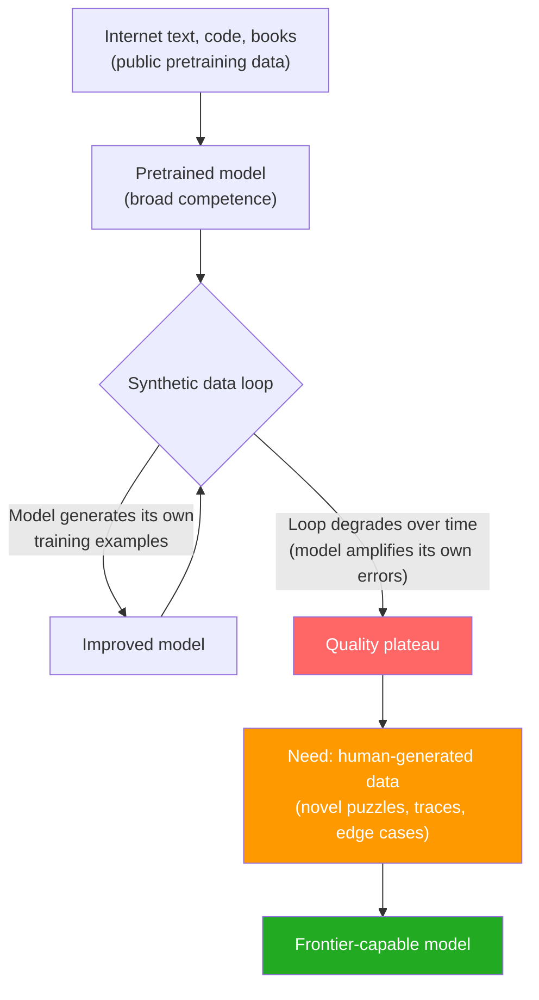
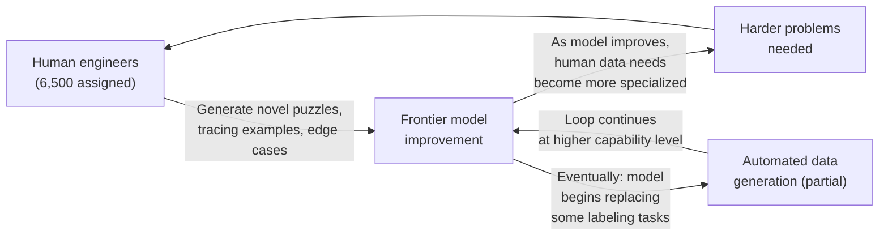

## When $130 Billion Isn't Enough

Meta is spending somewhere between $115 and $135 billion on AI infrastructure in 2026 alone. The company signed a $21 billion deal with CoreWeave for cloud capacity through 2032. It has rebuilt its organizational chart from the ground up around AI. By any measure, Meta's AI bet is one of the largest capital commitments in corporate history.

And yet, by early July, CEO Mark Zuckerberg was standing in front of employees at an internal town hall admitting that the AI agents Meta has been building "haven't progressed as quickly" as he hoped. That the trajectory of agentic development over the previous four months "hasn't really accelerated in the way that we expected."

A $130 billion bet, not delivering.

To understand why, you have to look at what was happening inside a unit most Meta employees had never heard of three months earlier — and why thousands of senior engineers were calling it a gulag.

---

## The Forced Draft

In March 2026, Meta assembled a new group called the **Applied AI Engineering** unit. The formation method was unusual: roughly 6,500 engineers and product managers across the company received surprise emails telling them they had been transferred. The offer was binary — join the unit or leave Meta.

The unit's structure was equally unusual. It was built flat: a 50-to-1 ratio of individual contributors to managers. Hundreds of engineers reporting to a handful of leads, with minimal middle management between them. In theory, this was meant to move fast. In practice, thousands of people suddenly had almost no one to talk to about their work.

By May 2026, Meta had also laid off approximately 8,000 employees — about 10 percent of its global workforce — and simultaneously redirected another 7,000 into AI-focused groups including "Agent Transformation Accelerator XFN" and "Central Analytics." In a matter of weeks, roughly one in five Meta employees had a fundamentally different job than the one they had signed up for.

---

## The Work Nobody Wanted to Do

Here is what the Applied AI unit was actually doing: writing puzzles.

Not puzzles in a creative, intellectually stimulating sense. Coding challenges designed to a specification. Step-by-step task demonstrations for mundane workflows. Click-sequence records — detailed logs of what a human cursor does when filling out a form, booking a meeting, or navigating an application. The kind of granular, labeled data that shows an AI model what human-computer interaction looks like from the inside.

This was not the work most of these engineers thought they were hired to do. And it raised a fair question: why couldn't Meta's AI just generate this data itself?

The answer involves a problem the entire AI industry is quietly struggling with: the **synthetic data ceiling**.

Early in model training, the internet provides vast amounts of diverse text and code. Models learn from this at scale. But as models get better — approaching or exceeding average human performance on specific tasks — the gap between what a model already knows and what novel training examples can teach it narrows dramatically.

One shortcut is to have the model generate its own training data. This works for a while. But models amplify their own existing biases and blind spots when they self-teach. The data becomes a hall of mirrors. Quality degrades.

The only way to keep improving a frontier model beyond this point is to feed it genuinely novel, human-crafted examples: problems designed to sit just outside the model's current capability, edge cases the model wouldn't think to generate itself, labeled traces of human reasoning the model hasn't seen.

Research firm Epoch AI has projected that the stock of quality-filtered public text available for AI pretraining will be fully consumed somewhere between 2026 and 2032 at current training rates. The synthetic data ceiling isn't a distant threat. For frontier labs, it's a present-tense problem.

Meta's solution was to turn its engineering workforce into a data labeling operation.

---

## "It's Literally the Gulag"

Engineers did not take this quietly.

"It's literally the gulag," one employee told *Wired*. "Most people find the work soul-crushing," said another. The name spread across internal channels. It stuck.

In mid-June, the frustration broke into the open. During a livestreamed, company-internal presentation, someone hijacked the broadcast with an expletive-filled outburst demanding that attendees relay a profane message to a senior Meta AI executive. The stunt was raw, chaotic, and visible to thousands of employees watching in real time.

Separately, more than 1,600 employees signed a petition protesting a program that tracked their keystrokes and mouse clicks to gather AI training data — with no opt-out option.

The specific grievances were multiple: the work felt menial compared to what engineers had been hired to do; the flat organizational structure left people without guidance or career visibility; communication from leadership had been minimal; and many felt they had been press-ganged into a role with no path out.

Zuckerberg responded with an internal memo on June 12.

"Given the complexity of these changes, we've made mistakes and will almost certainly make more," he wrote. He acknowledged that the company had not been "as clear as we aspire to be" in its communication. He promised to find new roles for engineers stuck in model-training work, pledged no further company-wide layoffs for the rest of 2026, and arrived with a package of concessions: larger budgets for team offsites, a company-wide hackathon scheduled for July, the return of assigned desks in many offices, and reductions to the extreme manager-to-employee ratios.

---

## The Bigger Problem: Agents Not Accelerating

The engineer revolt was visible. The deeper problem Zuckerberg revealed at the July 2 town hall was structural.

Meta had built its organizational restructuring around a specific bet: that AI agents — software capable of taking multi-step actions autonomously on users' behalf — were about to become transformative. The "Agent Transformation Accelerator XFN" group was created precisely to build and deploy these systems at scale.

The agents haven't arrived on schedule.

"The trajectory of the agentic development over at least the last four months hasn't really accelerated in the way that we expected," Zuckerberg told employees. He said the job cuts had not been as "clean" as they should have been, and acknowledged that the disruption to thousands of people's careers had not yielded the product progress Meta hoped for.

He struck a cautiously forward-looking note: expecting "more significant benefits" from the AI investments within the next three to six months. But the gap between the investment — $130 billion in capex, 15,000 employees restructured — and the results delivered so far was unmistakable.

---

## What Every AI Lab Will Eventually Face

Meta's situation is a preview, not an anomaly.

Every frontier AI lab is approaching the same constraint: public data is finite, synthetic data degrades, and the only reliable path forward runs through human judgment. The difference between labs will be how creatively and humanely they can organize that human input — and whether the people doing the work feel like participants or conscripts.

The 50:1 manager ratio that Meta tried was a structural experiment in removing the overhead of supervision. The revolt it produced suggests that removing oversight at that scale doesn't create autonomy — it creates isolation. Talented engineers doing unfamiliar, repetitive work without clear context for why it matters will find ways to express that.

There is also a deeper irony here. The same engineers Meta assigned to label data are, in a sense, competing with the AI systems Meta is trying to build. The better those systems get, the less human labeling they'll need. But until they get there, the humans are load-bearing. It's a strange position: indispensable and apparently interchangeable at the same time.

Zuckerberg's three-to-six-month timeline for visible results from the AI investments is optimistic, but not implausible. What happens next likely depends less on compute or model architecture and more on whether Meta can find a way to make the data generation work feel like meaningful engineering — or automate enough of it that it mostly goes away.

For the engineers currently writing coding puzzles in a 50:1 flat unit, that distinction matters quite a bit.

---

## Sources

- [Mark Zuckerberg tells staff that AI agents haven't progressed as quickly as he'd hoped — TechCrunch](https://techcrunch.com/2026/07/02/mark-zuckerberg-tells-staff-that-ai-agents-havent-progressed-as-quickly-as-hed-hoped/)
- [Meta's months-old AI unit is a soul-crushing gulag, say the engineers stuck inside it — TechCrunch](https://techcrunch.com/2026/06/12/metas-months-old-ai-unit-is-a-soul-crushing-gulag-say-the-engineers-stuck-inside-it/)
- [Inside the revolt at Meta's Applied AI unit — The Next Web](https://thenextweb.com/news/meta-applied-ai-unit-revolt-data-labeling-draftees)
- [Zuckerberg says Meta's AI agent progress is slower than expected — The Next Web](https://thenextweb.com/news/zuckerberg-meta-ai-agent-progress-slower-than-expected)
- [Zuckerberg Tells Meta Employees AI Agents Are Advancing Slower Than Expected — PYMNTS](https://www.pymnts.com/facebook-meta/2026/zuckerberg-tells-meta-employees-ai-agents-are-advancing-slower-than-expected/)
- [Meta slashes 8,000 jobs as it pivots towards AI — NPR](https://www.npr.org/2026/05/20/nx-s1-5826917/meta-layoffs-ai-jobs)
- [Meta layoffs 2026: 8,000 jobs cut in AI restructuring — Quartz](https://qz.com/meta-layoffs-8000-jobs-ai-restructuring-052026)
- [Meta AI Unit Called 'Gulag' as 1,600 Sign Protest — AI Weekly](https://aiweekly.co/alerts/meta-ai-unit-called-gulag-as-1600-sign-protest)
- [Meta Engineers Call AI Unit a 'Gulag' as Zuckerberg Admits Mistakes — OpenTools](https://opentools.ai/news/meta-engineers-revolt-ai-unit-draft-gulag-zuckerberg)
- [Meta Conscripts 6,500 Engineers as Data Labelers: Revolt Exposes AI Training Ceiling — TechTimes](https://www.techtimes.com/articles/318586/20260617/meta-conscripts-6500-engineers-data-labelers-revolt-exposes-ai-training-ceiling.htm)
- [Meta's $14.3B AI Bet Hits a Training Data Wall: Zuckerberg Admits Mistakes — TechTimes](https://www.techtimes.com/articles/318464/20260616/metas-143b-ai-bet-hits-training-data-wall-zuckerberg-admits-mistakes.htm)
- [Zuckerberg: Meta's AI reorganization goals 'haven't come to fruition' — TheStreet](https://www.thestreet.com/investing/stocks/zuckerberg-meta-ai-reorganization-goals-havent-come-to-fruition)
