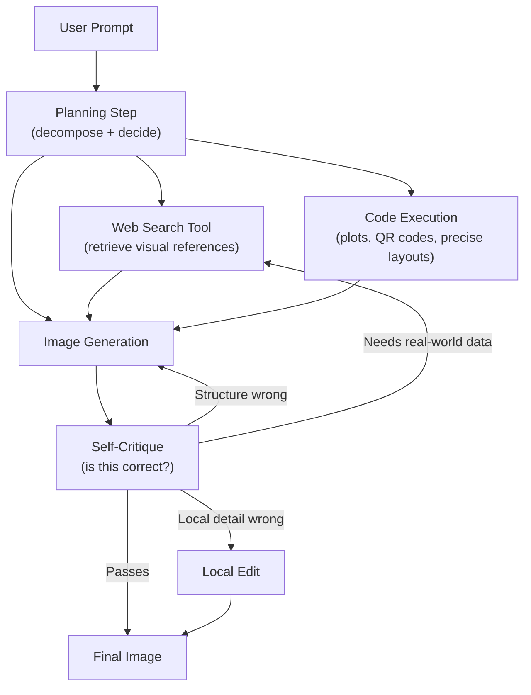
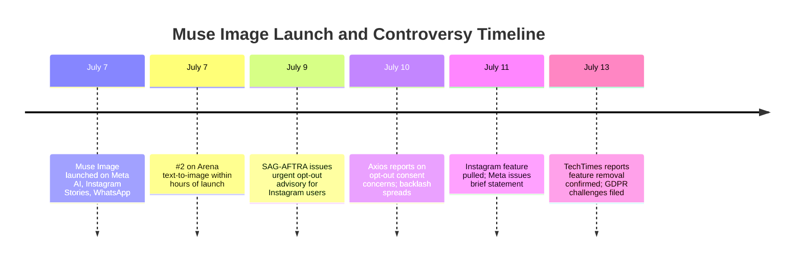

## A Different Kind of Image Generator

Every major AI image generator you've used probably works the same way under the hood: you type a prompt, the model converts it into a noisy blob of pixels, then runs a diffusion process to iteratively clean that noise into a coherent image. The whole thing happens in one shot, left to right, start to finish. What you ask for is what it tries to produce.

Meta Muse Image, released on July 7, 2026, takes a fundamentally different approach — and the difference matters more than you might expect.

Rather than mapping your prompt directly to pixels, Muse Image first *thinks*. It breaks your request into sub-problems, decides whether it needs to look something up, writes and executes code if the task involves precise layouts or diagrams, and drafts an image it then critically reviews before showing it to you. Only if the draft fails its own inspection does it try again, choosing the lightest-weight fix: a local edit for a small detail error, a full regeneration for a structural problem, or a different tool entirely for something factual.

This is, in effect, what AI researchers call an **agentic** loop applied to image generation — and it's the defining technical bet that makes Muse Image worth paying attention to.

---

## Who Built It, and Why That's Significant

Muse Image is the second major product from **Meta Superintelligence Labs** (MSL), a research group created in early 2026 when Meta hired Alexandr Wang — Scale AI's founder and former CEO — as Chief AI Officer. Wang's first release from the new lab was Muse Spark, a large language model. Muse Image follows it, with Muse Video (a companion video generation model) released simultaneously.

The formation of MSL marked a deliberate organizational shift: Meta decided to build frontier AI models entirely in-house rather than licensing or partnering for key capabilities. The Muse family is the lab's first public demonstration of what that means in practice.

---

## How Agentic Image Generation Works

Traditional diffusion models have no concept of "checking their work." Once generation begins, they run the same forward process from noise to image and output whatever comes out.

Muse Image changes this by training on a completely different objective. Meta used **reinforcement learning** to teach the model to use three tools during generation:

1. **Web search** — to ground factual or current-events-heavy prompts in real visual references. Ask it to generate an image related to a recent news story, and it can look the story up first.
2. **Code execution** — to produce things that are hard to generate by eye but easy to generate by calculation: charts, precise data plots, functional QR codes.
3. **Self-critique and revision** — the model reflects on its own draft and can choose to edit locally, regenerate entirely, or switch to a different tool.

The critical thing about this approach is that the self-revision behavior was **not designed in by engineers**. It emerged during reinforcement learning because the model discovered that revising produced better images and therefore higher reward. That's a meaningful technical result: the model independently learned that checking its own work was a useful strategy.

Meta also reports that Muse Image obeys **test-time compute scaling** — the more inference compute it's given, the better the output, following an approximately log-linear relationship. This mirrors what researchers have observed in language models doing extended reasoning, and suggests the same scaling playbook (bigger budgets at inference time for harder problems) applies here.

---

## What It Can Actually Do

Beyond the architectural novelty, Muse Image ships with a capable practical feature set:

- **Text-to-image** from natural language prompts, with stronger factual accuracy than prior generators
- **Image editing**: paint over an object to erase it, describe what you want changed
- **Multi-image blending**: combine photos from multiple sources into a single coherent scene
- **Readable text in images**: a historically weak point for diffusion models; Muse Image can render legible signs, labels, and headlines
- **Functional QR codes**: generated via code execution rather than visual approximation, so they actually scan
- **Animated GIFs**: short looping clips from a still-image starting point

At launch, it ranked **#2 on Arena's text-to-image leaderboard** — behind only OpenAI's GPT Image 2, and ahead of Google NanoBanana 2, xAI's Grok Imagine, and Microsoft AI Image. Arena rankings are determined by pairwise human preference votes, making them a harder-to-game signal than purely automated benchmarks.

---

## Where You Actually Encounter It

Muse Image isn't just a research demo — Meta deployed it across its consumer platforms.

**Meta AI app**: the primary home for text-to-image generation and editing, available in the US at launch with international rollout planned.

**Instagram Stories**: Muse Image powers more than 30 new AI effects in the Stories composer. Users can generate custom backgrounds, remix photos with AI filters, and create stylized versions of their content directly within the app.

**WhatsApp**: in direct conversations with Meta AI on WhatsApp (initially limited to a small number of countries), users can generate images via text prompts without leaving the chat.

Meta's stated roadmap extends this to Facebook and Messenger as well as additional Instagram surfaces.

---

## The 96-Hour Controversy

Within 48 hours of launch, Muse Image's integration with Instagram triggered a significant public backlash — and one of the faster product rollbacks in recent tech history.

The specific feature that drew fire: a setting that let any user reference a *public Instagram account* in a Muse Image prompt, pulling photos from that account's feed as visual references for the generated image. If your Instagram is public, someone could type your handle, and Muse Image would produce images styled after — or incorporating — your appearance.

The setting was **opt-out by default**, meaning it was enabled for every public Instagram account unless the account holder actively disabled it. Users were not notified when someone created an AI image using their likeness.

SAG-AFTRA — the actors' union — moved within 48 hours of launch, stating: *"Anything other than a clear and conspicuous opt-in for these types of uses of Instagram users' images is unacceptable, and an utter miscalculation of public sentiment."* Creative Artists Agency and the Indian government filed similar objections. GDPR-focused rights groups pointed out that the opt-out design almost certainly violated EU data protection law, which requires explicit consent before processing personal data for new purposes.

Meta pulled the Instagram reference feature four days after launch, posting a brief statement: *"We've heard the feedback that this feature missed the mark, so it's no longer available."*

The episode is instructive beyond the specific product decision. The opt-out-by-default design choice wasn't unusual for Meta: the company has historically used this pattern across features from ad targeting to cross-app data sharing. But the combination of *image generation* (not just data use), *public likeness* (your face, not just your browsing history), and *no notification* (you might never know it happened) exceeded a threshold that prior opt-out controversies had not reached.

The underlying technical capability remains live in Meta AI. What was removed was specifically the Instagram-account-reference feature that made other users' likenesses trivially accessible as inputs.

---

## Why This Architecture Change Matters

The shift to agentic generation is not cosmetic. It addresses three failure modes that have dogged AI image generators since their mainstream debut:

**Factual accuracy**: a standard diffusion model asked to depict a real location, product, or news event generates something plausible-looking but often factually wrong — the wrong building, the wrong logo, a detail that reveals the model's training data is stale. Muse Image's web search tool gives it access to current, real-world visual references before it generates anything.

**Precise structures**: charts, diagrams, readable text, QR codes, and precise spatial layouts are fundamentally difficult to approximate through denoising. Code execution bypasses the approximation entirely — the model writes code that *computes* the precise structure and renders it.

**Iterative refinement**: a model that can inspect its own draft and choose to revise catches a class of errors that a one-shot model never gets to fix. This is particularly valuable for complex prompts with multiple constraints, where getting everything right in a single pass is statistically hard.

Together, these capabilities narrow the gap between "AI-generated image" and "image produced by a skilled human using reference materials and iterating on drafts." That gap has always been the ceiling on where and how AI-generated images can be used. Muse Image pushes that ceiling noticeably higher.

---

## The Bigger Picture: Social Platforms as AI Deployment Vectors

Muse Image's reach on day one — available to Instagram's 2+ billion users via Stories, and to WhatsApp's 3 billion users in certain markets — makes it almost certainly the largest simultaneous deployment of a new AI image model in history.

Previous frontier image generators (Midjourney, DALL-E, Stable Diffusion) built user bases over months and years. Muse Image shipped to a massive installed user base instantly.

That distribution advantage is Meta's core asset in the AI image generation race, and Muse Image is a bet that having the best in-house model is worth the cost of building a superintelligence lab from scratch to get it. Whether the technical architecture — agentic, tool-using, self-refining — actually gives Meta a durable lead over OpenAI's GPT Image 2, or whether the next competitor iteration closes the gap, will play out over the months ahead.

What's already clear is that the agentic approach to image generation has moved from research prototype to production product. The generator that thinks before it draws is no longer theoretical.

---

## Sources

- [Introducing Muse Image and Muse Video — Meta AI Blog](https://ai.meta.com/blog/introducing-muse-image-muse-video-msl/)
- [Introducing Muse Image: Image Generation Built for Your World — about.fb.com](https://about.fb.com/news/2026/07/introducing-muse-image-meta-ai/)
- [Meta debuts Muse Image, its first AI image model built under Alexandr Wang's lab — The Next Web](https://thenextweb.com/news/meta-muse-image-ai-generation-instagram-whatsapp)
- [Meta just launched a new AI generator, Muse Image, and users are already pushing back over use of their photos — TechCrunch](https://techcrunch.com/2026/07/07/meta-rolls-out-muse-a-new-ai-image-generator/)
- [Meta AI Can Now Use Your Instagram Photos Without Consent. SAG-AFTRA Urges App Users to Opt Out — Variety](https://variety.com/2026/film/news/sag-aftra-slams-meta-ai-instagram-photos-opt-out-1236806350/)
- [Meta Axed Instagram AI Feature That Generated Anyone's Likeness Without Consent — TechTimes](https://www.techtimes.com/articles/320268/20260713/meta-axed-instagram-ai-feature-that-generated-anyones-likeness-without-consent.htm/)
- [Meta pauses Muse Image after Instagram AI backlash — Proton Blog](https://proton.me/blog/meta-ai-image-generator-muse)
- [Meta's Muse Image Beats Google but Trails OpenAI in AI Image Generation — AlphaSignal](https://alphasignal.ai/news/meta-s-muse-image-beats-google-but-trails-openai-in-ai-image-generation)
- [Meta Muse Image climbs to second place in Arena's image generation rankings — CryptoBriefing](https://cryptobriefing.com/meta-muse-image-arena-rankings/)
- [Meta Muse Image: Social AI Image Generation, Explained — Kingy.ai](https://kingy.ai/blog/meta-muse-image-ai-model-social-image-generation/)
- [Meta's new AI image maker draws fire over consent — Axios](https://www.axios.com/2026/07/10/meta-ai-image-consent)
- [New AI Models in July 2026: Every Major Launch Tracked — Skycrumbs Blog](https://skycrumbs.com/blog/ai-models-july-2026)
