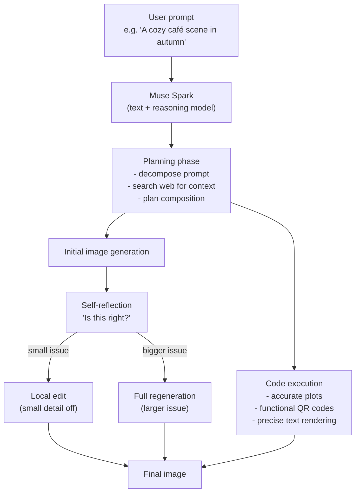
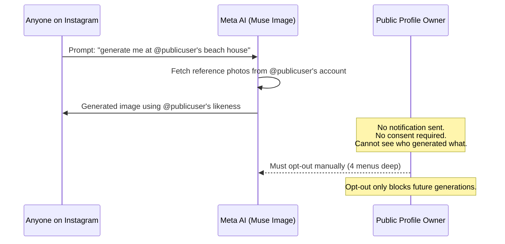
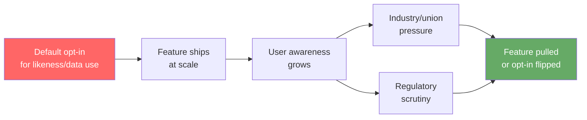

## The Launch

On July 7, 2026, Meta unveiled Muse Image — the first AI image generation model built entirely in-house by Meta Superintelligence Labs (MSL), the division assembled under Chief AI Officer Alexandr Wang. The announcement came alongside news that the model would be deployed immediately across Meta AI, Instagram Stories, and WhatsApp, powering over 30 new visual effects for creators and a free tier for everyday image generation.

On benchmarks, the model punched hard. As of its launch, Muse Image ranked **No. 2 on Chatbot Arena's image generation leaderboard**, ahead of Google's image models, across three categories: text-to-image generation, single-image editing, and multi-image editing — all scored by human preference. It trailed OpenAI's flagship image model but not by much, and it beat everything else.

Technically, Muse Image is genuinely interesting. And then the privacy controversy started within hours of the announcement.

---

## How Muse Image Actually Works

Most image models work by mapping a prompt to a latent space and decoding it into pixels. Muse Image takes a fundamentally different approach: it treats image generation as a **reasoning problem**, not a lookup problem.

Before generating a single pixel, Muse Image's reasoning model — **Muse Spark** — interprets the prompt, searches the web for factual context if needed, and plans the image. Then, during and after generation, the model reflects on whether its draft matches the intent. If a small detail is off, it applies a local edit. If the composition is fundamentally wrong, it regenerates from scratch.

This self-refinement loop is powered by reinforcement learning: the model was trained to evaluate and revise its own outputs, and it learned during that training to write and execute **code** when precision matters. That's why Muse Image can produce accurate plots, properly styled text within images, and fully functional QR codes — things that pure diffusion models reliably fumble because they treat all pixels equally.

The practical result is a model that gets better the more compute you give it to think. Users could see noticeably different results just by prompting it to "think carefully about the layout" before generating.

---

## The Instagram Reference Feature

Here's where things went sideways.

Alongside the image generation tools, Meta launched what looked like a creative feature: you could **@-mention any public Instagram account** in a Muse Image prompt, and the model would pull reference photos from that account to help generate new images. Want to create an AI portrait in the style of a photographer you follow? @-mention their account. Want to generate an image that looks like your friend at the beach? Same mechanism.

The problem was in the defaults. Every adult public Instagram account was automatically enrolled. No notification was sent to the account holder. No consent was required from the person whose face, photos, and likeness were being used as generation inputs. The only way to prevent your images from being used was to navigate **four menu levels deep** in Instagram settings — and even then, opting out only blocked *future* generations, not images already created.

Meta's position was that the feature was within the terms of service that public Instagram users had already agreed to. The counter-argument from critics was swift and precise: *agreeing to post publicly is not the same as consenting to have your likeness used as AI generation training material by strangers*.

---

## The Backlash

The response from the creative and entertainment industry was some of the fastest organized pushback an AI feature has received.

**SAG-AFTRA** (the Screen Actors Guild, representing over 160,000 performers) put out guidance within 24 hours of launch, urging all members — and the general public — to opt out immediately. The union's statement was pointed: *"Anything other than a clear and conspicuous OPT-IN for these types of uses of Instagram users' images is unacceptable, and an utter miscalculation of public sentiment."*

**Creative Artists Agency (CAA)**, one of the largest talent agencies in the world, called the rollout "irresponsible" and stated: *"No one's name, image, likeness, voice or creative work should be used by any third party, including AI models, without clear, documented consent."*

**Public Citizen**, the consumer advocacy group, called it an "egregious invasion" of privacy and pushed for regulatory action.

Three days after launching — on July 10, 2026 — Meta pulled the Instagram reference feature. The company acknowledged it "missed the mark" and said the feature was "no longer available." Muse Image itself remained live across Meta AI, Instagram, and WhatsApp, but the ability to @-mention public accounts was gone.

---

## The Broader Pattern

This wasn't Meta's first rodeo with this specific kind of controversy, and it wasn't unique to Meta. The cycle has repeated across the industry:

1. Company ships AI feature with permissive defaults
2. Users realize the defaults expose their data or likeness
3. Advocates and unions respond loudly
4. Feature is pulled or defaults are changed

OpenAI's Sora video model faced nearly identical backlash for an opt-out policy around using public video content. Google Photos AI features drew criticism for ambiguous consent around facial recognition. The pattern suggests that "default opt-in" for likeness-based AI features is consistently misjudging where public tolerance actually sits.

The trouble is that each time the cycle completes, the damage isn't fully undone. Images already generated from someone's likeness remain in circulation. The opt-out only applies to future generations. There is no "reverse" button.

---

## The EU AI Act Wrinkle

Muse Image launched two weeks before a significant EU compliance deadline.

Starting **August 2, 2026**, Article 50 of the EU AI Act requires anyone publishing AI-generated or AI-manipulated content in EU markets to **visibly label it**. The key word is "visibly" — the standard requires that people encountering the content be able to tell it's AI-generated.

Meta's answer to watermarking is **Content Seal** — an invisible, compression-resistant watermark embedded in every Muse Image output that can be machine-detected but is invisible to the human viewer. This technically satisfies some watermarking definitions but appears to land on the wrong side of the EU visibility requirement.

Whether Content Seal constitutes sufficient labeling under EU law is still being interpreted. If it doesn't, Meta faces the uncomfortable choice of adding visible watermarks to all AI images generated through its platforms — which would affect hundreds of millions of users — or carving out EU-specific behavior before the deadline.

---

## What Muse Image Gets Right

Amid the controversy, it's worth being clear that the underlying model is legitimately impressive. Its agentic architecture — reasoning before generating, then refining iteratively — is a meaningful step beyond the prompt-in, image-out paradigm that most generators still use.

The ability to accurately render **styled text within images** has been a persistent failure mode for AI image models. Muse Image's approach of learning to write and execute code for text rendering during RL training is a clever structural fix rather than a brute-force scaling solution.

The integration depth — 30+ Instagram Story effects, WhatsApp generation, advertising creative tools, native Meta AI chatbot support — means this model has an immediately available distribution channel of **billions of users**, which no competitor's image model can match at launch.

On quality and deployment reach, Muse Image is a real achievement.

---

## The Design Question That Remains

The removal of the Instagram reference feature doesn't close the underlying question. It defers it.

Every major image generation platform now faces the same dilemma: the most compelling features involve personalization, which means referencing real people's real images. The technical capability is real. The consent frameworks are not.

The industry has arrived at a point where the model can do it, the infrastructure can serve it, and the regulatory regime is still catching up. The question of who owns a likeness — and who has the right to use it as a generation input — will be litigated in courts, resolved in standards bodies, and fought over in contract negotiations for years.

For now, every public Instagram account is a potential training input unless you go find the four menus to say otherwise.

---

## Sources

- [Introducing Muse Image: Image Generation Built for Your World — Meta Newsroom](https://about.fb.com/news/2026/07/introducing-muse-image-meta-ai/)
- [Meta just launched a new AI generator, Muse Image, and users are already pushing back over use of their photos — TechCrunch](https://techcrunch.com/2026/07/07/meta-rolls-out-muse-a-new-ai-image-generator/)
- [Meta AI Can Now Use Your Instagram Photos Without Consent. SAG-AFTRA Urges App Users to Opt Out — Variety](https://variety.com/2026/film/news/sag-aftra-slams-meta-ai-instagram-photos-opt-out-1236806350/)
- [Meta Removes Muse Image Instagram Feature After Consent Backlash — TechRepublic](https://www.techrepublic.com/article/news-meta-scraps-muse-image-feature-after-launch/)
- [Why Meta Axed Muse's Image Instagram Reference Feature — SentiSight](https://www.sentisight.ai/why-meta-axed-muse-image-instagram-feature/)
- [Meta Disables New Muse AI Image Generator After Backlash From CAA and SAG-AFTRA — IBTimes Australia](https://www.ibtimes.com.au/meta-halts-muse-image-ai-tool-backlash-1872233)
- [Meta's new Muse Image model accepts Instagram accounts as a prompt — Engadget](https://www.engadget.com/2210087/meta-s-new-muse-image-model-accepts-instagram-accounts-as-a-prompt/)
- [SAG-AFTRA on X — SAG-AFTRA](https://x.com/sagaftra/status/2075388961560658379)
- [Meta Muse Image: The AI Image Model That Thinks First — AI Tool Curator](https://www.aitoolcurator.com/blog/meta-muse-image/)
- [Muse Image is technically impressive, but Meta's use of Instagram photos raises questions — The Decoder](https://the-decoder.com/muse-image-is-technically-impressive-but-metas-use-of-instagram-photos-raises-questions/)
