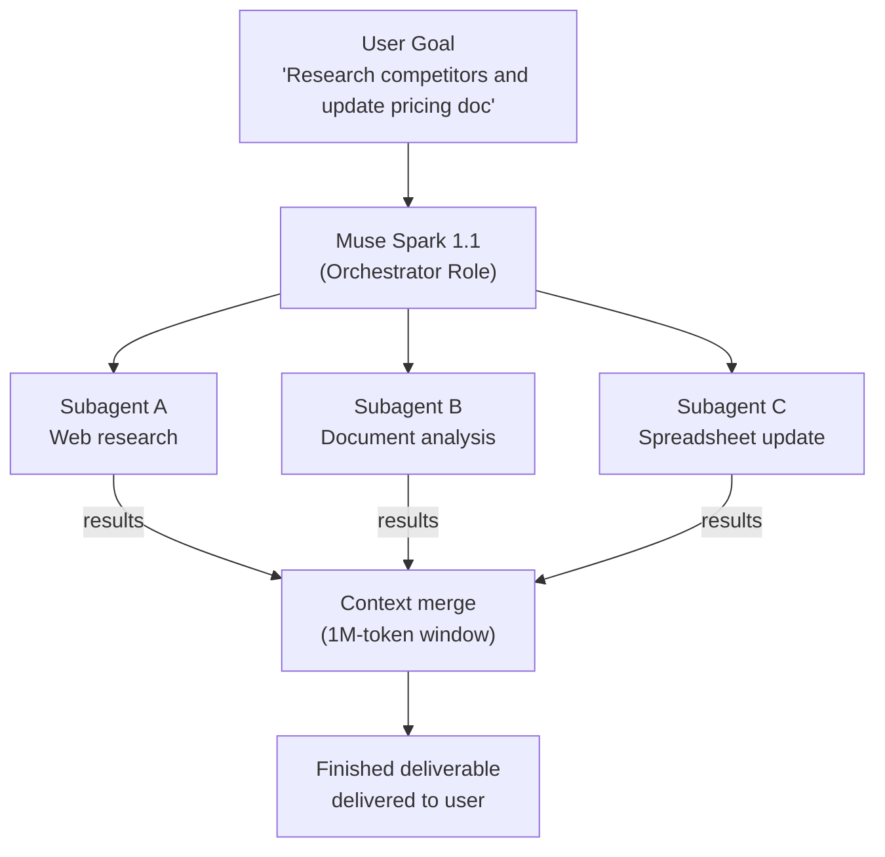
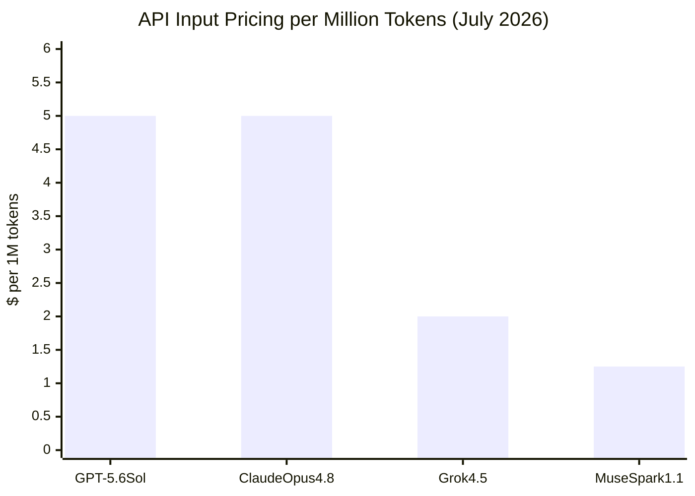

## The Company That Championed Open AI Just Closed Its Best Model

For years, Meta's AI strategy was built on a clear bet: give the weights away for free, and the developer ecosystem will build your moat for you. Llama 2, Llama 3, Llama 4 — each release became the most-downloaded open-weight model family on the planet, racking up 1.2 billion cumulative downloads by early 2026. Mark Zuckerberg published manifestos about open AI. Meta spent billions making the argument that openness was the right path for the industry.

Then, on April 8, 2026, Meta shipped its first closed-source AI model, Muse Spark 1.0. On July 9, 2026, it followed up with Muse Spark 1.1 — a significantly upgraded version, accompanied by the public preview of a paid developer API.

The reversal is real, and it matters. But what's even more interesting is *what kind of model* Meta chose to keep proprietary — and why it might be right to do so.

---

## Who Built This and Why It's Different

Muse Spark 1.1 comes from Meta Superintelligence Labs, a new internal division Meta stood up under Alexandr Wang, the former CEO of Scale AI, whom Meta brought on board in a deal valued at roughly $14.3 billion. Wang joined nine months before the launch of Muse Spark 1.0 and has led the team that built both versions.

This isn't the same team that shipped Llama. The Superintelligence Labs group operates with more independence, a different research agenda, and — crucially — a different business model in mind. While Llama continues to be developed and released as an open-weight model for researchers and the open-source community, the Muse Spark family is designed for a different audience: developers and enterprises who need the highest capability and are willing to pay API costs to get it.

Meta says it "hopes to open-source future versions" of Muse Spark. But for now, there are no weights to download. The architecture and parameter count are undisclosed.

---

## What Muse Spark 1.1 Is Actually Built For

Most AI benchmark discussions focus on coding: SWE-Bench scores, Terminal-Bench results, pass rates on algorithmic problems. And on those pure coding evaluations, Muse Spark 1.1 is competitive but not dominant — it scores 61.5% on SWE-Bench Pro, compared to Claude Opus 4.8's 69.2% and GPT-5.5's 58.6%.

But the release is positioned differently. Muse Spark 1.1 is built first and foremost as an *agentic* model — one designed to take actions, use tools, and complete long-horizon tasks with minimal human intervention. On that axis, the numbers tell a different story:

| Benchmark | Muse Spark 1.1 | Claude Opus 4.8 | GPT-5.5 |
|---|---|---|---|
| **MCP Atlas** (tool use) | **88.1** | 82.2 | ~80s |
| **JobBench** (professional tool use) | **54.7** | 48.4 | 38.3 |
| **Humanity's Last Exam** (with tools) | **62.1** | 57.9 | — |
| **Finance Agent v2** | **57.2** | — | — |
| SWE-Bench Pro (coding) | 61.5 | **69.2** | 58.6 |
| DeepSWE 1.1 | 53.3 | 59.0 | **67.0** |

The pattern is clear: Muse Spark 1.1 leads on tasks that require a model to interact with tools, navigate software interfaces, and coordinate over multiple steps. It trails on pure code-generation tasks where there's a correct answer to compare against.

This is a deliberate design choice, not a weakness. Tool use and computer use are exactly the capabilities that matter when an AI is doing real work in real environments — filling out forms, querying APIs, updating spreadsheets, orchestrating parallel subagents. Benchmark leaderboards measure the former more readily than the latter.

---

## The Agentic Architecture: Three Things That Actually Work Differently

### Computer Use That Decides Its Own Strategy

Muse Spark 1.1 doesn't just follow a script when interacting with software. It decides, in real time, whether to write a script for speed or to click through an interface directly. It generates batches of actions per reasoning step rather than deliberating over one click at a time — which dramatically reduces the number of model calls needed for a workflow.

Meta demonstrated this with a concrete example: the model uses video shot from a smartphone, extracts useful product photos, reasons about what to list, then opens a browser and creates a Facebook Marketplace listing autonomously. Another demonstration showed an agent placing a dinner-party order that notices updated context mid-task (a restaurant being closed, a guest's dietary change) and adjusts the order without user intervention.

### Multi-Agent Orchestration as a First-Class Capability

The model is designed to function both as an orchestrator and as a subagent. As the main agent, it gathers context, makes a plan, and delegates execution across parallel subagents. As a subagent, it understands its scope, uses only the tools it's been given, and knows when to escalate back to the main agent rather than guessing.

This two-mode design is significant because it means a single Muse Spark 1.1 deployment can serve as the brain of a multi-agent system *and* as one of the workers inside someone else's system. That composability is exactly what enterprise workflows need.

### Zero-Shot Tool Generalization

Most tool-use models are trained on a fixed set of tools and struggle when handed a new API schema they've never seen before. Muse Spark 1.1 is trained specifically to generalize — it reads a new tool schema and figures out how to use it correctly without additional fine-tuning.

This is what the top MCP Atlas score reflects. MCP Atlas isn't measuring performance on a known set of tools; it's measuring how well a model handles tools presented at runtime, including custom MCP servers and domain-specific APIs. An 88.1 on that benchmark means the model can be dropped into a new enterprise environment and start using its tools immediately — without retraining.

---

## Context Compaction: Managing a Million Tokens Actively

Muse Spark 1.1 ships with a 1-million-token context window — an upgrade from the roughly 260K tokens of the original Muse Spark. But what makes this interesting isn't just the size; it's how the model manages it.

The model performs what Meta calls *context compaction*: it actively summarizes earlier conversation history and completed task steps, keeping the critical information needed for later work while discarding what's no longer relevant. This lets it maintain coherent long-horizon task state without hitting the practical limits that plague simpler sliding-window approaches.

Think of it like a human project manager who doesn't try to hold every detail of a three-month project in working memory — they maintain a concise status doc that captures what matters, and they know what's safe to archive.

---

## The Pricing Play: A Quarter of the Competition's Cost

Here's the most immediate reason enterprise developers will pay attention: Muse Spark 1.1 is priced at **$1.25 per million input tokens and $4.25 per million output tokens**. New API accounts start with $20 in free credits.

For comparison, Claude Opus 4.8 costs $5/M input and $25/M output. GPT-5.6 Sol costs $5/M input and $30/M output. Muse Spark 1.1 is roughly one-quarter the input cost of either.

That gap matters in agentic workflows more than anywhere else. A single complex agent task can involve dozens to hundreds of model calls, each with substantial context. At competitive pricing, the cost difference between models becomes the difference between a product being economically viable and not.

The Meta Model API launched in public preview for US developers on July 9 — same day as the model release. EU availability is targeted for later in 2026, pending regulatory review. The API is self-serve: sign up on the Meta Developer Console, claim your $20 credits, and start building immediately.

---

## What About Llama?

The obvious question: does this mean Meta is abandoning open-source AI?

The answer appears to be no — but with a major asterisk. Meta has been explicit that Llama continues as the open-weight track, intended for researchers and developers who need local deployment, customization, and freedom from API costs. The Llama API was quietly retired in July 2026 (Meta now points developers to third-party hosts for inference), but new Llama model development continues.

What's changed is that Meta no longer believes its *frontier* model should be open. The capabilities in Muse Spark 1.1 — particularly the agentic behaviors, context compaction, and zero-shot tool generalization — represent significant engineering investment that Meta intends to monetize directly. The open-source frontier layer that Meta helped create in 2023–2024 is now being maintained by others: Chinese labs like Moonshot AI (with the just-released 2.8T-parameter Kimi K3), European research groups, and Google's Gemma team.

Meta's view seems to be: we proved that open AI was viable; now we're competing on the closed frontier where the economics are different.

---

## Where Muse Spark 1.1 Falls Short

The post wouldn't be complete without the honest part.

On SWE-Bench Pro (real GitHub issue resolution), Muse Spark 1.1 scores 61.5% — behind Claude Opus 4.8 at 69.2%. On DeepSWE 1.1, it scores 53.3%, behind both GPT-5.5 (67.0%) and Opus 4.8 (59.0%). For teams whose primary use case is complex code generation or autonomous software engineering, these numbers still favor Anthropic's and OpenAI's offerings.

The model's architecture and training methodology are also completely opaque — no technical report, no model card with weight details, no system card explaining safety mitigations (beyond a high-level preparedness report). For teams with compliance or auditability requirements, that's a real gap.

And the Meta Model API is US-only for now. Teams in Europe or Asia who want to use Muse Spark 1.1 in production have to wait.

---

## Why This Release Matters Beyond Meta

Muse Spark 1.1 is significant not just because it's a capable model with competitive pricing. It's significant because it marks a structural shift in how the AI model market is organized.

For two years, Meta played the role of open-source disruptor — forcing OpenAI and Anthropic to justify their prices against a free alternative that was nearly as good. That pressure drove down API costs across the industry and made AI accessible to a much wider range of developers.

Now Meta is on the other side of that trade. By entering the paid frontier market with a model that leads on agentic benchmarks at a fraction of the cost of its competitors, Meta is applying a different kind of pressure: not "why pay at all?" but "why pay four times as much for similar tool-use performance?"

The AI price war just got a new contestant — and this one has 3.3 billion daily active users to train against.

---

## Sources

- [Introducing Muse Spark 1.1 — Meta AI Blog](https://ai.meta.com/blog/introducing-muse-spark-meta-model-api/)
- [Introducing Muse Spark 1.1 — Meta AI Research](https://research.meta.ai/blog/introducing-muse-spark-meta-model-api)
- [Meta jumps into AI coding market in effort to chase Anthropic and OpenAI — CNBC](https://www.cnbc.com/2026/07/09/meta-jumps-into-ai-coding-market-to-chase-anthropic-and-openai.html)
- [Meta Muse Spark 1.1: Meta's First Paid Agent Model — Pricing, Benchmarks and Developer Impact — The Agent Report](https://the-agent-report.com/2026/07/meta-muse-spark-1-1-coding-agent-api-pricing/)
- [Meta Announces Muse Spark 1.1, Beats Claude Opus 4.8 And GPT 5.5 On Some Benchmarks — OfficeChai](https://officechai.com/ai/muse-spark-1-1-benchmarks/)
- [Meta prices Muse Spark 1.1 API at $1.25/$4.25 per M tokens — AI Weekly](https://aiweekly.co/alerts/meta-prices-muse-spark-11-api-at-125425-per-m-tokens)
- [Meta Just Went Closed Source. Here's Why That Changes Everything About AI — Miraflow](https://miraflow.ai/blog/meta-closed-source-muse-spark-changes-everything-ai-2026)
- [Meta debuts new AI model, attempting to catch Google, OpenAI after spending billions — CNBC](https://www.cnbc.com/2026/04/08/meta-debuts-first-major-ai-model-since-14-billion-deal-to-bring-in-alexandr-wang.html)
- [Muse Spark Safety & Preparedness Report — arXiv](https://arxiv.org/pdf/2606.12429)
- [Meta releases latest update of AI model Muse Spark as tech giant accelerates AI push under Alexandr Wang — Fortune](https://fortune.com/2026/07/09/meta-muse-spark-1-1-release-alexandr-wang-superintelligence-labs-mark-zuckerberg/)
