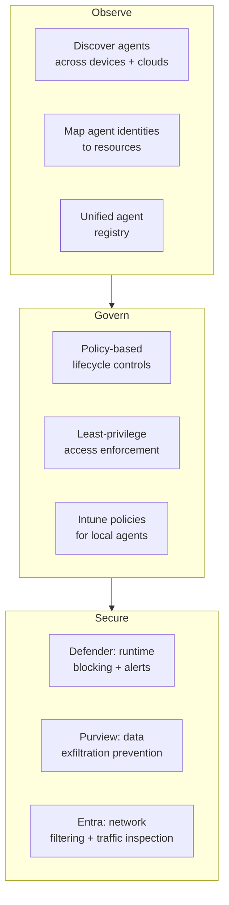
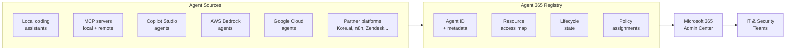

## The New IT Problem: Agents You Didn't Know You Had

For decades, enterprise IT knew how to count what it was responsible for: laptops, servers, user accounts, applications. You could audit the list, revoke access, enforce a policy. The perimeter was messy but bounded.

Then came AI agents.

Not just one or two. When a developer installs a coding assistant that reads source code and writes to a terminal, when a sales manager deploys a Copilot automation that reads CRM records and sends emails, when a data team runs a cloud agent that queries databases and files summary reports — each of those is a software process acting with real credentials, touching real data, running beyond the view of the security team.

This is **agent sprawl**: the uncontrolled proliferation of AI agents across an enterprise, each with partial visibility, partial access, and no consistent governance. It is, as Microsoft's security team put it, "an entirely new category of enterprise security risk."

Microsoft Agent 365, which reached general availability on May 1, 2026, is the industry's first purpose-built control plane for managing this problem at scale.

---

## What Is Microsoft Agent 365?

Agent 365 is not an AI assistant. It does not generate text or execute tasks. It is a **management and security platform** — a control plane that gives IT and security teams visibility into every AI agent running in their environment, the ability to set governance policies across them, and real-time protection against risky behavior.

Think of it as the thing that manages the things. Microsoft describes its purpose as helping organizations "observe, govern, and secure agents and their interactions" — whether those agents were built internally, deployed via Microsoft Copilot Studio, sourced from a vendor, or installed informally on an employee's laptop.

At general availability, Agent 365 is priced at **$15 per user per month** as a standalone add-on, or bundled into the new **Microsoft 365 E7** suite at $99 per user per month. E7 also packages Microsoft Copilot, the full Microsoft Entra Suite, and the M365 E5 security stack — Microsoft's all-in-one offering for AI-ready enterprises.

---

## The Three Pillars: Observe, Govern, Secure

Microsoft organizes the platform around three functions that map directly to the lifecycle of any IT risk:

**Observe** is the foundation. You cannot govern what you cannot see. Agent 365 discovers agents running on Windows endpoints via Microsoft Defender and Intune, surfaces cloud agents from AWS Bedrock and Google Cloud through a new registry sync feature, and builds an asset context map showing which identities, data stores, and cloud resources each agent can reach.

**Govern** is the policy layer. Once agents are visible, IT teams can assign ownership, enforce least-privilege access, set lifecycle states (active, paused, retired), and apply Intune policies to block unauthorized agent execution methods on managed devices.

**Secure** is real-time protection. Microsoft Defender monitors agent behavior at runtime and can block malicious patterns before data leaves the environment. Microsoft Purview's data-loss-prevention capabilities now extend to agent prompts — intercepting sensitive information before it reaches an AI model.

---

## Entra Agent ID: Giving Non-Humans an Identity

One of the most architecturally significant moves in Agent 365 is treating agents the same way enterprises already treat employees: with identity.

Every agent managed through Agent 365 is issued an **Entra Agent ID** — a unique identity in Microsoft Entra (formerly Azure AD) that enables the same governance mechanisms your IT team already uses for human accounts: access policies, audit logs, lifecycle management, and the ability to suspend or revoke credentials instantly.

This is a meaningful shift. An agent operating without a managed identity is effectively an anonymous process. There is no reliable way to know what data it accessed or when, and if something goes wrong, there is no clear trail. Entra Agent IDs bring agents into the same identity model as employees, which means existing security tooling — conditional access, privileged identity management, sign-in risk detection — extends to cover them naturally.

An analogy: it is the difference between a contractor who badges in through reception versus one who slips in through an unlocked side door. The work they do might look identical, but only the first one shows up in the audit log.

---

## The Registry: A Census of Your AI Workforce

The Agent 365 Registry is the operational hub of the platform — a centralized catalog of every agent in your tenant, its metadata, its assigned identity, and its connection to organizational resources.

At GA, the registry supports **more than 20 types of local agents**, including coding agents, AI desktop applications, and both local and remote Model Context Protocol (MCP) servers. Starting in June 2026, Microsoft Defender adds **asset context mapping** — for each agent in the registry, IT can see which devices host it, which MCP servers it connects to, which identities it uses, and which cloud resources those identities can reach.

The registry is not passive. IT admins can apply Intune policies directly from the admin center to block specific agents from running on managed devices. The GA announcement used the example of blocking all instances of a specific local coding agent across an organization's fleet — a one-step action rather than a manual per-device operation.

---

## Multi-Cloud: AWS and Google Cloud Are in Scope

A particularly notable move at GA is registry sync for non-Microsoft cloud platforms. Organizations running agents on **AWS Bedrock** or **Google Cloud Vertex AI** can now connect those platforms to Agent 365 — enabling auto-discovery of agents running on those services, inventory of the models they are built on, and basic lifecycle operations arriving in a near-future update.

This matters because most enterprise AI deployments are not pure Microsoft stacks. Shadow AI does not stay within one cloud, and a governance tool that only covers Microsoft-hosted agents would miss a large portion of the actual risk surface. By extending registry sync to AWS and Google Cloud, Agent 365 positions itself as a cross-platform control plane rather than a vendor-specific tool.

Integrations with major partner ecosystems — n8n, Kore.ai, Kasisto, Zendesk, NVIDIA, Adobe, and others — arrive pre-configured, meaning agents built on those platforms show up in the registry without requiring custom IT integration work.

---

## Windows 365 for Agents: Isolated Cloud PCs for Agentic Workloads

Announced alongside Agent 365 and reaching GA at Microsoft Build 2026 (June 2), **Windows 365 for Agents** provides a dedicated compute tier for agent workloads that need to operate inside full desktop and browser environments rather than through APIs alone.

Think of it as a Cloud PC whose occupant is an AI process. Each instance is Entra-joined, Intune-managed, and policy-enforced. Billing is pay-as-you-go by the hour, which makes it economical for burst workloads — for example, running hundreds of parallel agents simultaneously on a large data processing job, then shutting them all down when done.

The integration with Agent 365 means every agent running in a Windows 365 for Agents instance shows up in the registry, carries an Entra Agent ID, and is subject to the same governance and security policies as any other managed agent in the environment.

---

## What This Means for Enterprise IT

The arrival of Agent 365 at GA is a signal that the enterprise industry has formally accepted AI agent governance as an operational necessity, not a future concern.

**Shadow AI is now a defined problem class.** Unmanaged agents on employee devices — coding assistants reading source code, local LLM runtimes connected to internal databases — are formally categorized alongside shadow IT apps, and the tooling to address them exists. IT teams that were waiting for tooling before drafting governance policies now have it.

**Agent identity is the new user identity.** The Entra Agent ID model signals that access management practices organizations have built for humans extend naturally to agents. That is the right abstraction: an agent with write access to production systems needs the same scrutiny as a contractor with the same access.

**Multi-cloud sprawl is the default.** By building registry sync for AWS and Google Cloud, Microsoft acknowledges that no enterprise operates on a single platform. Useful agent governance has to span all of them — and will need to span more as the agent ecosystem grows.

**Governance is now a budget line item.** At $15 per user per month standalone — or absorbed into the E7 bundle — Agent 365 establishes that AI agent governance is a cost category in its own right, not something IT can absorb informally into existing tooling.

The broader arc is clear: AI agents are moving from experimental to operational in enterprise environments faster than most security teams anticipated. Agent 365 is Microsoft's answer to what IT infrastructure looks like when the workforce includes both humans and software processes. Whether competitors build comparable platforms or whether this becomes a structural Microsoft advantage will be one of the more consequential enterprise technology questions of the next two years.

---

## Sources

- [Microsoft Agent 365, now generally available, expands capabilities and integrations — Microsoft Security Blog](https://www.microsoft.com/en-us/security/blog/2026/05/01/microsoft-agent-365-now-generally-available-expands-capabilities-and-integrations/)
- [Microsoft Build 2026: Securing code, agents, and models across the development lifecycle — Microsoft Security Blog](https://www.microsoft.com/en-us/security/blog/2026/06/02/microsoft-build-2026-securing-code-agents-and-models-across-the-development-lifecycle/)
- [Get ahead of agent sprawl: manage and govern AI agents at scale — Microsoft Community Hub (Entra Blog)](https://techcommunity.microsoft.com/blog/microsoft-entra-blog/get-ahead-of-agent-sprawl-manage-and-govern-ai-agents-at-scale/4513160)
- [What's New in Agent 365: May 2026 — Microsoft Community Hub](https://techcommunity.microsoft.com/blog/agent-365-blog/what%E2%80%99s-new-in-agent-365-may-2026/4516340)
- [Microsoft Agent 365 overview — Microsoft Learn](https://learn.microsoft.com/en-us/microsoft-agent-365/overview)
- [Microsoft takes Agent 365 out of preview as shadow AI becomes an enterprise threat — VentureBeat](https://venturebeat.com/technology/microsoft-takes-agent-365-out-of-preview-as-shadow-ai-becomes-an-enterprise-threat)
- [Microsoft Agent 365 Turns Shadow AI Into a Governed Asset Class — Futurum Research](https://futurumgroup.com/insights/microsoft-agent-365-turns-shadow-ai-into-a-governed-asset-class/)
- [Microsoft's new cloud PCs place AI agents under enterprise controls — Help Net Security](https://www.helpnetsecurity.com/2026/05/28/microsoft-windows-365-for-agents-ai-automation/)
- [Secure agentic AI for your Frontier Transformation — Microsoft Security Blog](https://www.microsoft.com/en-us/security/blog/2026/03/09/secure-agentic-ai-for-your-frontier-transformation/)
- [Agent 365: Microsoft's Enterprise AI Control Plane explained — Rob Quickenden's Blog](https://robquickenden.blog/2026/03/agent-365-nears-ga/)
