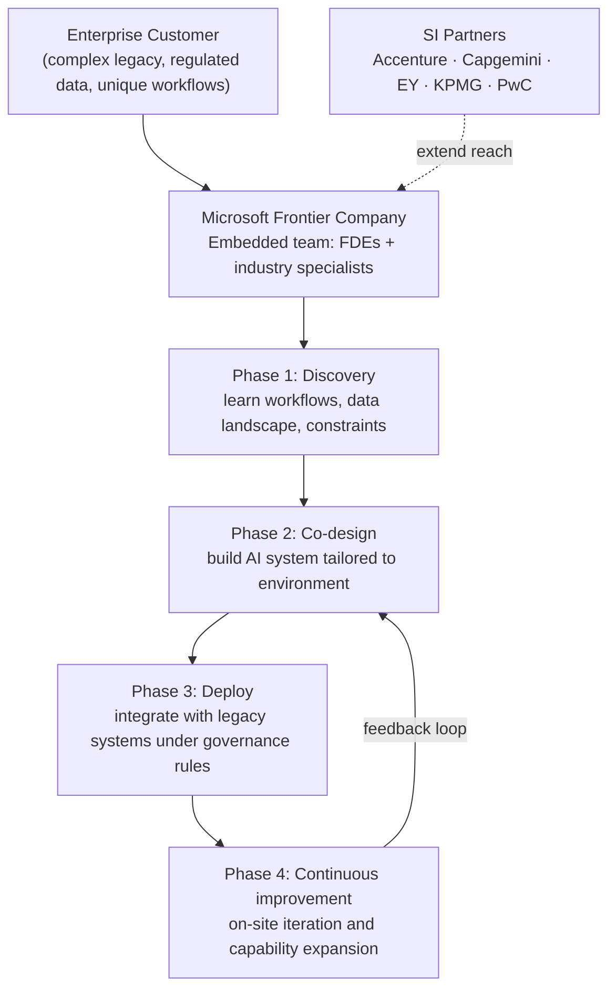

## The Pilot That Never Graduates

Ask any enterprise software buyer what 2024 and 2025 felt like, and you'll hear some version of the same story. Enthusiastic AI pilots. Impressive demos. Promising early results. And then — a wall.

The numbers make the pattern concrete. According to a 2026 Writer enterprise survey, **79% of organisations face significant challenges scaling AI** despite high levels of investment, and that figure is up double digits from 2025. A separate Deloitte report found that **97% of enterprises struggled to demonstrate real business value** from their early generative AI projects. Gartner expects **over 40% of agentic AI projects to be cancelled by 2027**.

The models themselves aren't the problem. GPT-5.5, Claude Opus 4.8, Gemini 3.1 Pro — all of these are genuinely remarkable. What they can't do on their own is navigate a decade of undocumented legacy integrations, understand why a particular finance team has an unusual approval workflow, or know which data is safe to surface and which sits under a regulatory hold.

That gap — between what a model can theoretically do and what it can actually do in a specific organisation — has become the defining challenge of enterprise AI in 2026. And this week, the AI industry made a collective multi-billion-dollar bet on how to close it.

---

## A Technique Borrowed From Intelligence Work

The solution isn't new. Palantir invented it in 2005 for a customer whose requirements couldn't be written in a statement of work: the CIA.

Intelligence analysts couldn't openly describe what they needed, couldn't share classified schemas with vendor engineers, and couldn't evaluate "working software" in a contractor's demo room. Palantir's answer was to send its own engineers inside the agency's walls. Instead of delivering a product and walking away, these engineers worked alongside analysts, learned the tradecraft, and built systems against real operational data in real time.

Palantir called these people Forward Deployed Engineers, or FDEs. The role is closer to embedded co-developer than consultant: you're not advising, you're building — inside the customer's environment, under their constraints, with their people. Until 2016, Palantir had more FDEs than pure software engineers at headquarters. The model produced roughly $2.87 billion in 2024 revenue.

Now the rest of the AI industry is copying it, at scale and with urgency.

---

## Microsoft Goes All In: $2.5 Billion and 6,000 Engineers

On July 2, 2026, Microsoft announced **Microsoft Frontier Company**, a new operating business backed by a $2.5 billion investment and staffed with 6,000 engineers, trainers, and industry specialists. The sole mission: embed those people inside enterprise customers to co-design, deploy, and continuously improve AI systems.

The division will be led by Rodrigo Kede Lima, who spent the past six years leading Microsoft's enterprise business across the Americas and Asia. The team draws from existing Microsoft forward-deployed engineers, technical consultants, customer support staff, and salespeople who carry deep industry experience in finance, healthcare, manufacturing, retail, and professional services.

What makes the model work is specificity. General-purpose AI consultants often speak the language of AI but not the language of a pharmaceutical regulatory workflow or a commodities trading desk. Microsoft Frontier Company pairs AI engineering skills with genuine domain depth — a team working with a healthcare network will have people who understand ICD-10 coding, not just transformer architectures.

The division is also explicitly **model-agnostic**. Customers can choose from Microsoft's own AI portfolio, third-party commercial models, or open-source alternatives. Customer data and IP are ring-fenced and cannot be used to train Microsoft's models. For enterprises that have spent two years worrying about data sovereignty, that last point matters.



Early customers already working with this model include **LSEG** (the London Stock Exchange Group), where Microsoft's engineers helped embed AI directly into LSEG Workspace, enabling finance professionals to ask complex questions across structured and unstructured financial content in real time. Unilever, Novo Nordisk, and Land O'Lakes are also cited as early Frontier Transformation partners.

---

## A Race Now Worth $9 Billion

Microsoft didn't invent this idea in 2026 — and it isn't alone in betting on it.

Two days before Microsoft's announcement, **Amazon Web Services committed $1 billion** to its own Forward Deployed Engineering organisation. The AWS model differs slightly: rather than using a joint venture, Amazon deploys its own engineers directly, planning to scale the team into the thousands through a combination of hiring and internal transfers.

In May 2026, both **OpenAI** and **Anthropic** launched dedicated FDE joint ventures. OpenAI's venture is valued at $4 billion; Anthropic's at $1.5 billion. Both pair the AI lab's model expertise with implementation partners who can operate inside regulated enterprise environments.

Add Microsoft and Amazon, and the industry has committed an estimated **$9 billion** in aggregate to enterprise AI deployment this year — at a time when frontier models themselves are getting cheaper, not more expensive.

```mermaid
quadrantChart
    title Enterprise AI FDE Initiatives (2026)
    x-axis "Capital Committed (low → high)" 0 --> 4
    y-axis "Team Scale (small → large)" 0 --> 10
    quadrant-1 "Big bet"
    quadrant-2 "Well-resourced"
    quadrant-3 "Targeted"
    quadrant-4 "Lean"
    Microsoft Frontier Co: [0.83, 1.0]
    OpenAI FDE JV: [1.0, 0.42]
    Amazon AWS FDE: [0.25, 0.57]
    Anthropic FDE JV: [0.38, 0.35]
```

When four of the five largest AI players simultaneously redirect capital away from model development and toward implementation services, they are sending a clear signal: **model quality is no longer the primary buying criterion**. The companies that win enterprise contracts in the next 18 months will be those that make AI work inside actual organisations, not just inside benchmarks.

---

## Why Implementation Is So Hard

It's worth pausing on why this is difficult, because the answer isn't obvious.

Enterprise AI fails for three broad reasons. First, **data quality**. Seventy-three percent of organisations report data quality as their biggest implementation challenge. Corporate data is rarely the clean, well-labelled corpus that models train on. It's scattered across ERPs, CRMs, SharePoint sites, email archives, and spreadsheets with undocumented schemas. Before an AI agent can help a procurement officer, someone has to understand — and often fix — the data it will reason over.

Second, **integration complexity**. Most enterprises run on systems that were not designed for real-time AI inference. An AI that can answer a question about inventory needs to query live ERP data, apply business rules that vary by region, and return a result in under two seconds. Wiring that together requires engineering depth that most internal IT teams are still building.

Third, **organisational and governance friction**. Which outputs can the AI share with external parties? Which data is subject to GDPR or HIPAA? Who approves a workflow change when the AI suggests restructuring an approval chain? These questions don't have technical answers — they require people who understand both the AI system and the corporate context.

FDEs exist precisely to navigate that third layer. They're not just engineers; they're translators between what the model can do and what the organisation is ready to do.

---

## What This Means for Enterprise Buyers

If you're on the procurement side of an AI decision in 2026, the emergence of FDE units at every major AI lab changes the calculus in a few useful ways.

**You have more leverage.** When Microsoft, Amazon, OpenAI, and Anthropic are all competing for your implementation contract, you can negotiate on terms you couldn't have six months ago — model choice, data governance commitments, and pricing.

**Beware of platform lock-in.** FDEs from a single vendor will naturally favour that vendor's model stack. Microsoft Frontier Company's "model-diverse" framing is worth noting, but the SI partnerships (Accenture, KPMG, etc.) also have preferred-vendor relationships. Choose an implementation approach that leaves you room to switch models as the market evolves.

**Internal skill-building matters more, not less.** FDEs accelerate your first deployment; they don't replace the need for internal AI fluency. The organisations getting the most from early FDE partnerships are those that treat the engagement as a knowledge-transfer exercise, not a managed service.

---

## The Broader Signal

There's a historic parallel here that's worth naming. In the 1990s, enterprise software companies — SAP, Oracle, PeopleSoft — sold complex systems and then spawned a massive ecosystem of implementation consulting firms to make those systems work. The consulting tail became as large as the product companies themselves.

We may be watching the same pattern play out with AI, compressed into a two-year window. The difference is that this time the model-makers are trying to own the implementation layer themselves, rather than ceding it to Accenture and Deloitte from the start.

Whether that bet pays off depends on whether FDE units at AI labs can scale the domain expertise that makes them effective. Palantir spent 15 years building that capability. Microsoft, Amazon, OpenAI, and Anthropic are all trying to build it in 15 months.

The winner won't necessarily be the company with the best model. It may be the company that figures out how to put the right engineer, with the right domain knowledge, in the right customer's building — at scale.

---

## Sources

- [Microsoft Frontier Company: AI engineering that amplifies and protects your intelligence — Microsoft Blog](https://blogs.microsoft.com/blog/2026/07/02/microsoft-frontier-company-ai-engineering-that-amplifies-and-protects-your-intelligence/)
- [Microsoft commits $2.5 billion and 6,000 employees to new AI implementation unit — CNBC](https://www.cnbc.com/2026/07/02/microsoft-commits-2point5-billion-6000-employees-ai-implementation-unit.html)
- [Microsoft unveils $2.5B 'Frontier Company' to embed AI engineers inside customers — GeekWire](https://www.geekwire.com/2026/microsoft-announces-2-5b-frontier-company-to-embed-ai-engineers-inside-customers/)
- [Microsoft Frontier Company launches with 6,000 engineers, $2.5B — Yahoo Finance](https://finance.yahoo.com/technology/ai/articles/microsoft-frontier-company-launches-6-144023214.html)
- [Amazon launches new $1 billion FDE org, following OpenAI and Anthropic — TechCrunch](https://techcrunch.com/2026/06/30/amazon-launches-new-1-billion-fde-org-following-openai-and-anthropic/)
- [AWS puts $1 billion into new AI unit to embed engineers with customers — CNBC](https://www.cnbc.com/2026/06/30/aws-amazon-ai-forward-deployed-engineers.html)
- [Anthropic and OpenAI are both launching joint ventures for enterprise AI services — TechCrunch](https://techcrunch.com/2026/05/04/anthropic-and-openai-are-both-launching-joint-ventures-for-enterprise-ai-services/)
- [Why Microsoft, Amazon, OpenAI and Anthropic are embedding thousands of engineers inside customer offices — Storyboard18](https://www.storyboard18.com/trending/why-microsoft-amazon-openai-and-anthropic-are-embedding-thousands-of-engineers-inside-customer-offices-103097.htm)
- [How Palantir Invented the Forward Deployed Engineer Model — FDE Academy](https://fde.academy/blog/how-palantir-invented-the-forward-deployed-engineer-model)
- [Enterprise AI adoption in 2026: Why 79% face challenges despite high investment — Writer](https://writer.com/blog/enterprise-ai-adoption-2026/)
- [Microsoft launches $2.5 billion Frontier Company to help enterprises move beyond AI pilots — Neowin](https://www.neowin.net/news/microsoft-launches-25-billion-frontier-company-to-help-enterprises-move-beyond-ai-pilots/)
- [Microsoft mobilizes 6,000 workers to help customers adopt AI — Bloomberg](https://www.bloomberg.com/news/articles/2026-07-02/microsoft-mobilizes-6-000-workers-to-help-customers-adopt-ai)
