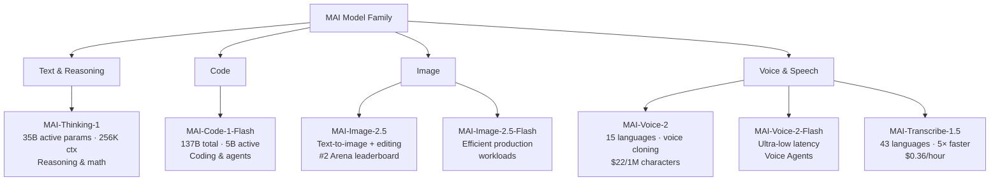
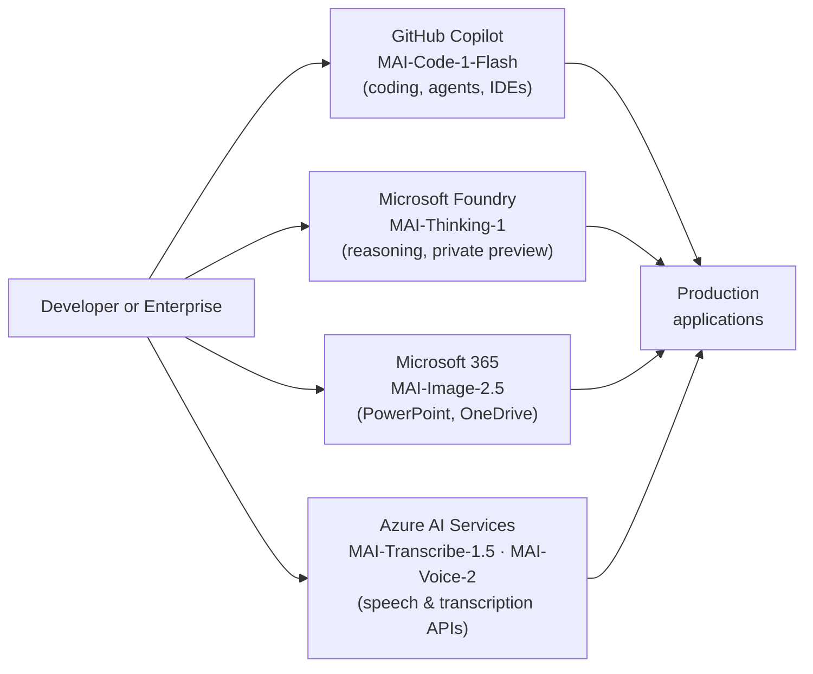

## The Partnership That Made Microsoft Nervous

For most of the past five years, Microsoft's AI strategy had a single load-bearing pillar: its relationship with OpenAI. Between 2019 and 2024, Microsoft committed north of $13 billion to the partnership, embedding GPT models into Bing, Azure, and Copilot. It was the most consequential bet on a single AI vendor in corporate history.

But a $3-trillion company running critical products on technology it does not control is an uncomfortable position. What happens if OpenAI raises prices? What if they ship a competing product? What if a geopolitical event makes the models inaccessible? Microsoft quietly started hedging — and at Build 2026, on June 2 in San Francisco, it showed the world what four years of internal model-building looks like.

The announcement: seven new AI models built entirely in-house by the **Microsoft AI Superintelligence Team**, none of which relied on outputs, weights, or architecture from OpenAI or Anthropic.

---

## Why "Zero Distillation" Is the Headline

Most smaller AI models cheat a little. A technique called *knowledge distillation* lets a small model learn by imitating a bigger one — you feed the small model the outputs of a larger "teacher" model, and it picks up the teacher's patterns faster than if it learned from raw data alone. It is a legitimate and widely-used approach. It also creates a dependency: the student inherits the teacher's biases, quirks, and legal entanglements.

Microsoft's seven MAI models are explicitly trained with **zero distillation from any third-party model**. Every example in the training corpus is commercially licensed and curated in-house. That is not just a legal precaution; it means the models are truly Microsoft's IP, inspectable and customizable without limits that a licensor might impose.

Mustafa Suleyman, CEO of Microsoft AI and the architect of the MAI strategy, framed the goal as *self-sufficiency*, not a break from OpenAI. The partnership continues; GPT models remain available on Azure. But Microsoft is no longer betting the house on a vendor's continued cooperation.

---

## The Seven Models at a Glance

The MAI family spans four modalities and several capability tiers:

Each model fills a distinct slot. Rather than one "do everything" model, Microsoft is assembling a system — a deliberate design choice that lets different components improve independently.

---

## MAI-Thinking-1: The Reasoning Engine

The most strategically significant model in the announcement is **MAI-Thinking-1**, Microsoft's first in-house reasoning model.

Reasoning models — popularized by OpenAI's o-series and Anthropic's extended-thinking Claude variants — allocate additional compute to *think through* a problem before answering, rather than replying in a single pass. The result is dramatically better performance on tasks that require multi-step logic: math proofs, code debugging, research synthesis, legal analysis.

MAI-Thinking-1's architecture:

- **35 billion active parameters**, implemented as a sparse Mixture-of-Experts (MoE) model
- **256,000-token context window** — long enough to hold an entire small codebase or a book-length document
- Trained on commercially licensed data, with no third-party model outputs in the training pipeline

On benchmarks, the numbers are striking for a mid-sized model:
- **97.0% on AIME 2025** (the American Invitational Mathematics Examination, a standard test for reasoning model quality)
- **94.5% on AIME 2026**
- Matches **Claude Opus 4.6 on SWE-bench Pro** for software engineering tasks
- Preferred over Claude Sonnet 4.6 in blind human evaluations run by Surge, an independent ratings firm

The Mixture-of-Experts design is key to the efficiency story. In a dense model, every parameter activates for every token. In a sparse MoE model, only a fraction of the total parameters engage per forward pass. MAI-Thinking-1 has 35 billion *active* parameters, meaning around 35 billion fire at once during inference — but it likely has a much larger total parameter pool from which experts are dynamically selected. You get the knowledge of a much bigger model at the cost of a smaller one.

At launch, MAI-Thinking-1 entered private preview on **Microsoft Foundry**, accessible by request. It supports function calling, multi-layered instruction following, and is compatible with the standard Chat Completions API.

---

## MAI-Code-1-Flash: The Developer's Daily Driver

Where MAI-Thinking-1 is the heavy hitter for hard problems, **MAI-Code-1-Flash** is designed for the volume work developers actually do most of the time: autocomplete, inline suggestions, small refactors, answering questions about unfamiliar code.

The architecture is also MoE, but the numbers look different:

| Specification | Value |
|---|---|
| Total parameters | 137 billion |
| Active parameters per pass | ~5 billion |
| Context window | 256,000 tokens |
| SWE-bench Pro score | 51.2% |
| Claude Haiku 4.5 for comparison | 35.2% |
| Token efficiency advantage | ~60% fewer tokens on SWE-bench Verified |
| API price (input / output) | $0.75 / $4.50 per million tokens |

The 137B-total / 5B-active design is the efficiency trick: a very large knowledge base, but cheap to query because most of it is idle at any moment. Think of it like a reference library where you can pull any book, but you only read one chapter at a time.

MAI-Code-1-Flash was also trained *inside* GitHub Copilot's production environment rather than evaluated against it after the fact. The training data reflected real developer interactions, which is unusual enough to be notable — most models are trained on public code repositories, then dropped into an IDE context that looks quite different from their training distribution.

The model launched June 2 across all Copilot plans (Free, Pro, Pro+, Max) and expanded to Copilot CLI, the cloud agent, Visual Studio, JetBrains IDEs, Eclipse, Xcode, and GitHub Mobile on June 18. At $0.75 per million input tokens, it is one of the cheapest competent coding models available.

---

## The Multimodal Stack: Image, Voice, and Transcription

The remaining five models address adjacent tasks:

**MAI-Image-2.5** handles text-to-image generation and image editing. At launch, it ranked second on the Chatbot Arena image editing leaderboard, ahead of Google's Nano Banana 2 Pro. It went live in PowerPoint first, with OneDrive integration rolling out shortly after. A Flash variant (MAI-Image-2.5-Flash) targets high-volume production workloads where cost and speed matter more than maximum fidelity.

**MAI-Transcribe-1.5** is positioned as the world's fastest and most accurate transcription model, with support for 43 languages and domain-specific vocabulary — meaning it can correctly transcribe medical terms, legal jargon, or engineering abbreviations out of the box. The claimed speed advantage is 5× over comparable models, and pricing starts at $0.36 per hour of audio.

**MAI-Voice-2** generates natural-sounding speech across 15 languages and can clone a voice from a short sample, a capability that ships with strict misuse safeguards. It is priced at $22 per million characters. A Flash variant (MAI-Voice-2-Flash) reduces latency to the sub-100ms range needed for real-time conversational voice agents.

Together, these five models give Microsoft a complete in-house stack for building multimodal applications — no third-party APIs required for any of the major modalities.

---

## Humanist Superintelligence: What Microsoft Thinks AI Should Be

The model announcements were framed by a philosophical statement that Mustafa Suleyman called **Humanist Superintelligence** (HSI).

The core claim is that AI capability and human-centrism are not in tension — they are the correct pair of design goals. Specifically, HSI means building AI that:

- Is domain-specific and problem-oriented rather than unbounded
- Maintains human oversight and accountability
- Accelerates human capabilities rather than replacing human judgment
- Remains calibrated within limits set by the humans deploying it

This is a pointed contrast with two other framings in the industry. One school (associated with some AGI researchers) treats advanced AI as a necessarily autonomous agent that humans should learn to work *with*. Another treats superintelligence as an existential risk to be contained or slowed. Microsoft's framing argues for a third path: accelerate capability, but keep humans in the loop by design rather than by hope.

Whether this philosophy survives contact with competitive reality remains to be seen. But it does reflect the practical constraint Microsoft faces as a company that sells AI to risk-averse enterprises: businesses need AI systems they can audit, override, and be held accountable for. "Humanist Superintelligence" is partly a product philosophy and partly a pitch to CISOs.

---

## One More Thing: Majorana 2

Tucked into the Build keynote alongside the MAI models was an update on Microsoft's quantum computing program: **Majorana 2**, the second generation of Microsoft's topological quantum chip.

The headline stat is a 1,000-fold improvement in qubit reliability over the first generation, with a mean qubit lifetime of 20 seconds and instances reaching up to one minute. Microsoft achieved this by replacing aluminum with lead in the superconducting material stack and redesigning the semiconductor structure.

The AI connection: Microsoft says its quantum team used **Microsoft Discovery** — the company's agentic AI research tool — to manage experimental workflows, automate measurements, optimize fabrication processes, identify flaws, and propose new material configurations. The AI did not design the chip, but it substantially accelerated the research loop. Microsoft now expects to achieve a fault-tolerant, scalable quantum computer by 2029, half its original timeline.

Majorana 2 is not a product available to developers today, but it illustrates what Microsoft means when it says AI should serve human researchers: the quantum team is experimenting faster because they have an AI running their instrument workflows while they sleep.

---

## What This Means If You Build on Microsoft's Stack

For developers and enterprises, the practical upshot is straightforward:

You no longer need to leave Microsoft's platform to access competitive models. And if you are building applications where data sovereignty, audit trails, or regulatory compliance matter, the "no third-party distillation" story becomes a genuine selling point — you can trace the provenance of the model's training all the way back to commercially licensed data Microsoft controls.

The multi-model strategy also means you can route requests dynamically: use MAI-Code-1-Flash for autocomplete at scale, escalate to MAI-Thinking-1 for the hard problems, and fall back to GPT-5.x when you need the OpenAI ecosystem. Microsoft Foundry presents all of these through a unified API.

---

## The Bigger Picture

The MAI announcement at Build 2026 is worth situating in the broader AI landscape of mid-2026: OpenAI shipped GPT-5.6 Sol, Terra, and Luna; SpaceXAI launched Grok 4.5; Anthropic released Claude Fable 5 and Sonnet 5; and Apple rebuilt Siri on Google Gemini. The AI model market has never been more competitive — or more fragmented.

Microsoft's move is a vote for vertical integration. Rather than being a distributor of other companies' models, it wants to be the company that *builds* the models running in every Microsoft product. The MAI team shipped seven models in a single event. If they can keep that velocity, the dependency on OpenAI that once seemed like a strength may quietly become a legacy arrangement.

Satya Nadella called the week of Build 2026 "the most ambitious set of announcements in Microsoft's history." Whether that holds up over time, the MAI models represent something concrete: a $3-trillion company decided it needed to learn how to train frontier AI models itself. It did, and it isn't done.

---

## Sources

- [Microsoft Build 2026: MAI keynote transcript — Microsoft AI](https://microsoft.ai/news/microsoft-build-2026-mai-keynote-transcript/)
- [Building a hill-climbing machine: Launching seven new MAI models — Microsoft AI](https://microsoft.ai/news/building-a-hillclimbing-machine-launching-seven-new-mai-models/)
- [Towards Humanist Superintelligence — Microsoft AI](https://microsoft.ai/news/towards-humanist-superintelligence/)
- [Introducing MAI-Code-1-Flash — Microsoft AI](https://microsoft.ai/news/introducingmai-code-1-flash/)
- [MAI-Code-1-Flash is now available for GitHub Copilot — GitHub Changelog](https://github.blog/changelog/2026-06-02-mai-code-1-flash-is-now-available-for-github-copilot/)
- [Microsoft Build 2026: MAI-Thinking-1 Is First In-House Reasoning Model, Trained Without OpenAI Data — TechTimes](https://www.techtimes.com/articles/317631/20260602/microsoft-build-2026-mai-thinking-1-first-house-reasoning-model-trained-without-openai-data.htm)
- [Microsoft unveils new AI models to lessen reliance on OpenAI and lower costs for developers — CNBC](https://www.cnbc.com/2026/06/02/microsoft-unveils-new-ai-models-lessen-reliance-on-openai-lower-costs.html)
- [Microsoft AI chief says company was "set free" from OpenAI to pursue superintelligence — VentureBeat](https://venturebeat.com/technology/microsoft-ai-chief-says-company-was-set-free-from-openai-to-pursue-superintelligence)
- [Majorana 2, made more reliable with Microsoft Discovery agentic AI — Microsoft News](https://news.microsoft.com/source/features/innovation/majorana-2-microsoft-discovery-agentic-ai/)
- [New MAI models in Microsoft Foundry across text, image, voice, and speech — Microsoft Community Hub](https://techcommunity.microsoft.com/blog/azure-ai-foundry-blog/new-mai-models-in-microsoft-foundry-across-text-image-voice-and-speech/4524632)
- [Microsoft AI CEO outlines hopes to build "humanist superintelligence" — TechRadar](https://www.techradar.com/pro/we-need-an-ai-that-places-humanity-first-microsoft-ai-ceo-outlines-hopes-to-build-humanist-superintelligence-and-has-seven-new-models-to-help-him-do-it)
