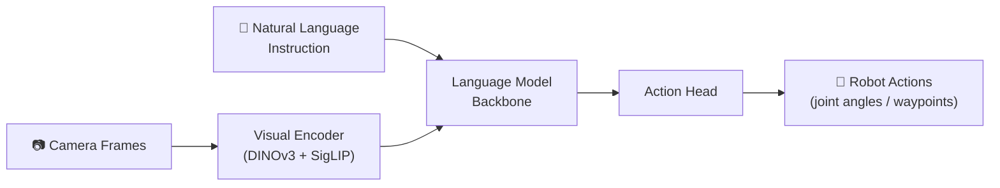
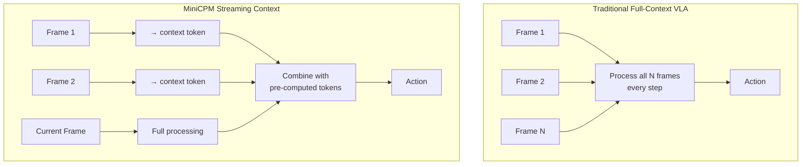
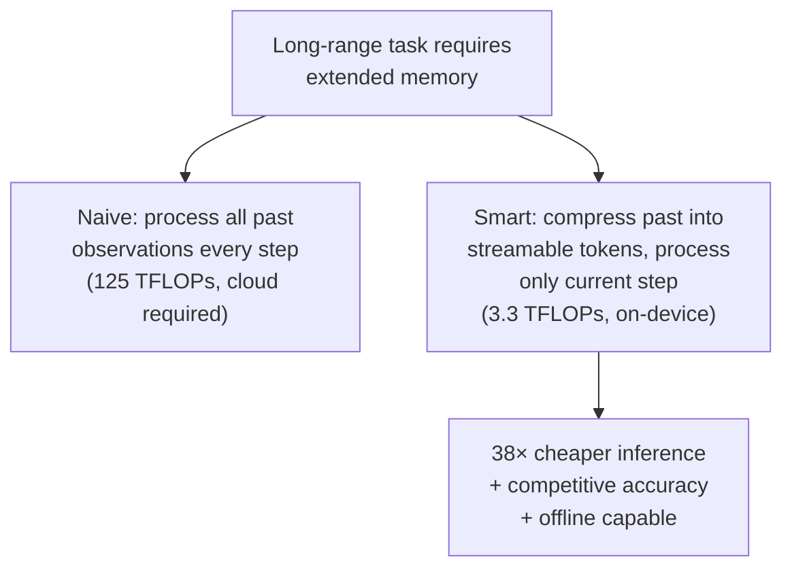

## The Rule Everyone Thought Was Unbreakable

For most of the past two years, the working assumption in robotics AI was straightforward: bigger foundation models produce better robot behavior. A 7-billion-parameter vision-language-action model will beat a 3-billion-parameter one, all else being equal. A 3B will beat a 1.5B. The logic mirrored what the NLP community believed about language models before DeepSeek and Gemma rewrote those rules.

On July 19, 2026, at the World Artificial Intelligence Conference in Shanghai, OpenBMB dropped a result that breaks this assumption again — this time in robotics.

Their new **MiniCPM-RobotManip** model, a 1.5-billion-parameter vision-language-action (VLA) model, outperformed both Google's **π₀.₅** (3B parameters) and Alibaba's **Qwen-VLA** (5B+ parameters) across representative robotic manipulation evaluations. On RMBench — a benchmark specifically measuring a robot's ability to use long-range visual memory during tasks — MiniCPM-RobotManip scored **53**, while π₀.₅ scored roughly **10**.

Same benchmark. One-third of the parameters. Five times the score.

The companion model, **MiniCPM-RobotTrack** (0.9B), runs fully on-device for embodied target-following with no cloud connection — a first for a model of this capability.

---

## What Is a Vision-Language-Action Model?

Before diving into the architecture, it helps to understand what a VLA model actually does.

A traditional robot brain consists of three distinct modules: one that perceives the scene (computer vision), one that decides what to do (a planner or policy network), and one that converts decisions into motor commands (a controller). These modules are trained separately and stitched together at runtime. The hand-offs between them are brittle, and each module has its own representation of the world.

A **Vision-Language-Action model** collapses all three into a single neural network. The model takes raw camera frames and a natural-language instruction as input, and outputs the robot's next action (joint angles, gripper state, velocity commands) directly. The shared internal representation means the model can connect what it sees ("the cup is tipping") with what it was told ("pour into the bowl without spilling") and what it should do (compensate with wrist angle) — in a unified forward pass.

The challenge with VLAs is that they're compute-hungry. Processing a full high-resolution frame through a large language model backbone every 100 milliseconds at robot operating frequencies requires a lot of GPU — too much to run on the robot itself. Most VLA systems today require a cloud server or a powerful workstation attached to the robot via cable or WiFi.

MiniCPM-Robot changes this through a combination of model size discipline and a key architectural trick: **streaming context**.

---

## The Streaming Context Trick

The single most important innovation in MiniCPM-RobotManip is how it handles visual history.

Robot tasks are rarely instantaneous. Picking up an object that rolls, assembling a part from multiple angles, navigating around a person who keeps moving — all of these require the robot to remember what it saw ten seconds ago, not just what it sees right now. Prior VLA models handled this by feeding a buffer of recent frames into the model in each forward pass. If the model needs 60 frames of context, it processes all 60 frames, every step. That's where the compute explodes.

MiniCPM-RobotManip introduces a **streaming context mechanism** that works differently. Rather than re-processing all historical frames at every step, the model compresses each processed frame into a compact **context token** and appends it to a running stream. At inference time, only the current frame is processed in full. Historical information arrives as these pre-computed context tokens — cheap to access, already compressed.

The numbers: full-context processing costs approximately **125 TFLOPs per step**. Streaming context costs **3.3 TFLOPs per step** — a **38× reduction** — while retaining up to **60 frames of visual history**, equivalent to one full minute of operation. The model doesn't forget; it just remembers more efficiently.

This efficiency is what makes on-device inference viable. PhyAI, the inference framework OpenBMB ships alongside MiniCPM-Robot, applies additional optimizations — CUDA Graph capturing and custom Triton fused kernels — that push throughput from **10 Hz to 37 Hz on an NVIDIA H20 GPU**. That's fast enough for fluid robot motion without needing a server.

---

## MiniCPM-RobotManip: One Policy, Every Task

Beyond the compute efficiency, the design philosophy of MiniCPM-RobotManip is worth understanding: it is a **generalist policy**.

Most manipulation models are trained per-task. You fine-tune one model for grasping, another for pouring, another for assembly. Switching tasks requires swapping checkpoints. The generalist approach trains a single set of weights to handle all downstream tasks, using task descriptions provided at runtime in natural language.

This matters for deployment. A robot that can switch between tasks based on verbal instructions — without reloading a different model — is far easier to integrate into a real workflow. It also means the training data from different tasks can share representations, often improving performance on each individual task through the shared learning.

The benchmark that captures this most clearly is **RMBench**, which tests contextual memory across extended manipulation episodes. Tasks require the robot to remember where it placed an object, what it did with a tool two steps ago, or how the scene has changed since the start of the sequence. MiniCPM-RobotManip's score of 53 against π₀.₅'s score of ~10 reflects the streaming context mechanism directly: the larger model ran out of effective memory while the smaller, more efficient one retained a full minute of history.

---

## MiniCPM-RobotTrack: Following People With No WiFi

The second model in the series, **MiniCPM-RobotTrack** (0.9B), tackles a different problem: embodied target tracking. You want a robot to follow a specific person (or object) through an environment — maintaining the correct distance, adapting when the target turns or accelerates, and not getting confused when other people cross the path.

MiniCPM-RobotTrack is built on MiniCPM4-0.5B and uses a fusion of **DINOv3** and **SigLIP** visual features — two complementary encoders that together produce a rich, robust representation of the tracked subject. Instead of outputting raw velocity commands, the model predicts **eight future waypoints** as (x, y, yaw) tuples: a short trajectory rather than a single next action. This prediction horizon makes motion smoother and handles short occlusions gracefully, since the model has already planned the path around the momentary loss of sight.

Training uses **DAgger-style self-improvement**: the model is deployed in simulation, its failures are collected (crossings, rapid turns, multi-person intersections), and those hard cases are fed back into training automatically. This iterative process is what makes the model robust to the adversarial situations that trip up systems trained only on clean demonstrations.

The result: **5+ frames per second** on a Unitree Go2 EDU quadruped robot, with **~180ms end-to-end latency**, running entirely locally with no network dependency. The robot follows you through a building even if the WiFi goes out.

---

## The Open-Source Context

MiniCPM-Robot comes from **OpenBMB**, an open-source community created by Tsinghua University's Natural Language Processing Laboratory and Mianbi Intelligence (the commercial entity). The MiniCPM series — which started with small language models and has since expanded to multimodal and now robotic models — has accumulated **38 million total downloads** across GitHub and Hugging Face.

This open-source foundation matters in several ways. The weights are downloadable and modifiable. The training code, inference framework (PhyAI), and evaluation tools are all published. A researcher at a university with modest GPU resources can fine-tune MiniCPM-RobotManip on their specific robot and task in a way that simply isn't possible with closed systems like Google's Gemini Robotics 2 or most commercial robot AI stacks.

At WAIC 2026, Mianbi also showcased the broader commercial traction of its edge-side models: vehicles with MiniCPM-based intelligence have crossed 300,000 units in mass production, and the company's valuation exceeded 20 billion yuan. The robotics models represent the next frontier of that on-device edge strategy.

---

## Why This Keeps Happening

The pattern MiniCPM-Robot represents is now appearing across almost every subdomain of AI: a carefully designed, open, small model beats a larger, less optimized one by solving a specific architectural problem.

In language models, it was mixture-of-experts routing, per-layer embeddings, and hybrid attention that let 27B-parameter Gemma 4 match much larger models. In vision, it was efficient token compression that let small models process high-resolution images without blowing up memory. In robotics, it is streaming context that lets a 1.5B model maintain a full minute of visual memory more cheaply than a 3B model maintaining 10 seconds.

The common thread: **the naive solution to context is to recompute everything; the efficient solution is to cache, compress, and stream**. Each domain has its own version of this insight, and each time someone discovers it, the size required to reach frontier performance drops dramatically.

For anyone building with or on robots in 2026, MiniCPM-Robot is worth understanding in detail. The weights are available on Hugging Face, the code is on GitHub, and the PhyAI framework handles deployment. The larger lesson — that on-device, open, small-but-smart models are catching closed behemoths in real-world tasks — is one that's going to keep playing out.

---

## Sources

- [OpenBMB/MiniCPM-Robot — GitHub](https://github.com/OpenBMB/MiniCPM-Robot)
- [WAIC 2026: ModelBest Unveils MiniCPM-Robot Embodied AI Series — Gasgoo](https://autonews.gasgoo.com/articles/news/waic-2026-modelbest-unveils-embodied-ai-model-series-minicpm-robot-2079096405120483328)
- [openbmb/MiniCPM-RobotManip — Hugging Face](https://huggingface.co/openbmb/MiniCPM-RobotManip)
- [openbmb/MiniCPM-RobotTrack — Hugging Face](https://huggingface.co/openbmb/MiniCPM-RobotTrack)
- [AI Daily: Mianbi Intelligence Open-Sources MiniCPM-Robot — AIBase](https://news.aibase.com/daily/29723)
- [EAIDaily — July 20, 2026 — WoLoveAI](https://www.woloveai.cn/p/eaidaily20260720/)
- [China's On-Device AI Unicorn Mianbi Intelligence: Valuation Exceeds 20B Yuan — BigGo Finance](https://finance.biggo.com/news/d72da874-31be-4faa-a74c-84e0046720c7)
- [2026 WAIC: Embodied Intelligence Moves Beyond the Showcase Era — Moomoo](https://www.moomoo.com/news/post/73180254/2026-waic-in-depth-outlook-embodied-intelligence-moves-beyond-the)
