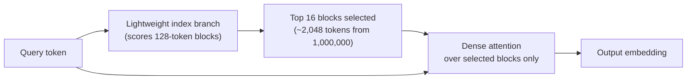
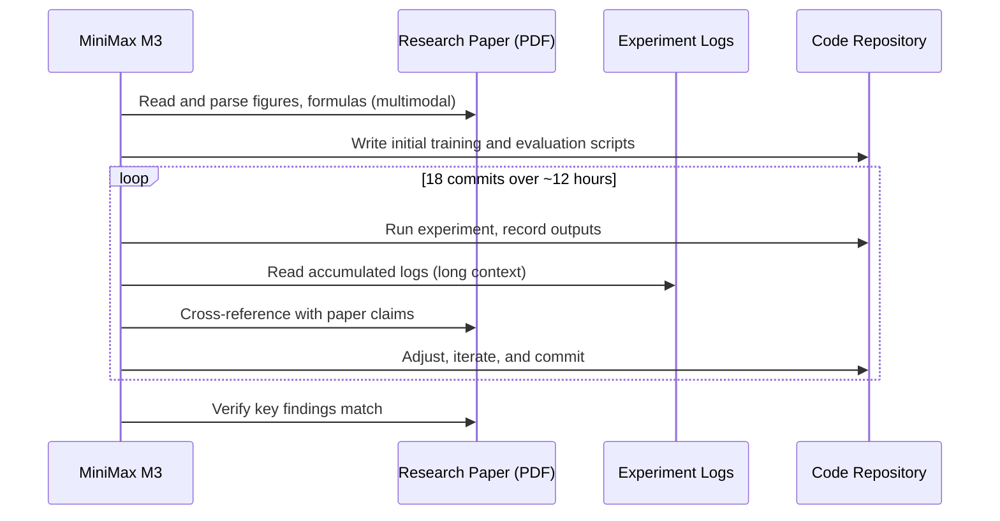

## The Problem with "Pick Any Two"

For most of AI's recent history, open-weight models faced a version of the classic design tradeoff: you could have a model with **frontier-level coding ability**, or one with a **very long context window**, or one with **native multimodal understanding** — but not all three, not in a single openly available checkpoint you could download and run yourself.

Proprietary models like Claude Opus 4.8 or GPT-5.5 achieved all three because they could deploy enormous compute without explaining how. Open-weight models had to make choices. Long context with full attention is expensive — the computational cost grows quadratically with context length. Native multimodality adds parameters. Frontier-grade coding requires massive training investment. Something always gave.

On June 1, 2026, MiniMax — a Shanghai-based AI lab founded in 2021 — released **MiniMax M3** and made a credible claim to solving all three at once: 59% on SWE-Bench Pro (ahead of GPT-5.5), a genuine 1-million-token context window, and native image, video, and desktop computer-use capabilities — all in a single open-weight model priced at roughly 5–10% of its proprietary equivalents.

The key that made it possible wasn't more compute. It was a new attention architecture.

---

## What Is MiniMax M3?

MiniMax M3 is a **428-billion-parameter Mixture-of-Experts (MoE)** model. MoE means only a fraction of its parameters are active during any given inference call — roughly 23 billion per token. Think of it like a hospital with dozens of specialist departments: the institution is large, but any individual patient visit only involves the relevant specialists. MoE design gives M3 enormous total capacity while staying computationally lean at runtime.

The model launched with weights available on Hugging Face under the MiniMax Community License, which permits non-commercial use freely and commercial use with attribution requirements above a revenue threshold. Three capabilities ship in a single checkpoint:

- **Agentic coding**: writing, debugging, and running code in long autonomous sessions
- **Long-context reasoning**: processing up to one million tokens of input simultaneously
- **Native multimodality**: accepting text, images, and video as input — and operating desktop computers as output

---

## The Architecture That Makes It Possible: MiniMax Sparse Attention

The 1-million-token context window is the feature that technically *should* be impossible at this price point, and explaining why requires a short detour into how transformer attention works.

Standard "full attention" lets a model relate any token in its context to any other token. That's powerful, but the compute cost scales quadratically: double the context, quadruple the compute. At one million tokens, full attention becomes prohibitively expensive for practical use. Most models claiming long contexts either truncate silently, use memory-compression techniques that lose precision, or simply run slowly and expensively.

MiniMax's solution is a new mechanism called **MiniMax Sparse Attention (MSA)**, described in an arXiv paper published alongside the model.

The core idea is a two-step approximation. Rather than asking "how does this current token relate to every one of the million previous tokens?", MSA first asks a cheaper question: "which *blocks* of the context are likely to be relevant?"

MSA divides the key-value cache into blocks of 128 tokens each. A lightweight scoring branch evaluates each block and selects the 16 most relevant ones per query. The model then does dense, precise attention only over those 16 blocks — roughly 2,000 tokens out of one million, or 0.2% of the total context.

Crucially, MSA operates on **uncompressed** key-values. Competing approaches like DeepSeek's Multi-head Latent Attention compress the keys and values before storage, which saves memory but introduces approximation error at the compression stage. MSA's block selection adds approximation at the *selection* stage, but the attention itself is exact: it reads real, uncompressed token representations from the blocks it picks. MiniMax built a custom kernel with exp-free top-k selection and contiguous memory access to make each block read efficient, so no block gets read twice.

The result is striking: compared to MiniMax's previous model M2, M3 achieves **9× faster prefill** and **15× faster decoding** at 1M token context, at **1/20th the per-token compute**. The paper formalizes this as a 28.4× reduction in per-token attention compute relative to standard full attention at 1M context, while performing on par with standard grouped-query attention on quality benchmarks.

---

## The Benchmarks: Where M3 Stands

### Coding

M3's headline result is **59.0% on SWE-Bench Pro**, a benchmark that tests whether a model can resolve real, unmodified GitHub issues in production repositories — not toy problems written for evaluations. The comparison:

| Model | SWE-Bench Pro | Type |
|---|---|---|
| Claude Opus 4.8 | 69.2% | Closed |
| GLM-5.2 | 62.1% | Open-weight |
| MiniMax M3 | 59.0% | Open-weight |
| GPT-5.5 | 58.6% | Closed |
| Gemini 3.1 Pro | 54.2% | Closed |

M3 and GLM-5.2 are the only open-weight models in that leaderboard tier. M3 also achieves 66% on Terminal-Bench 2.1 and 83.5% on BrowseComp.

A caveat worth keeping in mind: several results were obtained on MiniMax's own infrastructure with agent scaffolding tools including Claude Code and their internal Mini-SWE-Agent. Independent community replications are still ongoing, and scores from self-reported evals with bespoke scaffolding are generally treated as upper-bound estimates until reproduced externally.

### Computer Use

M3 scored **70.06% on OSWorld-Verified**, a benchmark for desktop computer automation that tests whether a model can complete real-world tasks — file management, web browsing, application use — in a sandboxed desktop environment. Allowing the model up to 200 actions (instead of 100) improved its score from 68.70% to 70.06%, which suggests M3 benefits from a larger action budget when tasks require self-correction.

### Long Context

With MSA, M3 maintains high retrieval accuracy even at its maximum 1M-token depth. This matters because many models with large claimed context windows degrade badly when the relevant information appears near the middle of a long document — the notorious "lost in the middle" problem. M3's block-selection mechanism explicitly addresses this by scoring blocks independently of position.

---

## The Most Striking Demonstration: Reproducing a Research Paper

To showcase all three capabilities working together, MiniMax tasked M3 with reproducing an **ICLR 2025 Outstanding Paper** award winner: *"Learning Dynamics of LLM Finetuning."*

The model ran autonomously for **nearly 12 hours**, producing **18 commits** and **23 experimental figures** without any human intervention.

The reproduction matched the paper's key results: the squeezing effect during SFT, the prediction-probability dynamics during DPO, and the Extend mitigation method the original authors proposed. What makes this demonstration notable is that it required all three headline capabilities simultaneously — multimodality to read curves and formulas from the paper's figures, long context to hold the full paper plus growing experiment logs in memory, and coding capability to write and run the experiments over a multi-hour session. Routing between specialist models at each step would have added latency, cost, and failure points.

---

## The Broader Context: A Wave of Open-Weight Frontier Models

M3 did not arrive in isolation. June 2026 saw an unusually dense cluster of frontier-competitive open-weight releases, mostly from Chinese AI labs:

| Model | Lab | Release | SWE-Bench Pro | Key angle |
|---|---|---|---|---|
| MiniMax M3 | MiniMax | June 1 | 59.0% | Integration: coding + 1M ctx + multimodal |
| GLM-5.2 | Z.ai | June 13 | 62.1% | Raw coding intelligence, MIT license |
| MiMo-V2-Pro | Xiaomi | Q2 2026 | — | Cost and throughput, most-used on OpenRouter |

Each model bets on a different strength. GLM-5.2 maximizes raw coding scores. MiMo-V2-Pro optimizes for price and request volume. M3's wager is **integration**: one checkpoint that handles documents, code, images, video, and desktop automation in a single inference call, with enough context to hold a multi-hour session in memory.

For agentic workflows specifically, that integration bet matters. An agent that needs to read a screenshot, consult documentation, update a codebase, and track state over hours of autonomous work is poorly served by switching between specialist models at each step. Each handoff adds latency and a potential failure point. A unified model that handles all of these natively, with a context window large enough to remember where it started, is architecturally cleaner.

---

## Pricing and Access

Via the MiniMax API, M3 is priced at **$0.30 per million input tokens and $1.20 per million output tokens** for requests up to 512K tokens, doubling to $0.60/$2.40 for the full 1M-token range (current promotional pricing). For comparison, GPT-5.5 costs roughly $2.50/$10.00 per million tokens — M3 at full 1M-token context costs approximately 5–10% of a comparable proprietary model.

For developers who want to self-host, weights are downloadable from Hugging Face (`MiniMaxAI/MiniMax-M3`). At 428B total parameters, this requires significant GPU infrastructure — multiple H100-class GPUs at minimum — but the option exists, which is the core distinction from any proprietary alternative. M3 is also available through OpenRouter, AMD Instinct GPUs (Day 0 support announced at launch), Fireworks AI, Together AI, and Qubrid AI.

---

## Why This Matters

The significance of M3 is less about any single benchmark and more about the end of a specific tradeoff. Until very recently, an open-weight model that could read a PDF, interpret a screenshot, write code to automate a desktop task, and maintain all of that context over a twelve-hour autonomous session simply did not exist. Researchers and developers who needed that combination had to use proprietary APIs, with the cost, vendor lock-in, and data-privacy constraints that entails.

MiniMax Sparse Attention is the specific technical contribution that breaks the constraint — not by adding more compute, but by making attention smarter about what it looks at. The arXiv paper is designed to let others replicate and build on it. If the approach generalizes (and the early results suggest it does), it has implications for any model facing the long-context scaling wall — which is most of them.

The open-weight frontier is no longer a meaningful step behind the proprietary one. It is arriving at roughly the same time, with weights you can download, on hardware you can control, at a price that changes what's economically feasible to build.

---

## Sources

- [MiniMax M3: Frontier Coding, 1M Context, Native Multimodality — MiniMax Blog](https://www.minimax.io/blog/minimax-m3)
- [MiniMax Sparse Attention — arXiv:2606.13392](https://arxiv.org/abs/2606.13392)
- [MiniMax M3: Open-weight model with a million-token context challenges proprietary leaders — The Decoder](https://the-decoder.com/minimax-m3-open-weight-model-with-a-million-token-context-challenges-proprietary-leaders/)
- [MiniMax Releases MiniMax M3 with MSA Architecture — MarkTechPost](https://www.marktechpost.com/2026/06/01/minimax-releases-minimax-m3-with-msa-architecture-supporting-1m-token-context-native-multimodality-and-agentic-coding/)
- [MiniMax-M3 debuts, eclipsing GPT-5.5 and Gemini 3.1 Pro for 5–10% of the cost — VentureBeat](https://venturebeat.com/technology/minimax-m3-debuts-eclipsing-gpt-5-5-and-gemini-3-1-pro-on-key-benchmark-performance-for-just-5-10-of-the-cost)
- [MiniMax teases M3 with new sparse attention and 15.6× response speed boost — VentureBeat](https://venturebeat.com/technology/minimax-teases-upcoming-m3-model-with-new-sparse-attention-mechanism-and-15-6x-response-speed-boost)
- [Serving MiniMax-M3 for efficient inference — Together AI Blog](https://www.together.ai/blog/serving-minimax-m3-for-efficient-inference-unlocking-1m-token-context-and-multimodality-without-regrets)
- [MiniMax M3 is live: long context + native multimodality at 1/20th the price — Fireworks AI Blog](https://fireworks.ai/blog/minimax-m3-launch)
- [MiniMaxAI/MiniMax-M3 — Hugging Face](https://huggingface.co/MiniMaxAI/MiniMax-M3)
- [MiniMax M3 — OpenRouter](https://openrouter.ai/minimax/minimax-m3)
