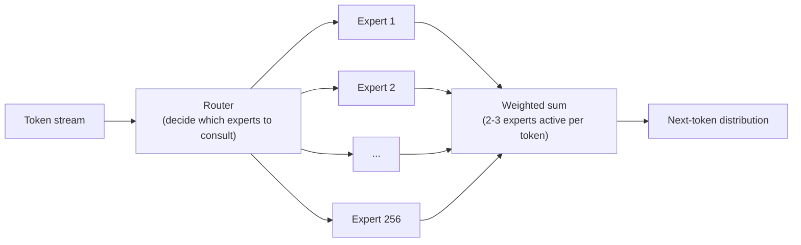
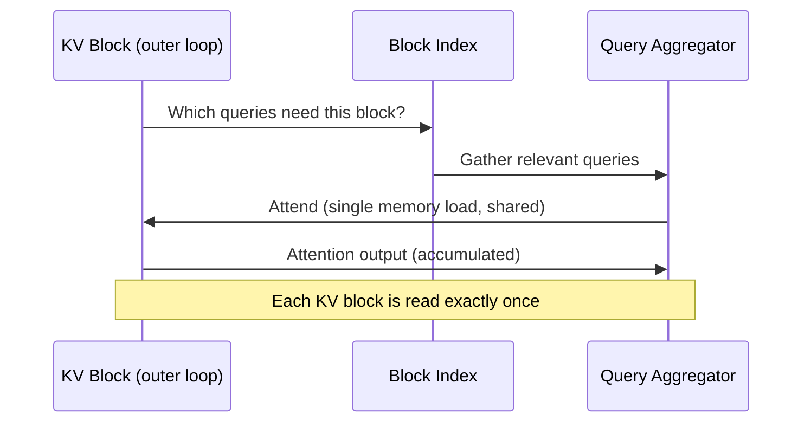
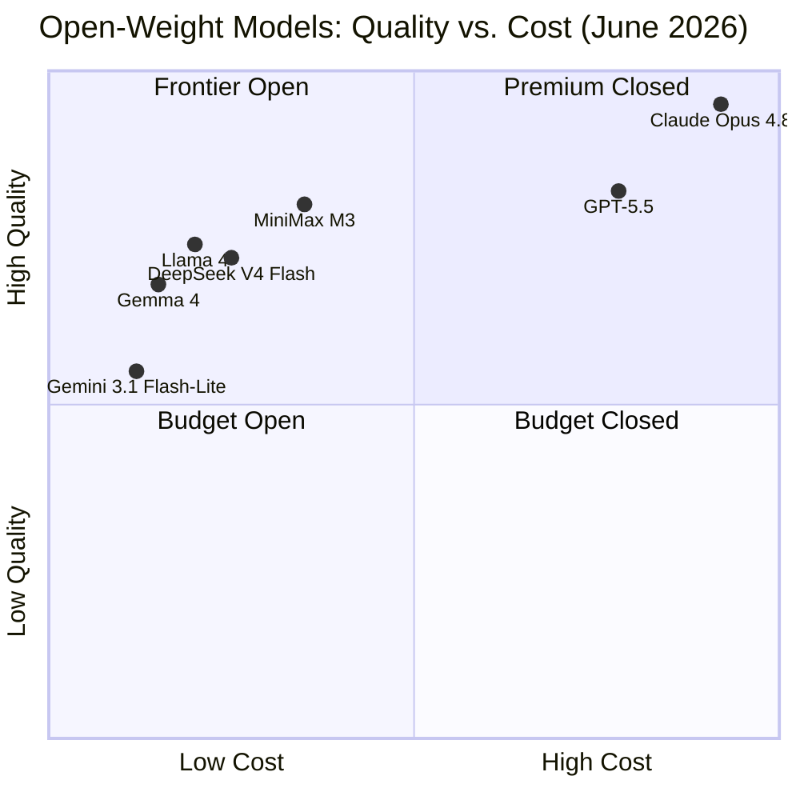

## The Open-Weight Tide Finally Reached the Frontier

For the past two years, a familiar story played out in AI releases: a new proprietary frontier model would debut with benchmark scores nobody could touch, while open-weight alternatives lagged by a comfortable margin. Teams that cared about running models on their own infrastructure had to accept a meaningful performance penalty. The gap was real, and it was the price of control.

That gap has been narrowing fast in 2026. DeepSeek V4 Flash brought frontier-class reasoning to open weights earlier this year. Gemma 4 pushed efficient open models further down the cost curve. Llama 4 hit competitive coding scores while fitting on commodity hardware. Each release moved the frontier a step closer to something you could actually run yourself.

MiniMax M3, released June 1, 2026, is the most ambitious claim yet: a single model that scores 59% on SWE-bench Pro — **ahead of GPT-5.5** — at $0.60 per million input tokens, with a one-million-token context window, native image and video input, and computer-use capabilities. Open weights ship within ten days of the API launch.

It is, at minimum, the most technically interesting open-weight release of the year.

---

## What MiniMax Actually Is

Most Western developers know MiniMax through Hailuo, its AI video tool. That's a narrow view of a company that has been quietly building one of China's widest AI product stacks since 2021.

Founded by former SenseTime VP Yan Junjie and two co-founders, MiniMax covers large language models, agentic coding, speech synthesis, music generation, image generation, and video generation. The company IPO'd on the Hong Kong Stock Exchange in January 2026, raising HK$4.8 billion. Its valuation roughly doubled on the first day of trading.

The M-series models are MiniMax's frontier LLM line. M1 was notable for training cost efficiency (reportedly 200× cheaper than GPT-4). M2 introduced strong long-context performance. M2.7, released in March 2026, scored first among open-source models at its price point on the Artificial Analysis Intelligence Index. M3 is the next step: an attempt to build an open-weight model that competes with the proprietary frontier on the metrics that matter most to developers — coding, agents, long context, and cost.

---

## The Architecture: Two Ingredients

M3 rests on two design choices working together: a fine-grained Mixture of Experts backbone, and a novel attention mechanism called MiniMax Sparse Attention.

### Mixture of Experts: Scale Without the Compute Bill

M3 has **229.9 billion total parameters** — a genuinely large model. But like GPT-4, DeepSeek V3, and Mistral's Mixtral models, it uses Mixture of Experts (MoE) to stay practical. The model activates only **9.8 billion parameters per token**, routing each token through the most relevant 2 or 3 of its **256 fine-grained experts**.

The intuition: instead of one giant network that applies the same weights to every token, you build a committee of specialists and let each token consult only the relevant ones. The 229.9 billion parameters represent the full committee's knowledge; the 9.8 billion activated at inference represent how much that knowledge costs to retrieve for any given input.

Fine-grained experts (256 vs. the 8 or 16 typical in earlier MoE models) mean each expert develops narrower, more targeted specializations. More routing decisions happen per token, but each decision is cheaper to execute.

The MoE backbone alone gets you a large-capacity model at reasonable inference cost. But it does nothing to solve the harder problem: what happens when your context is a million tokens long?

---

## The Real Innovation: MiniMax Sparse Attention

Attention is the step in a transformer where each token "looks at" other tokens to decide how to update its representation. In standard full attention, every token attends to every other token in the context window. The compute cost grows with the **square** of the sequence length: doubling the context quadruples the attention work.

At 1 million tokens, full attention is simply not feasible at production latency or cost. You need a way to pay attention to only the *relevant* parts of the context.

This is not a new problem. Existing solutions either compress the key-value cache (losing precision, breaking prefix caching) or use approximations that introduce their own accuracy penalties. DeepSeek's Multi-head Latent Attention (MLA), for example, compresses KVs into a low-rank latent space — clever, but it loses some of the original information and requires special inference infrastructure.

MiniMax Sparse Attention (MSA) takes a different path: **block-level selection on the real, uncompressed key-value cache**.

### How It Works

Rather than compressing KVs, MSA keeps them intact but selectively skips large chunks of them. The mechanism splits the context into blocks and runs a lightweight index pass to decide which blocks each query actually needs to attend to. Queries attend fully and accurately to the selected blocks and skip the rest entirely.

The key engineering insight is *how* the attention loop is organized. Standard sparse attention implementations iterate over queries in the outer loop, loading KV blocks as needed for each query — meaning popular KV blocks get loaded repeatedly from memory. MSA flips this:

By making KV blocks the outer loop and gathering all queries that need a given block at once, each block is loaded from memory exactly once per forward pass. MiniMax reports this is **more than 4× faster** than open-source alternatives like Flash-Sparse-Attention and flash-moba.

The practical result: at a one-million-token context, MSA drops per-token compute to roughly **1/20th** of what M2 required, while maintaining the accuracy of full attention on the selected blocks. Benchmarked against M2 at 1M tokens:

- **9.7× faster prefilling** (generating the KV cache from the input)
- **15.6× faster decoding** (generating output tokens one by one)

These numbers matter enormously for real workloads. A retrieval task over a book-length document, a codebase audit with full repository context, or an agent loop that needs to maintain memory of thousands of prior turns — all become practical rather than theoretical.

---

## The Numbers That Matter

### Benchmarks

M3's benchmark scores are MiniMax-reported (independent verification is pending, as the open weights were not yet public at time of writing):

| Benchmark | M3 | GPT-5.5 | Claude Opus 4.7 |
|---|---|---|---|
| SWE-bench Pro | **59.0%** | 58.6% | ~62% |
| Terminal-Bench 2.1 | 66.0% | — | — |
| MCP Atlas (agentic tool use) | 74.2% | — | — |
| BrowseComp | 83.5 | — | — |

SWE-bench Pro evaluates a model's ability to resolve real, unmodified GitHub issues in production repositories. At 59%, M3 edges past GPT-5.5 (58.6%) — a notable result for an open-weight model. It trails Claude Opus 4.8's 69.2%, but Opus 4.8 is a different class of offering with a matching price premium.

Terminal-Bench and MCP Atlas measure long-horizon execution and tool use — capabilities increasingly critical as agentic workflows become production workloads.

### Pricing

| Model | Input ($/million tokens) | Output ($/million tokens) | Open weights? |
|---|---|---|---|
| GPT-5.5 | $2.25 | $9.00 | No |
| Claude Opus 4.8 | $5.00 | $25.00 | No |
| MiniMax M3 | $0.60 | $2.40 | Yes (pending) |
| Gemini 3.1 Flash-Lite | $0.25 | $1.00 | No |
| GLM-4.7 | $0.11 | $0.44 | No |

At $0.60 per million input tokens, M3 costs about **four times less than GPT-5.5** for the same task while posting slightly higher SWE-bench Pro scores. For high-volume agentic pipelines — where token costs compound quickly — that gap is the difference between a viable product and an expensive experiment.

OpenRouter launched M3 at a temporary promotional price of $0.30 per million input tokens.

---

## Not Just Text: Multimodal and Computer Use

M3 accepts text, images, and video as native inputs. This isn't bolted-on vision capability added as an afterthought — MiniMax designed multimodality into the architecture from the start, following the same "native" approach seen in Gemini Omni and GPT-5.5.

More practically, M3 supports **computer use**: the ability to see a desktop screenshot, decide what to click or type, and execute actions through a controlled environment. MiniMax Code, the company's coding assistant product, uses this capability to let M3 operate a real development environment — running tests, checking browser output, and modifying files in response to what it sees on screen.

For developers building autonomous agents, a single model that can read a codebase, browse the web, reason over video documentation, and interact with a running application removes a significant integration burden.

---

## Where M3 Sits in the Open-Weight Landscape

The open-weight model ecosystem in mid-2026 looks nothing like it did eighteen months ago. Open models now hold 223 of the 356 positions tracked by Artificial Analysis across quality, speed, and cost dimensions. The meaningful capability gap between the closed frontier and the best open weights has shrunk to the point where the choice is primarily economic and operational rather than qualitative.

M3's combination of frontier-adjacent quality at open-weight pricing places it in what's become the most competitive quadrant in AI right now. Every major lab — Chinese and Western, open and closed — is fighting for this space.

The competitive subtext is significant. MiniMax was one of three Chinese AI companies Anthropic accused in February 2026 of using thousands of fraudulent accounts to extract training data from Claude through model distillation. MiniMax denied the allegation. Whether or not the claim has merit, it reflects the intensifying competition between Chinese AI labs and Western incumbents — a competition that M3's benchmark performance makes concrete.

---

## What Developers Should Know

**The API is live now.** M3 is available through MiniMax's own API, OpenRouter, and other routing providers. For teams already using agentic frameworks (LangChain, LlamaIndex, or raw API calls), M3 drops in like any other OpenAI-compatible endpoint.

**Open weights are incoming.** MiniMax committed to publishing weights and a full technical report on Hugging Face and GitHub within ten days of the June 1 launch. That means on-premises deployment via vLLM or SGLang is close — though both inference engines will need to add MSA-specific kernel support to realize M3's full speed advantage on long contexts.

**Benchmark skepticism is warranted.** Self-reported benchmarks on unreleased weights deserve scrutiny. Terminal-Bench and MCP Atlas are newer evaluations with less community vetting than SWE-bench. The SWE-bench Pro score of 59% is independently meaningful — SWE-bench has rigorous methodology and is hard to game — but the agentic benchmark numbers should be treated as informative until reproduced externally.

**The MSA efficiency claims are credible on their merits.** The architectural argument for why "KV outer gather Q" is faster than "Q outer gather KV" is sound. Memory access patterns matter enormously for GPU throughput, and loading each KV block once rather than repeatedly is a genuine improvement. Independent kernel benchmarks will be interesting when weights ship.

---

## Why This Release Is Worth Watching

MiniMax M3 is notable not just for what it scores, but for what it represents: the convergence of several previously separate goals into a single model. Frontier coding performance. Million-token context at practical speeds. Multimodal inputs including video. Computer use. Open weights. Competitive pricing.

Previous models made trade-offs among these. You could have open weights or long context, but the two together meant accepting a significant quality hit. You could have frontier performance or open weights, but rarely both on the same model.

Whether M3's self-reported benchmarks hold up under independent evaluation, and whether the MSA efficiency gains survive real deployment at scale, will become clear as the weights land on Hugging Face and developers start running them. The architectural transparency alone — publishing weights and a technical report, not just an API — means these questions will actually be answerable.

For the broader market, the more significant data point is the price. At $0.60 per million input tokens for a model that beats GPT-5.5 on software engineering tasks, the cost of deploying frontier-quality AI agents has dropped another floor. The floor keeps moving.

---

## Sources

- [MiniMax M3: Frontier Coding, 1M Context, Native Multimodality — MiniMax Official Blog](https://www.minimax.io/blog/minimax-m3)
- [MiniMax Releases MiniMax M3 with MSA Architecture Supporting 1M-Token Context — MarkTechPost](https://www.marktechpost.com/2026/06/01/minimax-releases-minimax-m3-with-msa-architecture-supporting-1m-token-context-native-multimodality-and-agentic-coding/)
- [MiniMax M3: Open-weight model with a million-token context challenges proprietary leaders — The Decoder](https://the-decoder.com/minimax-m3-open-weight-model-with-a-million-token-context-challenges-proprietary-leaders/)
- [MiniMax teases M3 model with new sparse attention mechanism and 15.6X response speed boost — VentureBeat](https://venturebeat.com/technology/minimax-teases-upcoming-m3-model-with-new-sparse-attention-mechanism-and-15-6x-response-speed-boost)
- [MiniMax Goes Sparse: Decoding M3's Attention from a Single Diagram — Hugging Face Blog](https://huggingface.co/blog/AtlasCloud-AI/minimax-goes-sparse)
- [MiniMax M3 API on OpenRouter — OpenRouter](https://openrouter.ai/minimax/minimax-m3)
- [MiniMax M3 Benchmark: Coding, Agentic, and Long-Context — MiniMax M3 Benchmark Site](https://minimaxm3.com/blog/minimax-m3-benchmark)
- [MiniMax Group — Wikipedia](https://en.wikipedia.org/wiki/MiniMax_Group)
- [MiniMax M3 Open-Weight Coding Model: Frontier Claims, Unverified Benchmarks — TechTimes](https://www.techtimes.com/articles/317532/20260601/minimax-m3-open-weight-coding-model-frontier-claims-unverified-benchmarks.htm)
- [MiniMax M3 GitHub Repository — GitHub](https://github.com/MiniMax-AI/MiniMax-M3)
- [MiniMax M3 Developer Guide: Benchmarks & Pricing — Lushbinary](https://lushbinary.com/blog/minimax-m3-developer-guide-benchmarks-pricing-msa-architecture/)
- [Open Source AI Models 2026: Top 6 Compared on Cost — AI Productivity](https://aiproductivity.ai/blog/open-source-ai-models-comparison-2026/)
