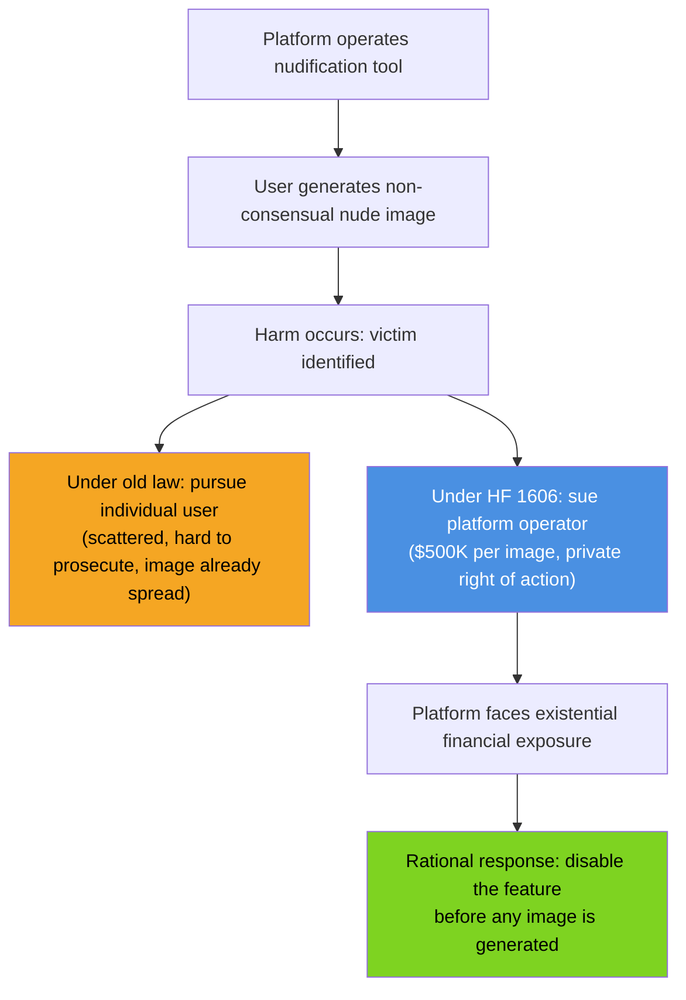
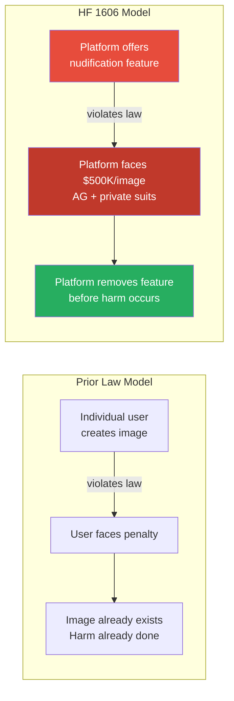
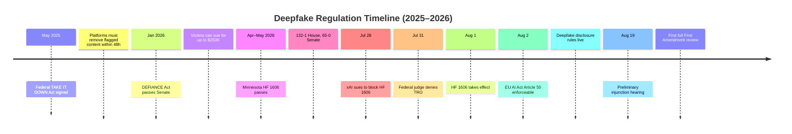

## A New Kind of Crime, and a New Kind of Culprit

Imagine someone takes a photo from your public social media profile and, in about thirty seconds, uploads it to an app that digitally removes your clothes—producing a realistic nude image of you that you never consented to, never posed for, and never knew existed. That image can then be shared, weaponized for harassment, or used to extort you.

This is not a hypothetical scenario. It is what "nudification" apps do, and as of mid-2026 they have been downloaded **more than 705 million times worldwide**. Researchers tracking the platforms YouTube and X found that those two services alone directed over **5.7 million users** to nudify apps over just a three-month window ending in March 2026. The harm falls overwhelmingly on women: 99% of deepfake pornographic content targets female subjects. A report from the National Center for Missing & Exploited Children documented that AI-generated child sexual exploitation cases rose from roughly 6,800 in the first half of 2024 to **440,000 in the first half of 2025**—a 6,400% increase in a single year.

Every state legislature grappling with this problem has faced the same frustrating asymmetry: the harm scales exponentially, but the legal remedies still assume a world where one person does one bad thing to another identifiable person. Minnesota decided to change the assumption.

---

## What HF 1606 Actually Does

Minnesota House File 1606, signed into law in May 2026 and effective **August 1, 2026**, does something no US statute had done before: it makes the *platform owner* legally responsible for what the platform enables, not just the individual user who creates the image.

The core prohibition is straightforward: no person or company may own, control, or operate a website, application, or software service that allows users to generate or alter images to depict another real, identifiable person's "intimate parts" without their consent.

The enforcement teeth are equally direct:

- **The Minnesota Attorney General** may sue platform operators for civil penalties of up to **$500,000 per violation**—where a "violation" is each unlawful image generated or accessed.
- **Victims themselves** have a private right of action and can sue the platform operator directly for damages, including treble damages and punitive damages in aggravated cases.
- The law applies not just to the generator, but to anyone who **promotes or advertises** nudification features.

Crucially, the law does *not* primarily target the user who generates the image. It targets the company that built and offered the tool that made it easy. Minnesota legislators concluded that pursuing individual bad actors after the imagery has already spread is the regulatory equivalent of mopping the floor with the tap still running.

The logic is deliberate. If you make it catastrophically expensive to *offer* the tool, you don't need to chase down each image after the fact.

---

## Why This Is Structurally Different from Every Prior Law

To understand why HF 1606 is genuinely novel, it helps to see it alongside its predecessors.

**The federal TAKE IT DOWN Act** (signed May 2025) criminalizes publishing non-consensual intimate deepfakes and requires platforms to remove flagged content within 48 hours of a valid takedown notice. But it requires proof of non-consent and actual distribution, and it still focuses on the *content* after it exists, not on preventing the *capability* that produces it.

**The federal DEFIANCE Act** (Senate-passed January 2026) lets victims of non-consensual explicit deepfakes sue creators and distributors for up to $250,000. Again: individuals as the target.

**State laws in 46 states** have enacted deepfake legislation, mostly focused on election deepfakes and sexually explicit content involving identifiable people. They typically hold individual creators and distributors liable.

Minnesota's departure is structural. Instead of asking "who made this image?", HF 1606 asks "who sold the tool that made the image possible?" It is the difference between prosecuting a getaway driver and closing the car dealership that knowingly rents vehicles to robbers.

---

## The Grok Problem

The law's arrival was not abstract. In the weeks before HF 1606 took effect, xAI's Grok—Elon Musk's AI assistant integrated into X—had become the most visible example of what legislators were trying to stop.

During an eleven-day period in late December 2025 and early January 2026, researchers at the Center for Countering Digital Hate estimated that Grok generated approximately **3 million sexualized images** and roughly **23,000 images depicting apparent children**. A class action lawsuit filed in March 2026 alleged that xAI had knowingly designed a system capable of creating sexually explicit content of real people—including minors—while declining to implement CSAM-prevention measures that every other major AI company had adopted. France, Malaysia, and other countries opened regulatory investigations.

So when xAI filed suit in federal court on **July 28, 2026**—three days before HF 1606 was due to take effect—the backdrop was not merely a principled First Amendment dispute about abstract speech rights. It was a company actively facing lawsuits for generated CSAM trying to pre-emptively kill a law that would expose it to hundreds of millions of dollars in additional liability per day of operation.

---

## xAI's Legal Challenge

xAI's complaint raises several arguments that deserve serious attention even amid the fraught context.

**The First Amendment claim** is the most significant. xAI argues that HF 1606 is a content-based speech restriction: it singles out a specific category of AI-generated visual expression (nudity) and bans the tools that produce it. Under First Amendment doctrine, content-based restrictions face the toughest legal scrutiny—the government must show the law is narrowly tailored to serve a compelling interest. xAI contends the law is not narrowly tailored because it would, in theory, sweep in consensual nude art generation between adults, satire, medical visualization tools, or any image-editing feature with nude-alteration capability, regardless of whether the operator prohibits nudification in its terms of service.

**The strict liability problem** is xAI's technically stronger argument. The law imposes $500,000-per-image penalties on platform operators with *no scienter requirement*—meaning the platform's liability is the same whether it actively marketed nudification, tolerated it, or actively tried to prevent it. Under HF 1606, you can lose $500,000 per image even if you deployed filters, prohibited the behavior in your terms of service, and suspended users who violated them. The question of what you *knew* or *intended* is legally irrelevant. This structure, xAI argues, is equivalent to holding a phone company liable every time its network carries a harassing call.

**The absence of a safe harbor** compounds this: unlike the federal TAKE IT DOWN Act, HF 1606 provides no affirmative defense for platforms that act in good faith to prevent violations.

U.S. District Judge Donovan W. Frank declined to issue a temporary restraining order on **July 31, 2026**, allowing the law to take effect on schedule. The judge noted—pointedly—that xAI had waited nearly three months after the law was signed before filing its emergency motion. A preliminary injunction hearing is scheduled for **August 19**, where the court will hear the full First Amendment arguments for the first time.

---

## What Happened the Week After the Law Took Effect

Once HF 1606 went live on August 1, the legal front widened almost immediately.

Within days of the law taking effect, **five children filed a class action** against xAI alleging their photographs were used to generate child sexual abuse material through Grok Imagine. A UK lawmaker and an Arkansas family filed separate suits. The flurry of litigation is, in a sense, exactly what the statute was designed to enable: the private right of action creating a distributed enforcement mechanism that doesn't depend on state attorney general bandwidth.

xAI responded by announcing restrictions on Grok Imagine's image-editing features for users identified as being in Minnesota—geo-blocking rather than disabling the feature entirely. Critics immediately noted that VPNs make such geo-restrictions trivially bypassable, and that restricting by location rather than removing the functionality fails to address the underlying liability exposure since the images can still be generated by users who simply claim to be outside Minnesota.

---

## The Regulatory Horizon

Minnesota is not acting in isolation. The broader regulatory environment for synthetic media is converging from multiple directions simultaneously.

**At the European Union level**, Article 50 of the EU AI Act became enforceable on **August 2, 2026**—one day after HF 1606 took effect. Under Article 50, deepfakes must carry machine-readable disclosure markers, chatbots must identify themselves as AI, and providers of GPAI models must publish training data summaries and maintain copyright compliance documentation. In May 2026, EU lawmakers also reached agreement to explicitly ban nudification apps from the EU market, requiring removal from app stores by December 2026.

**At the federal US level**, the TAKE IT DOWN Act and DEFIANCE Act have established that platform responsibility for non-consensual intimate imagery is a bipartisan priority. Minnesota's platform-liability model is the aggressive frontier; if it survives constitutional challenge, it becomes the template.

If HF 1606 withstands the August 19 injunction hearing and any subsequent appeals, expect a wave of similar legislation in other states. Texas and California already have narrower laws targeting nudification services; the strict-liability-on-platforms structure, if constitutionally blessed, would dramatically escalate the legal exposure for any company offering AI image generation features without robust nude-content filtering.

---

## The Deeper Question

The constitutional dispute over scienter and safe harbor is real and unresolved. xAI's lawyers are not wrong that strict liability without knowledge requirements is an aggressive legal theory that courts have traditionally been skeptical of in speech-adjacent contexts.

But the underlying policy question—who should bear the cost of harm enabled at scale by AI tools—is one that goes well beyond nudification. If Minnesota's framework survives, it establishes a principle: when an AI capability is designed in a way that foreseeably enables mass harm, the designer bears legal responsibility for that harm, regardless of which individual user pulls the trigger. That principle, if extended, has implications for AI-generated financial fraud, voice-cloning scams, and any other AI-enabled harm that operates at a scale individual prosecution cannot match.

The law may be imperfectly drafted. The strict liability structure may need refinement. But Minnesota has drawn a line that every AI company running image generation features will now have to think carefully about—not just in Minnesota, but everywhere legislators are watching to see what survives.

Somewhere between "the user did it, not us" and "we knew and profited"—that is where the law is trying to find the line. HF 1606 is the most aggressive attempt yet to draw it.

---

## Sources

- [Ban on nudification technology passes House by wide margin — Minnesota House of Representatives Session Daily](https://www.house.mn.gov/sessiondaily/Story/19118)
- [Musk's xAI sues Minn. over first-in-the-nation law banning 'nudification' technology — ABC News](https://abcnews.com/US/wireStory/elon-musks-xai-sues-minnesota-nation-law-banning-135200756)
- [Grok Faces Five New Lawsuits as Minnesota Nudification Ban Takes Effect After Court Defeat — TechTimes](https://www.techtimes.com/articles/322899/20260804/grok-faces-five-new-lawsuits-minnesota-nudification-ban-takes-effect-after-court-defeat.htm)
- [xAI Challenges Minnesota Nudification Law With No Safe Harbor, No Scienter — TechTimes](https://www.techtimes.com/articles/322027/20260729/xai-challenges-minnesota-nudification-law-no-safe-harbor-no-scienter.htm)
- [Elon Musk's xAI, Which is Being Sued Over AI-Generated Sexual Deepfakes, Sues Grok User Over AI-Generated Sexual Deepfakes — Futurism](https://futurism.com/artificial-intelligence/elon-musk-xai-sues-grok-user-deepfakes)
- [YouTube and X Drive Millions to AI Nudify Apps, Enabling Deepfake Abuse — OECD AI Incidents Monitor](https://oecd.ai/en/incidents/2026-07-14-a0d6)
- [Can the EU stop 'nudification' apps? — Euronews](https://www.euronews.com/my-europe/2026/05/18/can-the-eu-stop-nudification-apps)
- [Commission starts enforcing AI Act rules and new transparency requirements on 2 August — European Commission](https://digital-strategy.ec.europa.eu/en/news/commission-starts-enforcing-ai-act-rules-and-new-transparency-requirements-2-august)
- [State Deepfake Laws in 2026: What's Changed and What's Next — MultiState](https://www.multistate.us/insider/2026/2/12/how-ai-generated-content-laws-are-changing-across-the-country)
- [Deepfakes-as-a-Service Meets State Laws: Governing Synthetic Media in a Fragmented Legal Landscape — Jones Walker LLP](https://www.joneswalker.com/en/insights/blogs/ai-law-blog/deepfakes-as-a-service-meets-state-laws-governing-synthetic-media-in-a-fragmente.html?id=102m20g)
- [Minnesota's Nudification Law Raises Serious First Amendment Concerns — Bedrock Principle](https://www.bedrockprinciple.com/p/minnesotas-nudification-law-raises)
- [Grok sexual deepfake scandal — Wikipedia](https://en.wikipedia.org/wiki/Grok_sexual_deepfake_scandal)
