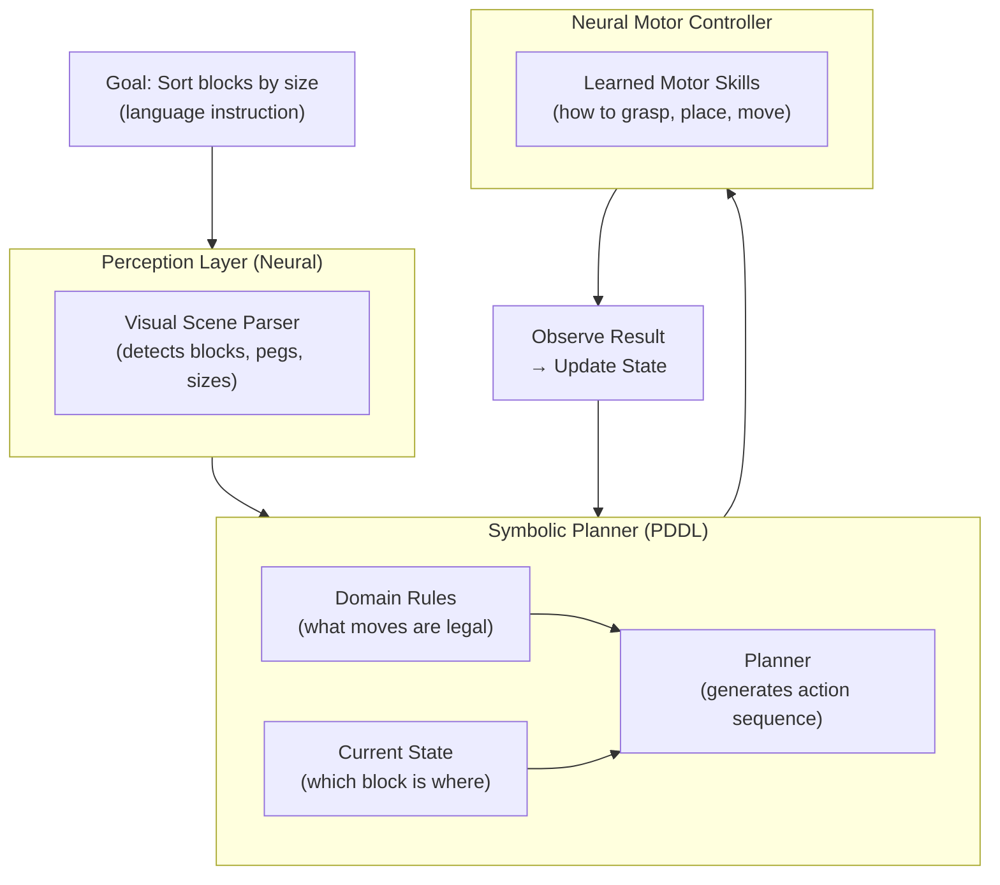
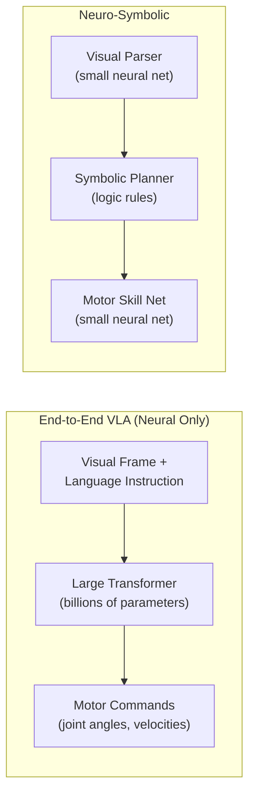

## A Robot Stacking Blocks Is Quietly Making a Big Argument

It doesn't look like much: a robot arm moving colored blocks in a simulated environment, solving variants of the Tower of Hanoi puzzle. But the paper sitting behind that demo, published on arXiv in February 2026 and accepted for presentation at the International Conference on Robotics and Automation (ICRA) in Vienna, makes a claim that cuts against one of AI's most entrenched assumptions.

A **neuro-symbolic** system — one that combines a neural network with an explicit logical planner — solved the task with **95% accuracy**. The leading neural end-to-end model managed just **34%**. More striking still: training the neuro-symbolic system consumed roughly **1% of the energy** needed to train the neural baseline. At inference time, it used about **5%** as much power.

That is not a marginal improvement. It is a different order of magnitude, on both axes simultaneously.

---

## Why AI's Energy Bill Has Become Impossible to Ignore

To understand why that efficiency number matters, it helps to have a sense of scale.

Global data center electricity consumption was around 415 terawatt-hours in 2024 — roughly 1.5% of all electricity used on Earth. By 2026, projections from the International Energy Agency place that figure at over 1,000 TWh. To put it another way: if data centers were a country, they would rank among the five largest energy consumers in the world, sitting between Japan and Russia.

AI is a major driver of that growth. Accelerated computing infrastructure — the GPUs and specialized chips that run AI workloads — is growing at roughly **30% per year**. A single ChatGPT query already uses about ten times more electricity than a Google search. ChatGPT-5 queries can consume anywhere from 2 to 45 watt-hours each, depending on length and complexity.

Against that backdrop, a technique that does more with 100 times less energy is not an academic curiosity. It is a potential inflection point.

---

## The Two Camps: End-to-End vs. Structured Reasoning

Current robot AI tends to fall into one of two camps.

The first is the **end-to-end foundation model** approach. A vision-language-action model (VLA) is trained on enormous datasets of video, language, and robot trajectories. Given a visual scene and a natural-language instruction, it outputs motor commands directly. The appeal is elegance and generality: one model, no hand-coded rules, trained on raw experience. The leading open-weight VLA tested in the Tufts paper is π0 (pi-zero), a state-of-the-art model from Physical Intelligence.

The second is **neuro-symbolic AI** — a much older idea that has recently found new footing. Instead of learning everything from pixels and text, a neuro-symbolic system splits the problem in two:

- A **symbolic planner** handles the logic: what actions are possible, what rules govern them, what sequence reaches the goal. It reasons explicitly in a formal language called PDDL (Planning Domain Definition Language), which looks something like structured English: "move block A from peg 1 to peg 3, provided peg 3 has room."
- A **neural network** handles the physical execution: how to actually move the robot arm to complete each individual step.

The symbolic part figures out *what to do*. The neural part figures out *how to do it*.



Compare this to a pure VLA approach, where a single large neural network must learn both the abstract logic *and* the physical motor skills from scratch — a dramatically larger and more computationally hungry learning problem.



---

## What the Experiment Actually Showed

The Tufts team — Timothy Duggan, Pierrick Lorang, Hong Lu, and professor Matthias Scheutz of the Human-Robot Interaction Laboratory — tested both approaches on structured variants of the Tower of Hanoi puzzle with physical blocks. This is not a toy problem: it requires planning multiple steps ahead, tracking state, and generalizing rules across configurations that weren't in the training data.

The results were sharp:

| Task | Neuro-Symbolic | Best VLA (π0) |
|---|---|---|
| 3-block arrangement (trained) | **95%** success | 34% success |
| 4-block arrangement (unseen) | **78%** success | **0%** (complete failure) |
| Training energy | **1%** of VLA | baseline |
| Inference energy | **5%** of VLA | baseline |

The 4-block result is particularly telling. The VLA had never seen a 4-block configuration and could not generalize. The neuro-symbolic system, by contrast, applied the same logical rules to the new configuration — because logic, unlike neural weights, generalizes by design.

The reason is structural. A symbolic planner doesn't need to re-learn the rules of a game every time the board gets bigger. It just applies them. The neural components only need to learn a small, well-defined set of physical skills — "how to pick up a block," "how to place it on a peg" — not the entire combinatorial space of possible situations.

---

## An Old Idea Whose Time Has Come (Again)

Neuro-symbolic AI is not new. The idea of combining neural learning with symbolic logic goes back decades, and it has gone through several waves of interest. What's changed is the surrounding ecosystem.

Modern large language models have made the symbolic half dramatically easier to deploy: LLMs can translate natural language into PDDL problem descriptions, bridging the gap between human intent and formal planning. Better neural architectures have improved the low-level motor control networks. And the robotics field has matured to the point where structured long-horizon manipulation is a well-defined benchmark rather than a vague aspiration.

At the same time, the energy and performance limits of pure neural scaling are becoming harder to ignore. Training a frontier VLA on diverse robot data requires vast compute; fine-tuning it for a specific task requires significant additional energy; and the resulting model often fails to generalize cleanly to new configurations. The neuro-symbolic approach sidesteps much of this by putting the structure where it belongs — in the planner — and reserving learning for the parts that genuinely need it.

```mermaid
quadrantChart
    title Performance vs Energy Cost
    x-axis Low Energy --> High Energy
    y-axis Low Performance --> High Performance
    quadrant-1 "Ideal: High perf, low energy"
    quadrant-2 "High perf, high energy"
    quadrant-3 "Low perf, low energy"
    quadrant-4 "Low perf, high energy"
    Neuro-Symbolic (3-block): [0.15, 0.92]
    VLA π0 (3-block): [0.95, 0.34]
    Neuro-Symbolic (4-block): [0.15, 0.78]
    VLA π0 (4-block): [0.95, 0.02]
```

---

## What This Doesn't Mean (Yet)

It's worth being clear about the limits.

The Tower of Hanoi, however physically complex, is a **structured, rule-governed task** — exactly the kind of problem symbolic planners were designed for. VLAs arguably shine in messier, open-ended settings: unstructured environments, ambiguous instructions, novel objects that no planner has rules for. Scheutz and his team acknowledge this trade-off explicitly in the paper; their claim is not that neuro-symbolic AI wins everywhere, but that for structured long-horizon tasks, the current industry instinct to throw more neural compute at the problem is both inefficient and brittle.

This distinction matters practically. A robot that must help in a warehouse — moving specific items according to explicit rules — is a different problem from a robot that must navigate an untidy kitchen. The first has structure a symbolic planner can encode. The second may not.

The paper also tests in simulation. Generalization to real-world hardware, noisy perception, and unexpected physical variation remains a next step. The team's presentation at ICRA 2026 will be an opportunity to field exactly those questions from the robotics community.

---

## Why It Matters Beyond Robotics

The implications extend well past robot arms.

Every technique that reduces the compute required to achieve a given level of capability is, in effect, a multiplier on what the field can afford to do. If neuro-symbolic methods can genuinely match or beat end-to-end neural approaches on structured tasks at a fraction of the energy cost, that changes the economics of deploying AI in energy-constrained environments: edge devices, mobile robots, embedded systems, applications in parts of the world where reliable grid power is not a given.

It also reopens a methodological debate that the deep learning revolution arguably closed prematurely. For most of the last decade, "more data, more compute, bigger model" has been the dominant paradigm — and it has worked spectacularly well in many domains. But as the energy costs of that paradigm become politically and economically significant, results like this one suggest there may be an alternative path worth re-examining.

The Tufts paper's title is a quiet joke: *The Price Is Not Right*. The price being questioned is the one we've been paying — in electricity, in carbon, in compute — for systems that learn everything from scratch when they don't have to.

---

## Sources

- [The Price Is Not Right (arXiv:2602.19260) — Duggan, Lorang, Lu, Scheutz, Tufts HRI Lab](https://arxiv.org/abs/2602.19260)
- [Neuro-Symbolic AI Cuts Robot Energy Use by 100x — Nerd Level Tech](https://nerdleveltech.com/neuro-symbolic-ai-cuts-robot-energy-use)
- [AI breakthrough cuts energy use by 100x while boosting accuracy — ScienceDaily](https://www.sciencedaily.com/releases/2026/04/260405003952.htm)
- [100x Less Power: The Breakthrough That Could Solve AI's Massive Energy Crisis — SciTechDaily](https://scitechdaily.com/100x-less-power-the-breakthrough-that-could-solve-ais-massive-energy-crisis/)
- [New AI Models Could Slash Energy Use While Dramatically Improving Performance — Tufts Now](https://now.tufts.edu/2026/03/17/new-ai-models-could-slash-energy-use-while-dramatically-improving-performance)
- [Neuro-symbolic AI breakthrough cuts energy consumption by 100x — The News (Pakistan)](https://www.thenews.com.pk/latest/1397941-neuro-symbolic-ai-breakthrough-cuts-energy-consumption-by-100x)
- [Energy demand from AI — International Energy Agency](https://www.iea.org/reports/energy-and-ai/energy-demand-from-ai)
- [AI is set to drive surging electricity demand from data centres — IEA News](https://www.iea.org/news/ai-is-set-to-drive-surging-electricity-demand-from-data-centres-while-offering-the-potential-to-transform-how-the-energy-sector-works)
- [How much energy does ChatGPT use? — Epoch AI](https://epoch.ai/gradient-updates/how-much-energy-does-chatgpt-use)
- [Matthias Scheutz — Tufts University Department of Computer Science](https://engineering.tufts.edu/cs/people/faculty/matthias-scheutz)
