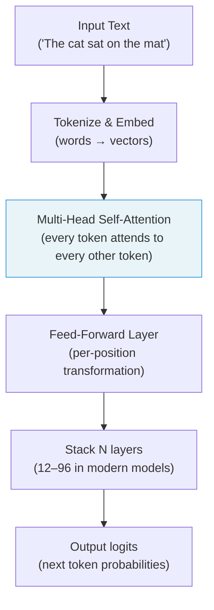
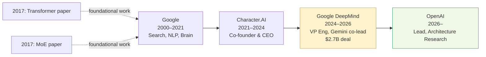

## Eleven Sentences That Moved a Market

On June 18, 2026, Noam Shazeer posted eleven sentences on X. The announcement was measured and gracious — *"It was a difficult decision to move on"* — but within four days it had wiped roughly **$270 billion from Alphabet's market capitalization**, producing the company's worst single-day stock decline in over a year.

The person doing the moving was not a routine research vice president. Shazeer is one of eight co-authors of **"Attention Is All You Need"** — the 2017 paper that introduced the Transformer architecture and became the technical foundation for every significant large language model that exists today, including GPT, Gemini, Claude, and Llama. He was also first author on the **sparse Mixture-of-Experts (MoE)** paper, the second architectural innovation that made it economically viable to scale those models to hundreds of billions of parameters without proportional compute costs.

He is, in a genuine sense, the person most directly responsible for the technical substrate the entire AI industry is now racing to commercialize. And as of this month, he is designing its successor at OpenAI.

---

## Building the Foundation Everyone Is Standing On

To understand why this hire matters, it helps to know what Shazeer actually built.

In 2017, Shazeer and seven colleagues at Google Brain published a paper proposing to replace recurrent neural networks — the dominant architecture for language processing at the time — with a simpler mechanism based entirely on **attention**. The core idea: instead of processing words one at a time in sequence, the model could look at all tokens in a passage simultaneously and learn weighted relationships between all of them.

The result was the **Transformer**.

Every major LLM in production today is a scaled-up descendant of that 2017 architecture. The paper now has over **165,000 citations** on Google Scholar, making it one of the most influential papers in the history of computer science.

But the Transformer alone couldn't scale to the sizes modern AI requires. Each layer of a standard Transformer activates all of its parameters for every token it processes. Run a trillion-parameter model on a 50-word prompt and you're touching a trillion weights per token — enormously expensive at any production scale.

Shazeer's answer was **Mixture-of-Experts (MoE)**. Instead of activating every parameter for every token, a sparse MoE model routes each token to a small subset of specialized "expert" sub-networks — typically 2 to 8 out of dozens or hundreds. The result: a model with a trillion total parameters might activate only 40–50 billion per token, delivering the knowledge of a trillion-parameter system at a fraction of the inference cost.

GPT-4, Gemini 1.5, Gemini 2.0, DeepSeek-V3, and Mistral's Mixtral models all use MoE architectures. The technique Shazeer invented is what makes large-scale AI commercially viable to run.

---

## The Long Road: Google → Character.AI → Google → OpenAI

Shazeer joined Google in 2000 and spent 21 years there, improving systems from the spell-checker to deep learning–based language models. By 2021 he was frustrated. He and colleague Daniel De Freitas had built an internal conversational AI called Meena that Google declined to release publicly. After years of watching research sit unreleased, they left.

In 2021, they co-founded **Character.AI**, a consumer chatbot platform built around persona-based conversations. By 2024 it was one of the most-visited AI products in the world — especially among younger users, a demographic that would later become the source of serious legal and reputational exposure.

In August 2024, Google signed a **$2.7 billion deal** structured as a non-exclusive technology license from Character.AI, paired with a reverse acqui-hire that brought Shazeer, De Freitas, and roughly 30 team members back into Google DeepMind. The Wall Street Journal reported that Shazeer's return was the primary rationale for the deal's price tag — more than half of the valuation Character.AI had sought from investors.

Google installed him as **VP of Engineering and co-lead of the Gemini program**, alongside Jeff Dean and Oriol Vinyals. He stayed for 22 months.

---

## What He'll Do at OpenAI

OpenAI's Chief Research Officer **Mark Chen** confirmed the title and framing on X the same day: *"His work on Transformers, MoE, and efficient decoding have shaped modern AI. He's extremely AGI-pilled and is super thoughtful about making it all go well."*

CEO Sam Altman added: *"Noam is one of the people I have most wanted to work with since the very beginning of OpenAI. Only took ten years. I think it will be worth the wait."*

The "ten years" framing is notable. OpenAI was founded in December 2015, and Shazeer has been on Altman's radar since the early days. His mandate — Lead for Architecture Research, focused on next-generation model designs — positions him to define what comes after the current generation of Transformer-based LLMs.

The hire also landed at a strategically charged moment. OpenAI recently filed a confidential S-1 with the SEC and is working with Goldman Sachs and Morgan Stanley toward an IPO potentially valuing the company at up to **$1 trillion**. Pre-IPO equity is the compensation instrument that established tech giants like Alphabet — already a $1.8 trillion public company — cannot easily match. Google can offer cash and tenure; it cannot offer the upside of being an early equity holder in a company racing toward that valuation.

---

## The Wider Talent Earthquake

Shazeer's departure was not an isolated event. Within 48 hours of his announcement, **John Jumper** — Google DeepMind VP and 2024 Nobel Prize in Chemistry co-laureate for the AlphaFold2 protein structure prediction system — announced he was leaving for **Anthropic**. AlphaFold researchers **Jonas Adler** and **Alexander Pritzel** were also reported to be joining Anthropic in the same wave.

The market reacted sharply. Alphabet shares fell as much as 7.2% intraday on June 22, erasing approximately **$270 billion in market capitalization** — one of the largest single-day value drops in the company's history.

Industry observers were blunt. Fortune quoted researchers questioning whether Google can remain at the AI frontier. Axios described the events as "AI's talent war hitting Google the hardest." The structural dynamic is becoming clear: OpenAI and Anthropic offer pre-IPO equity with meaningful upside, a sharper focus on AGI as an organizing mission, and a sense of urgency that a 27-year-old corporation with competing product lines and quarterly earnings pressure struggles to replicate.

A telling data point from Axios's reporting: OpenAI engineers are roughly **8× more likely to leave for Anthropic** than the reverse. The talent is flowing in one direction.

---

## A Hire That Comes With Complications

OpenAI's acquisition of Shazeer is not without controversy. Character.AI faces multiple wrongful death and user safety lawsuits, most prominently from the family of Sewell Setzer III, a 14-year-old Florida teen who died by suicide in 2024 after extensive interactions with a Character.AI chatbot. Megan Garcia, his mother, stated publicly: *"In my mind, these two gentlemen should not have the right to keep building products for people, much less children."*

Futurism's coverage noted that OpenAI hired him despite these ongoing lawsuits and the reputational weight they carry. OpenAI has not publicly addressed the Character.AI safety record in the context of the hire.

The tension here is real: the person being handed responsibility for the architecture of the world's most widely used AI systems co-led a consumer product that regulators, advocates, and bereaved families argue caused serious harm to children. Whether OpenAI has implemented adequate safeguards around its own products to prevent similar outcomes is a question that will follow Shazeer into his new role.

---

## The $2.7 Billion Irony

The number that sharpens this story is the simplest one: Google paid **$2.7 billion** in 2024 to secure Shazeer's contributions to Gemini for the next decade. OpenAI likely obtained his services for a compensation package smaller in absolute cash terms — but potentially worth far more in pre-IPO equity if OpenAI hits its valuation targets.

The deeper implication is structural. In the race toward AGI, the most valuable resource is not compute, data, or capital — all of which Google has in abundance. It is the handful of researchers who understand the fundamental architecture of machine intelligence deeply enough to invent the next paradigm. In a single week in June 2026, Google lost the co-inventor of the Transformer (to OpenAI) and a Nobel laureate whose breakthrough defined AI-assisted biology (to Anthropic).

The Transformer was invented at Google in 2017. Whatever architecture comes next — and Shazeer is now being paid by OpenAI to design it — will very probably not be.

---

## Sources

- [Noam Shazeer announcement on X](https://x.com/NoamShazeer/status/2067400851438932297)
- [Mark Chen (OpenAI CRO) confirms title on X](https://x.com/markchen90/status/2067402457500758375)
- [CNBC: Google Gemini co-lead Noam Shazeer leaves for OpenAI](https://www.cnbc.com/2026/06/18/google-gemini-co-lead-noam-shazeer-leaves-for-openai.html)
- [Axios: Top AI researcher leaves Google for OpenAI](https://www.axios.com/2026/06/18/noam-shazeer-google-openai-characterai)
- [Axios: Google takes the hit in AI's talent war](https://www.axios.com/2026/06/23/ai-lab-agi-google-deepmind-departures)
- [Fortune: Google DeepMind researcher departures raise doubts about winning the AI race](https://fortune.com/2026/06/23/google-deepmind-ai-researcher-departures-raise-doubts-about-ability-to-win-the-ai-race-shazeer-jumper-eye-on-ai/)
- [Bloomberg: Alphabet shares drop after second AI star departs for a rival](https://www.bloomberg.com/news/articles/2026-06-22/alphabet-shares-drop-after-second-ai-star-departs-for-a-rival)
- [CNBC: John Jumper to leave Google DeepMind for Anthropic](https://www.cnbc.com/2026/06/19/john-jumper-to-leave-google-deepmind-for-anthropic.html)
- [TechCrunch: Nobel laureate John Jumper leaving DeepMind for Anthropic](https://techcrunch.com/2026/06/20/nobel-laureate-john-jumper-is-leaving-deepmind-for-rival-anthropic/)
- [TechCrunch (2024): Character.AI CEO Noam Shazeer returns to Google](https://techcrunch.com/2024/08/02/character-ai-ceo-noam-shazeer-returns-to-google/)
- [Benzinga: Sam Altman says it's "10 years in the making"](https://www.benzinga.com/markets/tech/26/06/53269428/google-gemini-co-lead-noam-shazeer-joins-openai-sam-altman-says-its-10-years-in-the-making)
- [MLQ News: OpenAI hires Transformer co-inventor away from Google DeepMind](https://mlq.ai/news/openai-hires-transformer-co-inventor-noam-shazeer-away-from-google-deepmind/)
- [Futurism: OpenAI just hired a guy accused of terrible things](https://futurism.com/artificial-intelligence/openai-hires-noam-shazeer)
- [The AI Insider: OpenAI hires Shazeer and Dean Ball ahead of IPO](https://theaiinsider.tech/2026/06/19/openai-hires-transformer-co-author-noam-shazeer-and-former-white-house-ai-official-dean-ball-ahead-of-ipo/)
- [Outlook Business: Alphabet loses $270B after Google AI departures](https://www.outlookbusiness.com/corporate/alphabet-loses-270-bn-after-google-ai-departures-how-two-exits-sparked-concerns)
- [TechCrunch: AI researchers continue to leave Google for rivals](https://techcrunch.com/2026/06/24/ai-researchers-continue-to-leave-google-for-its-rivals/)
- [Wikipedia: Noam Shazeer](https://en.wikipedia.org/wiki/Noam_Shazeer)
- [arXiv: Attention Is All You Need (Vaswani et al., 2017)](https://arxiv.org/abs/1706.03762)
