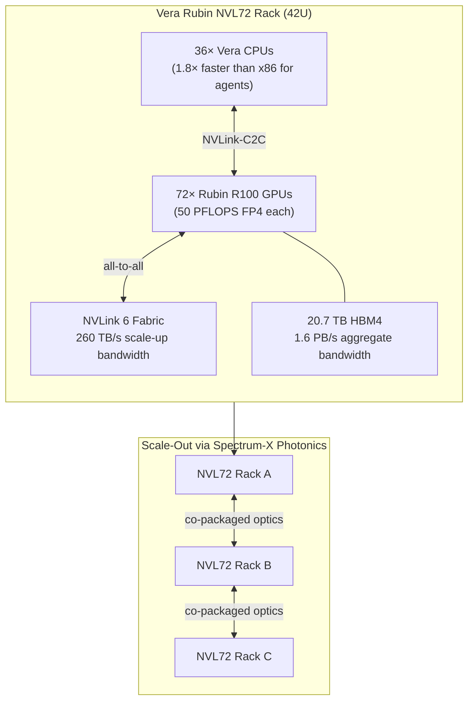
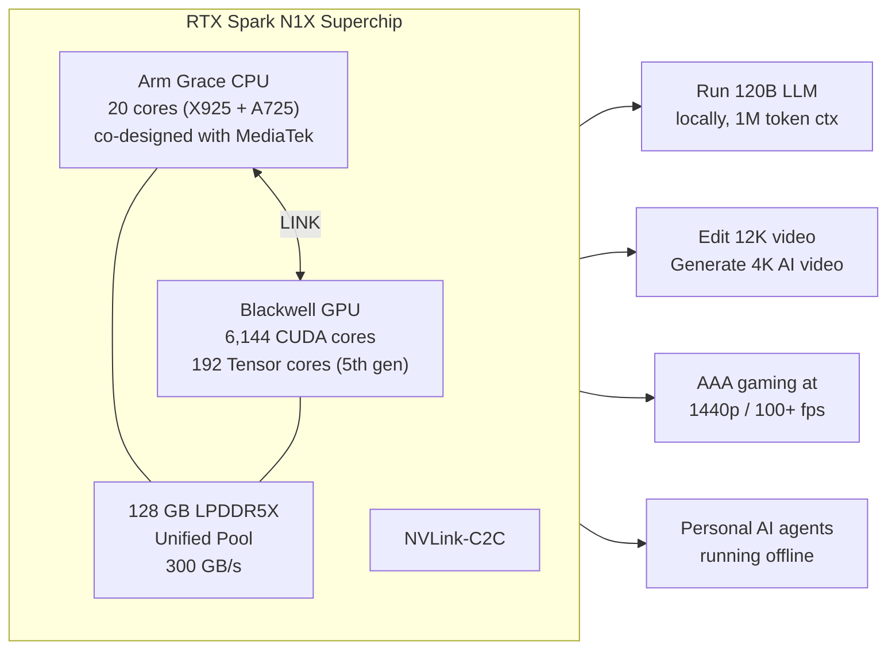

## The Year Nvidia Moved on Two Fronts at Once

For most of the past decade, the story of AI hardware was simple: make the data center GPU bigger, faster, and more power-hungry, and let the frontier models follow. Hopper, then Blackwell, each generation a bigger rack, a bigger power bill, a bigger cluster.

2026 is different. Within a month, Nvidia delivered products at two ends of the computing spectrum simultaneously — a new data center platform claiming five times the inference throughput of its predecessor, and a consumer chip designed to bring serious AI capability inside a half-inch-thick laptop. Understanding both, and the strategy connecting them, is one of the more useful things an AI-aware engineer can do right now.

---

## Vera Rubin: The Data Center Refresh

The **Vera Rubin platform** was first outlined at CES in January 2026 and entered full production in time for cloud deployments later this year. The name honors two scientists: Vera Rubin, the astronomer who gathered evidence for dark matter, and the platform's own ambition to make AI inference a little less mysterious in cost and scale.

At the heart of the platform is the **Rubin R100 GPU**, built on TSMC's 3nm process with a dual-die design containing 336 billion transistors. That's only 1.6× more transistors than Blackwell — but transistor count is a poor proxy for performance, and the architecture changes underneath are significant.

The headline number is **50 petaFLOPS of NVFP4 inference per GPU**, which is 5.6× the B200 and 3.3× the B300. Memory bandwidth gets an equally large jump: each R100 uses HBM4 with up to 22 TB/s of bandwidth per GPU, compared to 8 TB/s for HBM3e on the B200 — a 2.75× increase that matters enormously for inference, where the bottleneck is almost always moving weights around, not arithmetic.

### The NVL72: A Rack Is Now a Supercomputer

The real unit of sale for Vera Rubin is not a single GPU but the **NVL72 rack** — 72 Rubin GPUs and 36 Vera CPUs in a fully liquid-cooled, standard 42U footprint. At rack scale:

- **3.6 EFLOPS** of NVFP4 inference capacity
- **2.5 EFLOPS** of training throughput
- **20.7 TB** of total HBM4 memory
- **1.6 PB/s** of aggregate HBM bandwidth
- **260 TB/s** of NVLink 6 scale-up bandwidth inside the rack (double Blackwell NVL72's 130 TB/s)

Nvidia's headline claim is **10× lower cost per token** versus an equivalent Blackwell deployment, driven by the combination of higher throughput per GPU, better memory efficiency, and the halved interconnect bottleneck from NVLink 6. For training large Mixture-of-Experts (MoE) models — the architecture behind most current frontier models — Rubin reportedly requires **one-quarter as many GPUs** to match Blackwell's performance. Fewer GPUs means fewer power drops, fewer networking hops, and smaller cluster footprints.

Cloud providers making first deployments in 2026 include AWS, Google Cloud, Microsoft Azure, Oracle Cloud Infrastructure, CoreWeave, Lambda, Nebius, and Nscale.

---

## Vera CPU: The First Processor Built for Agents

Tucked inside each NVL72 are 36 units of Nvidia's **Vera CPU** — announced separately as a product class of its own, and described by Nvidia as "the first CPU built for AI agents."

That phrasing deserves unpacking. General-purpose x86 processors were designed to handle almost any kind of work equally well. An AI agent, by contrast, spends most of its cycles on a specific mix of operations: running inference, orchestrating tool calls, processing structured and unstructured context, doing reinforcement-learning updates, and managing the stateful data pipelines that connect those steps. Vera's microarchitecture is shaped around exactly that profile, with Nvidia citing **1.8× faster task completion** on agentic workloads versus x86.

The most visible early proof point is in the delivery list. On **May 17, 2026**, Nvidia personally delivered the first Vera CPU systems to Anthropic, OpenAI, and SpaceXAI. Oracle Cloud Infrastructure received its allocation on May 20. These are not production fleet shipments — they are evaluation units at the world's largest AI training and inference operations, the organizations most motivated to validate any silicon claim carefully. Commercial availability at scale is planned for fall 2026, with OCI already committing to deploy hundreds of thousands of Vera CPUs beginning this year.

---

## RTX Spark: The Other Half of the Strategy

While the Vera Rubin platform addresses the cloud, **RTX Spark** — unveiled at Computex on May 31, 2026 — targets the opposite end: personal laptops and compact desktops.

The chip behind RTX Spark is the **N1X superchip**, which fuses two of Nvidia's most capable dies:

| Component | Details |
|---|---|
| **CPU** | 20 Arm cores: 10× Cortex-X925 (performance) + 10× Cortex-A725 (efficiency), co-designed with MediaTek |
| **GPU** | Blackwell-architecture die: 6,144 CUDA cores, 192 fifth-gen Tensor cores, 48 RT cores |
| **Memory** | Up to 128 GB LPDDR5X unified (CPU + GPU share one pool) |
| **Bandwidth** | 300 GB/s |
| **AI throughput** | 1 petaFLOP FP4 |
| **CPU-GPU link** | NVLink-C2C (same chip-to-chip interconnect used in Nvidia's server Grace-Blackwell) |
| **Form factor** | Laptops as thin as 14mm; compact desktops |

The unifying memory pool is the technical detail that sets this apart from conventional laptops, where GPU memory is a separate island the CPU cannot efficiently access. On RTX Spark, both processors share the same 128 GB of memory. A large language model loaded into memory is immediately visible to both the GPU (for fast matrix math) and the CPU (for orchestration logic), with no copies or DMA transfers between them.

The practical implication Nvidia quotes: **run a 120-billion-parameter LLM with a one-million-token context window entirely offline on a laptop.** That is a model class that, until recently, required a server rack to operate at any usable speed.

OEM partners — ASUS (ProArt P16/P14), Dell, HP (OmniBook), Lenovo, Microsoft (Surface Laptop Ultra), and MSI — are all building RTX Spark laptops for a fall 2026 launch. The entry-level 128GB configuration is priced around **$2,899**.

---

## Why the Two Stories Are One Story

Reading these releases separately misses the strategic logic.

Nvidia is building a **silicon stack for the agent era** — a vertical from hyperscale cloud to a laptop you carry in a bag. Agents at the cloud end require the low latency and massive context throughput that Vera Rubin provides. The same agents, when users want them running privately and offline, need the unified memory and local model capacity that RTX Spark delivers. The Vera CPU is the connective tissue: identical microarchitecture, designed around agent-specific workloads, appearing both in NVL72 racks and (in a consumer variant) inside RTX Spark laptops.

There is also a competitive dimension. Qualcomm held a near-monopoly on Windows on Arm with its Snapdragon X series — but that exclusivity agreement with Microsoft expired. Nvidia's entry into the PC silicon market via RTX Spark is a direct bid to replace Qualcomm as the premium Arm PC option, just as Apple's M-series chips proved that Arm and GPU-unified-memory can reshape the personal computing experience entirely.

On the data center side, the 10× per-token cost claim is the number AMD, Google, and AWS's own custom silicon will need to answer. A 10× cost reduction is not a marginal improvement; it reshapes the economics of deploying large models at scale and makes previously impractical use cases — long-context retrieval-augmented generation over massive corpora, always-on reasoning agents for every employee — economically viable.

---

## What Changes for Engineers and Teams

A few practical implications worth considering:

**Inference cost floors are falling.** If Nvidia's 10× token cost reduction holds in production, the inference budgets you set for AI features today will look conservative in twelve months. Features that currently don't pencil out may become viable — but so will competitors who hit the same cost floor.

**Edge inference is becoming real.** Running 120B-parameter models on a laptop without a network connection changes what "offline AI" means. Privacy-sensitive workloads, air-gapped deployments, latency-critical applications — all of these benefit from edge inference at this capability level. If you've been deferring local-model features because the hardware wasn't there, the hardware is almost here.

**Architecture decisions made for x86 may need revisiting.** Vera CPU's 1.8× speed advantage for agentic workloads is plausible if your inference infrastructure relies heavily on context-switching, tool orchestration, and RL feedback loops. The coming 18 months will produce a clearer picture of whether that advantage holds in real deployments — worth tracking.

The next quarterly reports from OpenAI, Anthropic, and the cloud hyperscalers will say more than any benchmark. The Vera CPU deliveries in May are the experiment; those organizations' infrastructure decisions in Q3 are the result.

---

## Sources

- [NVIDIA Kicks Off the Next Generation of AI With Rubin — NVIDIA Newsroom](https://nvidianews.nvidia.com/news/rubin-platform-ai-supercomputer)
- [NVIDIA Vera Rubin Opens Agentic AI Frontier — NVIDIA Newsroom](https://nvidianews.nvidia.com/news/nvidia-vera-rubin-platform)
- [NVIDIA Unveils Vera, the CPU for Agents — NVIDIA Newsroom](https://nvidianews.nvidia.com/news/nvidia-unveils-vera-the-cpu-for-agents)
- [Vera Arrives: NVIDIA's First CPU Built for Agents Lands at Top AI Labs — NVIDIA Blog](https://blogs.nvidia.com/blog/vera-cpu-delivery/)
- [NVIDIA and Microsoft Reinvent Windows PCs for the Age of Personal AI — NVIDIA Newsroom](https://nvidianews.nvidia.com/news/nvidia-microsoft-windows-pcs-agents-rtx-spark)
- [NVIDIA Vera Rubin NVL72 Detailed: 72 GPUs, 36 CPUs, 260 TB/s Scale-Up Bandwidth — VideoCardz](https://videocardz.com/newz/nvidia-vera-rubin-nvl72-detailed-72-gpus-36-cpus-260-tb-s-scale-up-bandwidth)
- [NVIDIA hand-delivers the first Vera CPU systems to Anthropic, OpenAI, SpaceXAI — Tweaktown](https://www.tweaktown.com/news/111686/nvidia-hand-delivers-the-first-vera-cpu-systems-to-anthropic-openai-spacexai-and-more/index.html)
- [GTC 2026: Nvidia Unveils Vera Rubin AI Platform, Eyes $1T by 2027 — Data Center Knowledge](https://www.datacenterknowledge.com/data-center-chips/gtc-2026-nvidia-unveils-vera-rubin-ai-platform-eyes-1t-by-2027)
- [Nvidia unveils RTX Spark Superchip for laptops and desktop PCs at Computex 2026 — Tom's Hardware](https://www.tomshardware.com/laptops/nvidia-unveils-rtx-spark-superchip-at-computex-2026-new-platform-promises-to-turn-windows-into-an-agentic-ai-os-with-arm-cpu-blackwell-gpu-and-128gb-unified-memory)
- [Nvidia Vera Rubin Platform: 336B Transistors and 5x Blackwell Leap — Tech Insider](https://tech-insider.org/nvidia-vera-rubin-platform-gtc-2026-rubin-r100-gpu/)
