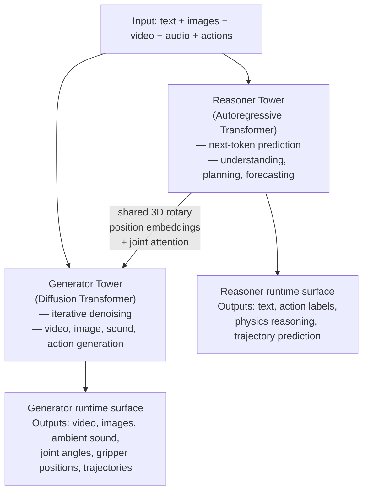
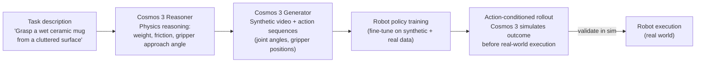

## The Training Data Problem Nobody Talks About

Teaching a robot arm to pick up a mug sounds simple. In practice, it means generating thousands of training examples: the mug at different angles, different lighting, slippery surfaces, the gripper approaching from the wrong angle. Collecting that data in the real world is slow, expensive, and sometimes dangerous. The standard answer is simulation, but most simulators are either too synthetic to transfer to the real world, or they require a team of engineers to set up and maintain.

Autonomous vehicle development runs into the same wall. You need training examples for rare edge cases — a child running into the street, a truck jackknifing on a wet highway — but you can't send fleets of cars into traffic hoping those situations happen naturally. The solution, again, is synthetic data, and the bottleneck is generating it fast enough and realistically enough to matter.

For most of the last decade, the world model and the action model were separate components. One model understood what it was seeing. A different model decided what to do about it. A third generated synthetic video for training. Tying them together required custom glue code for every application and made the systems brittle when conditions changed. The models didn't share a common representation of physical reality.

NVIDIA Cosmos 3 changes that. Launched on May 31, 2026 at GTC Taipei, Cosmos 3 is the first fully open **omnimodel** for physical AI — a single system that can see the world, reason about physics and objects, simulate what happens next, generate realistic training data, and emit robot actions, all within one unified architecture.

---

## What Is an Omnimodel?

An omnimodel is exactly what it sounds like: a model that handles multiple modalities — text, images, video, audio, and action sequences — without switching between separate specialised components. This is different from a multimodal model in an important way. Most multimodal models are trained to *understand* multiple modalities. An omnimodel must also *generate* across those modalities, and Cosmos 3 adds a third requirement on top of that: generating physically grounded outputs, meaning outputs that obey real-world constraints like gravity, inertia, and object permanence.

Before Cosmos 3, NVIDIA's Cosmos platform was a family of separate tools:

- **Cosmos Predict** for video world simulation
- **Cosmos Transfer** for controlled video generation from driving or robot data
- **Cosmos Reason** for visual understanding and physics-grounded chain-of-thought
- **Cosmos Policy** for fine-tuning video models into robot control policies

Each was strong in its domain, but using them together meant stitching outputs and managing different model interfaces. Cosmos 3 collapses all of this into a single model that can act as a vision-language model, a video generator, a physics simulator, a robot policy, or all four at once depending on how you prompt it.

---

## The Two-Tower Architecture

The key insight in Cosmos 3's design is that **reasoning and generation require fundamentally different mechanisms**, but they need to share a model of the world. Forcing one mechanism to do both creates compromises in each. Cosmos 3 solves this with a **two-tower Mixture-of-Transformers (MoT)** architecture.

The **Reasoner Tower** is an autoregressive transformer — the same basic mechanism behind GPT-style language models. It predicts the next token given all prior tokens, which makes it good at sequential reasoning: understanding a scene, generating captions, predicting what happens next, producing chain-of-thought explanations of physical events.

The **Generator Tower** is a diffusion transformer. Rather than predicting token by token, it starts from noise and iteratively denoises it into a coherent output. Diffusion is better at producing high-fidelity continuous outputs like video frames and images, where the whole output must be globally consistent rather than locally predicted token by token.

What makes Cosmos 3's design distinctive is that these towers are not independent — they cannot be run in isolation. **The Generator cannot operate without the Reasoner.** The two towers share three-dimensional rotary position embeddings across the spatial and temporal axes, and their layers interact through joint attention. Reasoning happens first, by design, before any generation begins. A robot planning its next move cannot produce a trajectory until Cosmos 3 has reasoned about the scene it is in.

The model ships in three sizes:

| Variant | Total parameters | Base transformer |
|---|---|---|
| **Edge** | 4B | 2B dense transformer (trained from scratch) |
| **Nano** | 16B | 8B dense (initialised from Qwen3-VL) |
| **Super** | 64B | 32B dense (initialised from Qwen3-VL) |

Edge is designed for on-device inference in embedded robotics. Nano is the workhorse for most research workloads. Super targets large-scale synthetic data generation and the most demanding simulation tasks.

---

## Two Runtime Surfaces, One Model

Developers interact with Cosmos 3 through two runtime surfaces. Switching between them is a matter of how you structure the input — the same model weights serve both.

**Reasoner** accepts text and visual inputs and produces text outputs. You use it to ask Cosmos 3 to describe a scene, predict what will happen in the next five seconds, explain why an object will fall given its current position, or generate a step-by-step plan for a manipulation task. Reasoner is the world model's understanding layer.

**Generator** accepts a richer input palette — text, images, video, ambient sound, and action data — and produces multimodal outputs. This is where Cosmos 3 becomes directly useful for training pipelines:

- **Video generation**: Given a description of a scenario, Cosmos 3 produces temporally coherent video that respects the physical constraints of the scene. This is synthetic data for training downstream models.
- **Action generation**: Cosmos 3 can output robot-executable action sequences — joint angles, gripper positions, and trajectory waypoints — that can be fed directly into robot control loops without translation.
- **Action-conditioned rollouts**: Given an action sequence and a starting state, Cosmos 3 simulates what the world would look like after the actions are taken, enabling model-predictive control without a separate physics simulator.
- **Ambient sound synthesis**: Cosmos 3 generates physically appropriate audio for video sequences — the scrape of a gripper against metal, the slap of a robot foot on concrete — which matters for multi-sensory training regimes.

---

## Why This Compresses Training From Months to Days

The canonical bottleneck in physical AI development looks like this:

1. Define the task (e.g., "pick up an irregular object from a cluttered tray").
2. Collect real-world training data — hours of robot teleoperation or manual curation.
3. Identify edge cases missing from the training set.
4. Go back to step 2 to collect more data for those cases.
5. Repeat until generalisation is good enough for deployment.

In practice this loop takes months. Data collection is expensive, edge cases are rare, and the infrastructure to replay training scenarios does not exist for most teams.

Cosmos 3 shortcuts most of this. Given a text description of any scenario — "the box is tilted at 30 degrees with a smooth surface and poor lighting" — it can generate physically realistic video plus the corresponding robot action sequence for that scenario in minutes. Teams can enumerate edge cases programmatically, generate training data for each, and verify policy behaviour in simulation before a single real-world run.

NVIDIA's claim that this compresses physical AI training and evaluation cycles **from months to days** is a direct consequence of removing the real-world data bottleneck for the long tail of edge cases. The real world is still needed for final validation, but the iteration loop that accounts for most of the calendar time moves into fast simulation.

---

## What It Looks Like in Practice: Robotics

For a robotic manipulation task, a developer's workflow with Cosmos 3 looks roughly like this:

The action output is not a description of how to move — it is numerical data: specific joint angles at specific timesteps, specific gripper forces. This is what makes Cosmos 3 different from a multimodal model that generates video and then requires a separate system to interpret that video as motion commands. The robot training pipeline gets shorter because there is no translation step in the middle.

---

## What It Looks Like in Practice: Autonomous Vehicles

For autonomous vehicle development, Cosmos 3 is most valuable as a **scenario generator** for rare and dangerous events. An AV team might have millions of hours of ordinary highway driving but only a handful of examples of a pedestrian stepping unexpectedly into a bike lane, or a traffic light malfunctioning during a left turn.

Cosmos 3 can generate photorealistic video of those scenarios from a text description, with physically consistent motion of every object in the scene. AV engineers can then use that synthetic data to train and test perception and planning models without waiting for the rare event to occur in the real world or constructing an expensive closed-course scenario.

---

## The Open Release and the Cosmos Coalition

Cosmos 3 ships under the **OpenMDW-1.1 license**, with model weights, training scripts, and deployment tools all available on GitHub and Hugging Face. This is not the first open release in the Cosmos family, but it is the most comprehensive: previous versions required separate licensing for commercial use, while OpenMDW-1.1 allows commercial fine-tuning and deployment with attribution.

Alongside the model release, NVIDIA announced the **Cosmos Coalition** — a group of AI labs and robotics companies committing to build on and contribute to the Cosmos ecosystem. Founding members include Agile Robots, Black Forest Labs, Generalist, LTX, Runway, and Skild AI. The coalition's goal is faster interoperability: if a robot policy trained on Cosmos 3 data can be deployed across multiple hardware platforms without reimplementation, the entire field moves faster.

The open release is also a strategic play. Making a frontier foundation model freely available accelerates the ecosystem of tools, fine-tunes, and integrations built on top of NVIDIA's architecture. Every team that builds on Cosmos 3 creates a dependency on the NVIDIA hardware stack it runs on — a version of the same playbook that made CUDA the default compute layer for deep learning a decade ago.

---

## How Does It Compare to Existing Approaches?

Three categories of prior work are most directly relevant:

**Video diffusion models** (Sora, Runway Gen-3, Kling) generate impressive video but do not reason about physical constraints and cannot output action sequences. They are content generators, not physical simulators.

**World models** (DreamerV3, TDMPC2) are trained to predict environment state given past observations and actions, and they can generate action-conditioned rollouts. But they are typically domain-specific, trained on data from a single robot in a single environment, and do not generalise to new tasks without significant retraining.

**Vision-Language-Action models** (Google's RT-2, OpenVLA, Pi0) unify vision understanding with action generation but do not include a world generation component — they cannot produce synthetic training data for their own fine-tuning.

Cosmos 3 is attempting to occupy a space none of these categories cover: a **generalist physical AI foundation model** that can act as a VLM, a world simulator, a synthetic data engine, and a robot policy, depending on which runtime surface you call.

---

## What It Cannot Do Yet

Cosmos 3 does not make real-world testing irrelevant. Sim-to-real transfer — the gap between a model's behaviour in simulation and its behaviour on physical hardware — remains an active research problem. Cosmos 3 narrows the gap by producing more physically accurate synthetic data than earlier tools, but physical contact dynamics, material properties, and sensor noise in real deployments still surprise systems that trained entirely in simulation.

The Edge variant (4B parameters) is designed for on-device inference, but running the Super variant (64B parameters) for real-time control on a robot requires significant compute. Most teams will use Cosmos 3 Super for offline synthetic data generation and Cosmos 3 Edge or a fine-tuned policy derivative for on-device deployment.

---

## The Bigger Picture

Jensen Huang's framing at GTC Taipei — "the big bang of physical AI is just around the corner" — is easy to dismiss as a product launch line. But the underlying argument is structural. Language model development accelerated dramatically when large, general-purpose pretrained models became freely available for fine-tuning. Before that, each NLP application required training a model from scratch on task-specific data. The open release of BERT in 2018 compressed the time-to-deployment for most NLP tasks from months to weeks.

Physical AI has lacked that moment. Every robotics team has been training from scratch, on private data, with custom simulation pipelines. Cosmos 3 is an attempt to provide the common pretrained foundation that language AI got from GPT-2 and BERT — a general model that has already learned what physics looks like, what objects do, and how actions translate to outcomes.

Whether Cosmos 3 becomes the BERT of physical AI depends on how well its synthetic data transfers to real deployments, and whether the Cosmos Coalition builds a diverse enough ecosystem of fine-tunes and applications to generate the network effects that made MCP or Kubernetes irreplaceable. But the architectural decision to unify reasoning, simulation, and action generation in a single open model is the right move. The question is whether the sim-to-real gap narrows fast enough to match the ambition.

---

## Sources

- [NVIDIA Launches Cosmos 3, the Open Frontier Foundation Model for Physical AI — NVIDIA Newsroom](https://nvidianews.nvidia.com/news/nvidia-launches-cosmos-3-the-open-frontier-foundation-model-for-physical-ai)
- [Cosmos 3: Omnimodal World Models for Physical AI — NVIDIA Research Technical Report](https://research.nvidia.com/labs/cosmos-lab/cosmos3/technical-report.pdf)
- [How Cosmos 3 Helps Physical AI Think Before It Acts — NVIDIA Blog](https://blogs.nvidia.com/blog/cosmos-3-physical-ai-open-world-foundation-model/)
- [Develop Physical AI Reasoning, World, and Action Models with NVIDIA Cosmos 3 — NVIDIA Technical Blog](https://developer.nvidia.com/blog/develop-physical-ai-reasoning-world-and-action-models-with-nvidia-cosmos-3/)
- [Welcome NVIDIA Cosmos 3: The First Open Omni-model for Physical AI Reasoning and Action — Hugging Face](https://huggingface.co/blog/nvidia/cosmos-3-for-physical-ai)
- [NVIDIA Releases Cosmos 3: A Two-Tower Mixture-of-Transformers Foundation Model — MarkTechPost](https://www.marktechpost.com/2026/06/03/nvidia-releases-cosmos-3-a-two-tower-mixture-of-transformers-foundation-model-unifying-physical-reasoning-world-generation-and-action-generation/)
- [NVIDIA Cosmos GitHub Repository — GitHub](https://github.com/nvidia/cosmos)
- [Cosmos 3 Release Notes — GitHub](https://github.com/NVIDIA/cosmos/releases/tag/Cosmos3)
- [Nvidia Cosmos 3 Brings Open Weights to Robotics — eWeek](https://www.eweek.com/news/nvidia-cosmos-3-physical-ai/)
- [Nvidia Cosmos 3 targets AV and robotics training workloads — Automotive World](https://www.automotiveworld.com/news/nvidia-cosmos-3-targets-av-and-robotics-training-workloads/)
- [NVIDIA launches Cosmos 3, chip-fab tools and humanoid robot platform — Interesting Engineering](https://interestingengineering.com/ai-robotics/nvidia-physical-ai-cosmos3-humanoid-robots-tsmc)
