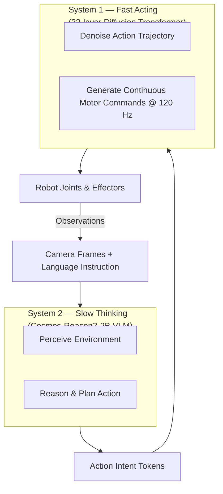
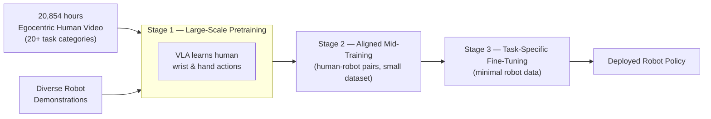

## The Robot Dexterity Bottleneck

Building a robot that can pick up a cup isn't hard. Building a robot that can pick up *any* cup — on any surface, from any angle, in a cluttered kitchen — has resisted decades of engineering effort.

The problem isn't processing power or actuator precision. It's data. Teaching a robot the full richness of human dexterity requires an enormous variety of training examples showing what hands do in the real world. And collecting that data via robot teleoperation is slow, expensive, and fundamentally bottlenecked by how many robot-hours you can buy.

In April 2026, NVIDIA published research and released a model that proposes a different answer: train on humans instead.

---

## What Is Isaac GR00T N1.7?

NVIDIA Isaac GR00T N1.7, released in early access on April 17, 2026, is a 3-billion-parameter **Vision-Language-Action (VLA) foundation model** for humanoid robots. It is open and commercially licensed under Apache 2.0, available on Hugging Face and GitHub — which puts it in the hands of every robotics team in the world, not just those with expensive in-house research infrastructure.

The "foundation model" framing matters here. Just as a language model like GPT is pre-trained on internet text and then fine-tuned for specific tasks, GR00T N1.7 is pre-trained on vast human and robot data, then fine-tuned for specific robot embodiments and tasks. The idea is that most of what a robot needs to know about manipulation — how joints move, how to approach an object, how to recover from a slip — can be learned *once* from generalized data, rather than relearned for every new robot and task.

---

## The Dual-System Architecture

GR00T N1.7's design draws directly from cognitive science. Kahneman's "thinking fast and slow" maps surprisingly well onto robot control: some actions require slow, deliberate reasoning; others demand fast, fluid execution.

GR00T N1.7 implements this as two tightly coupled systems:

**System 2** — the vision-language module — runs on a Cosmos-Reason2-2B backbone (built on the Qwen3-VL architecture). It reads the scene and the natural-language instruction together, producing a high-level action plan.

**System 1** — a 32-layer Diffusion Transformer (DiT) — takes that plan and generates precise, continuous motor commands at 120 Hz. The diffusion architecture is important: by iteratively denoising a trajectory rather than predicting a single discrete action, it produces smoother, more natural motion — closer to how a human hand actually moves.

The two systems are jointly trained, so System 2's reasoning is shaped by what System 1 can actually execute, and System 1's denoising is grounded in the semantic intent from System 2.

One subtle but important design choice: N1.7 represents actions as **relative end-effector deltas** — movements described as changes from the current position, rather than absolute joint targets. This shared representation works for both human hand motion and robot arm motion, which is precisely what enables the EgoScale transfer.

---

## EgoScale: Training on Humans Instead of Robots

The key question in robot learning is: *where does the training data come from?*

Until recently, the standard answer was robot teleoperation — human operators guiding robots through tasks while sensors log joint states and camera frames. It works, but it's expensive and slow. The largest datasets before EgoScale contained roughly 1,000 hours of demonstrations.

NVIDIA's EgoScale research asked a different question: **what if you used humans?**

The EgoScale dataset contains **20,854 hours** of egocentric human video — footage shot from a first-person perspective, hands and objects in frame — spanning more than 20 task categories including tool use, food prep, assembly, and object handling. That's more than 20× larger than any prior robot-learning dataset.

The transfer mechanism is a three-stage recipe:

1. **Human pretraining**: Train the VLA to predict human wrist and hand actions from egocentric video — no robot involved at this stage.
2. **Aligned mid-training**: Apply a small bridging dataset of human demonstrations paired with equivalent robot demonstrations, closing the gap between human and robot morphology.
3. **Task-specific fine-tuning**: Standard fine-tuning on a small set of robot demonstrations for the target task.

The crucial finding is that Stage 1 transfers remarkably well to Stage 3 — the manipulation priors learned from watching humans directly improve downstream robot task completion.

---

## The Scaling Law Discovery

The most scientifically significant result from EgoScale isn't a benchmark number. It's a **scaling law**.

Researchers found a near-perfect log-linear relationship (R² = 0.9983) between the volume of human egocentric pretraining data and the VLA's validation loss. In plain terms: more human video produces predictably better robot performance, with no sign of diminishing returns in the current data range.

Going from 1,000 to 20,000 hours of human video **more than doubled** average task completion rates. The final policy improved average success rate by **54%** over a no-pretraining baseline when operating a 22-degree-of-freedom dexterous robotic hand — one of the most mechanically complex scenarios in current manipulation research.

This matters enormously because scaling laws are what transformed language models from research curiosities into the backbone of modern AI. Before relationships between data, compute, and performance became predictable, training large models was partly guesswork. Once Chinchilla-style laws were established, labs could plan with confidence.

EgoScale argues the same era is opening for robot dexterity. If performance scales log-linearly with human video, then the path to more capable robots is straightforward: collect more human footage. That's far cheaper and faster than running robot teleop experiments.

The result also validates a deeper hypothesis: **human motion is a genuine prior for robot motion**, even though the morphologies differ. Hands are hands, regardless of whether they're made of flesh or metal and carbon.

---

## From Lab to Factory Floor

Theory is one thing. What's more striking in April 2026 is that GR00T-powered robots are already operating in real factories.

At **Hannover Messe 2026** (April 20–24), NVIDIA and over 110 robot-brain-developer partners demonstrated physical AI systems completing real production tasks on the show floor. The ecosystem includes ABB, Agility Robotics, FANUC, Figure AI, KUKA, Skild AI, Universal Robots, and YASKAWA, among many others.

Two deployments stood out:

**Siemens — Erlangen, Germany**: Humanoid's wheeled humanoid robot, running on NVIDIA Jetson Thor, completed a two-week logistics trial at a Siemens electronics factory in January 2026 ahead of the April announcement. Results: 60 tote moves per hour, autonomous operation exceeding 8 consecutive hours, and autonomous pick-and-place success rates above 90%. All target performance metrics were met.

**BMW — Leipzig, Germany**: Hexagon Robotics' AEON robot made its operational debut at BMW Plant Leipzig, where it supports high-voltage battery assembly and component production. AEON runs on NVIDIA Jetson Orin and was trained largely through simulation on NVIDIA's Isaac platform. Additional testing runs through spring 2026 ahead of full pilot operations in summer.

These aren't trade show demos. They're production deployments with measurable throughput numbers, and both cite NVIDIA's physical AI stack as the enabling technology.

---

## Why Openness Changes the Calculus

GR00T N1.7's Apache 2.0 license means any organization — a robotics startup, a university lab, or a manufacturing enterprise — can use it in commercial products without licensing fees or restrictions. NVIDIA has also partnered with Hugging Face to integrate Isaac GR00T into the LeRobot open-source framework, putting the model alongside the same tooling the AI community uses to fine-tune language models today.

The robotics research world has historically been fragmented, with each lab building its own training infrastructure, data pipeline, and evaluation protocol from scratch. A shared foundation model changes that — the same way ImageNet-pretrained models changed computer vision research in the 2010s. Fine-tuning from a common base is faster, cheaper, and produces more comparable results.

NVIDIA's strategy here echoes what they've described as wanting to be the "Android of generalist robotics" — an open platform that runs on their hardware and becomes the default base for the industry.

---

## What Comes Next

NVIDIA has previewed **GR00T N2**, built on a "DreamZero" world action model architecture. Rather than predicting actions directly from observations, N2 builds a learned world model inside the policy — the robot simulates probable consequences before committing to a move. NVIDIA says N2 helps robots succeed at new tasks in new environments more than twice as often as current VLA models. Availability is expected by the end of 2026.

The broader arc is clear. Physical AI is tracing the same trajectory as language AI: from task-specific models to generalist foundation models, from proprietary pipelines to open ecosystems, from research papers to factory floors.

The question is no longer whether AI can make robots dexterous. The EgoScale scaling law suggests it's a matter of data volume. The question now is how fast the data flywheel spins — and who builds it first.

---

## Sources

- [NVIDIA Releases New Physical AI Models as Global Partners Unveil Next-Generation Robots — NVIDIA Newsroom](https://nvidianews.nvidia.com/news/nvidia-releases-new-physical-ai-models-as-global-partners-unveil-next-generation-robots)
- [EgoScale: Scaling Dexterous Manipulation with Diverse Egocentric Human Data — arXiv:2602.16710](https://arxiv.org/abs/2602.16710)
- [GR00T N1: An Open Foundation Model for Generalist Humanoid Robots — arXiv:2503.14734](https://arxiv.org/abs/2503.14734)
- [NVIDIA Isaac GR00T — GitHub Repository](https://github.com/NVIDIA/Isaac-GR00T)
- [EgoScale: NVIDIA Research Project Page](https://research.nvidia.com/labs/gear/egoscale/)
- [NVIDIA and Global Robotics Leaders Take Physical AI to the Real World — NVIDIA Newsroom](https://nvidianews.nvidia.com/news/nvidia-and-global-robotics-leaders-take-physical-ai-to-the-real-world)
- [Siemens and Humanoid Bring Physical AI to the Factory Floor — PR Newswire](https://www.prnewswire.com/news-releases/siemens-and-humanoid-bring-physical-ai-to-the-factory-floor-deploying-humanoids-in-industrial-operations-with-nvidia-302744559.html)
- [BMW Group: First Humanoid Robot Introduced in Plant Leipzig — BMW Group News](https://www.bmwgroup.com/en/news/general/2026/humanoid-robot-in-leipzig.html)
- [NVIDIA and Partners Showcase AI-Driven Manufacturing at Hannover Messe 2026 — Robotics and Automation News](https://roboticsandautomationnews.com/2026/04/20/nvidia-and-partners-showcase-ai-driven-manufacturing-systems-at-hannover-messe-2026/100766/)
- [The Human Scale: NVIDIA's EgoScale Unlocks High-Dexterity Robotics via 20,000 Hours of Human Video — Humanoids Daily](https://www.humanoidsdaily.com/news/the-human-scale-nvidia-s-egoscale-unlocks-high-dexterity-robotics-via-20-000-hours-of-human-video)
- [Early Access: Isaac GR00T N1.7 — NVIDIA Developer Forums](https://forums.developer.nvidia.com/t/early-access-isaac-gr00t-n1-7-open-reasoning-vla-model-for-humanoid-robotics/366916)
