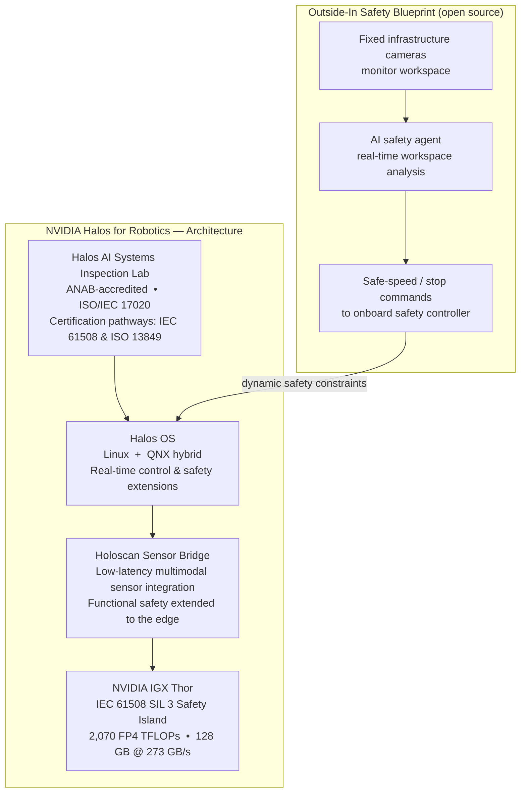

The robots are already in the warehouses. Digit, Agility Robotics' bipedal humanoid, has been shipping packages at Amazon facilities, handling materials at GXO logistics centers, and assembling parts at Toyota and Schaeffler plants. And yet until June 22, 2026, there was no standardized safety system designed specifically for how a humanoid AI robot and a human coworker could share the same floor.

NVIDIA changed that with the launch of **Halos for Robotics**, the first full-stack safety system built for physical AI.

---

## Why Humanoid Robot Safety Is Harder Than It Sounds

Industrial robots have had safety standards for decades. The key frameworks — ISO 10218, ISO 13849, IEC 61508 — assume a robot fixed to a floor, operating inside a defined zone, that stops when a human steps inside a perimeter. A welding arm bolted to a workcell is relatively predictable: the failure modes are well-understood and the safety interlocks are straightforward.

A humanoid robot is a completely different problem.

Digit walks on two legs through a warehouse. It steps around pallets, adjusts its grip dynamically, and makes real-time decisions about its environment — decisions driven by AI models rather than deterministic control code. The standards that govern a fixed welding arm don't translate: the failure modes are different, AI components introduce uncertainty that hard-coded interlocks can't cover, and the robot roams an entire facility rather than operating inside a cage.

A survey of safety engineers in early 2026 found that most humanoid robot deployments fell into a **regulatory gap**: no existing standard directly addresses dynamically stable, AI-driven bipedal robots in shared human workspaces. Standards bodies like IEEE and ISO are working to fill this gap, but realistic timelines suggest ratified humanoid-specific standards are 18–36 months away.

That's where Halos comes in.

---

## What Halos for Robotics Actually Is

Halos for Robotics is a four-layer architecture that provides safety guarantees from silicon to certification. Think of it like the safety system in a modern car — not just airbags, not just ABS, but a coordinated stack where hardware, software, and sensors all share the same definition of "safe," and all fail gracefully in concert.

The four layers are:

1. **NVIDIA IGX Thor** — the certified compute hardware foundation
2. **Holoscan Sensor Bridge** — the safety-certified sensor integration layer
3. **Halos OS** — a hybrid real-time operating system built for safety-critical robots
4. **Halos AI Systems Inspection Lab** — the certification pathway and ecosystem anchor

---

## Layer 1: The Safety Island in the Chip

The hardware foundation is **NVIDIA IGX Thor**, an industrial-grade AI compute module. Its most unusual feature is the **Functional Safety Island (FSI)** — a physically isolated processor embedded in the same chip, with its own dedicated power supply, clock, and I/O that has no runtime dependency on the main AI compute domain.

The FSI is IEC 61508 SIL 3 capable — the same Safety Integrity Level used for braking systems in trains, industrial gas turbines, and nuclear plant controls. It includes over 22,000 safety mechanisms that continuously monitor the main SoC for hardware faults and trigger emergency responses when anomalies are detected.

An analogy: imagine a car where the brakes are governed by a separate computer that has no software connection to the infotainment system, and that computer has been audited to the same standards as aircraft avionics. That's roughly what the FSI provides for a robot's safety-critical functions.

On the AI side, IGX Thor is powerful: 2,070 FP4 TFLOPs of AI compute, 14 ARM Neoverse CPU cores, and 128 GB of memory at 273 GB/s. The unified module matters because the safety domain and the AI domain are co-located — so a safety decision can reach the motors in milliseconds, not hundreds of milliseconds.

---

## Layers 2 and 3: Sensors and Software in the Safety Chain

A safety system aware only of the compute module is incomplete. The **Holoscan Sensor Bridge** extends functional safety guarantees out to the cameras, LiDAR, and force-torque sensors at the robot's fingertips. Sensor data arrives over a safety-certified path rather than a best-effort network connection, which means the FSI can include sensor health and data integrity in its safety calculations — not just assume the sensors are working.

Running on top of IGX Thor, **Halos OS** is a hybrid operating system that pairs Linux with QNX. Linux gives software developers familiar tooling for running AI models and application code. QNX, a real-time OS with a long track record in safety-critical embedded systems (it's in medical devices and automotive ECUs), ensures that safety-critical tasks get deterministic, bounded execution times — something Linux alone cannot guarantee. The two run in parallel, each handling the work it's certified for.

---

## The Outside-In Safety Blueprint: Eyes Beyond the Robot

One of the most interesting parts of Halos doesn't live on the robot at all. The **Outside-In Safety Blueprint** is an open-source reference architecture (Apache 2.0, available on GitHub) that uses fixed infrastructure cameras mounted in a facility — on walls, ceilings, or overhead gantries — to monitor the workspace and dynamically adjust the robot's safety constraints in real time.

Here's the scenario it addresses: a robot is allowed to move at full speed through an empty aisle. A worker walks in from a side corridor — outside the robot's current sensor range. How does the robot know to slow down before the human is close enough to trigger onboard sensors?

With the Outside-In Blueprint, facility cameras detect the worker and send a constraint update to Halos OS *before* the human enters the robot's immediate perception envelope. The robot slows to a collaborative-safe speed. When the worker leaves the zone, it resumes full speed. The robot's onboard sensing remains active as a last-resort layer, but the external camera network gives it a larger, earlier safety envelope.

In NVIDIA's warehouse-loading demonstration, external cameras monitor autonomous forklifts and human workers at trailer docks. The Safety Core — the blueprint's decision engine — determines in real time whether equipment can safely enter the loading zone. The key insight: outside-in and on-board sensing aren't competitors; they're complementary layers of a defense-in-depth architecture.

---

## Agility's Digit: First in Line

Agility Robotics is the first company to formally integrate Halos for Robotics into a production humanoid. Digit is already operating at Amazon, GXO, Schaeffler, and Toyota Motor Manufacturing Canada — but the Halos-integrated version targets deployment in **late 2026**.

The integration path runs through the **Halos AI Systems Inspection Lab**, an ANAB-accredited inspection body (ISO/IEC 17020) that NVIDIA has established to help partners assess their systems against IEC 61508 and ISO 13849 before engaging third-party certification bodies. Preassessed certification pathways held by the Lab significantly reduce the time and cost of formal sign-off — a critical bottleneck for companies trying to get robots through regulatory approval before the relevant industry standards have even been published.

Boston Dynamics, Hesai, and 40 other companies spanning manufacturers, certification bodies, and sensor makers have joined the Halos partner ecosystem.

---

## Standing on 18,600 Engineering Years

The headline number from NVIDIA's announcement: Halos for Robotics draws on **more than 18,600 engineering years** of safety development accumulated through NVIDIA's autonomous vehicle (AV) work on the DRIVE platform.

That heritage is significant. Autonomous vehicle safety engineering is one of the most demanding software disciplines in existence. DRIVE Orin — the AV chip that preceded IGX Thor — went through years of ISO 26262 automotive-grade functional safety analysis. The transfer isn't one-to-one: IEC 61508 (industrial) and ISO 26262 (automotive) are different standards. But the methodology, tooling, failure mode analysis processes, and institutional knowledge translate directly.

For robotics engineers, this is like inheriting a cathedral instead of having to pour the foundation. The structural engineering is largely done; what remains is adapting it to a new use case.

---

## What Comes Next

Halos for Robotics is NVIDIA placing a strategic bet: that robotics will need a safety platform the same way the automotive industry needed one in the 1990s — a common infrastructure any manufacturer can build on, backed by a broad ecosystem of hardware vendors, software partners, and certification bodies.

The main bottleneck blocking wider humanoid robot deployment isn't AI capability. The models are good enough for many tasks. The bottleneck is **liability and certification**: who is responsible when the robot hurts someone, and how do you prove the system meets a safety standard when no specific standard yet exists?

Halos doesn't fully resolve that problem — ratified standards for AI-driven humanoid robots are still years away. But it gives manufacturers a credible, documented, auditable safety architecture to point to, and an inspection lab that can produce pre-certification evidence. For companies already running pilots in industrial environments, that may be enough to move from cautious trials to broader rollout.

The open-source Outside-In Safety Blueprint signals something else: NVIDIA is not trying to own the entire safety stack. It wants to own the hardware layer and let the broader ecosystem build on top — a platform strategy that, if it works in robotics the way CUDA worked in AI compute, could make Halos the de facto safety foundation for an entire generation of physical AI systems.

---

## Sources

- [NVIDIA Announces Halos for Robotics — NVIDIA Newsroom](https://nvidianews.nvidia.com/news/nvidia-announces-halos-for-robotics-the-industrys-first-full-stack-safety-system-for-physical-ai)
- [Inside NVIDIA Halos for Robotics: A Full-Stack Functional Safety System for Physical AI — NVIDIA Technical Blog](https://developer.nvidia.com/blog/inside-nvidia-halos-for-robotics-a-full-stack-functional-safety-system-for-physical-ai/)
- [NVIDIA Halos Outside-In Safety Blueprint — GitHub (NVIDIA/halos-outside-in-safety)](https://github.com/NVIDIA/halos-outside-in-safety)
- [NVIDIA Halos Robotics Functional Safety Platform — NVIDIA AI Trust Center](https://www.nvidia.com/en-us/ai-trust-center/halos/robotics/)
- [NVIDIA and Agility Team Up on "Halos," the First Full-Stack Safety Architecture for Humanoids — Humanoids Daily](https://www.humanoidsdaily.com/news/nvidia-and-agility-team-up-on-halos-the-first-full-stack-safety-architecture-for-humanoids)
- [NVIDIA Releases Halos, a Full-Stack Safety System for Robotics — The Robot Report](https://www.therobotreport.com/nvidia-releases-halos-a-full-stack-safety-system-for-robotics/)
- [NVIDIA Launches Halos, Industry's First Full-Stack Robotics Safety System — Automation International](https://www.automation-mag.com/news/112130-nvidia-launches-halos,-industry%E2%80%99s-first-full-stack-robotics-safety-system)
- [NVIDIA Halos Powers Full-Stack Safety for Human-Humanoid Collaboration — Interesting Engineering](https://interestingengineering.com/ai-robotics/nvidia-halos-robotics-safety-system-humanoid-robots)
- [NVIDIA IGX Thor Powers Industrial, Medical, and Robotics Edge AI Applications — NVIDIA Technical Blog](https://developer.nvidia.com/blog/nvidia-igx-thor-powers-industrial-medical-and-robotics-edge-ai-applications/)
- [5 Humanoid Robot Challenges That Block Factory Deployment in 2026 — There's A Robot For That](https://theresarobotforthat.com/blog/humanoid-robot-challenges/)
