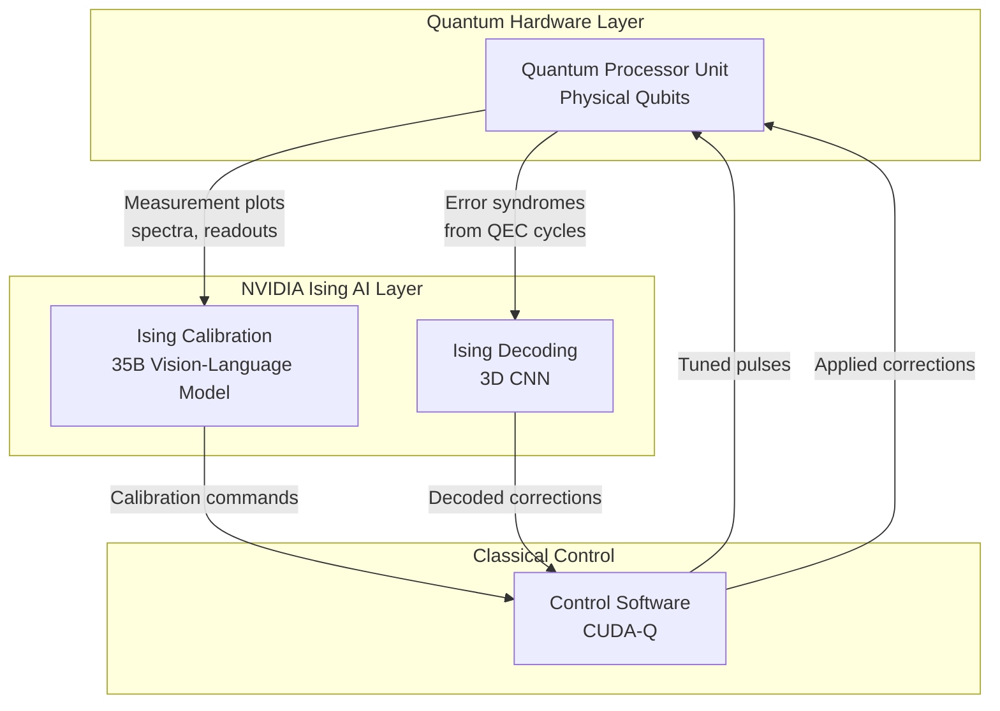
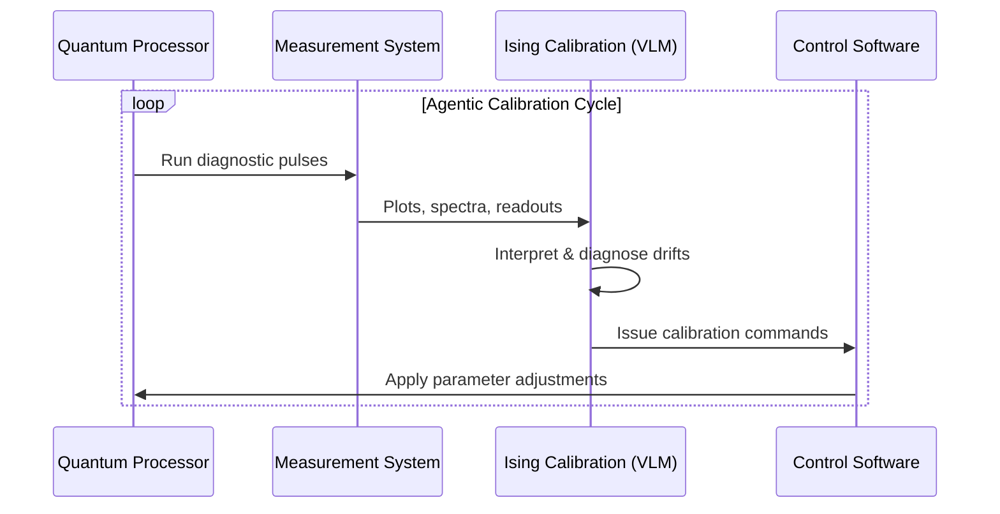
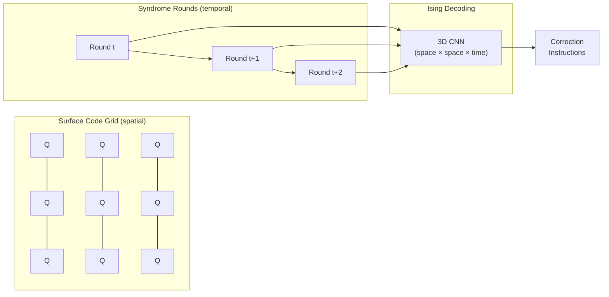

## The Promise and the Problem

Quantum computers hold out a breathtaking promise: problems that would take classical supercomputers millions of years to solve — simulating drug molecules, optimizing logistics networks, cracking cryptographic schemes — could theoretically be cracked in hours by a machine operating on quantum superposition and entanglement.

The word "theoretically" is doing a lot of work there.

Today's quantum processors are extraordinarily fragile. Their computing units — qubits — exist in delicate quantum states that collapse at the slightest disturbance. A stray electromagnetic field, a tiny vibration, even cosmic rays can flip a qubit from the right answer to the wrong one. Keeping a quantum computer running reliably is less like operating a supercomputer and more like trying to balance a thousand spinning tops simultaneously, inside a near-absolute-zero refrigerator, while nobody is allowed to look too closely at any of them.

Two problems sit at the core of this fragility: **calibration** (keeping the hardware tuned) and **error correction** (detecting and fixing mistakes in real time). NVIDIA's newly released Ising model family, launched April 14, 2026 under the Apache-2.0 license, is the first open-source attempt to attack both problems with AI.

## The Two Walls Blocking Useful Quantum Computing

### Wall One: Calibration Is a Never-Ending Job

Quantum processors require constant, meticulous tuning. Every qubit in a processor has dozens of physical parameters — resonance frequencies, coupling strengths, pulse durations — that drift continuously due to temperature fluctuations, electromagnetic noise, and material aging. When those parameters fall out of spec, computation quality degrades.

Traditionally, calibrating a quantum processor is a slow, manual process that can take days and requires deep hardware expertise. For a small research chip with a handful of qubits, that's manageable. For the multi-thousand-qubit processors needed for commercially useful quantum computing, it becomes a full-time job for a team of specialized engineers — and it never really ends.

### Wall Two: Error Correction Needs a Decoder That Can Keep Up

Because individual qubits are so error-prone, every practical quantum computing architecture relies on **quantum error correction (QEC)**. The idea is elegant: instead of trusting a single fragile physical qubit, you encode one "logical qubit" across many physical qubits. If a few of the physical qubits make errors, you can detect and correct those errors without ever directly reading the logical qubit's state — which would destroy it.

The most widely used QEC scheme today is the **surface code**. A 2D grid of physical qubits is periodically measured to detect error patterns. A classical algorithm called a **decoder** reads those measurements and determines what errors occurred, so corrections can be applied.

Here's the catch: the decoder has to run faster than errors accumulate. For a distance-13 surface code — a configuration needed for fault-tolerant computation on hardware with typical error rates — the decoder must process millions of measurement outcomes per second. Traditional decoders like pyMatching, currently the open-source industry standard, struggle to hit latency targets as qubit counts grow, and their accuracy degrades at lower error rates.

## What Is NVIDIA Ising?

NVIDIA Ising is the world's first family of open AI models built specifically for quantum computing infrastructure. The name references **Ernst Ising**, the physicist behind the Ising model — a mathematical framework for studying magnetic systems that has deep connections to the optimization problems central to quantum hardware.

The model family ships with open weights, training frameworks, datasets, and deployment tooling under the Apache-2.0 license. It targets the two walls above with two distinct models:

## Ising Calibration: Teaching AI to Tune Quantum Hardware

Ising Calibration is a **35-billion-parameter vision-language model** trained on multi-modal qubit data — the kind of measurement plots, spectroscopy graphs, and experimental readouts that a quantum engineer would normally spend hours interpreting at a whiteboard.

Think of it as an AI expert who has absorbed every calibration run ever logged across many quantum processors, and who can look at a Rabi oscillation plot or a qubit readout histogram and immediately say: "this qubit's resonance frequency has drifted 2 MHz, this coupling needs re-tuning, here's the sequence of steps to fix it."

The model is designed for an **agentic loop**: it receives measurement outputs from the quantum processor, interprets them, decides what parameters to adjust, issues calibration commands, and observes the results — all without human intervention.

To measure this capability, NVIDIA collaborated with quantum hardware partners to create **QCalEval** — the world's first benchmark for agentic quantum calibration. It's a six-part semantic scoring test covering: interpreting experimental results, classifying error types, evaluating statistical fit quality, identifying key features in qubit spectra, and generating actionable next-step recommendations.

On QCalEval, Ising Calibration outperforms every general-purpose frontier model:

| Model | QCalEval Score (relative) |
|---|---|
| Ising Calibration | **Best** |
| Gemini 3.1 Pro | −3.27% |
| Claude Opus 4.6 | −9.68% |
| GPT-5.4 | −14.5% |

The gap isn't surprising — general-purpose frontier models have never been trained on qubit spectroscopy data. But it shows that domain-specific training on specialized scientific hardware data can decisively outperform models many times larger on the tasks that actually matter for running real quantum processors.

## Ising Decoding: Making Error Correction Fast Enough

Ising Decoding attacks the real-time decoding bottleneck with a **3D convolutional neural network**. The architecture is purpose-built for the spatial and temporal structure of surface code syndromes: the 2D grid of qubit measurements forms the spatial dimensions, and rounds of syndrome measurements over time form the third.

The model ships in two variants — one optimized for minimum latency, one for maximum accuracy — giving hardware teams a tunable tradeoff. Both support FP8 quantization for efficient deployment on NVIDIA GPUs and integrate with the CUDA-Q quantum computing platform.

Against pyMatching — the current open-source standard:
- Up to **2.5× faster** decoding latency
- Up to **3× more accurate** (lower logical error rate)
- For distance-13 surface codes at p=0.003 error rate specifically: **2.3× faster** and **1.5× more accurate**

The 3× accuracy improvement compounds. In surface codes, logical error rate suppression depends exponentially on keeping the physical error rate well below a critical threshold. A better decoder effectively pushes that threshold lower — meaning you extract more reliable logical qubits from the same physical hardware you've already built, without needing more qubits or lower-noise components.

## Who Is Building With Ising?

NVIDIA coordinated early access with a broad set of quantum research institutions and commercial hardware companies. Adopters announced at launch include:

- **Academia Sinica** (Taiwan)
- **Fermi National Accelerator Laboratory**
- **Harvard John A. Paulson School of Engineering and Applied Sciences**
- **Infleqtion**
- **IQM Quantum Computers**
- **Lawrence Berkeley National Laboratory's Advanced Quantum Testbed**
- **UK National Physical Laboratory (NPL)**

The list spans academic research labs, national laboratories, and commercial quantum hardware vendors — suggesting that Ising is positioned as community infrastructure rather than a product tied to any specific qubit technology or hardware platform.

Quantum computing stocks surged in the days following the announcement, with investors reading NVIDIA's move as a signal that the software and tooling layer of quantum computing is maturing faster than expected.

## Why This Matters

The release matters on three levels.

**It legitimizes the AI-for-QEC category.** Prior work on AI-based quantum decoders has been mostly academic — proofs of concept on small simulated systems. Ising ships as production-ready open tooling with real benchmark data against real hardware at scale, which moves the conversation from "could this work?" to "here's how you deploy it today."

**Open weights lower the barrier to entry.** Quantum error correction research has historically required either expensive proprietary tools or years of expertise to build custom decoders from scratch. A community-accessible baseline model that outperforms prior open-source work by up to 3× on accuracy compresses that timeline dramatically for teams working on emerging quantum hardware platforms.

**It reveals NVIDIA's long-term strategy in quantum.** NVIDIA's core business is selling GPUs, and quantum computers don't run their quantum circuits on GPUs. But the classical control systems surrounding quantum computers — calibration loops, decoder inference, hybrid quantum-classical optimization — absolutely do. By positioning itself as the AI infrastructure layer for quantum systems, NVIDIA plants a flag in the stack that remains valuable regardless of which qubit technology wins the underlying hardware race. The bet is that whoever runs the classical AI layer of quantum computing captures significant value, no matter which physical qubit platform ultimately scales.

The road to fault-tolerant quantum computing is still long. Current processors have hundreds to low thousands of physical qubits; fault-tolerant computation for industrially relevant problems may require millions. But calibration and error correction are two of the hardest problems on that road, and Ising makes both meaningfully more tractable. For quantum hardware teams, that's not a small thing.

## Sources

- [NVIDIA Newsroom — NVIDIA Launches Ising, the World's First Open AI Models to Accelerate the Path to Useful Quantum Computers](https://nvidianews.nvidia.com/news/nvidia-launches-ising-the-worlds-first-open-ai-models-to-accelerate-the-path-to-useful-quantum-computers)
- [NVIDIA Technical Blog — NVIDIA Ising Introduces AI-Powered Workflows to Build Fault-Tolerant Quantum Systems](https://developer.nvidia.com/blog/nvidia-ising-introduces-ai-powered-workflows-to-build-fault-tolerant-quantum-systems/)
- [NVIDIA Ising — AI for Quantum Computing (product page)](https://developer.nvidia.com/ising)
- [The Quantum Insider — NVIDIA Launches Ising, the World's First Open AI Models](https://thequantuminsider.com/2026/04/14/nvidia-launches-ising-the-worlds-first-open-ai-models-to-accelerate-the-path-to-useful-quantum-computers/)
- [Tom's Hardware — Nvidia releases open AI models for quantum computing tasks — 'Ising' said to be 2.5x faster and 3x more accurate](https://www.tomshardware.com/tech-industry/artificial-intelligence/nvidia-releases-ising-open-ai-models)
- [MarkTechPost — NVIDIA Releases Ising: the First Open Quantum AI Model Family for Hybrid Quantum-Classical Systems](https://www.marktechpost.com/2026/04/19/nvidia-releases-ising/)
- [Quantum Computing Report — NVIDIA Launches Ising: Open AI Models for Quantum Processor Calibration and Error Correction](https://quantumcomputingreport.com/nvidia-launches-ising-open-source-ai-models-to-accelerate-quantum-development/)
- [CNBC — Quantum stocks on pace for a massive week after Nvidia debuts AI models to boost the tech](https://www.cnbc.com/2026/04/16/quantum-stocks-nvidia-ai-models.html)
- [Riverlane — Quantum Error Correction: Our 2025 Trends and 2026 Predictions](https://www.riverlane.com/blog/quantum-error-correction-our-2025-trends-and-2026-predictions)
- [Nature — Quantum error correction below the surface code threshold](https://www.nature.com/articles/s41586-024-08449-y)
