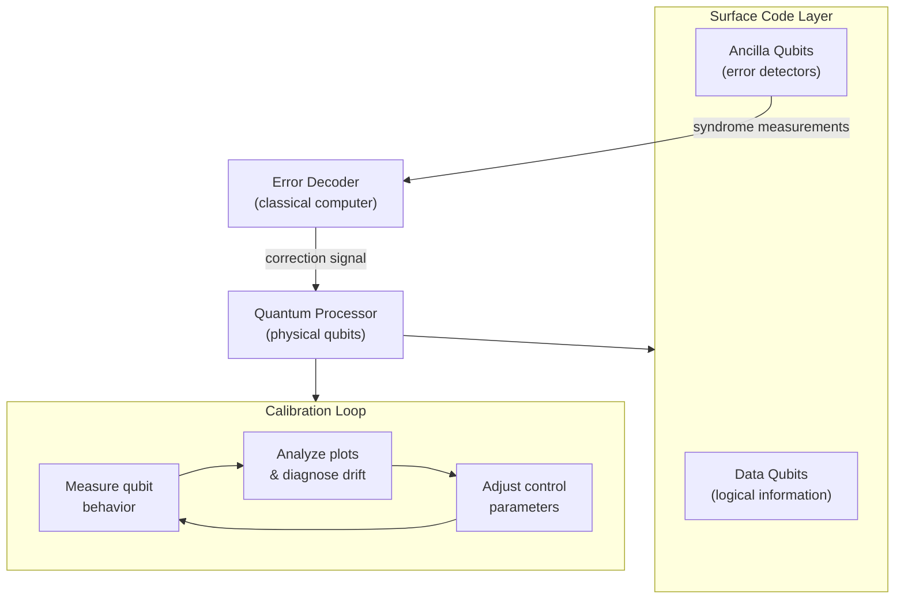
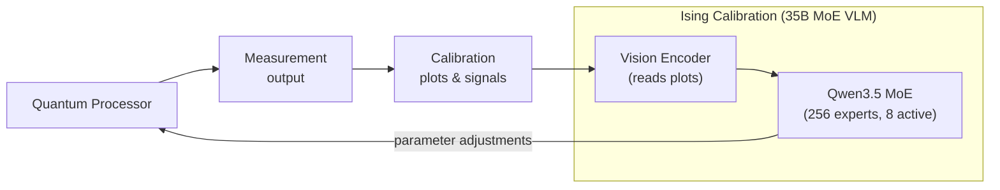
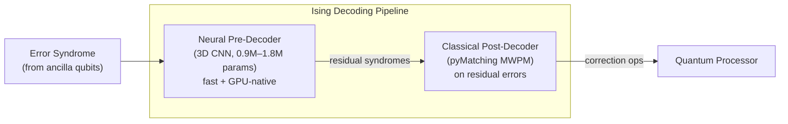

## A Quantum Computer Without a Babysitter

Imagine you built the world's most powerful calculator, but it required a team of specialists working around the clock just to keep it from giving wrong answers. That is, roughly speaking, the state of quantum computing today.

Modern quantum processors are extraordinarily sensitive machines. Qubits — the quantum equivalents of classical bits — lose their quantum properties within microseconds when the slightest vibration, temperature fluctuation, or stray electromagnetic field disturbs them. Engineers spend enormous effort on two problems that never fully go away: *keeping the processor calibrated* so it behaves as expected, and *continuously correcting errors* that creep in while a computation runs.

On **April 14, 2026** — World Quantum Day — NVIDIA released **Ising**, the world's first family of open-source AI models designed to take over both of those jobs. Named after the [Ising model](https://en.wikipedia.org/wiki/Ising_model), a foundational concept in statistical mechanics that predates the transistor, the release signals something significant: NVIDIA is positioning classical AI as the indispensable partner to quantum hardware.

---

## Why Quantum Computers Need Constant Attention

Before diving into what Ising does, it helps to understand why quantum computers are so hard to operate.

### Problem 1: Calibration

Every qubit in a quantum processor has a set of control parameters — the precise frequencies, pulse shapes, and timings that coax it into doing what you want. These parameters drift constantly. Temperature shifts, component aging, and environmental noise all change how qubits behave. A quantum processor that was perfectly tuned this morning may give wrong answers by afternoon.

Recalibrating a processor means running a battery of measurements, analyzing the resulting plots, diagnosing what drifted, adjusting parameters, and repeating. Today, this process takes **days** for large chips and typically requires expert quantum engineers who can interpret arcane measurement outputs. Scaling to the hundreds or thousands of qubits needed for practical applications makes manual calibration untenable.

### Problem 2: Quantum Error Correction

Quantum computers cannot simply "check their work" the way classical computers do. Measuring a qubit collapses its quantum state, destroying the computation. Instead, researchers use **quantum error correction (QEC)** — encoding a single *logical* qubit across many *physical* qubits, so that errors on individual physical qubits can be detected and fixed without ever directly reading the logical state.

The dominant approach today is the **surface code**, which arranges physical qubits in a 2D grid. Ancilla qubits around the edges detect errors indirectly, producing a pattern called the *error syndrome*. A classical algorithm — the **decoder** — reads the syndrome and determines which corrections to apply.

Here is the catch: the decoder must run *faster than errors accumulate*. On real hardware, this means sub-microsecond latency. The current open-source gold standard, **pyMatching**, implements minimum-weight perfect matching (MWPM), a graph algorithm that is accurate but computationally demanding. As qubit counts grow and error syndromes become more complex, classical decoders become a bottleneck.

---

## What NVIDIA Ising Is

Ising is two distinct AI models packaged together under a single open-source release:

| Model | Architecture | Size | Target Problem |
|-------|-------------|------|---------------|
| **Ising Calibration** | MoE Vision-Language Model | 35B total / ~3B active | Quantum processor calibration |
| **Ising Decoding** (Fast) | 3D Convolutional Neural Network | 0.9M parameters | Real-time QEC decoding (speed) |
| **Ising Decoding** (Accurate) | 3D Convolutional Neural Network | 1.8M parameters | Real-time QEC decoding (accuracy) |

Both are released under the **Apache 2.0 license** — fully open, commercially permissive, with weights on Hugging Face and training code on GitHub. NVIDIA also published data provenance, training methods, and tooling for fine-tuning and quantization.

---

## Ising Calibration: A Vision-Language Model That Reads Quantum Hardware

Ising Calibration (`Ising-Calibration-1-35B-A3B`) is a **35-billion-parameter Mixture-of-Experts vision-language model** built on top of Qwen3.5-35B-A3B. It has 256 expert sub-networks, 8 of which activate per token — meaning only about **3 billion parameters fire** during any given inference pass.

The model's unusual feature is its integrated vision encoder. Quantum calibration diagnostics are inherently visual: engineers inspect oscilloscope traces, qubit frequency sweeps, randomized benchmarking plots, and Ramsey fringe patterns. Ising Calibration was trained on this kind of data and can look at the *same images a human engineer would* and infer what corrections to make.

Paired with an **agentic workflow**, Ising Calibration iterates automatically: measure → analyze → adjust → measure again, until the processor returns to spec. NVIDIA reports this compresses calibration from **days to hours**.

On NVIDIA's new **QCalEval benchmark** for quantum calibration tasks, Ising Calibration outperforms Gemini 3.1 Pro, Claude Opus 4.6, and GPT 5.4 — general-purpose frontier models that, by comparison, have no domain-specific training on quantum hardware behavior.

---

## Ising Decoding: A Neural Pre-Decoder for Error Correction

The two Ising Decoding models are dramatically smaller — 0.9M and 1.8M parameters respectively — but they target a very different performance constraint: **real-time operation during an active quantum computation**.

Both are **3D convolutional neural networks** designed to decode surface code error syndromes. Rather than replacing pyMatching entirely, they act as a **neural pre-decoder**: they process the raw syndrome measurements first, correct a large fraction of errors, and pass the residual problem to a lightweight classical post-decoder. The result is a pipeline that is both faster and more accurate than running pyMatching alone.

NVIDIA's benchmarks for distance-13 surface codes at physical error rate p = 0.003:

- **Ising Decoding Fast**: 2.5× faster latency, 1.1× higher accuracy than pyMatching alone
- **Ising Decoding Accurate**: 2.3× faster latency, 1.5× higher accuracy than pyMatching alone

The speed improvement matters because the decoder runs in the feedback loop of an active quantum computation. Every microsecond of latency is time during which uncorrected errors accumulate.

---

## Where It Runs and Who Is Using It

Ising integrates with NVIDIA's **CUDA-Q** quantum software platform and the **NVQLink QPU-GPU interconnect**, which allows quantum processors and NVIDIA GPUs to communicate with low latency — a necessity for real-time error correction decoding.

Named early adopters and research partners at launch include:

- **IonQ** (using Ising Calibration directly in production)
- **Atom Computing**, **EeroQ**, **Q-CTRL**, **Conductor Quantum**
- **IQM Quantum Computers**, **Infleqtion**
- **Fermilab**, **Harvard**, **UK National Physical Laboratory**
- **Lawrence Berkeley National Laboratory's Advanced Quantum Testbed**
- **Academia Sinica**

The breadth of that list — spanning hardware companies, national laboratories, and universities across three continents — reflects how widely the calibration and decoding problems are felt.

---

## Why This Is a Bigger Deal Than It Looks

The surface headline is that NVIDIA released a quantum AI model. The deeper story is about where NVIDIA is positioning itself in the quantum ecosystem.

Quantum hardware companies — IonQ, IBM Quantum, Google Quantum AI, Rigetti — compete on qubit count, gate fidelity, and coherence time. NVIDIA is not competing on those axes. Instead, Ising plants a flag at the *classical compute layer* that quantum hardware depends on: the software and AI infrastructure that keeps processors running and interprets their outputs.

This is a familiar playbook. NVIDIA's GPUs did not build AI models themselves; they became the substrate on which AI was built. CUDA became the programming interface that researchers couldn't work without. CUDA-Q and now Ising are the same bet applied to quantum computing: become indispensable infrastructure before the market matures.

The market reaction was immediate. On April 14, IonQ's stock surged **more than 20%**, and the broader quantum computing sector rallied. Investors interpreted the announcement not as competition to quantum hardware makers, but as validation — a signal that NVIDIA sees the quantum market as real enough to commit to with open-source tooling.

---

## The Name Itself

The choice of "Ising" as the model name is worth a moment. Ernst Ising introduced the [Ising model](https://en.wikipedia.org/wiki/Ising_model) in his 1925 doctoral thesis as a simplified mathematical description of ferromagnetism: a lattice of spins that interact with their neighbors. It became one of the most widely studied models in statistical physics and, later, a benchmark problem for quantum optimization algorithms.

The Ising model sits at an interesting intersection: it is both a problem that quantum computers are expected to solve efficiently *and* a conceptual metaphor for the kind of local-interaction physics that governs qubit behavior. NVIDIA naming its quantum AI framework after it is a nod to this dual relevance — a rare case where a product name is also a physics pun with genuine technical resonance.

---

## What to Watch Next

Ising Calibration currently supports surface code processors and the calibration workflows used by its launch partners. Several open questions will determine how significant this release becomes in practice:

1. **Generalization across hardware modalities.** Ising was trained primarily on superconducting qubit data. Whether it transfers to trapped-ion, photonic, or neutral-atom processors — which have very different noise profiles — will determine how broadly it can be adopted.
2. **Real-time deployment at scale.** Ising Decoding's benchmarks are for distance-13 codes. Fault-tolerant quantum computing likely requires codes at distance 25 or higher. Performance at that scale remains to be demonstrated.
3. **Community fine-tuning.** With Apache 2.0 weights and published training frameworks, the quantum research community can now fine-tune Ising for their own hardware. How quickly a community of specialized variants emerges will mirror what happened with open language models after LLaMA.

NVIDIA has said additional Ising models are in development. Given the pace of the field, the April 14 release is likely a foundation, not a final product.

---

## The Big Picture

NVIDIA Ising is a proof of concept for something larger: using AI to operate quantum hardware at scale. The calibration and decoding problems it targets are not niche concerns — they are the two most immediate practical blockers between today's noisy quantum processors and the fault-tolerant systems that can run the algorithms quantum computing is famous for: drug discovery, materials simulation, cryptographic analysis, and combinatorial optimization.

Making those workflows automatable, fast, and open-source is not just a product launch. It is an argument that the path to useful quantum computing runs through AI — and that NVIDIA intends to own that path.

---

## Sources

- [NVIDIA Launches Ising, the World's First Open AI Models to Accelerate the Path to Useful Quantum Computers — NVIDIA Newsroom](https://nvidianews.nvidia.com/news/nvidia-launches-ising-the-worlds-first-open-ai-models-to-accelerate-the-path-to-useful-quantum-computers)
- [NVIDIA Ising Introduces AI-Powered Workflows to Build Fault-Tolerant Quantum Systems — NVIDIA Technical Blog](https://developer.nvidia.com/blog/nvidia-ising-introduces-ai-powered-workflows-to-build-fault-tolerant-quantum-systems/)
- [NVIDIA Launches Ising, the World's First Open AI Models to Accelerate The Path to Useful Quantum Computers — The Quantum Insider](https://thequantuminsider.com/2026/04/14/nvidia-launches-ising-the-worlds-first-open-ai-models-to-accelerate-the-path-to-useful-quantum-computers/)
- [NVIDIA Launches Ising Open Models for Quantum Computing — InfoQ](https://www.infoq.com/news/2026/04/nvidia-ising-quantum/)
- [nvidia/Ising-Calibration-1-35B-A3B — Hugging Face](https://huggingface.co/nvidia/Ising-Calibration-1-35B-A3B)
- [nvidia/Ising-Decoder-SurfaceCode-1-Accurate — Hugging Face](https://huggingface.co/nvidia/Ising-Decoder-SurfaceCode-1-Accurate)
- [NVIDIA Ising: Open AI Models for Quantum Calibration and Error Correction — postquantum.com](https://postquantum.com/industry-news/nvidia-ising-quantum-ai-models/)
- [NVIDIA Ising: The World's First Open AI Models to Scale Quantum Computing — The Tech Revolutionist](https://thetechrevolutionist.com/2026/04/nvidia-ising-open-source-ai-quantum-computing.html)
- [Nvidia Just Stunned the Quantum Computing Market — The Motley Fool](https://www.fool.com/investing/2026/05/04/nvidia-stun-quantum-computing-ionq-d-wave-rigetti/)
- [Evaluating Neural Pre-Decoding with NVIDIA Ising: From Surface to Bivariate Bicycle Codes — Quantum Computing Report](https://quantumcomputingreport.com/evaluating-neural-pre-decoding-with-nvidia-ising-from-surface-to-bivariate-bicycle-codes/)
- [Ising model — Wikipedia](https://en.wikipedia.org/wiki/Ising_model)
- [GitHub - NVIDIA/Ising-Decoding: A training framework for AI Quantum Error Correction Decoders](https://github.com/NVIDIA/Ising-Decoding)
