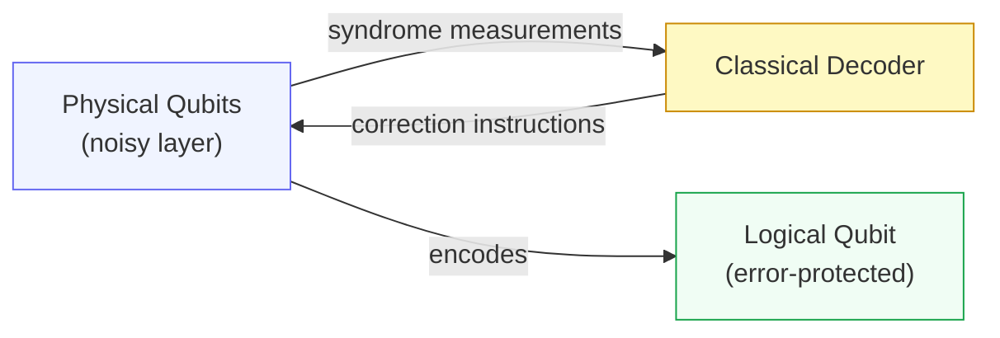
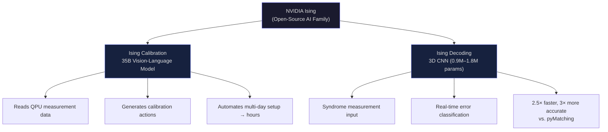
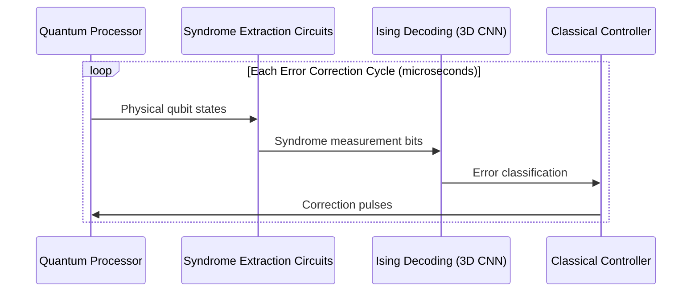

## The Promise and the Problem

Quantum computers can, in theory, solve certain classes of problems that classical computers cannot touch in any practical timeframe — drug discovery, materials simulation, cryptography, optimization across enormous search spaces. But "in theory" is doing a lot of heavy lifting in that sentence.

In practice, today's quantum processors are extremely fragile. Qubits — the quantum equivalent of a classical bit — don't hold their state reliably. Heat, vibration, stray electromagnetic fields, even the act of measuring them causes them to decohere and flip. The best quantum processors available today make an error roughly once in every thousand operations. That sounds tolerable until you consider that a useful quantum algorithm for something like drug-molecule simulation might require trillions of operations to complete. At one error per thousand gates, the computation collapses into noise long before it produces a meaningful answer.

The gap between today's noisy intermediate-scale quantum (NISQ) hardware and the fault-tolerant quantum computers of tomorrow is bridged by two engineering disciplines that have, until now, depended almost entirely on human experts: **quantum error correction** and **qubit calibration**. NVIDIA's new Ising model family, released open-source on April 14, 2026, applies AI to both — and the results are significant enough to have sent the entire quantum computing sector into a stock rally.

## A Quick Primer on Quantum Error Correction

Classical computers fix errors by redundancy: store three copies of every bit, and if one disagrees with the other two, you know which one is wrong and can correct it. Quantum mechanics makes this far harder. You cannot simply copy a qubit — that would violate the no-cloning theorem. And measuring a qubit to check it destroys the superposition you were trying to protect.

The solution is a category of techniques called quantum error correction (QEC). Instead of copying the qubit directly, QEC encodes one **logical qubit** across many **physical qubits**. Errors in the physical layer can be detected through indirect measurements called syndrome measurements, which reveal *that* an error occurred without revealing *what information* the logical qubit holds. A fast classical decoder interprets these syndromes and figures out which correction to apply.

The most widely studied approach is the **surface code**, which arranges physical qubits on a 2D grid. A distance-7 surface code (meaning it can correct up to 3 simultaneous errors) uses 101 physical qubits to protect a single logical one. At larger scale, you might need a thousand physical qubits per logical qubit. This qubit overhead is enormous — but it's the price of reliability.

The decoder has to be fast — typically sub-microsecond — because qubits decohere quickly and errors compound. Traditional decoders like the minimum-weight perfect matching (MWPM) algorithm are well-understood but slow to scale. pyMatching, the current open-source industry standard, is the reference implementation of MWPM that most researchers use today.

## The Second Problem: Calibration

Before error correction can even begin, there is a more basic problem: qubits need to be tuned constantly.

Quantum processors are, in a sense, musical instruments — extraordinarily sensitive ones that drift out of tune continuously due to temperature shifts, charge noise, magnetic flux variations, and material aging. Before running any experiment, operators must calibrate their qubits: characterizing each one's resonant frequency, measuring two-qubit gate fidelities, adjusting control pulses, checking readout circuits. For a processor with hundreds or thousands of qubits, this calibration routine can take **days** of expert time, and needs to be repeated regularly.

This is not a peripheral concern. Poor calibration is often the actual bottleneck between a quantum processor on paper and one that produces reliable results in practice. And as quantum chips grow larger, the calibration burden grows faster than linearly.

## Enter NVIDIA Ising

On April 14, 2026, NVIDIA launched **Ising** — the world's first family of open-source AI models purpose-built for quantum computing infrastructure. The name is a tribute to the Ising model, a landmark mathematical framework from statistical physics that dramatically simplified the analysis of complex magnetic systems. The analogy is apt: just as the Ising model made intractable physics tractable, NVIDIA's Ising aims to make quantum engineering tractable at scale.

The family has two members, each targeting a distinct problem:

### Ising Calibration: The 35B Vision-Language Model

Ising Calibration is a 35-billion-parameter vision-language model trained on multi-modality qubit data. Think of it as a quantum-specialist AI that reads the output of experiments run on a quantum processor — oscilloscope traces, scatter plots, histograms of qubit measurements — and decides what to do next to improve performance.

It works like an agentic loop: the model observes the current state of the processor, interprets the experimental results (classifying outcomes, evaluating significance, assessing fit quality), and generates actionable recommendations — adjust this pulse amplitude, recalibrate that readout resonator, recharacterize the cross-talk on those two qubits. Then it observes the next round of results and iterates.

To evaluate models on these tasks, NVIDIA collaborated with quantum partners to create **QCalEval**, the world's first benchmark for agentic quantum calibration. It contains 243 samples across 87 scenario types from 22 experiment families, all drawn from real quantum computer outputs. Ising Calibration 1 scores 3.27% better on average than Gemini 3.1 Pro, 9.68% better than Claude Opus 4.6, and 14.5% better than GPT 5.4 on QCalEval — general-purpose frontier models simply aren't trained for the nuances of qubit physics.

The practical impact is striking. Academia Sinica reports cutting their full-chip readout calibration time **from one hour to thirty seconds**. Across the broader set of adopters, calibration workflows that previously required days of expert setup now run in hours of automated execution.

### Ising Decoding: The Tiny but Mighty 3D CNN

Ising Decoding is architecturally very different — not a large language model but a pair of compact 3D convolutional neural networks with 0.9 million and 1.8 million parameters respectively, optimized for speed and accuracy tradeoffs. Their job is to perform real-time syndrome decoding for surface-code quantum error correction.

The 3D in "3D CNN" maps directly to the problem geometry: two spatial dimensions correspond to the 2D surface-code qubit grid, and the third captures time — successive rounds of syndrome measurement. The model learns to recognize patterns of errors propagating through spacetime on the qubit lattice, which is exactly the structure that makes surface-code decoding hard for classical MWPM decoders at scale.

Ising Decoding is up to **2.5× faster** and **3× more accurate** (in terms of logical error rate) than pyMatching. For a distance-9 surface code, it achieves a 1.66× reduction in logical error rate. The models ship with support for a depolarizing noise model and include a training framework built on PyTorch and CUDA-Q for customizing to specific noise models and code distances — whether surface codes, bivariate bicycle codes, or others.

## Who Is Using It

Adoption on day one was unusually broad. Ising Calibration is already deployed at:

- **Fermi National Accelerator Laboratory** and **Lawrence Berkeley National Laboratory's Advanced Quantum Testbed** (superconducting and neutral-atom platforms)
- **Harvard** John A. Paulson School of Engineering and Applied Sciences
- **IonQ**, **IQM Quantum Computers**, **Atom Computing**, **Infleqtion**, **Q-CTRL**, **EeroQ**, **Conductor Quantum**
- **U.K. National Physical Laboratory**

Ising Decoding is deployed at Cornell, Sandia National Laboratories, UC San Diego, UC Santa Barbara, University of Chicago, USC, Yonsei University, SEEQC, and others.

The breadth of hardware covered — superconducting qubits, trapped ions, neutral atoms — matters because these modalities have quite different noise characteristics and calibration routines. That Ising Calibration works well across them suggests genuine generalization, not narrow overfitting to one platform.

## Market Reaction

The announcement triggered an immediate and pronounced rally in quantum computing stocks. IonQ shares rose over 50% in the week following the announcement. D-Wave Quantum, Rigetti Computing, and Quantum Computing each surged more than 20–30%. Markets appear to be pricing in the possibility that Ising meaningfully shortens the timeline to commercially useful quantum hardware — a timeline that has been the subject of considerable skepticism.

Whether that market reaction will prove prescient is an open question. The Ising models solve real engineering problems, but they don't make quantum hardware intrinsically less noisy — they make it easier to work with. The fundamental physics constraints remain.

## Why This Matters Beyond the Hype

NVIDIA's strategic logic here is worth appreciating. The company has made the Ising models **open-source under a permissive license** and is distributing them via **NVIDIA NIM microservices**, their standard inference deployment system. They're also releasing a cookbook of quantum computing workflows and curated training data.

This is the same playbook that worked in classical AI: lower the barrier to adoption, get your tooling embedded in the ecosystem, and capture the infrastructure layer as the field matures. If fault-tolerant quantum computing does arrive at scale within the next decade, the software toolchain it runs on will likely have roots in frameworks like this one.

For engineers and researchers currently working with quantum hardware, Ising is immediately practical. If you're spending significant time on manual calibration routines, an AI model that cuts that to hours is a meaningful productivity multiplier — regardless of where you stand on broader quantum timelines.

For the broader technical community, Ising is a useful reminder that some of AI's most consequential near-term applications aren't in chatbots or coding assistants. They're in solving the grinding, expert-dependent infrastructure problems that stand between promising prototypes and reliable systems — whether those systems are quantum processors, semiconductor fabrication lines, or particle accelerators.

The future of computing may be quantum. The tools keeping it running may well be AI.

---

## Sources

- [NVIDIA Launches Ising, the World's First Open AI Models to Accelerate the Path to Useful Quantum Computers — NVIDIA Newsroom](https://nvidianews.nvidia.com/news/nvidia-launches-ising-the-worlds-first-open-ai-models-to-accelerate-the-path-to-useful-quantum-computers)
- [NVIDIA Ising Introduces AI-Powered Workflows to Build Fault-Tolerant Quantum Systems — NVIDIA Technical Blog](https://developer.nvidia.com/blog/nvidia-ising-introduces-ai-powered-workflows-to-build-fault-tolerant-quantum-systems/)
- [NVIDIA Ising — Open AI Models for Quantum Computing (product page)](https://www.nvidia.com/en-us/solutions/quantum-computing/ising/)
- [NVIDIA Ising: First Open Quantum AI Models — The Quantum Insider](https://thequantuminsider.com/2026/04/14/nvidia-launches-ising-the-worlds-first-open-ai-models-to-accelerate-the-path-to-useful-quantum-computers/)
- [Nvidia releases open AI models for quantum computing — 'Ising' said to be 2.5x faster and 3x more accurate — Tom's Hardware](https://www.tomshardware.com/tech-industry/artificial-intelligence/nvidia-releases-ising-open-ai-models)
- [NVIDIA Releases Ising: the First Open Quantum AI Model Family for Hybrid Quantum-Classical Systems — MarkTechPost](https://www.marktechpost.com/2026/04/19/nvidia-releases-ising/)
- [Quantum stocks on pace for a massive week after Nvidia debuts AI models to boost the tech — CNBC](https://www.cnbc.com/2026/04/16/quantum-stocks-nvidia-ai-models.html)
- [Evaluating Neural Pre-Decoding with NVIDIA Ising: From Surface to Bivariate Bicycle Codes — Quantum Computing Report](https://quantumcomputingreport.com/evaluating-neural-pre-decoding-with-nvidia-ising-from-surface-to-bivariate-bicycle-codes/)
- [NVIDIA Unveils Open 'Ising' Models Targeting Scalable Quantum Computing — HPCwire](https://www.hpcwire.com/off-the-wire/nvidia-debuts-ising-ai-models-for-quantum-calibration-and-error-correction/)
- [Quantum error correction below the surface code threshold — Nature (2024)](https://www.nature.com/articles/s41586-024-08449-y)
