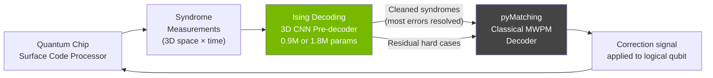
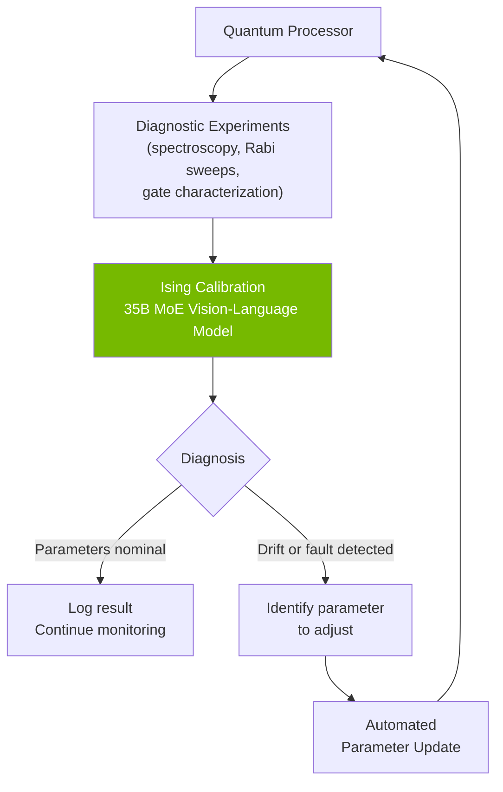

## The Broken Promise of Quantum Computing

For three decades, quantum computing has been the technology perpetually "ten years away." The theoretical potential is staggering: qubits that exist in superposition allow quantum computers to explore exponentially many solutions simultaneously, promising breakthroughs in drug discovery, cryptography, materials science, and optimization. The engineering reality has been less glamorous.

Real quantum processors are extraordinarily fragile. A qubit — the quantum equivalent of a classical bit — can be disturbed by something as mundane as stray electromagnetic radiation or thermal fluctuations. This noise doesn't just slow computation; it silently corrupts answers. And calibrating the hardware to minimize that noise in the first place requires days of painstaking expert tuning.

Until a machine can run reliably for long enough to complete a useful computation, it remains an expensive research curiosity. NVIDIA thinks AI can unlock that reliability — and on April 14, 2026, it made its first major move to prove it.

---

## The Two Mountains Blocking Useful Quantum Computers

Before understanding what NVIDIA Ising does, it helps to understand the two specific problems it attacks.

**Error correction** is the practice of redundantly encoding one logical qubit across many physical qubits, then continuously checking for and correcting errors. The dominant scheme, called the surface code, spreads a single logical qubit across a grid of dozens or hundreds of physical qubits. Each "round," ancilla qubits detect whether errors have crept in — without collapsing the computation. A classical computer outside the quantum chip then receives this "syndrome" data and infers which corrections to apply.

The catch: that correction must happen in microseconds, before the next round of gates runs. Otherwise errors compound faster than they can be cleaned up. The long-reigning software for this job is a library called pyMatching, which implements minimum-weight perfect matching (MWPM), a classical graph-theory algorithm. It works — but it already strains at the scale and noise complexity of today's largest chips, and will break down long before chips reach millions of qubits.

**Calibration** is the other mountain. Before a quantum processor can run any circuit, its hardware parameters — pulse frequencies, gate timings, coupling strengths — must be precisely tuned to the physical properties of each individual qubit, which drift continuously with temperature and fabrication imperfections. Today, that means a series of diagnostic experiments followed by expert humans analyzing the results and manually adjusting settings. On a 100-qubit chip, the process can eat multiple days. On a future 10,000-qubit chip, it would be practically impossible without automation.

These two problems — real-time error decoding and continuous hardware calibration — are the main engineering bottlenecks separating today's "noisy intermediate-scale" quantum (NISQ) devices from the fault-tolerant machines that would actually change industries.

---

## What NVIDIA Launched on World Quantum Day

On April 14, 2026 — internationally recognized as World Quantum Day — NVIDIA released **Ising**: the world's first family of open AI models designed specifically to crack both problems. The name is a deliberate nod to the Ising model, a foundational framework in statistical physics that describes how interacting particles give rise to complex emergent behavior. The analogy is apt: Ising the AI toolkit aims to bring order to the chaotic, interacting world of qubits.

Jensen Huang, NVIDIA's founder and CEO, framed the launch directly: "AI is essential to making quantum computing practical. With Ising, AI becomes the control plane — the operating system of quantum machines — transforming fragile qubits into scalable and reliable quantum-GPU systems."

The entire model family is open-source, available on GitHub and Hugging Face, meaning any quantum lab can adopt, fine-tune, or build on the models without licensing fees.

---

## Ising Decoding: AI-Powered Error Correction

Ising Decoding is a family of compact **3D convolutional neural networks** — two pre-trained variants at 0.9 million and 1.8 million parameters, respectively — trained to decode surface-code syndromes faster and more accurately than any classical algorithm alone.

The critical design decision is that Ising Decoding functions as a **pre-decoder** in a hybrid pipeline. Rather than trying to replace pyMatching entirely, the neural network processes the 3D syndrome volume (two spatial dimensions of the qubit grid, plus measurement rounds stacked along the time axis), corrects the majority of errors in a fast first pass, and then hands the cleaned-up syndromes to pyMatching for final resolution.

The performance numbers are striking. At physical error rates representative of today's hardware, the models run at approximately **1 microsecond per decoding round** on NVIDIA GB300 GPUs — fast enough to keep pace with real qubit measurement cycles. They achieve **2.5× faster throughput and 3× lower logical error rates** compared to pyMatching running alone, while requiring an order of magnitude less training data than previous neural decoder approaches.

One particularly practical advantage: because the CNN learns directly from experimental syndrome data, it implicitly captures the real noise fingerprint of a specific chip. There's no need for engineers to specify an accurate circuit-level noise model upfront — a significant win, because real hardware noise is messy and correlated in ways that idealized models systematically miss.

The training framework (open-sourced in full at `github.com/NVIDIA/Ising-Decoding`) supports five model configurations with varying receptive fields, and models export to SafeTensors, ONNX, or TensorRT for deployment. An integration with CUDA-Q QEC enables end-to-end GPU-accelerated decoding pipelines at production latency.

---

## Ising Calibration: The 35-Billion-Parameter Quantum Technician

The calibration model is a different beast entirely. **Ising Calibration** is a **35-billion-parameter Mixture-of-Experts vision-language model** trained on multi-modality qubit measurement data from real quantum processors.

Think of it as a multimodal AI specifically trained to do what a PhD-level hardware specialist does: look at the outputs of calibration experiments — spectroscopy sweeps, Rabi oscillation plots, two-qubit gate characterization curves — and determine what the data means, what is wrong, and what to adjust. The difference is Ising Calibration does this in seconds rather than days, and can run autonomously as a continuous agentic loop.

The model reduces calibration cycle time **from days to hours** — or, in continuous operation, keeps processors in tune without human intervention between sessions. That shift from periodic manual calibration to ongoing automated calibration mirrors what happened in classical data center management when AIOps tools began handling routine operations that previously required on-call engineers.

---

## QCalEval: The First Benchmark for Quantum Calibration AI

NVIDIA didn't just release the models — it co-created the first rigorous benchmark for evaluating them. **QCalEval**, developed with Fermilab, Harvard, and other collaborating institutions, is a six-part semantic scoring evaluation suite built from real quantum computer outputs.

The dataset contains 243 samples across 87 scenario types drawn from 22 experiment families, spanning both superconducting qubits and neutral-atom platforms. Models are graded on six distinct tasks: technical description of experimental plots, outcome classification, scientific reasoning about what patterns imply, fit reliability assessment, physical parameter extraction, and calibration diagnosis with corrective actions.

Ising Calibration achieved a mean zero-shot score of **74.7 out of 100** on QCalEval — outperforming closed-source frontier models including Gemini 3.1 Pro, GPT-5.4, and Claude Opus 4.6 on the domain-specific tasks. The benchmark is also open-sourced at `github.com/nvidia/QCalEval`, giving the entire field a shared yardstick to track progress.

---

## Who's Already Running It

Within weeks of the April 14 launch, a wide range of leading institutions began integrating the models:

- **Fermilab** and **Lawrence Berkeley National Laboratory's Advanced Quantum Testbed** deployed Ising Calibration in their processor management workflows.
- **Harvard's John A. Paulson School of Engineering** adopted the models for calibration automation research.
- **IQM Quantum Computers** and **Infleqtion** — commercial quantum hardware vendors — began testing Ising Decoding against their own chip stacks.
- **Academia Sinica** (Taiwan's national research institute) and the **UK National Physical Laboratory** are also among the early adopters.

The breadth of hardware platforms — superconducting qubits, trapped ions, and neutral atoms — is telling. Ising's design goal is generalization across qubit modalities, not optimization for a single architecture. This cross-platform strategy is what makes the QCalEval benchmark so valuable: it provides a neutral evaluation surface that isn't biased toward one vendor's hardware.

---

## Why This Is Bigger Than It Looks

NVIDIA's move into quantum with Ising is strategically significant beyond the immediate technical wins.

The dominant long-term architecture for quantum computing is not a standalone quantum machine but a **quantum co-processor** paired with a classical GPU cluster. The GPU handles real-time decoding, control, and classical workloads; the quantum chip handles specific computations the classical machine can't efficiently simulate. In that model, the AI stack running on the GPU side — managing error correction and calibration — becomes just as important as the qubit hardware itself.

By releasing Ising as open-source, NVIDIA builds an ecosystem around its GPU platform while simultaneously pushing the field toward its approach to AI-assisted quantum control. Every lab that adopts Ising Decoding is a lab running that workload on NVIDIA hardware. The open model is the customer acquisition strategy.

The market noticed. The week of the Ising launch, quantum computing stocks — IonQ, Rigetti, D-Wave — collectively rose, with IonQ gaining over 20%. Analysts interpreted the announcement not as a competitive threat to quantum hardware vendors, but as validation that the path to fault-tolerant quantum computers had just received a serious engineering boost from an unexpected direction.

Jensen Huang has previously suggested useful quantum computers might be a decade away. Ising represents a concrete bet that AI can compress that timeline — not by improving qubit hardware directly, but by making existing hardware reliable enough to run real algorithms sooner.

---

## Sources

- [NVIDIA Launches Ising, the World's First Open AI Models to Accelerate the Path to Useful Quantum Computers — NVIDIA Newsroom](https://nvidianews.nvidia.com/news/nvidia-launches-ising-the-worlds-first-open-ai-models-to-accelerate-the-path-to-useful-quantum-computers)
- [NVIDIA Ising Introduces AI-Powered Workflows to Build Fault-Tolerant Quantum Systems — NVIDIA Developer Blog](https://developer.nvidia.com/blog/nvidia-ising-introduces-ai-powered-workflows-to-build-fault-tolerant-quantum-systems/)
- [NVIDIA/Ising-Decoding — GitHub (training framework for AI Quantum Error Correction Decoders)](https://github.com/NVIDIA/Ising-Decoding)
- [NVIDIA/QCalEval — GitHub (evaluation scripts for the QCalEval benchmark)](https://github.com/nvidia/QCalEval)
- [NVIDIA Launches Ising, the World's First Open AI Models — The Quantum Insider](https://thequantuminsider.com/2026/04/14/nvidia-launches-ising-the-worlds-first-open-ai-models-to-accelerate-the-path-to-useful-quantum-computers/)
- [Nvidia releases open AI models for quantum computing tasks — Tom's Hardware](https://www.tomshardware.com/tech-industry/artificial-intelligence/nvidia-releases-ising-open-ai-models)
- [Jensen Huang Just Pulled Quantum Computing Into Nvidia's Orbit — Benzinga](https://www.benzinga.com/trading-ideas/movers/26/04/51863200/jensen-huang-just-pulled-quantum-computing-into-nvidias-orbit)
- [The Week Nvidia Saved Quantum Computing — InvestorPlace](https://investorplace.com/hypergrowthinvesting/2026/04/the-week-nvidia-saved-quantum-computing/)
