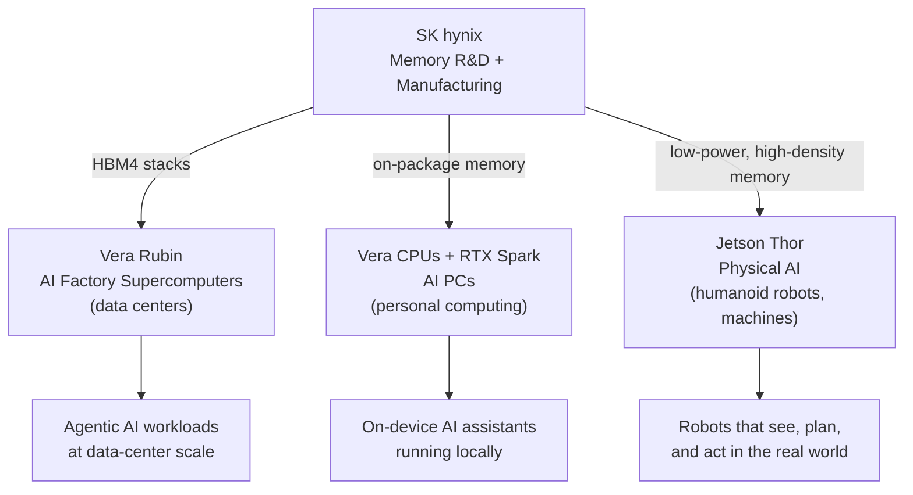
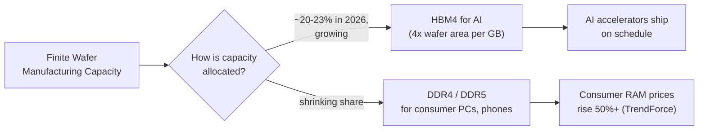

## A Handshake Worth Watching

On June 7, 2026, during a swing through Seoul that local press nicknamed a "week-long honeymoon," NVIDIA CEO Jensen Huang and SK hynix sealed a multiyear technology partnership. The headline is simple: the two companies will co-develop memory chips together for years to come. The implications are not simple at all.

This is not a one-off purchase order. It is a roadmap-sharing agreement that touches three separate businesses — giant AI data centers, the next generation of AI-enabled personal computers, and the robots NVIDIA hopes will populate factories and warehouses. SK hynix called itself NVIDIA's "largest memory partner." Huang put it more plainly: "We work very closely with SK. We've maintained a long relationship, and I'm proud of their success."

To understand why a memory-chip supply deal is one of the more consequential AI stories of the past month, you need two pieces of context: what NVIDIA is actually building, and why the entire global memory industry has been thrown into chaos by the AI boom.

---

## Three Markets, One Memory Supplier

NVIDIA's pitch to SK hynix wasn't simply "build us more chips." It was "help us build memory for three different products at once." Under the partnership, SK hynix will co-develop memory for:

- **Vera Rubin** — NVIDIA's next-generation AI supercomputer platform, now in full production, built for massive "AI factory" data centers
- **Vera CPUs and RTX Spark-powered PCs** — NVIDIA's first foray into the Windows PC chip market, a combined CPU/GPU "superchip" built with Taiwan's MediaTek, aimed at laptops and desktops running Windows on Arm
- **Jetson Thor** — NVIDIA's edge-computing platform for "physical AI," the chips that go inside humanoid robots and autonomous machines

A year ago, SK hynix's relationship with NVIDIA was almost entirely about one product category: the high-bandwidth memory that sits next to NVIDIA's data-center GPUs. This deal expands that relationship into "personal AI" and "physical AI" — NVIDIA's own language for the PC and robotics markets it's trying to create. SK hynix gets exposure to two new revenue streams; NVIDIA gets a memory partner that already understands its roadmap.

---

## What HBM4 Actually Is (and Why It's Hard)

The memory at the center of this deal is called HBM4 — the fourth generation of "high bandwidth memory," a JEDEC industry standard finalized in 2025. Ordinary computer memory (DDR5, the kind in most laptops) is a flat chip soldered onto a circuit board, connected to the processor by a relatively narrow set of wires. HBM takes a different approach: it stacks multiple memory dies vertically, like a tiny skyscraper, and connects them to the processor through thousands of microscopic wires running through the silicon itself.

The payoff is bandwidth. HBM4 uses a 2,048-bit-wide data bus — 32 times wider than a single DDR5 channel — running at over 11 gigabits per second per pin. Do the math and a single HBM4 stack moves more than 2.8 terabytes of data per second, while consuming 40–50% less power than DDR4 would need to hit equivalent throughput. For an AI accelerator that has to feed billions of parameters through its compute cores continuously, that bandwidth is the difference between a GPU running at full speed and one starved for data.

It's also, as Huang told SK hynix executives, "extremely complicated" to manufacture. Stacking a dozen-plus dies without a single bad connection, then bonding that stack to a logic base die, pushes the limits of semiconductor packaging. Only three companies in the world currently ship it at scale: SK hynix, Samsung, and Micron. For NVIDIA's upcoming Vera Rubin platform, analysts estimate SK hynix will supply roughly 60–70% of HBM4 volume, with Samsung around 25–30% and Micron filling the rest.

---

## The Story Behind the Story: Your RAM Got More Expensive

Here is the part of this announcement that reaches well beyond data centers and into ordinary households. HBM4 doesn't appear out of nowhere — it's manufactured on the same kind of silicon wafers, in the same fabs, as the everyday DDR5 memory inside consumer laptops and gaming PCs. Every wafer SK hynix, Samsung, or Micron dedicates to HBM4 is a wafer not making consumer memory.

And HBM is wafer-hungry. Because of its stacked design and lower yields, a gigabyte of HBM can consume roughly four times the wafer area of a gigabyte of standard DDR5. Industry analysts estimate AI workloads will absorb something like 20–23% of all global DRAM wafer capacity in 2026 — capacity that used to go toward phones, laptops, and desktop RAM kits.

The result has been one of the sharpest memory price spikes in recent history. TrendForce projected DRAM prices would rise 50–55% in early 2026 alone compared to the end of 2025. A 32GB DDR4 kit that cost $60–90 in October 2025 was selling for $150–180 by January. Micron quietly retired its consumer-facing Crucial brand in February 2026 to redirect manufacturing toward higher-margin enterprise AI customers. One leaked SK hynix internal forecast reportedly doesn't expect consumer DRAM supply to catch up with demand until 2028 or later.

Seen against that backdrop, the NVIDIA–SK hynix partnership isn't just a story about two companies cooperating — it's a story about a chip industry reorganizing its entire production capacity around AI, with consumer electronics absorbing the squeeze. The deal also explains the slightly jarring market reaction it produced: shares of both SK hynix and Samsung initially fell more than 10% on the announcement day, before settling down roughly 4% and 8% respectively. That drop had little to do with the partnership itself — it tracked a broader global tech sell-off triggered by strong U.S. jobs data and renewed bets on a Federal Reserve rate hike — but it underscored just how tightly Korean chipmakers' stock prices are now tied to the rhythm of AI infrastructure news.

---

## Beyond Supply: AI Designing Its Own Memory

The partnership's least-covered but arguably most interesting piece is that it isn't only about NVIDIA buying SK hynix's chips. It's also about using NVIDIA's AI tools to help SK hynix design and manufacture those chips faster.

Under the agreement, SK hynix will apply NVIDIA's CUDA-X software libraries and PhysicsNeMo physics-simulation framework to accelerate chip simulations and the TCAD (technology computer-aided design) workflows engineers use to model transistors at the atomic scale. Separately, SK hynix plans to build "digital twins" of its fabrication plants using NVIDIA Omniverse and OpenUSD, paired with NVIDIA's cuOpt optimization engine, aiming toward fully autonomous fab operations — factories that simulate, plan, and adjust their own production lines.

It's a small, concrete example of a pattern showing up across the chip industry: AI is no longer just the end product of advanced semiconductors. It's becoming the tool used to design and build the next generation of those same semiconductors — a feedback loop where better chips train better AI, which in turn helps engineer even better chips.

---

## What This Means Going Forward

**For NVIDIA**, the deal is about derisking its most important dependency. Memory has been the binding constraint on AI accelerator output for the past two years; locking in roadmap-level collaboration with its largest supplier — across three separate growth markets simultaneously — reduces the odds of a future bottleneck stalling product launches.

**For SK hynix**, it's a hedge against being a single-market supplier. Diversifying into "personal AI" PC chips and "physical AI" robotics memory gives the company exposure to NVIDIA's broader strategy, rather than being purely a data-center HBM vendor at the mercy of hyperscaler capital expenditure cycles.

**For consumers**, the news is less encouraging. As long as AI accelerators remain memory-bandwidth-starved and HBM continues eating into shared wafer capacity, the price of ordinary RAM — in laptops, gaming rigs, and budget PCs — is likely to stay elevated well past 2026. The SK hynix internal forecast pointing to 2028 before supply catches up with demand suggests this isn't a temporary blip; it's a multi-year reallocation of the world's memory-manufacturing capacity toward AI.

**For Samsung and Micron**, the other two HBM suppliers, the message is competitive pressure: NVIDIA has signaled a preference for deep, roadmap-level partnership over arms-length purchasing, and SK hynix just got the most explicit public endorsement of that preference yet.

The chips that make headlines are usually the GPUs themselves — the Blackwells, the Rubins, the next flashy accelerator name. But GPUs are useless without memory fast enough to keep them fed, and this deal is a reminder that the AI boom's bottlenecks have moved. The interesting fights in semiconductors right now aren't only about who has the fastest processor. They're about who can stack memory dies tall enough, and fast enough, to keep up with it — and who gets left waiting for the leftover wafer capacity.

---

## Sources

- [NVIDIA and SK hynix Announce Multiyear Technology Partnership to Advance Memory for AI Factories — NVIDIA Newsroom](https://nvidianews.nvidia.com/news/sk-hynix-ai-factory)
- [SK hynix and NVIDIA Announce Multi-year Technology Partnership to Advance Memory for AI Factories — SK hynix Newsroom](https://news.skhynix.com/multi-year-tech-partnership-with-nvidia/)
- [Nvidia and SK hynix Sign Multiyear Memory Pact: Why Your Next PC's RAM Just Got More Expensive to Build — TechTimes](https://www.techtimes.com/articles/317994/20260608/nvidia-sk-hynix-sign-multiyear-memory-pact-why-your-next-pcs-ram-just-got-more-expensive-build.htm)
- [NVIDIA And SK Hynix Partner On Multi-Year Advanced AI Memory Agreement — HotHardware](https://hothardware.com/news/nvidia-sk-hynix-multi-year-deal-ai-factories-next-gen-memory)
- [SK Hynix Stock: NVIDIA Deal Pulls It Into Three New AI Markets — CoinCentral](https://coincentral.com/sk-hynix-stock-nvidia-deal-pulls-it-into-three-new-ai-markets/)
- [RAM Prices 2026: Buy Now or Wait as Gartner Forecasts 130% Memory Cost Surge — TechTimes](https://www.techtimes.com/articles/317872/20260605/ram-prices-2026-buy-now-wait-gartner-forecasts-130-memory-cost-surge.htm)
- [Here's why HBM is coming for your PC's RAM — Tom's Hardware](https://www.tomshardware.com/pc-components/ram/hbm-is-eating-your-ram)
- [SK hynix Reportedly to Supply About Two-Thirds of NVIDIA HBM4; Samsung Targets Early Delivery — TrendForce](https://www.trendforce.com/news/2026/01/28/news-sk-hynix-reportedly-to-supply-about-two-thirds-of-nvidia-hbm4-samsung-targets-early-delivery/)
- [Jetson Thor: Advanced AI for Physical Robotics — NVIDIA](https://www.nvidia.com/en-us/autonomous-machines/embedded-systems/jetson-thor/)
- [Jensen Huang Seoul Sunday: Hyundai, Gaming AI, and SK HBM4 Talks Cement Korea Physical AI Chain — TechTimes](https://www.techtimes.com/articles/317963/20260607/jensen-huang-seoul-sunday-hyundai-gaming-ai-sk-hbm4-talks-cement-korea-physical-ai-chain.htm)
- [Nvidia clinches deals with South Korean giants including SK Group to advance AI boom — RTÉ](https://www.rte.ie/news/business/2026/0608/1577304-nvidia-south-korean-deals/)
- [AI memory is sold out, causing an unprecedented surge in prices — CNBC](https://www.cnbc.com/2026/01/10/micron-ai-memory-shortage-hbm-nvidia-samsung.html)
