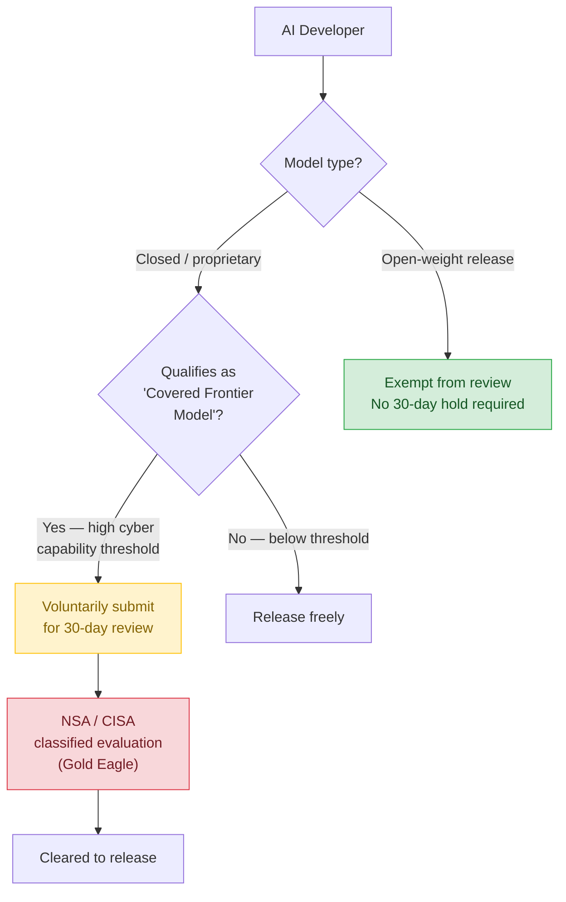
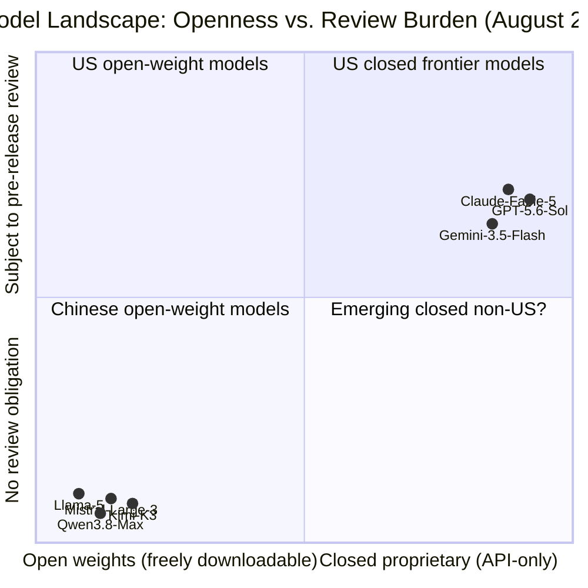

## The Regulator's Dilemma

One of the oldest problems in policy is the gap between a rule and the thing the rule is meant to control.

Every time a government tries to contain a powerful technology, it confronts a basic question: *what exactly is the thing we're regulating?* With AI models, that question has cracked open a debate in Washington with no clean answer — one that will shape how frontier AI is built, deployed, and competed over for years.

On June 2, 2026, President Trump signed Executive Order 14409, "Promoting Advanced Artificial Intelligence Innovation and Security." Its core mechanism is straightforward: before the most capable AI systems reach the public, the government should get a look at them first. Thirty days, voluntary, confidential. The NSA evaluates cybersecurity risks, CISA coordinates with developers, findings stay classified.

But one detail is reshaping the entire competitive landscape: **open-weight models are fully exempt**.

---

## Two Kinds of AI Model

To understand why the exemption matters, you need to understand the distinction that has become the fault line of modern AI policy.

A **closed model** is what most people picture when they think of commercial AI. You access it through an API or an app, and the company controls everything. GPT-5.6 Sol, Claude Fable 5, and Gemini 3.5 Flash are all closed. You cannot download them, run them locally, or modify them. The model lives in someone else's data center, and if the company decides to take it offline, it disappears.

An **open-weight model** is structurally different. The developer publishes the trained numerical parameters — the "weights" — for anyone to download, run locally, fine-tune, and deploy as they see fit. Llama from Meta, Mistral Large, and Gemma from Google are well-known examples. Increasingly, a wave of Chinese models has joined this category: Kimi K3 from Moonshot AI and Qwen3.8-Max from Alibaba are both released as open weights.

The critical difference is the *physics of distribution*. Once a company publishes model weights, the model propagates instantly across mirrors, file-sharing networks, and private servers around the world. There is no recall mechanism. Restriction becomes logistically impossible the moment the download begins.

That reality drove the White House's decision. If you require a 30-day review before release, there has to *be* a meaningful pre-release moment. For closed models, that moment exists — the company controls the launch date. For open-weight models, the moment you publish the weights, the model is everywhere. There is nothing left to review.

---

## What EO 14409 Actually Does

The executive order directs the NSA and CISA to build a classified benchmarking process for identifying AI models with "advanced cyber capabilities" — essentially, systems capable enough to meaningfully assist sophisticated cyberattacks. Models meeting that threshold are designated "covered frontier models."

For those models — in practice, top-tier closed systems from OpenAI, Anthropic, Google, and a small handful of others — the EO asks developers to voluntarily submit them 30 days before public release. The government uses that window to probe the model for security risks. Findings are classified and shared only with the company.

The word *voluntary* is doing significant work here. The administration framed the framework as non-coercive, and the detailed standards are classified — companies learn them privately rather than through public rulemaking. On July 14, 2026, the White House launched **Gold Eagle**, the AI cybersecurity clearinghouse mandated by the order, to coordinate vulnerability findings across government and industry.

---

## The Structural Blind Spot

Here is the competitive problem the exemption creates.

In mid-2026, Chinese AI models account for roughly **61 percent of tokens processed on OpenRouter**, a popular model-routing platform used by developers worldwide. That is not a niche statistic — it reflects the weight of daily usage by engineers building production AI systems.

Two models released in July 2026 have crystallized the issue:

- **Kimi K3** (Moonshot AI, July 16): 2.8 trillion total parameters, a 1-million-token context window, native vision, and always-on reasoning. It scores within 3 benchmark points of Claude Fable 5 on the Artificial Analysis Intelligence Index. Its weights were published to Hugging Face on July 27.
- **Qwen3.8-Max** (Alibaba, July 19): 2.4 trillion parameters, a Mixture-of-Experts architecture activating 95 billion parameters per query, also with a 1-million-token context window and multimodal input. Weights published August 12.

Neither model is subject to any review under EO 14409. Both are now freely downloadable and self-hostable by anyone, anywhere, with no US jurisdiction over their operation.

Meanwhile, OpenAI, Anthropic, and Google face voluntary but politically significant pressure to submit their latest models to NSA review before launch. Even a review that concludes cleanly still represents an operational delay and a window during which competitive secrets — training techniques, benchmark performance, capability boundaries — are examined by government.

The asymmetry is structural. The US-China Economic and Security Review Commission flagged this dynamic in a March 2026 report: chip export controls constrain Chinese labs' *training compute*, but once a model is trained and its weights published, those controls become irrelevant. The software layer has no borders.

---

## The Industry Divide

The exemption is not just a policy decision — it is a battleground with unusual alliances.

On July 24, 2026, a coalition of 25 companies including Nvidia, Microsoft, Meta, IBM, and Palantir published an open letter, "Open Weights and American AI Leadership," urging policymakers not to restrict open-weight models at all. Their argument: open weights are a US competitive strength. The ecosystem of researchers, startups, and fine-tuners who work with open models extends the frontier faster and more broadly than any single closed lab could. Restricting open weights would cede that advantage.

A separate, larger coalition of 179 AI companies — later joined by OpenAI, Google, SpaceX, and Amazon — wrote to the administration urging it not to restrict or ban Chinese open-weight models. Their reasoning was blunt: it's logistically impossible to ban weights that are already freely distributed across the internet, and attempting to do so would harm US developers who rely on those models.

OpenAI's public position has been different. Its leadership has raised concerns about Chinese open-weight models specifically, and Treasury Secretary Scott Bessent separately threatened to examine models like Kimi K3 for signs of IP theft from American developers — with potential sanctions if theft is established.

Anthropic has staked out the most structurally coherent position: mandatory safety testing should apply to all sufficiently capable models, open or closed, with lighter requirements for systems below a capability threshold. That would close the exemption gap. But it's not where the administration has landed.

---

## What This Encoding Reveals

The EO 14409 framework makes a specific bet about what AI risk fundamentally is: a **cybersecurity problem**.

The concern driving the order is that a sufficiently capable AI could help attackers conduct sophisticated infrastructure compromises, write novel malware, or design exploits at machine speed. That's a legitimate concern — and one where the closed/open distinction does provide some policy leverage, because closed models can be pulled or updated in response to emerging threats.

But it's a narrow slice of the AI risk landscape. A model capable enough to assist cyberattacks might equally be an open-weight system. The exemption doesn't protect against that combination; it simply admits that regulation at the point of release is impractical once weights are published.

The implicit logic is: *we can only intervene where we can actually intervene*. Since open weights cannot be recalled or reviewed post-publication, the framework focuses on what it can reach. That pragmatism has intellectual merit. But it also produces an inverse relationship between a model's public accessibility and its regulatory scrutiny: the models that reach the most users face the least oversight, while models behind paywalls face the most.

---

## The Unresolved Collision

CAISI — the Center for AI Standards and Innovation at NIST — had been building a public evaluation record before EO 14409 moved its findings into classified channels. That public track record gave researchers, policymakers, and companies a shared baseline for understanding what frontier models could do. With that record now paused, the evidentiary basis for public debate about AI capability has narrowed significantly.

The practical question the policy hasn't answered: *what happens when a Chinese lab releases an open-weight model that scores higher than today's closed frontier on the specific cybersecurity benchmarks the EO cares about?* Under the current framework, that model would be exempt by definition — not because it's safe, but because no rule applies to it.

That scenario may not be hypothetical for long. Kimi K3 and Qwen3.8-Max have closed the benchmark gap with closed US frontier models to within a few points. If the trajectory continues, the logic of capability-based review will collide directly with the logic of the openness exemption. The two cannot coexist indefinitely.

The shape of that eventual collision — whether it produces expanded coverage, new enforcement mechanisms, or simply acknowledged limits — will reveal more about where American AI governance is actually headed than any single executive order.

---

## Sources

- [White House exempts open-weight AI models from security review — Quartz](https://qz.com/white-house-open-weight-ai-models-exempt-security-review-080526)
- [Trump AI framework excludes open AI models — Axios](https://www.axios.com/2026/08/04/trump-ai-framework-open-models)
- [White House will exempt 'open' AI systems from security review — Washington Post](https://www.washingtonpost.com/technology/2026/08/04/white-house-will-exempt-open-ai-systems-security-review/)
- [China's Open-Weight Models to Be Spared US Tests, US Firms Told — Bloomberg](https://www.bloomberg.com/news/articles/2026-08-05/china-s-open-weight-models-to-be-spared-us-tests-us-firms-told)
- [New AI Executive Order Addresses Frontier Models and Cybersecurity Vulnerabilities — Wiley](https://www.wiley.law/alert-New-AI-Executive-Order-Addresses-Frontier-Models-and-Cybersecurity-Vulnerabilities)
- [White House Issues Executive Order Targeting Frontier AI Models — Greenberg Traurig](https://www.gtlaw.com/en/insights/2026/6/white-house-issues-executive-order-targeting-ai-enabled-cybersecurity)
- [New AI Executive Order Calls for Frontier Model Security — Skadden](https://www.skadden.com/insights/publications/2026/06/new-ai-executive-order)
- [Trump's New AI Frontier: The Executive Order Regulating Frontier AI Models — Foley Hoag](https://foleyhoag.com/news-and-insights/blogs/security-privacy-and-the-law/2026/june/trump-s-new-ai-frontier-the-executive-order-regulating-frontier-ai-models/)
- [NSA to Run Classified AI Benchmarking — AI Unfiltered](https://www.arturmarkus.com/nsa-to-run-classified-ai-benchmarking-for-military-frontier-models-trumps-executive-order-14409-gives-government-30-day-pre-release-access/)
- [New Open Weight AI Models from China Renew Calls for Regulation — HPCwire](https://www.hpcwire.com/2026/07/21/new-open-weight-ai-models-from-china-renew-calls-for-regulation/)
- [Lawmakers probe growing use of Chinese AI models in U.S. companies — CNBC](https://www.cnbc.com/2026/07/08/chinese-ai-models-probe-us-lawmakers.html)
- [OpenAI is scared of open-weight models. Should the US be? — TechCrunch](https://techcrunch.com/2026/07/20/openai-is-scared-of-open-weight-models-should-the-us-be/)
- [Open Models, Closed Minds: AI Policy Keeps Regulating the Wrong Thing — Truth on the Market](https://truthonthemarket.com/2026/07/23/open-models-closed-minds-ai-policy-keeps-regulating-the-wrong-thing/)
- [Open-weight AI vs. open-source AI: What's the difference? — Fierce Network](https://www.fierce-network.com/content/open-weight-ai-vs-open-source-ai-whats-difference)
- [Open-Weight AI Debate 2026: Why Big Tech Fights Regulation — Eden AI](https://www.edenai.co/post/the-open-weight-ai-debate-nvidia-microsoft-meta-push-back-on-regulation)
- [Kimi K3: World's First Open 2.8T Parameter AI Model — Labellerr](https://www.labellerr.com/blog/kimi-k3-world-first-open-2-8t-ai-model/amp/)
- [Why Kimi K3 Signals A Convergence Toward Open-Weight Models — Forbes](https://www.forbes.com/sites/geruiwang/2026/07/27/why-kimi-k3-signals-a-convergence-toward-open-weight-models/)
- [EO 14409 — Advanced AI Innovation and Security — Comparative AI](https://comparativeai.org/rules/us/eo-14409-frontier-ai-cybersecurity/)
