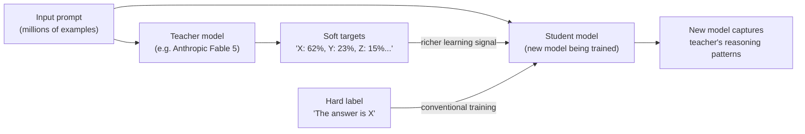
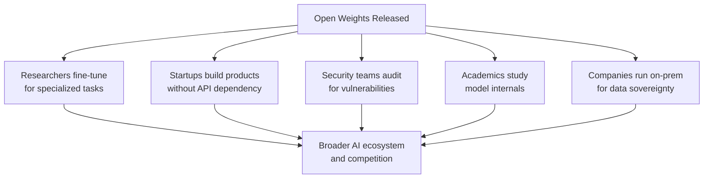

## One Model, One Week, One Firestorm

On July 16, 2026, Chinese AI startup Moonshot AI announced Kimi K3. On the surface, it looked like another model release: a large mixture-of-experts system, open weights, strong benchmarks. But within a week, K3 had triggered a White House accusation, threats of Treasury sanctions, and the largest industry coalition the AI space has ever assembled — all while raising a genuinely hard question: can the United States control who builds frontier AI if the knowledge is already public?

To understand why a model release caused a geopolitical incident, you need to understand what Kimi K3 is — and what it's accused of being.

---

## What Kimi K3 Actually Is

Kimi K3 is a 2.8-trillion-parameter Mixture-of-Experts (MoE) model from Beijing-based Moonshot AI. Only about 16 of its 896 expert layers activate for any given token, so a single forward pass costs far less compute than the raw parameter count implies. The model supports a one-million-token context window, native vision input, and extended agentic coding workflows.

The benchmark numbers are what caught everyone's attention.

On SWE-bench Verified — the standard test of an AI model's ability to resolve real, unmodified GitHub issues — K3 scores 76.8%, putting it ahead of Anthropic's Claude Fable 5, OpenAI's GPT-5.6 Sol, and every other publicly tested model. On FrontierSWE, a harder software engineering evaluation, K3 scores 81.2 against GPT-5.6 Sol's 71.3. On agentic automation tasks like AutomationBench-AA, it places first at 53%.

For comparison, GPT-5.6 Sol — OpenAI's own flagship — runs roughly $5 per million input tokens. Kimi K3 is available at a fraction of that cost. And the weights are public, meaning anyone can download, run, and fine-tune the model on their own hardware.

That combination — frontier-grade coding capability, open weights, Chinese origin — is exactly what spooked Washington.

---

## The Accusation: Industrial-Scale Distillation

On July 22, just six days after Kimi K3's announcement, Michael Kratsios, director of the White House Office of Science and Technology Policy, told reporters that the U.S. government had information showing Moonshot AI built Kimi K3 by **distilling Anthropic's Fable 5 model at industrial scale**.

Within hours, Treasury Secretary Scott Bessent escalated the statement. "Open source is not open season on American IP," he said, adding that distillation attacks that "cross the line into IP theft" could put "sanctions and Entity List designations" on the table for companies involved.

The Bureau of Industry and Security (BIS) opened a formal investigation. The White House also alleged that Moonshot had acquired Nvidia GB300-equipped servers via third countries — potentially in violation of U.S. export controls.

Moonshot AI denied all of the allegations.

---

## What Knowledge Distillation Actually Is

To evaluate the accusation, it helps to understand what knowledge distillation means technically.

In the context of large language models, distillation is the process of training a new model (the "student") to mimic the output distribution of an existing model (the "teacher"). Instead of training only on raw text data, a distillation run exposes the student to the teacher's predictions — its full probability distribution over possible next tokens — which encodes far richer information than a simple correct-or-wrong label. The student learns not just what answer the teacher gives, but how confident the teacher is and which alternatives it considered.

The technique is legitimate and widespread — OpenAI, Meta, and Anthropic all use some form of distillation internally. The legal and ethical question is whether using a commercial model's outputs as training data for a competing model violates terms of service, copyright, or trade secret law. That question has never been definitively settled in court.

The scale accusation is what makes this case different. Generating enough soft targets to meaningfully improve a 2.8-trillion-parameter model from Fable 5's outputs would require billions of API calls or unauthorized model access — a campaign that would cost tens of millions of dollars and leave a detectable footprint.

---

## The 15-Day Evidence Gap

Independent researchers moved fast to scrutinize the accusation.

Anthropic's Fable 5 model had a complicated recent history: it was briefly taken offline in late June 2026 due to U.S. export control restrictions, then re-released on July 1. Kimi K3 was announced on July 16. That leaves a **15-day window** between Fable 5's return to availability and K3's debut.

Experts pointed out that distilling a model at the scale needed to produce K3's results — and then completing the training run, evaluation, and deployment infrastructure for a 2.8T model — in 15 days is implausible. The White House's evidence has not been made public. Neither Anthropic nor the Bureau of Industry and Security has commented on the specifics of the investigation.

The accusation may be based on an earlier, pre-public access period, on different training data, or on different models entirely. Or it may reflect a broader pattern of model output scraping that predates July 1. The public record doesn't resolve this, and as of August 13, BIS's investigation remains open.

---

## The Industry Fires Back

Two days after the accusations, on July 24, 2026, a coalition of technology companies published a letter titled **"Open Weights and American AI Leadership."**

The initial signatories included Nvidia, Microsoft, Meta, IBM, Dell, Palantir, Andreessen Horowitz, Hugging Face, Y Combinator, Mozilla, Mistral, Replit, Perplexity, and the Linux Foundation. Within ten days, more than 270 companies and organizations had signed.

The letter's core argument is direct: restricting open-weight AI models would harm American competitiveness more than it would protect American IP. The signatories argue that:

- Open weights allow organizations to run AI on their own infrastructure, avoiding vendor lock-in and protecting data sovereignty — advantages that are decisive for hospitals, defense agencies, law firms, and startups.
- Open weights drive innovation at every layer of the stack — chips, frameworks, applications, services — by creating a shared foundation that anyone can build on.
- Restricting distillation broadly would throttle legitimate academic research and domestic fine-tuning, while doing little to stop actors with sufficient resources to circumvent the rules.
- The more productive policy response is expanding compute access for American researchers and funding shared training infrastructure, not gatekeeping model weights.

---

## The Fault Line Nobody Missed

One detail dominated coverage: the list of who *didn't* sign.

OpenAI, Anthropic, and Google — the three companies that sell access to closed frontier models — were all absent. Their business models depend on API access remaining the primary way organizations use frontier AI. Open weights, in a very direct sense, compete with their products.

This created an awkward split in the American AI industry. The companies arguing most loudly for open weights are the hardware vendors, open-source platforms, and the startup ecosystem that benefits from open models — many of whom would also be customers of the frontier labs if those models remained closed.

The frontier labs' silence wasn't neutral. Anthropic reportedly pushed for stronger language in the White House's AI framework specifically addressing open-weight security risks. That position puts it in direct tension with the signatories arguing the opposite.

---

## Washington's Unexpected Response

The accusation and the letter created pressure on the White House from two directions. What followed surprised many observers.

On August 5, Bloomberg reported that the White House had told top U.S. AI companies — Google, OpenAI, Anthropic, and Meta — that open-weight models released by Chinese competitors would **not** be subject to government safety testing under the Trump administration's new AI safety framework. The framework asks companies to voluntarily give the government early access to models for pre-release evaluation. Chinese open-weight models, by their nature, aren't submitted voluntarily — and the administration decided not to require American companies to test them on the government's behalf.

Democratic lawmakers called the approach "ad-hoc and unpredictable," and warned it would boost global adoption of Chinese AI at a strategically sensitive moment. Some national security analysts framed the exemption differently: testing open-weight models from China would create an obligation to act on what you find, and the administration may not have wanted to be in a position where it had formally evaluated a model and still couldn't restrict it.

The BIS investigation into Moonshot's Nvidia chip access continues separately.

---

## Why This Debate Matters Beyond Kimi K3

The fight over Kimi K3 is a proxy for a much larger unresolved question: **how do you control the proliferation of powerful AI when the mechanism of that proliferation is a legal download?**

Traditional export controls work because hardware has mass, consumes power, requires logistics, and sits in a physical location. A model weight file has none of those properties. Kimi K3's weights, once released publicly, can be downloaded by anyone, anywhere, and run on consumer hardware. Restricting them after release is closer to restricting a published scientific paper than restricting a shipment of semiconductors.

The distillation angle adds another layer. If a model's outputs — which users generate legitimately through a paid API — can be used to train a competing model, then every frontier model is potentially a free teacher for anyone willing to pay the API costs. Whether this constitutes IP theft, copyright infringement, or a legal use of publicly observable behavior is a question courts have not answered.

What the week of July 16–24 made clear is that the open-weights debate is no longer abstract. It now has a specific model, a specific accusation, a specific coalition, and a specific policy gap. The next step — whether legal action, new executive orders, or a negotiated industry framework — will define the rules of the AI race for the decade ahead.

---

## Sources

- [Kimi K3: The Open-Source Model That Just Cracked the Frontier Moat — Augmented Mind](https://augmentedmind.substack.com/p/kimi-k3-the-open-source-model-that-cracked-the-frontier-moat)
- [Kimi K3, Qwen 3.8, and a Week That Reset the Open-Weight Frontier — Sébastien D.](https://www.dsebastien.net/kimi-k3-qwen-3-8-and-a-week-that-reset-the-open-weight-frontier/)
- [White House Accuses Moonshot AI of Stealing Anthropic's Fable as Treasury Threatens Sanctions — Eastern Herald](https://easternherald.com/2026/07/23/moonshot-ai-fable-distillation-sanctions/)
- [Kimi K3 Distillation 2026 Faces a 15-Day Evidence Gap — Memeburn](https://memeburn.com/kimi-k3-distillation-2026-faces-a-15-day-evidence-gap/)
- [Trump official says Moonshot built Kimi K3 through theft of Anthropic's Fable — Seeking Alpha](https://seekingalpha.com/news/4616700-kratsios-says-moonshot-built-kimi-k3-through-industrial-distillation-of-anthropics-fable)
- [Nvidia, Microsoft, Meta warn against 'premature restrictions' of open-weight models — CNBC](https://www.cnbc.com/2026/07/24/nvidia-microsoft-meta-open-weight-ai-models.html)
- [Open Weights and American AI Leadership (letter) — Microsoft Corporate Responsibility](https://www.microsoft.com/en-us/corporate-responsibility/topics/open-weight/)
- [Nvidia and 24 other companies sign open-weights letter as Washington weighs Chinese AI model ban — Tom's Hardware](https://www.tomshardware.com/tech-industry/artificial-intelligence/nvidia-and-24-other-companies-sign-open-weights-letter-as-washington-weighs-chinese-ai-model-ban)
- [China's Open-Weight Models to Be Spared US Tests, US Firms Told — Bloomberg](https://www.bloomberg.com/news/articles/2026-08-05/china-s-open-weight-models-to-be-spared-us-tests-us-firms-told)
- [New Open Weight AI Models from China Renew Calls for Regulation — HPCwire](https://www.hpcwire.com/2026/07/21/new-open-weight-ai-models-from-china-renew-calls-for-regulation/)
- [Kimi K3 Benchmarks: Every Score, Every Comparison — Wan27](https://wan27.org/blog/kimi-k3-benchmarks)
- [As US weighs response to Chinese AI, industry urges against broad open-weight restrictions — TechCrunch](https://techcrunch.com/2026/07/24/as-us-weighs-response-to-chinese-ai-industry-urges-against-broad-open-weight-restrictions/)
