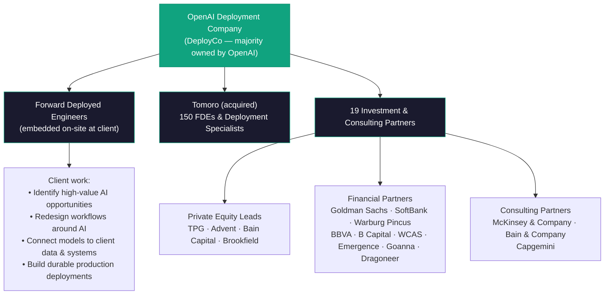
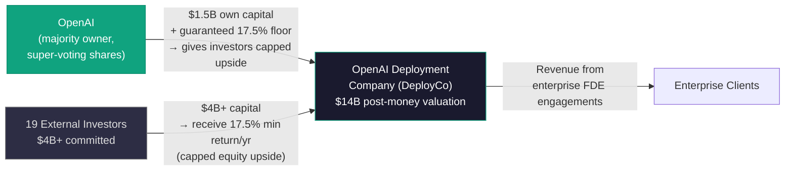
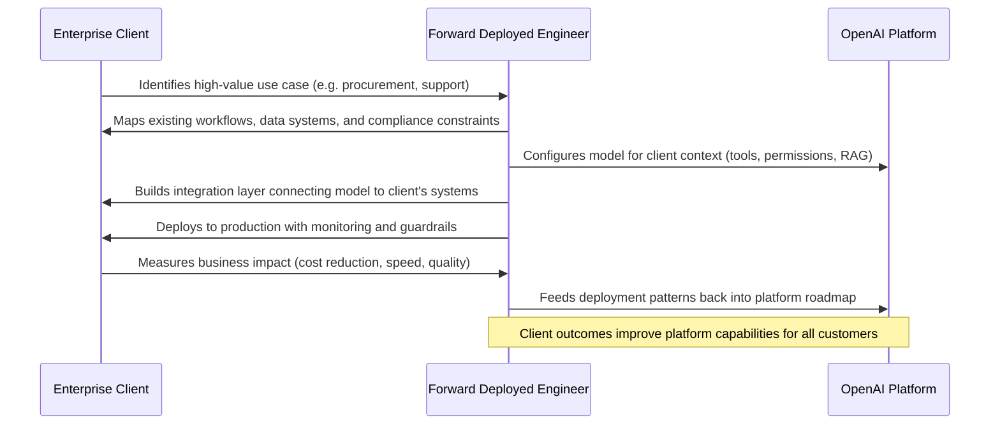

## A $40 Billion Bet That Mostly Hasn't Paid Off

Enterprises have spent close to $40 billion on generative AI over the past two years. CEOs have announced strategies. Pilot programs have run. Demos have impressed. And yet, by most credible estimates, only around **5% of enterprises have demonstrated real, measurable business returns** from AI.

This is not a story about AI not being capable enough. The models are extraordinary. GPT-4o, Claude 3.7, Gemini 2.0 — any of these can write code, summarize contracts, draft communications, and reason through complex problems at a level that would have seemed implausible two years ago.

This is a story about deployment. About the enormous gap between what AI can do in a demo and what it actually does inside a company with 80,000 employees, legacy ERP systems, fragmented permissions, compliance requirements, and organizational politics.

OpenAI has decided to close that gap itself — and it is doing so with $4 billion, 19 investors, and a team of engineers it will physically embed inside your organization.

---

## What OpenAI Just Built

On May 11, 2026, OpenAI officially launched the **OpenAI Deployment Company**, internally and colloquially known as **DeployCo**. It is a majority-owned subsidiary of OpenAI, structured as a Delaware LLC with its own balance sheet and investors — but with OpenAI retaining operational control through super-voting shares.

The official description is deliberately mission-oriented: *"to help organizations build and deploy AI systems they can rely on every day across their most important work."*

The practical description is more specific: DeployCo will employ **Forward Deployed Engineers (FDEs)** — specialists who work inside client organizations, not at OpenAI's offices — to identify high-value AI opportunities, redesign the workflows around them, and build the integrations that connect OpenAI models to the client's real data, controls, and systems.

This is not software-as-a-service. It is not an API. It is consulting — the kind where engineers live on-site in your company until the thing works.

---

## The Palantir Blueprint

If this model sounds familiar, it should. Palantir Technologies — the data analytics company founded by Peter Thiel and Alex Karp — pioneered this exact playbook over a decade ago, and it generated a **640% return** for early investors.

Palantir called its specialists "Forward Deployed Engineers" too. The idea: instead of selling software and hoping customers figure it out, you send your best engineers into the customer's environment and don't leave until the software is delivering outcomes. You treat the complexity of the customer's internal environment — the data silos, the legacy systems, the org charts — not as an obstacle to route around, but as the actual product to be engineered.

This is expensive. It does not scale like pure software. But it works in cases where the value of success is enormous and the probability of unassisted success is low. Defense contracts. Financial institutions. Healthcare systems. Complex manufacturing.

OpenAI's bet is that the current state of enterprise AI deployment — widespread adoption with thin results — looks a lot like those historically intractable domains.

Palantir's stock is up over 300% since 2024. Anthropic, OpenAI's closest rival, announced a nearly identical joint venture backed by Blackstone, Hellman & Friedman, and Goldman Sachs — on the same day Bloomberg first reported OpenAI's deal was final.

---

## A Peculiar Financial Structure

The capital structure of DeployCo is worth examining because it is genuinely unusual.

OpenAI raised **more than $4 billion** from 19 external investors, resulting in a post-money valuation of **$14 billion**. OpenAI contributed up to $1.5 billion of its own capital ($500 million at close plus an option for $1 billion more).

The unusual part: OpenAI has **guaranteed investors a minimum 17.5% annual return** over the five-year investment period.

Private equity vehicles do not typically receive explicit annualized return guarantees from their operating partners. OpenAI is essentially promising that if the Deployment Company underperforms, OpenAI itself is on the hook for making investors whole at that floor. In exchange, investors have capped upside — they do not participate in unlimited equity appreciation.

What this structure signals is that OpenAI is extremely confident in near-term enterprise AI services revenue — confident enough to write a contractual floor. It also means OpenAI can attract the world's most recognized private equity and consulting brands as aligned partners rather than mere customers.

---

## Tomoro: The Founding Acquisition

OpenAI announced simultaneously that it had agreed to acquire **Tomoro**, a UK-based applied AI consulting and engineering firm — described as the "founding acquisition" of DeployCo, suggesting more acquisitions are planned.

Tomoro was founded in 2023, built from the start in close alliance with OpenAI, and led by ex-Accenture engineers. It had grown to roughly **150 Forward Deployed Engineers and Deployment Specialists** across offices in London, Edinburgh, Manchester, Singapore, Sydney, and Melbourne.

Its track record speaks directly to why OpenAI wanted it:

- **Virgin Atlantic** — built an AI concierge system for the airline's customer operations
- **Supercell** (the studio behind Clash of Clans and Brawl Stars) — deployed an in-game support agent serving 110 million users, launched in twelve weeks, processing 500 million daily tokens, and reducing per-ticket support cost by **90%**
- **Tesco, Fidelity International, Red Bull, Mattel, the NBA** — production AI deployments across retail, finance, entertainment, and sports

Tomoro grew its monthly revenue tenfold in twelve months. OpenAI did not disclose the acquisition price.

The market immediately read the acquisition as a threat to incumbent IT services firms. **Accenture shares fell 3%** on the news; **Cognizant dropped 5%**, **Infosys declined 4%**. OpenAI had announced, in effect, that it was entering the $375 billion global IT consulting and services market.

---

## What "Forward Deployed Engineering" Actually Looks Like

The FDE model is distinct from both traditional software sales and traditional consulting. Here is what distinguishes it:

The feedback loop at the end is significant. FDEs are not just delivering value to individual clients — they are discovering which enterprise integration patterns work at scale, which OpenAI platform capabilities are blocking adoption, and which workflow redesigns reliably produce measurable results. That knowledge flows back into OpenAI's core product.

This makes DeployCo not just a revenue stream but a product intelligence operation.

---

## Why Now?

Three forces converged to make this the right moment for OpenAI to move.

**First, the models are ready.** Earlier generations of language models were interesting in demos but brittle in production — hallucinations were frequent, context windows were short, tool use was unreliable. That is no longer the case. GPT-4o and the o-series models are capable enough to power production mission-critical workflows when integrated correctly.

**Second, the deployment gap is large and growing.** The gap between what AI can do and what enterprises are actually extracting from it represents enormous trapped value. Enterprises are spending heavily and seeing thin returns — which means whoever can reliably bridge that gap commands premium pricing.

**Third, the competitive window is open — briefly.** Anthropic's simultaneous JV announcement shows this clearly: both companies recognized the same opportunity at the same time. The consulting firms, cloud hyperscalers, and Indian IT giants will all adapt. The window to define the category belongs to whoever moves with the most credible model-plus-services combination.

---

## What It Means If You Work in Enterprise AI

For organizations trying to extract value from AI, DeployCo represents something genuinely new: **the vendor who sold you the model is now also willing to come in and make it work**, backed by capital and a team with a track record.

The implications are significant:

- **Implementation risk shifts.** Historically, failed AI deployments were the customer's problem. FDE engagements change the incentive structure — DeployCo succeeds only if the client's deployment succeeds.
- **IT services incumbents face disruption.** Accenture, Deloitte, and the Indian outsourcing giants have made billions building enterprise software integrations. OpenAI is now a competitor with an inherent advantage: it controls the underlying model.
- **The definition of "AI product" is expanding.** The AI business is no longer just training frontier models. It is models plus deployment plus services plus feedback loops — and the organizations that can operate across all four layers will define the next decade.

For the 95% of enterprises that have spent heavily on AI without seeing real returns, the question OpenAI is now answering is not "Can AI do this?" but "Can we make this work in your specific organization, with your specific constraints?"

That turns out to be a very different — and potentially much more valuable — question.

---

## Sources

- [OpenAI launches the OpenAI Deployment Company — OpenAI Official Blog](https://openai.com/index/openai-launches-the-deployment-company/)
- [OpenAI launches AI consulting arm valued at $14 billion — Axios](https://www.axios.com/2026/05/11/openai-deployco-private-equity)
- [OpenAI finalizes $10 billion joint venture with PE firms to deploy AI — Bloomberg](https://www.bloomberg.com/news/articles/2026-05-04/openai-finalizes-10-billion-joint-venture-with-pe-firms-to-deploy-ai)
- [OpenAI to buy consulting firm for private equity joint venture — Bloomberg](https://www.bloomberg.com/news/articles/2026-05-11/openai-to-buy-consulting-firm-for-private-equity-joint-venture)
- [OpenAI acquires Tomoro as founding piece of $14 billion Deployment Company — The Next Web](https://thenextweb.com/news/tomoro-openai-deployment-company-consulting)
- [OpenAI launches $4bn Deployment Company with TPG, Advent, Bain, and Brookfield — The Next Web](https://thenextweb.com/news/openai-deployment-company-4bn-tpg-tomoro)
- [Anthropic and OpenAI are both launching joint ventures for enterprise AI services — TechCrunch](https://techcrunch.com/2026/05/04/anthropic-and-openai-are-both-launching-joint-ventures-for-enterprise-ai-services/)
- [Bain & Company invests in the OpenAI Deployment Company — Bain & Company Press Release](https://www.bain.com/about/media-center/press-releases/2026/bain-company-openai-a-new-venture-to-deploy-ai-at-enterprise-scale/)
- [Capgemini strengthens its position in enterprise AI — Capgemini Press Release](https://www.capgemini.com/news/press-releases/capgemini-strengthens-its-position-in-enterprise-ai-with-investment-in-the-openai-deployment-company/)
- [BBVA joins DeployCo, OpenAI's new company — BBVA Innovation](https://www.bbva.com/en/innovation/bbva-joins-deployco-openais-new-company-to-accelerate-ai-enterprise-transformation/)
- [OpenAI guarantees 17.5% minimum return to PE investors — Yahoo Finance](https://finance.yahoo.com/markets/stocks/articles/openai-guarantees-17-5-minimum-165757294.html)
- [OpenAI Launches $4 Billion Company to Accelerate Enterprise AI Adoption — PYMNTS](https://www.pymnts.com/news/artificial-intelligence/2026/openai-launches-4-billion-dollar-company-accelerate-enterprise-ai-adoption/)
- [OpenAI can't have incompetent AI consultants ruining the market, so bought its own — The Register](https://www.theregister.com/ai-ml/2026/05/11/openai-buys-ai-consultancy-to-sell-enterprises-on-its-models/5238213)
- [OpenAI Forms New Joint Venture, OpenAI Deployment Company, and Acquires Tomoro — Cooley LLP](https://www.cooley.com/news/coverage/2026/2026-05-12-openai-forms-new-joint-venture-openai-deployment-company-and-acquires-tomoro)
- [Forward deployed engineering at OpenAI — OpenAI Business](https://openai.com/business/the-openai-deployment-company/)
