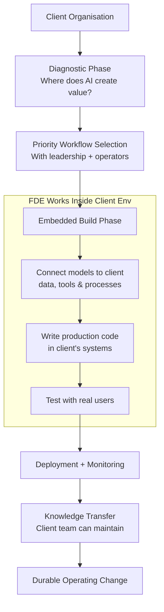
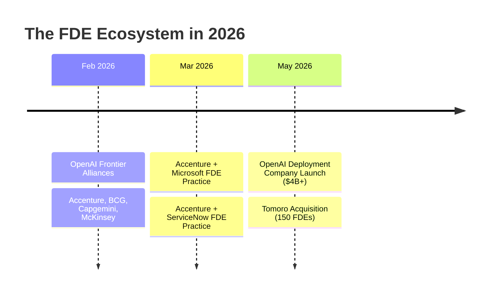
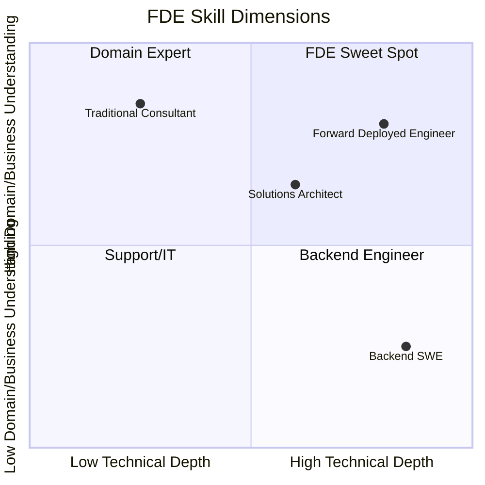

## The Bottleneck No One Talks About

For the past few years, every conversation about enterprise AI has circled the same questions: which model is most capable, which provider has the best API, which benchmark should you trust. But by mid-2026, the conversation has shifted. A different question is now driving billions of dollars in investment:

**Who actually builds the thing inside the company?**

Most enterprise AI projects don't fail because the model isn't good enough. They fail in the gap between a working prototype and a production system that the organisation actually uses. Data is siloed across legacy tools. Workflows were designed around humans and don't map onto agents. Teams don't know which process to automate first. The code is written, but no one built the integration layer, the monitoring, the change management, or the feedback loop.

This gap — call it the deployment gap — is where OpenAI placed a $4 billion bet on May 12, 2026.

---

## What Is the OpenAI Deployment Company?

The **OpenAI Deployment Company** (informally called DeployCo in industry coverage) is a majority-controlled OpenAI subsidiary backed by more than $4 billion in initial capital from 19 founding investors. The lead investors are TPG, Advent, Bain Capital, and Brookfield. Alongside the capital, three major consulting and systems integration firms — **Bain & Company, Capgemini, and McKinsey & Company** — joined as founding partners.

The same day as the launch, OpenAI announced the acquisition of **Tomoro**, an Edinburgh and London-based applied AI consulting firm with roughly 150 experienced engineers. Tomoro had already built production AI systems for Virgin Atlantic, Fidelity International, Tesco, Supercell, Red Bull, Mattel, and the NBA — giving the new Deployment Company an immediate, proven bench of operators.

The premise is simple: OpenAI's models are powerful enough for real business value, but most organisations lack the people who know how to wire those models into their operations and keep them running. DeployCo is the service layer that fills that gap — not through advice, but through engineers who write production code inside the client's own systems.

---

## The Role at the Center: Forward Deployed Engineer

The mechanism DeployCo uses to close the deployment gap is a job title that originated at a very different kind of company.

A **Forward Deployed Engineer** (FDE) is an engineer who works embedded inside a client organisation — physically on-site, hybrid, or inside the client's cloud environment — writing real code that runs in the client's production systems. They work alongside domain experts and frontline teams, not in a separate consulting layer removed from the actual workflows.

The name borrows from military vocabulary. "Forward deployed" means operating at the point of action rather than from a rear base. An FDE doesn't write a report and leave. They stay until the system runs reliably.

Their responsibilities span the full project lifecycle: identifying where AI creates value, designing the integration between models and existing data sources, building the production system, running it through testing with real users, and — critically — teaching the organisation's own people how to maintain and evolve it.

What FDEs are explicitly not: traditional management consultants. A McKinsey engagement delivers a strategy deck. An FDE engagement delivers a merged pull request. The deliverable is running code, not a recommendation.

---

## Where This Model Came From: Palantir's Intelligence-Agency Problem

The FDE concept is not new — it was invented at Palantir in the early 2010s out of a very specific kind of necessity.

Palantir's early customers were intelligence agencies. These were organisations that could not openly describe what they needed. They worked in classified environments with strict data policies, bespoke workflows, and decades of legacy systems built on institutional knowledge that wasn't written down anywhere.

Standard enterprise software sales — "here's our SaaS product, here's the API documentation" — didn't work. So Palantir took a different approach: it embedded engineers directly at customer sites, gave them security clearances, and had them work inside the client's operational environment until the software actually solved the problem.

The term "forward deployed" was borrowed deliberately from military vocabulary, where it describes units operating near the front line rather than from a rear logistics base. The model worked so well that by 2016, FDEs outnumbered traditional software engineers at Palantir.

From Palantir, the model spread. Companies like Stripe, Ramp, and Cursor all adopted variants of it. But until mid-2026, it was primarily associated with government and defense contexts. OpenAI's Deployment Company is the most visible signal yet that FDE is becoming the default model for deploying frontier AI into complex enterprises.

---

## The Engagement Model

A typical DeployCo engagement starts with what OpenAI describes as a "focused diagnostic" — a structured discovery process where FDEs map the client's workflows, data systems, and operating constraints to identify where AI can create measurable impact.

From that diagnostic, a small number of priority workflows are selected with the client's leadership and operational teams. Then the FDEs go to work: designing, building, testing, and deploying production systems that connect OpenAI models to the client's data, tools, and business processes.

The consulting partners — Bain & Company, Capgemini, McKinsey — handle the adjacent work that FDEs don't: operating model redesign, change management, systems integration strategy, data architecture planning, and long-term operational support. The Deployment Company and the consulting partners are described as coexisting rather than competing. DeployCo earns implementation revenue; the consulting firms earn advisory revenue.

This structure matters because it reflects how complex enterprise AI actually gets done. The code is only part of the problem. Getting 5,000 employees to change how they work, renegotiating vendor contracts, managing regulatory requirements for AI in a regulated industry, and ensuring the AI system stays accurate as the underlying data changes — all of that is change management, not software engineering.

---

## The Industry Pile-On

OpenAI's DeployCo didn't launch in a vacuum. The FDE model has been spreading rapidly across the industry since early 2026:

- **February 2026**: OpenAI announced its **Frontier Alliances** program, multi-year partnerships with Accenture, BCG, Capgemini, and McKinsey to co-sell AI deployment services to enterprises.
- **March 2026**: Accenture and Microsoft launched a joint **Microsoft Forward Deployed Engineering Practice** specifically designed to bring AI engineers inside client operations, focused on Azure AI capabilities.
- **March 2026**: Accenture and ServiceNow launched a separate **Forward Deployed Engineering Program** targeting agentic AI deployment for enterprise workflows.

This is a meaningful pattern. When Accenture launches FDE practices with both Microsoft and ServiceNow in the same quarter, it signals that the major systems integrators see embedded engineering as the primary delivery model for enterprise AI — not one-time implementation projects but continuous embedded teams.

---

## The Job Market Has Already Noticed

The demand signal from the labor market is striking. In April 2025, Indeed listed 643 open FDE positions in the US. By April 2026, that number had jumped to **5,330 — a 729% year-over-year increase**.

Salaries reflect the scarcity. The reported range runs from roughly $170,000 to $200,000+ annually, with top earners at large tech companies exceeding $300,000. Companies actively recruiting FDEs include not just OpenAI but Anthropic, Google Cloud, Palantir, Stripe, and Ramp.

The skills profile is unusual because the role demands depth in multiple dimensions simultaneously:

A pure software engineer can write excellent code but may not understand which workflow to automate or how to get buy-in from a resistant operations team. A pure consultant understands the business but can't write the production integration. The FDE profile sits at the intersection — high engineering depth, high domain and business fluency, and the interpersonal skills to operate inside a client organisation's culture and politics.

That combination is genuinely rare, which explains both the salary premium and the demand spike.

---

## What This Means

The launch of the OpenAI Deployment Company, alongside the Accenture practices and the FDE job market explosion, is telling a coherent story about where enterprise AI is in mid-2026:

**The technology problem is largely solved.** GPT-5.5, Claude Opus 4.8, Gemini 3.5 — these are capable enough to create real business value in most industries. The hard part is no longer "is the model good enough?" The hard part is the organisational transformation required to build production systems around them, change workflows that have existed for decades, integrate with legacy infrastructure, and maintain those systems over time.

That's a human problem, not a model problem. And the FDE model — embedding engineers directly inside organisations with the authority to write production code and the domain knowledge to understand the workflows — is the highest-leverage answer the industry has found so far.

The $4 billion OpenAI has raised for DeployCo is an explicit bet that the deployment gap is large enough, and persistent enough, to sustain a major professional services business built around frontier AI. Given that enterprise software implementation has historically been a larger revenue pool than the software licenses themselves — SAP's consulting ecosystem is larger than SAP — that bet looks defensible.

For developers and engineers watching from the outside, the FDE job market explosion is worth paying attention to. The ability to operate inside a client's systems, understand their domain deeply, and ship production code that survives contact with real organisational complexity — that's a distinct skill set from building products in a startup or writing features in a large tech org. It's a harder skill set to acquire. Which is exactly why it's worth $200,000 and up.

---

## Sources

- [OpenAI launches the OpenAI Deployment Company to help businesses build around intelligence — OpenAI](https://openai.com/index/openai-launches-the-deployment-company/)
- [OpenAI acquires Tomoro as founding piece of $14 billion Deployment Company — The Next Web](https://thenextweb.com/news/tomoro-openai-deployment-company-consulting)
- [OpenAI Launches Deployment Company With Tomoro Acquisition — Winbuzzer](https://winbuzzer.com/2026/05/12/openai-launches-deployment-company-tomoro-acquisition-xcxwbn/)
- [Introducing Frontier Alliances — OpenAI](https://openai.com/index/frontier-alliance-partners/)
- [What OpenAI Frontier Alliances Means for Your Data & AI Stack — Atlan](https://atlan.com/know/open-ai-frontier-alliances/)
- [Forward Deployed Engineer — Wikipedia](https://en.wikipedia.org/wiki/Forward_Deployed_Engineer)
- [How Palantir Invented the Forward Deployed Engineer Model — FDE Academy](https://fde.academy/blog/how-palantir-invented-the-forward-deployed-engineer-model)
- [What are Forward Deployed Engineers, and why are they so in demand? — The Pragmatic Engineer](https://newsletter.pragmaticengineer.com/p/forward-deployed-engineers)
- [Annual Salaries Top $300,000: AI Commercialization Fuels 800% Surge in 'Forward-Deployed Engineer' Jobs — BigGo Finance](https://finance.biggo.com/news/aGnvNJ4BYH_ypPqOyMpo)
- [Accenture Launches Microsoft Forward Deployed Engineering Practice — Accenture Newsroom](https://newsroom.accenture.com/news/2026/accenture-launches-microsoft-forward-deployed-engineering-practice-to-help-organizations-scale-ai-across-the-enterprise)
- [ServiceNow and Accenture Launch Forward Deployed Engineering Program — Accenture Newsroom](https://newsroom.accenture.com/news/2026/servicenow-and-accenture-launch-forward-deployed-engineering-program-to-scale-agentic-ai-across-the-enterprise)
- [What is a Forward Deployed Engineer: The AI Role OpenAI, Anthropic, and Google Are Hiring in 2026 — MarkTechPost](https://www.marktechpost.com/2026/05/20/what-is-a-forward-deployed-engineer-the-ai-role-openai-anthropic-and-google-are-hiring-in-2026/)
