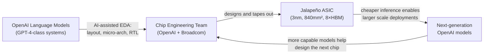
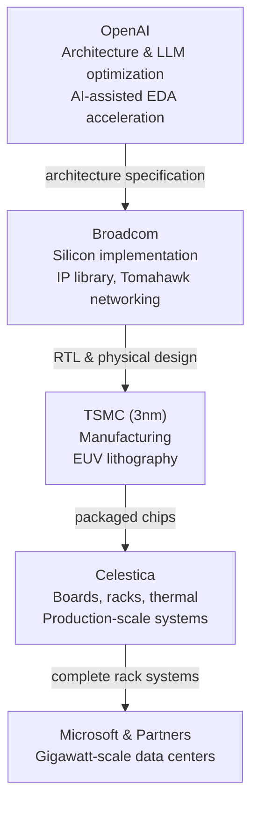

## The Bill for Every ChatGPT Response

Every time you've asked ChatGPT a question, the answer was generated on a rented GPU — almost certainly an NVIDIA H100, sitting in a Microsoft data center, drawing somewhere between 400 and 700 watts of power to produce your reply.

That arrangement worked well enough when AI demand was modest. At current scale, it's an existential cost problem. The more ChatGPT users OpenAI adds, the more GPU capacity it must buy or lease, at prices that NVIDIA sets. Inference — the act of generating text, one token at a time — has become OpenAI's largest operational expense, and general-purpose GPUs are not especially efficient at it.

Custom silicon is the standard answer to this problem. When you know exactly what you need to compute, you stop paying the overhead of hardware designed for everything else.

On June 24, 2026, OpenAI and Broadcom announced that OpenAI's answer has a name: **Jalapeño**.

---

## What Jalapeño Is

Jalapeño is OpenAI's first custom inference processor — an application-specific integrated circuit (ASIC) designed from the ground up for the specific math that large language models require.

Several design choices make it unusual even among custom AI chips:

**Reticle-scale die.** At approximately 840 mm², Jalapeño's die is essentially as large as TSMC's EUV lithography scanners can expose in a single shot on a 300 mm wafer. (The theoretical maximum is around 858 mm².) Making a die that large is a gamble: any random manufacturing defect that lands on the die kills the chip, so yield — the percentage of chips that pass quality control — is lower than on smaller dies. OpenAI accepted that tradeoff because a larger die means more compute and memory bandwidth in a single package, which is exactly what inference needs.

**Eight HBM stacks.** Surrounding the compute die are eight high-bandwidth memory (HBM) stacks, arranged on a silicon interposer in a 2.5D packaging configuration. Think of HBM like stacking a dozen thin memory wafers directly on top of each other, then placing that stack right next to the compute die on a shared substrate — with thousands of short vertical wires connecting them. The result: data moves a fraction of the distance it would on a conventional GPU design, and the available memory bandwidth increases substantially. This matters because inference is as much a memory bandwidth problem as a compute problem. A GPU doing inference is often sitting idle, waiting for model weights to arrive from memory, not actually computing.

**Systolic array + sparsity awareness.** The compute core is a systolic array — specialized matrix-multiply hardware tuned to transformer arithmetic. It's also designed to take advantage of sparsity: the observation that after quantization, a meaningful fraction of the weights in a trained model are zero, and zero-multiplications can be skipped. Skipping them reduces power consumption without affecting output quality.

**Integrated networking.** Rather than relying on commodity Ethernet switches between chips, Jalapeño uses Broadcom's Tomahawk networking silicon baked into the system architecture. When you're serving LLMs across many chips in parallel, inter-chip communication latency adds up quickly. Tighter integration reduces that overhead.

The chip is manufactured at TSMC on the 3-nanometer process node — the same node used in Apple's M4 and NVIDIA's Blackwell GPU generation.

---

## The Recursive Part: AI Designed the Chip

The nine-month timeline from initial design discussions to tape-out is what drew the most attention from semiconductor analysts. A high-performance ASIC of Jalapeño's complexity normally takes two to three years. Broadcom called it "one of the fastest development cycles ever achieved for a high-performance ASIC."

Three factors compressed the schedule:

1. **Software–hardware co-design.** OpenAI's model-serving teams and Broadcom's chip engineers worked in parallel rather than sequentially. Architecture decisions were made using real inference profiling data from production workloads, not guesses about what would matter. This eliminated the usual back-and-forth between software requirements and hardware capabilities.

2. **Broadcom's mature IP library.** Peripherals — memory controllers, I/O blocks, power management circuits — are proven blocks that Broadcom reused rather than redesigning from scratch. That alone removes months of verification work from the schedule.

3. **AI-assisted design.** OpenAI's own language models helped accelerate parts of the design and optimization process: register-transfer level coding, micro-architecture exploration, and documentation generation.

That third item deserves emphasis. The same class of models that will eventually run on Jalapeño helped decide what Jalapeño should look like. It is an early example of a recursive improvement loop: AI productivity tools speeding up the production of better AI infrastructure.

If this feedback loop can be replicated across successive chip generations, it could significantly compress the time between new silicon designs. NVIDIA currently releases new GPU generations on roughly an 18-to-24-month cadence. A competitor who can iterate in nine months and improve again before NVIDIA's next release operates in a fundamentally different competitive position.

---

## The Supply Chain: Who Does What

Jalapeño isn't a product OpenAI will sell; it's internal infrastructure. Getting it from tape-out to operating data centers requires a three-company supply chain with clearly delineated roles:

**OpenAI** designed the processor architecture around first-principles knowledge of LLM inference — the specific kernels, memory movement patterns, and serving behaviors that matter in production, not in benchmarks. That knowledge advantage is what makes custom silicon worth doing; if you don't have deep insight into the actual workload, you're just building a worse GPU.

**Broadcom** handled silicon implementation, tapping its existing IP portfolio and its mature relationship with TSMC's advanced packaging capabilities. Broadcom's XDSiP advanced packaging platform — which can integrate more than 6,000 mm² of silicon and up to 12 HBM stacks in a single device — provides the packaging foundation for Jalapeño's 2.5D configuration.

**Celestica** is the ODM (original design manufacturer) responsible for converting chips into deployable data center infrastructure: motherboards, rack layouts, power distribution, cooling systems, and the production-scale manufacturing pipelines that can supply enough units to fill gigawatt-scale facilities.

Microsoft has reportedly committed to purchasing 40% of the first production run — a guarantee that de-risks Broadcom's manufacturing investment and signals the intended deployment scale.

---

## Performance Claims — and the Important Caveats

OpenAI and Broadcom say Jalapeño will deliver roughly **50% lower inference cost per token** than current NVIDIA GPU alternatives, with performance per watt "substantially better than current state-of-the-art." Engineering samples are already running ML workloads in the lab at production target frequency and power. Third-party estimates suggest 2.5× the tokens per second per watt of comparable NVIDIA solutions on certain language tasks; a separate analysis suggests up to 60% lower power per inference versus an H100 on the same workload.

The caveats matter. These numbers are self-reported, benchmarked on workloads of OpenAI and Broadcom's own choosing, without disclosed comparison baselines or independent verification. OpenAI has not yet published a technical whitepaper or per-precision performance figures — those are promised for the coming months. Analysts note it is unclear which NVIDIA chips Jalapeño was tested against, under which batch sizes, model configurations, and production conditions.

The historical pattern with first-generation custom silicon is that real-world advantages tend to be narrower than launch claims, and that the second generation is when the benefits become clear and verifiable. Jalapeño should be read in that light.

---

## Deployment: End of 2026, Gigawatt Scale

Volume production and data center deployment is targeted for end of 2026, as the first step in what OpenAI and Broadcom are calling a "multi-generation compute platform."

"Gigawatt scale" is the stated ambition for the facilities being planned with Microsoft and unnamed additional partners. For context: a typical large hyperscale cloud data center today operates in the hundreds of megawatts range. A single gigawatt of power capacity is roughly equivalent to the output of a large nuclear power plant, and planning data centers at that scale represents a step-function increase in infrastructure intensity per facility. That shift is already visible in utility filings and grid planning documents across the US.

---

## What This Means for NVIDIA

NVIDIA currently holds an estimated 80% market share in AI accelerator chips. That dominance is structural: it took decades to build the CUDA software ecosystem, the manufacturing relationships with TSMC and SK Hynix, and the systems integration expertise that lets large clusters of GPUs work together efficiently.

Custom silicon from hyperscalers and AI labs — Google's TPUs, Amazon's Trainium, Microsoft's Maia, and now OpenAI's Jalapeño — doesn't show up in NVIDIA's market share statistics as lost sales, because these chips aren't sold competitively; they're consumed internally by their creators. Each GPU that a hyperscaler stops buying is a quiet erosion rather than a headline loss.

The nine-month design cycle is the variable that changes the competitive calculus. Conventional chip development timelines have historically protected incumbent chip vendors: by the time a competitor's custom silicon is designed, manufactured, and deployed, the incumbent has shipped a new generation. If AI-assisted design reliably compresses ASIC development to nine months, that buffer disappears. A team with sufficient model-serving expertise and an AI-assisted EDA pipeline could potentially iterate faster than the two-year GPU refresh cadence.

That scenario remains speculative. Jalapeño has yet to ship in volume. The performance claims haven't been independently verified. AI-assisted chip design is still early, and the nine-month timeline may reflect favorable conditions that don't generalize. But the tape-out is real, and it establishes a proof of concept that will be carefully watched by every semiconductor company whose business depends on AI compute demand.

---

## Sources

- [OpenAI and Broadcom Unveil LLM-Optimized Inference Chip — OpenAI](https://openai.com/index/openai-broadcom-jalapeno-inference-chip/)
- [OpenAI Unveils Its First Custom Chip, Built by Broadcom — TechCrunch](https://techcrunch.com/2026/06/24/openai-unveils-its-first-custom-chip-built-by-broadcom/)
- [OpenAI Unveils First Custom AI Inference Chip Jalapeño With Broadcom — VentureBeat](https://venturebeat.com/infrastructure/openai-unveils-first-custom-ai-inference-chip-jalapeno-with-broadcom-and-its-development-was-sped-up-with-openais-own-models)
- [Broadcom and OpenAI Unveil Custom-Built Jalapeño Inference Processor — Tom's Hardware](https://www.tomshardware.com/tech-industry/artificial-intelligence/broadcom-and-openai-unveil-custom-built-jalapeno-inference-processor-openais-first-chip-is-a-massive-reticle-sized-asic-built-in-an-ultra-fast-nine-month-development-cycle)
- [OpenAI and Broadcom Reveal Jalapeño, First AI Chip in Partnership — CNBC](https://www.cnbc.com/2026/06/24/openai-and-broadcom-reveal-jalapeno-first-ai-chip-in-partnership.html)
- [OpenAI and Broadcom Unveil LLM-Optimized Intelligence Processor — Broadcom Investor Relations](https://investors.broadcom.com/news-releases/news-release-details/openai-and-broadcom-unveil-llm-optimized-intelligence-processor)
- [Jalapeño in Nine Months: Did AI Just Break Chip Design Timelines? — Futurum Group](https://futurumgroup.com/insights/jalapeo-in-nine-months-did-ai-just-break-chip-design-timelines/)
- [OpenAI's First Custom AI Chip Targets 50% Cheaper Inference — TechTimes](https://www.techtimes.com/articles/319012/20260624/openais-first-custom-ai-chip-targets-50-cheaper-inference-jalapeno-unveiled.htm)
- [OpenAI Jalapeño Chip: What It Means for GPU Cloud — Spheron Blog](https://www.spheron.network/blog/openai-jalapeno-chip-gpu-cloud-inference-2026/)
- [OpenAI, Broadcom Roll Out Jalapeño AI Chip, Target Gigawatt-Scale Data Centres — Big News Network](https://www.bignewsnetwork.com/news/279145527/openai-broadcom-roll-out-jalapeno-ai-chip-for-llm-inference-target-gigawatt-scale-data-centres-from-2026)
