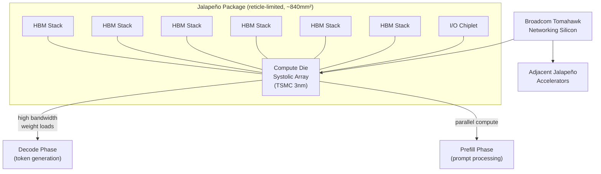
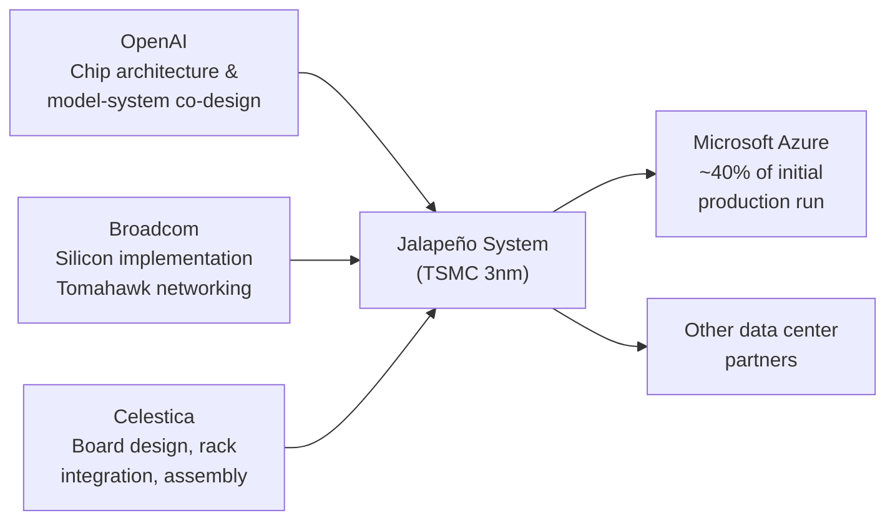

## The Bill That Won't Stop Growing

Running ChatGPT is expensive. Not in the casual sense — in the "this is the fastest-growing cost in a company burning tens of billions a year" sense. OpenAI's server costs crossed $8.4 billion last year. With GPT-5.6 now deployed and model usage climbing, projections put this year's figure around $14 billion.

The overwhelming majority of that bill is inference: generating every token of every response, for every user, on every device, around the clock. And almost all of that inference runs on NVIDIA GPUs — hardware designed for a wide range of parallel workloads, not specifically for the mechanics of large language models.

That's the business problem Jalapeño was built to solve.

---

## Why General-Purpose GPUs Leave Money on the Table

To understand why a custom chip matters, it helps to understand what actually happens when a language model generates text.

LLM inference has two distinct phases. The first is **prefill**: the model processes your entire prompt at once, a highly parallel computation that GPUs handle efficiently. The second — and far more time-consuming — is **decode**: the model generates each new token one at a time, autogressively, in sequence.

The decode phase is where the bottleneck lives. Generating a single token requires loading the entire model's weights from memory into the compute cores — every time, for every token. If a model has 100 billion parameters and produces 1,000 tokens in response to your query, those 100 billion values get loaded from memory 1,000 times over.

The limiting factor here is not raw computational speed (measured in FLOPS). It is **memory bandwidth** — how fast the chip can move data between storage and compute. Modern NVIDIA H100 GPUs are extraordinarily powerful at FLOPS, but a large share of that compute sits idle during the decode phase, waiting for memory transfers that can't keep up.

Custom chips designed specifically around this access pattern can do what a general-purpose GPU cannot: trade unused compute for vastly higher memory bandwidth, achieving "realized utilization much closer to theoretical peak performance," as OpenAI described it.

This is the technical gap Jalapeño is designed to close.

---

## What Jalapeño Actually Is

Announced on June 24, 2026, Jalapeño is a custom ASIC (Application-Specific Integrated Circuit) built on **TSMC's 3nm process** — the same manufacturing generation used for Apple's M4 chip and NVIDIA's Blackwell GPUs.

The key architectural choices:

- **Die size**: approximately 840mm², pressing against the reticle limit (~858mm²) of what an EUV scanner can expose in a single shot. Going reticle-limited means maximizing transistor count on a single monolithic die.
- **Memory**: eight HBM (High Bandwidth Memory) stacks surrounding the central compute die, delivering a massive memory bandwidth advantage over standard DRAM configurations.
- **Compute core**: a systolic array architecture — the same fundamental design philosophy as Google's early TPUs — optimized for the matrix multiplications at the heart of transformer inference.
- **I/O**: a separate I/O chiplet handles connectivity; two structural dummy dies provide mechanical balance in the package.
- **Networking**: Broadcom's Tomahawk silicon connects large numbers of Jalapeño accelerators inside data center racks, enabling multi-chip inference at scale.

The design philosophy is single-minded: Jalapeño was built for one job, running production inference on large language models as efficiently as possible. Every architectural choice subordinates general versatility to that specific workload.

OpenAI claims roughly **50% lower inference cost per token** versus current GPU-based clusters, along with "substantially better performance per watt." Engineering samples were already running ML workloads — including GPT-5.3-Codex-Spark — at production target frequency and power as of the announcement.

Independent benchmarks have not yet been published; the detailed technical report is expected later this year.

---

## The Chip That Was Designed With AI

Perhaps the most striking detail about Jalapeño is not what it does, but how fast it got here.

Custom ASICs of this complexity typically take **two to four years** from initial design to completed tape-out. Jalapeño went from blank-slate design to tape-out in **nine months** — a pace that semiconductor engineers have described as possibly the fastest publicly recorded cycle for a high-performance chip in this class.

The explanation OpenAI gave: their own AI models helped accelerate the chip's design and optimization process. The company did not specify which models were used or exactly how they were integrated into the engineering workflow. But the implication is significant: AI was used to design the chip that AI models will run on.

This creates a closed loop worth paying attention to. As frontier AI models become more capable at technical reasoning and code — including the specialized logic and verification work that chip design requires — they can compress the hardware development cycle. Faster hardware cycles mean cheaper inference sooner, which enables more capable models at lower cost, which in turn can further accelerate hardware development.

It is a feedback loop that didn't exist five years ago.

---

## Three Companies, One System

Jalapeño is not an OpenAI-alone story. The chip required a coordinated three-way partnership:

**OpenAI** designed the chip architecture from scratch, informed by years of operating large-scale inference systems and deep knowledge of their own model kernels, memory access patterns, and serving infrastructure. The co-design — where software and hardware are developed together rather than sequentially — is how the nine-month timeline was achievable.

**Broadcom** handled silicon implementation and brought critical networking expertise. Broadcom's Tomahawk networking silicon is what allows large numbers of Jalapeño chips to communicate efficiently inside a single data center rack, enabling multi-chip inference for the largest models. Broadcom has been a key player in custom AI silicon for hyperscalers — they also manufacture Google's TPUs.

**Celestica** is handling the system layer: board design, rack integration, and the production infrastructure to move individual chips into deployable computing systems at scale.

The partnership also spans generations: OpenAI and Broadcom announced a 10-gigawatt compute program covering both the current 3nm generation and a planned future 2nm generation, suggesting this is the beginning of a regular hardware cadence, not a one-off project.

---

## How It Compares to the Field

OpenAI is not the first AI company to build custom silicon — it is, by some measures, the last major one to do so.

| Company | Custom chip | In production |
|---|---|---|
| Google | TPU (first gen 2015; v6 "Trillium" 2024) | Yes — ~25% of global AI compute outside NVIDIA |
| Amazon | Trainium / Inferentia | Yes — over 1M chips shipped |
| Microsoft | Maia | Yes — Azure deployment |
| Meta | MTIA (Meta Training and Inference Accelerator) | Yes — production since 2023 |
| Apple | Neural Engine (on-device) | Yes — every iPhone/Mac since 2017 |
| **OpenAI** | **Jalapeño** | **Late 2026 (samples running)** |

NVIDIA remains the dominant supplier — its H100 and Blackwell GPUs power the vast majority of AI training and inference workloads globally, backed by a CUDA software ecosystem with over 4 million registered developers and 15 years of tooling depth. No custom ASIC, however efficient, immediately dislodges that installed base.

What custom chips do is allow the companies building on top of AI to control their own cost curve. Google's TPUs, by its own accounting, now cover roughly a quarter of its global AI compute capacity outside NVIDIA's supply chain. That is not GPU displacement — it is cost optimization and supply-chain resilience operating in parallel.

OpenAI's position is different from Google's in one key respect: OpenAI's inference volume is concentrated on a small number of their own models, while Google deploys AI across an enormous variety of products and services. Concentration makes custom silicon easier to justify and easier to optimize.

---

## The Deployment Timeline

Jalapeño is not yet shipping at scale. Here is what OpenAI and Broadcom have committed to:

- **Now (mid-2026)**: Engineering samples running ML workloads in OpenAI's labs at production-target frequency and power.
- **Late 2026**: Small prototype deployments at Microsoft data centers and other infrastructure partners. Microsoft is expected to take approximately 40% of the initial production run.
- **2027**: Full production ramp begins. Jalapeño starts carrying a meaningful fraction of OpenAI's inference traffic.
- **2028 (first half)**: Full operational scale across gigawatt-class data centers.

The gap between announcement and production is longer than the chip's development timeline — but this is normal for custom silicon at data center scale. Integrating a new chip architecture into production serving systems, qualifying it at each data center partner, and ramping manufacturing to the required volume all take time even after the chip works correctly in the lab.

---

## What Lower Inference Costs Actually Mean

The practical question is: who benefits if inference gets 50% cheaper?

The most direct answer is OpenAI itself — at $14 billion projected in infrastructure costs this year, a 50% reduction would recover billions of dollars annually that can be redirected to compute for training, product development, or margin.

The second answer is users and developers. Inference cost is a ceiling on what AI products can do economically. Every time inference gets cheaper, features that were financially impractical become viable: longer context windows in production, more frequent autonomous agent actions, AI running on personal devices that currently can't afford the API calls. The price drops that have made GPT-3.5-level capability effectively free — a roughly 280-fold reduction since late 2022 — have come primarily from software optimization and model efficiency. Custom hardware adds another structural lever to that curve.

The third answer is competition. When OpenAI controls its own silicon, it can offer pricing that is structurally independent of NVIDIA's pricing decisions. That matters for any market where OpenAI and its competitors price against each other.

---

## The Recursive Part

There is something slightly vertiginous about the whole story.

A company that builds AI used AI to design the chip that AI will run on. The design cycle was cut from years to months. The chip that emerges is optimized for exactly the workload the company's own models produce. And as those models improve at technical tasks, they become better at accelerating the next iteration of chip design.

The feedback loop between AI capability and AI infrastructure has always been present at a slow speed — better models justify more compute investment, which enables better models. Jalapeño is an example of that loop tightening, moving from years to months and from software optimization to hardware co-design.

Whether Jalapeño delivers on its performance-per-watt promises will be answered by independent benchmarks later this year. What is already clear is that OpenAI has permanently joined the club of AI companies that own their own hardware stack — and that it got there faster than anyone expected.

---

## Sources

- [OpenAI and Broadcom Unveil LLM-Optimized Intelligence Processor — OpenAI](https://openai.com/index/openai-broadcom-jalapeno-inference-chip/)
- [OpenAI and Broadcom Unveil LLM-Optimized Intelligence Processor — Broadcom Inc.](https://investors.broadcom.com/news-releases/news-release-details/openai-and-broadcom-unveil-llm-optimized-intelligence-processor)
- [OpenAI unveils its first custom chip, built by Broadcom — TechCrunch](https://techcrunch.com/2026/06/24/openai-unveils-its-first-custom-chip-built-by-broadcom/)
- [Broadcom and OpenAI unveil custom-built Jalapeño inference processor — Tom's Hardware](https://www.tomshardware.com/tech-industry/artificial-intelligence/broadcom-and-openai-unveil-custom-built-jalapeno-inference-processor-openais-first-chip-is-a-massive-reticle-sized-asic-built-in-an-ultra-fast-nine-month-development-cycle)
- [OpenAI and Broadcom unveil Jalapeño, a new AI chip built for LLM inference — Neowin](https://www.neowin.net/news/openai-and-broadcom-unveil-jalapeo-a-new-ai-chip-built-for-llm-inference/)
- [OpenAI unveils its first custom chip, built by Broadcom — CNBC](https://www.cnbc.com/2026/06/24/openai-and-broadcom-reveal-jalapeno-first-ai-chip-in-partnership.html)
- [OpenAI's First Custom AI Chip Targets 50% Cheaper Inference: Jalapeño Unveiled — TechTimes](https://www.techtimes.com/articles/319012/20260624/openais-first-custom-ai-chip-targets-50-cheaper-inference-jalapeno-unveiled.htm)
- [Broadcom and OpenAI debut Jalapeño Intelligence Processor — TechRadar](https://www.techradar.com/pro/broadcom-and-openai-debut-jalapeno-intelligence-processor-plot-an-apple-like-move-to-build-the-full-stack)
- [OpenAI debuts Jalapeño, its first custom AI chip to cut ChatGPT costs and reduce Nvidia dependency — TechSpot](https://www.techspot.com/news/112890-openai-debuts-jalapeo-custom-chip-built-cut-chatgpt.html)
- [OpenAI Jalapeño Chip: 50% Cheaper AI Inference, Challenging Nvidia — MACGPU Blog](https://macgpu.com/en/blog/2026-0625-openai-jalapeno-custom-ai-inference-chip.html)
