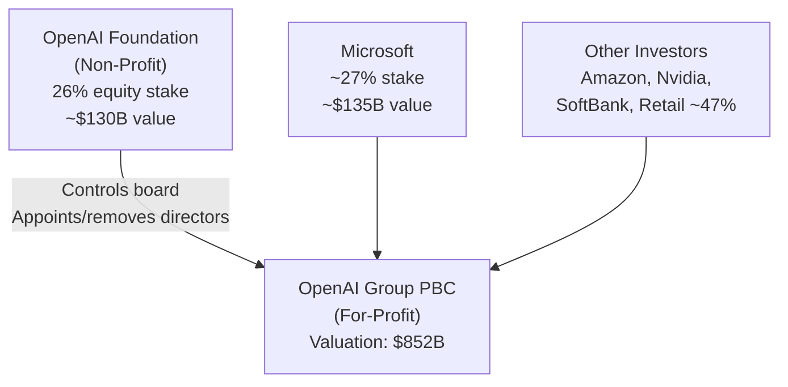
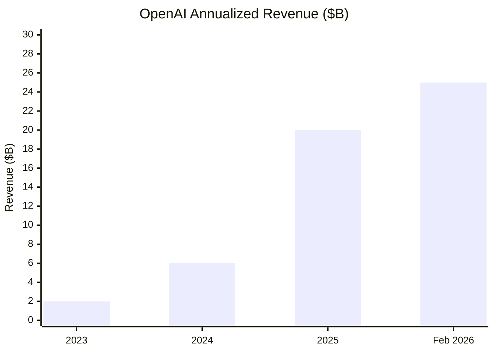
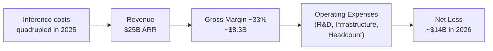

## The Company That Changed Everything Is About to Change Again

In October 2025, OpenAI completed a corporate transformation that had taken nearly two years of negotiations with state attorneys general. The storied AI lab — founded as a nonprofit to ensure artificial intelligence benefits humanity — became OpenAI Group PBC: a for-profit public benefit corporation with a $730 billion valuation and the legal machinery in place to list on a stock exchange.

Five months later, it had raised an additional $122 billion and was valued at $852 billion. CEO Sam Altman was openly discussing a 2026 IPO. And CFO Sarah Friar was, according to multiple reports, quietly urging him to wait.

This is the story of how OpenAI got here, what the numbers actually say, and why the biggest IPO in tech history may be more complicated than the press releases suggest.

---

## From Non-Profit to PBC: The Corporate Transformation

OpenAI launched in 2015 as a nonprofit with a mission to develop artificial general intelligence for the benefit of humanity. That structure worked fine when the company was a research lab. It became a serious constraint the moment OpenAI needed to raise the billions required to train and serve frontier AI models.

In 2019, OpenAI created a "capped profit" subsidiary — a for-profit entity where early investors could earn returns up to 100x their investment, with anything above that flowing to the nonprofit. It was an unusual structure designed to attract capital while preserving the mission. It worked, initially. Microsoft invested $1 billion, then much more.

But by 2024, the "capped profit" structure was becoming untenable. Competitors were raising uncapped capital. Anthropic and xAI had no such restrictions. OpenAI needed a clean cap table it could take public.

The restructuring completed in October 2025 replaced the capped-profit model with a standard public benefit corporation. The nonprofit (now called the OpenAI Foundation) retained a 26% equity stake — valued at roughly $130 billion — and kept the exclusive right to appoint and remove all board members. Microsoft, which had invested more than $13 billion across multiple rounds, ended up holding approximately 27% of the new PBC.

Crucially, the restructuring removed fundraising caps entirely — paving the way for the round that came next.

---

## The $122 Billion Round: The Largest in Silicon Valley History

On March 31, 2026, OpenAI announced it had closed a $122 billion funding round at a post-money valuation of $852 billion. It was the largest single private financing in Silicon Valley history — by a wide margin.

The investor roster read like a who's who of global tech capital:
- **Amazon**: up to $50 billion
- **Nvidia**: $30 billion
- **SoftBank**: $30 billion
- **Retail investors**: $3 billion (an unusual inclusion, signaling the eventual IPO)
- **Various other institutional investors**: the remaining balance

Microsoft continued to participate, though it accepted a renegotiated deal: it would no longer have the first right of refusal to be OpenAI's sole compute provider. OpenAI committed to purchasing $250 billion in Azure services over time, but gained the freedom to work with other cloud providers — including the very Amazon and Google infrastructure it had just accepted capital from.

The stated purpose of the round: build global AI infrastructure, continue frontier model research, and accelerate a platform vision that insiders were already calling a "superapp" — an AI assistant that could operate across productivity tools, consumer applications, and enterprise workflows with a unified interface.

At $852 billion, OpenAI was within striking distance of a $1 trillion valuation. The implied target for a 2026 IPO? Somewhere above that threshold.

---

## The Revenue Reality: Fast Growth, Unusual Losses

OpenAI hit $25 billion in annualized revenue in February 2026, up from $20 billion at the end of 2025, $6 billion in 2024, and roughly $2 billion in 2023. That's approximately a 3x year-over-year growth rate maintained for three consecutive years — performance that rivals the fastest-growing software companies in history.

The user numbers are equally striking. ChatGPT surpassed **900 million weekly active users** in February 2026, up from 400 million a year earlier. The company has more than 50 million paying subscribers. Enterprise now accounts for over 40% of revenue and is growing faster than consumer.

The business model breaks down roughly into three segments:

**Consumer subscriptions** — ChatGPT Free (ad-supported), ChatGPT Plus ($20/month), ChatGPT Pro ($200/month for heavy users). This segment drove initial explosive growth and remains the largest user funnel.

**Enterprise & team plans** — ChatGPT Team (~$25–30/user/month) and ChatGPT Enterprise (custom pricing, typically ~$60/seat) for organizations that need admin controls, privacy guarantees, and extended context. Enterprise is the fastest-growing revenue segment.

**API & developer access** — Developers and companies building products on top of GPT models pay per token consumed. API revenue is estimated at roughly $3.2 billion annualized and growing alongside the broader AI developer ecosystem.

The problem is what happens when you look below the revenue line.

---

## The Profitability Paradox: Burning Billions to Make Billions

Here is the uncomfortable arithmetic of being the world's leading AI company.

OpenAI's own internal forecasts, reported by the Wall Street Journal in late 2025, project **$14 billion in losses for 2026** — on roughly $25 billion in revenue. The losses aren't evidence of mismanagement; they're the structural cost of operating at the frontier of AI.

Training a new generation of frontier models costs hundreds of millions of dollars per run. Serving 900 million weekly users at inference — answering their questions, generating their images, running their code — requires enormous GPU clusters running continuously. OpenAI's inference costs alone quadrupled in 2025 as the models got more capable and the user base expanded.

The result: gross margins have actually *compressed* as the business has grown, from approximately 40% in 2024 to around 33% in 2025. Revenue is scaling, but so are costs — and right now costs are winning.

OpenAI's own projections show losses totaling roughly $44 billion before the company reaches profitability — which internal models put at some point around 2029. The path to profit depends on two bets: that model efficiency (doing more inference for less compute) will improve faster than usage grows, and that the AI platform vision will generate high-margin software revenue that doesn't require proportionally more GPU spend.

Both bets may well pay off. But they're bets, not certainties.

---

## The IPO Debate: Altman vs. Friar

In early May 2026, reporting from the Wall Street Journal surfaced a tension inside OpenAI that the company had not advertised: CEO Sam Altman and CFO Sarah Friar were not aligned on IPO timing.

Altman, who had publicly signaled a 2026 listing for months, reportedly wants to file in Q4 2026 — while the growth narrative is strong and before competitive pressure from Anthropic (reportedly now at $30 billion ARR) makes the positioning harder.

Friar, the former DocuSign CFO hired specifically to prepare OpenAI for public markets, has reportedly raised two specific concerns:

**Reporting readiness.** Going public means Sarbanes-Oxley compliance, audited financials, quarterly earnings calls, and the full weight of SEC reporting requirements. Friar has reportedly told colleagues that OpenAI has not yet built the internal controls and finance infrastructure to meet those standards on a 2026 timeline.

**The $600 billion problem.** OpenAI has accumulated approximately $600 billion in committed future spending — primarily data center contracts, cloud compute commitments, and chip procurement. If revenue growth doesn't accelerate above current trajectory, those commitments could create a balance sheet problem precisely when the company is asking public investors to value it at $1 trillion or above.

OpenAI has also reportedly missed several internal revenue milestones, including a target of 1 billion weekly active ChatGPT users — it's at 900 million but hasn't crossed that round number.

The tension here is structural. Altman is optimizing for strategic timing — going public before competitors, while the AI narrative is at peak momentum, and while the $852 billion private valuation gives him pricing power. Friar is optimizing for IPO quality — the kind of debut that holds its post-listing price and doesn't damage institutional credibility.

Both positions are rational. Which one prevails will likely determine whether the IPO happens in 2026 or slides to 2027.

---

## What a Trillion-Dollar OpenAI Would Actually Mean

To put the numbers in context: a $1 trillion IPO would make OpenAI larger than any company in history at the time of its public debut. For comparison:

- **Amazon's IPO** in 1997 valued it at roughly $550 million
- **Google's IPO** in 2004 valued it at $23 billion
- **Facebook's IPO** in 2012 valued it at $104 billion
- **Saudi Aramco's IPO** in 2019, the largest ever, valued it at $1.7 trillion — but that was a slow-moving traditional energy company with decades of earnings history

OpenAI would be going public with $25 billion in revenue, $14 billion in losses, and a thesis that hinges on the most transformative technology transition since the internet. Investors would be asked to buy into a company that might not turn a profit for three years — but that could realistically be generating $100 billion in revenue by 2029 if its projections hold.

The SpaceX IPO, widely expected to happen around the same time, is drawing comparisons: another capital-intensive, visionary, founder-led tech company that asks investors to trust a roadmap more than a balance sheet.

What makes the OpenAI case unique is the structural complexity: a nonprofit controls the board, $600 billion in commitments sit on the books, and the company's most important strategic asset — its frontier AI models — can be partially replicated by well-funded competitors. The moat is real, but it's maintained by constant, expensive reinvestment.

---

## The Bigger Picture

Whatever happens with the IPO timeline, OpenAI's trajectory in the first half of 2026 illustrates something important about the AI industry: the economics of building at the frontier are nothing like ordinary software.

Traditional software scales beautifully — write the code once, sell it a million times, watch margins expand. AI at scale works differently. Every additional user, every more capable model, every new capability requires more compute. The costs don't decouple from the revenue in the same way.

The companies that figure out how to break that coupling — through more efficient models, higher-margin enterprise software built on top of AI, or hardware that gets dramatically cheaper — will have a durable business. The ones that don't will spend the next decade chasing growth while the gap between revenue and losses closes too slowly for public markets to reward.

OpenAI is the clearest test case. It has the most users, the most revenue, and the most ambitious vision in the sector. It also has the most debt, the most committed spending, and the most pressure to prove that intelligence at scale can eventually be profitable.

The IPO, whenever it comes, will be one of the most scrutinized debut filings in financial history. The number that matters most won't be the valuation. It'll be the margin trajectory.

---

## Sources

- [OpenAI Raises $122 Billion at $852 Billion Valuation, Closing Largest Funding Round in History — Yahoo Finance](https://finance.yahoo.com/sectors/technology/articles/openai-raises-122-billion-852-073000122.html)
- [OpenAI, Not Yet Public, Raises $3B from Retail Investors in Monster $122B Fund Raise — TechCrunch](https://techcrunch.com/2026/03/31/openai-not-yet-public-raises-3b-from-retail-investors-in-monster-122b-fund-raise/)
- [OpenAI Closes Record-Breaking $122 Billion Funding Round as Anticipation Builds for IPO — CNBC](https://www.cnbc.com/2026/03/31/openai-funding-round-ipo.html)
- [ChatGPT Reaches 900 Million Weekly Active Users — TechCrunch](https://techcrunch.com/2026/02/27/chatgpt-reaches-900m-weekly-active-users/)
- [OpenAI IPO Delay to 2027? Sarah Friar Flags $600 Billion Risk as Sam Altman Pushes 2026 Listing — TechTimes](https://www.techtimes.com/articles/316323/20260504/openai-ipo-delay-2027-sarah-friar-flags-600-billion-risk-sam-altman-pushes-2026-listing.htm)
- [OpenAI CFO Reportedly Wants to Delay the IPO from 2026 to 2027 — Gizmodo](https://gizmodo.com/openais-cfo-reportedly-wants-to-delay-the-ipo-from-2026-to-2027-2000753760)
- [OpenAI Completes Restructure, Solidifying Microsoft as a Major Shareholder — CNBC](https://www.cnbc.com/2025/10/28/open-ai-for-profit-microsoft.html)
- [OpenAI Says It Plans to Report Stunning Annual Losses Through 2028 — Then Turn Wildly Profitable — Fortune](https://fortune.com/2025/11/12/openai-cash-burn-rate-annual-losses-2028-profitable-2030-financial-documents/)
- [OpenAI's Own Forecast Predicts $14 Billion Loss in 2026 but Nvidia-Style $100 Billion Revenues by 2029 — Yahoo Finance](https://finance.yahoo.com/news/openais-own-forecast-predicts-14-150445813.html)
- [OpenAI IPO 2026: Revenue, Valuation, Timeline and How to Invest — Techi.com](https://www.techi.com/openai-ipo/)
- [Facing $14B Losses in 2026, OpenAI Is Now Seeking $100B in Funding. But Can It Ever Turn a Profit? — RD World Online](https://www.rdworldonline.com/facing-14b-losses-in-2026-openai-is-now-seeking-100b-in-funding-but-can-it-ever-turn-a-profit/)
- [Our Structure — OpenAI](https://openai.com/our-structure/)
