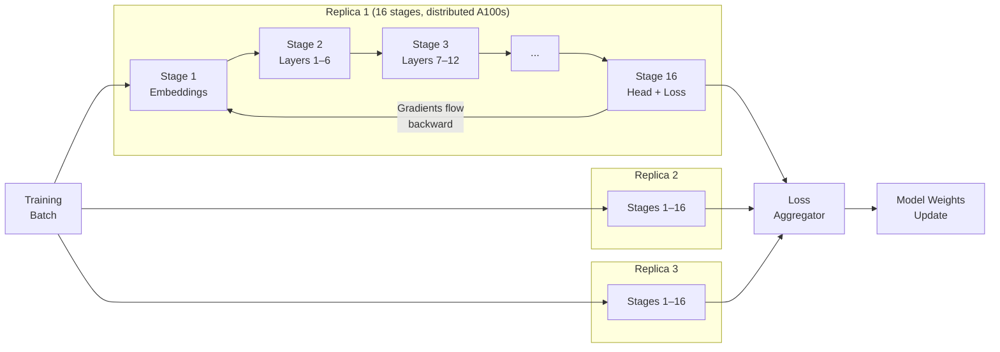

## The $100-Billion-Dollar Training Club

Training a frontier AI model is, for now, a member-only sport. GPT-4 is estimated to have cost around $100 million. The next wave of trillion-parameter models could exceed a billion dollars per run. To play at that level, you need tens of thousands of H100 GPUs, cooled and colocated in purpose-built datacenters, connected by ultra-low-latency InfiniBand fabric running at hundreds of gigabits per second.

In late April 2026, a team called Macrocosmos finished training a 100-billion-parameter language model across 48 geographically distributed Nvidia A100 GPUs connected over the public internet — for the equivalent of **$20 per hour** in compute costs.

Not $20 million. Not $20,000. Twenty dollars per hour.

The model is called **Orion-100B**, and it's the largest language model pretraining run ever conducted over the open internet. The headline cost figure is striking, but the more important story is *how* they got there — because the engineering decisions behind Orion reveal a credible path toward training frontier AI models without billion-dollar datacenters.

---

## What Orion-100B Actually Is

Orion-100B is a proof-of-concept, not a consumer product. The model itself uses a modified LLaMA 3.2 architecture at 100 billion parameters — comparable in scale to the class of models (Llama 4 Maverick, GPT-4o) running specialized workloads for millions of people daily. But Macrocosmos isn't shipping this model as a chatbot. They're demonstrating that a new training infrastructure can reach this scale at all.

The model was trained on **Bittensor Subnet 9** (SN9), a decentralized compute network where independent participants contribute GPU capacity and earn cryptocurrency rewards in exchange. Before Orion, the largest models trained on this infrastructure hovered below 15 billion parameters. Orion crossed 100 billion — a nearly **7× leap** achieved in a single month of scaling work.

---

## Why Training Across the Internet Is Hard

Training a large neural network means performing billions of floating-point operations in a precise sequence, with every GPU in the cluster needing to synchronize gradients after each step. In a datacenter, this happens over dedicated InfiniBand links at 400–800 Gb/s with microsecond-level latency.

The public internet is nothing like that. Connections between machines in different cities have round-trip latencies measured in milliseconds, not microseconds, and can swing unpredictably. A gradient synchronization that takes 200 microseconds over InfiniBand might take 50 milliseconds over a transcontinental internet link — meaning the GPUs sit idle 99.6% of the time between steps.

This is why most researchers considered internet-distributed training impractical for large models. The bandwidth wall seemed insurmountable. Macrocosmos found three specific engineering answers.

---

## Three Innovations That Made It Work

### IOTA: Pipeline Parallelism Built for Latency

IOTA (Incentivised Orchestrated Training Architecture) restructures how a model is split across machines. It avoids the communication patterns that make other parallelism strategies brutal over the internet.

In **data parallelism**, every GPU holds a full copy of the model and must synchronize gradients with every other GPU after each step — all-to-all communication that doesn't tolerate latency well. In **tensor parallelism**, model layers are sharded across machines that must communicate mid-layer during every forward pass — even worse.

IOTA uses **pipeline parallelism** instead: the 100B model is sliced into 16 sequential *stages*, each hosted on a different machine. Data flows forward through the stages like an assembly line — stage 1 processes the input, passes its output to stage 2, which passes its output to stage 3, and so on. Backward passes flow in reverse. Because each stage only needs to communicate with the *adjacent* stage rather than the entire cluster, the network traffic at any point is a single tensor transfer between two machines, not a collective broadcast.

Three independent **replicas** run in parallel (three copies of the 16-stage pipeline), which both increases throughput and provides resilience against node failures.

### ResBM: Shrinking the Data That Crosses the Wire

Even with pipeline parallelism, the activations (intermediate outputs) that pass between stages are large. In an uncompressed LLaMA-3.2 100B model, each activation tensor at a stage boundary is **140.6 MB**. At typical internet speeds and training step frequencies, that becomes a crippling bottleneck.

ResBM is a **lossless activation compression** technique developed specifically for this problem. It compresses those 140.6 MB tensors down to **2.2 MB** — a 64× reduction — with zero information loss. The underlying math of the training run is preserved exactly; only the wire format changes. This single innovation is what makes stage-to-stage communication over consumer internet connections viable in practice.

### Fault-Tolerant Orchestration

Distributing across the open internet means nodes drop out. A GPU in Germany might go offline mid-run. A node in Singapore might hit a network brownout. Orion's custom peer-to-peer networking protocol handles this gracefully.

When a node drops, the three replicas allow training to continue — one replica can absorb the work of another temporarily. Completed stages cache their outputs; when a node rejoins, only incomplete stages re-execute. A traditional datacenter cluster typically checkpoints the whole run and restarts from the last save when any node fails. Orion's architecture treats node failure as the expected case rather than the exceptional one.

---

## The Numbers: How It Stacks Up

| Metric | Orion-100B | Datacenter Equivalent |
|---|---|---|
| GPUs | 16 A100s × 3 replicas | 16 A100s (colocated) |
| Interconnect | Public internet | InfiniBand 400 Gb/s |
| MFU (avg) | 30.8% | ~46% |
| Peak relative speed | 82% of datacenter | 100% |
| Compute cost | ~$20/hr | ~$50–80/hr |

**Model FLOP Utilization (MFU)** is the standard measure of how much of a GPU's theoretical peak compute is doing useful work. Orion sustained 30.8% MFU — roughly 65% of what an equivalent colocated cluster achieves. That efficiency gap exists because even the best compression can't eliminate all internet latency, and pipeline bubbles (moments when a stage has nothing to process) are wider over slower links.

But the cost comparison closes more than the efficiency gap. Cloud A100s typically bill at $3–5 per GPU-hour; with 16 nodes, that's $48–80 per hour for the same compute budget. Orion's participants contribute hardware they've already bought, eliminating the cloud provider's overhead, cooling costs, and margin. The effective rate — roughly $1.25 per node per hour, $20 total — is **2.5–4× cheaper** depending on the cloud region you compare against.

---

## The Incentive Layer: Why Anyone Contributes

None of this works if nobody shows up with hardware. Bittensor handles this through **token economics**. Contributors who run pipeline stages on SN9 earn **TAO tokens** (Bittensor's native cryptocurrency) proportional to their compute contribution, measured by **CLASP** — a contribution-attribution mechanism that tracks how much useful work each participant provided during a training window.

This converts the economics of AI training into something resembling a mining pool. Instead of a single organization paying a cloud bill, training costs are distributed across potentially thousands of participants, each earning a return on hardware they already own. A researcher with a spare A100 in their lab, or a gaming rig with an RTX 4090, can be a node in a frontier-scale training run.

In February 2026, Macrocosmos launched a consumer-facing **Train at Home** app that lets participants contribute GPU capacity through a simple interface — no ML engineering knowledge required. This is roughly analogous to what SETI@home did for distributed computing in the early 2000s, except the output is model weights rather than radio telescope analysis.

---

## The Road to Orion: Two Years of Failure First

The trajectory from concept to 100B-parameter run is worth understanding because it shows how unglamorous the path was:

- **April 2025** — Work on IOTA begins targeting 15B parameters. The system collapses.
- **July 2025** — Team retreats to a 1.5B parameter testbed to debug the architecture from scratch.
- **August 2025 – March 2026** — Over 700 controlled experiments stress-testing failure modes: what happens when nodes drop at different pipeline stages, how compression affects convergence, how to attribute contribution fairly in adversarial conditions.
- **April 2026** — Orion begins. In a single month, model size scales **67× from 1.5B to 100B** parameters, pipeline stages scale from 1 to 16.

The jump from 1.5B to 100B in a month sounds implausible, but it reflects a pattern common in distributed systems research: once the core abstractions are correct, scaling is largely engineering rather than discovery. The 700 experiments were the hard work; the scaling was executing on validated design decisions.

---

## Why the Efficiency Gap Might Not Matter

A 30.8% MFU sounds mediocre compared to the 40–50% achieved by well-tuned datacenter clusters. But there are two reasons this comparison may be less relevant over time than it appears today.

First, the **cost advantage compounds**. At 65% of datacenter efficiency but 30–40% of datacenter cost, Orion is already economically competitive for any workload where cost-per-token matters more than time-to-result — which describes most research training runs, fine-tuning jobs, and long pretraining campaigns.

Second, the **efficiency gap is a moving target**. The ResBM compression technique is at version 1. Pipeline scheduling algorithms have significant room for optimization. As node participation grows (lower latency between nodes becomes possible with geographic diversity), pipeline bubbles shrink. The Macrocosmos team is projecting the first **trillion-parameter decentralized training run by Q1 2027** — and that estimate doesn't require any new fundamental research, only engineering iteration on the current architecture.

---

## What Changes If This Scales

The deeper implication of Orion-100B is structural: if decentralized, permissionless networks can train frontier models, then the barrier to building foundational AI shifts from *capital* to *algorithm quality and data*.

Today, the organizations that can train 100B+ parameter models can be counted on two hands. They are defined by their ability to secure billions in compute investment. If IOTA-style distributed training matures, that list expands to any team that can write a good training recipe and attract enough contributor nodes. That's a qualitatively different landscape — not because frontier models get cheaper to train in dollar terms, but because the *who* changes.

Whether that's straightforwardly good is an open question. Decentralized training removes the gatekeeping that slows safety research but also the gatekeeping that, sometimes, slows dangerous capability proliferation. Orion-100B doesn't resolve that tension. It just moves it to a different level of the stack.

What it does resolve is the question of whether the engineering is possible. It is.

---

## Sources

- [Orion-100B: Distributed pretraining arrives at hundred-billion-parameter scale — Macrocosmos (Substack)](https://macrocosmosai.substack.com/p/orion-100b-distributed-pretraining)
- [Macrocosmos Unveils Orion-100B, a 100B-Parameter Distributed AI Training Run — tao.media](https://www.tao.media/macrocosmos-unveils-orion-100b-a-100b-parameter-distributed-ai-training-run/)
- [Orion-100B Model Trained for Just 1.25 Dollars Per Hour Revolutionising AI Training Costs — Ayen News](https://news.ayen.in/orion-100b-low-cost-ai-training/)
- [Orion-100B Macrocosmos: 100B Model Trained Over the Internet — SimplyTao](https://simplytao.ai/blog/orion-100b-macrocosmos)
- [Incentivised Orchestrated Training Architecture (IOTA): A Technical Primer for Release — arXiv 2507.17766](https://arxiv.org/abs/2507.17766)
- [Subnet 9 IOTA — Macrocosmos Developer Guide](https://docs.macrocosmos.ai/subnets/subnet-9-iota)
- [SN9 Deploys IOTA for Distributed Large-Scale Model Training — Let's Data Science](https://letsdatascience.com/news/sn9-deploys-iota-for-distributed-large-scale-model-training-a8604137)
- [Beyond A Single AI Cluster: A Survey of Decentralized LLM Training — arXiv 2503.11023](https://arxiv.org/pdf/2503.11023)
- [The Push for Decentralized AI Solutions — Brownstone Research](https://www.brownstoneresearch.com/bleeding-edge/the-push-for-decentralized-ai-solutions/)
- [Decentralized AI Training Turns Homes Into Data Hubs — IEEE Spectrum](https://spectrum.ieee.org/decentralized-ai-training-2676670858)
