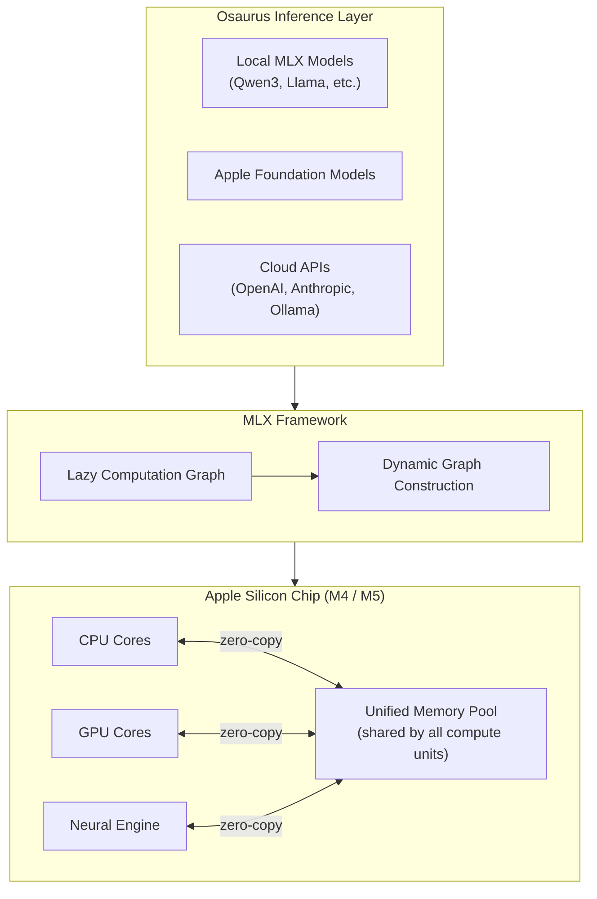
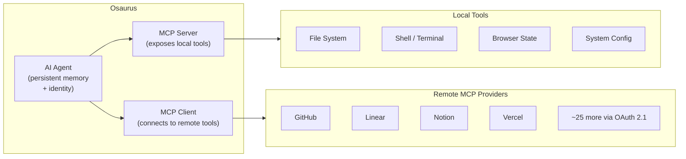
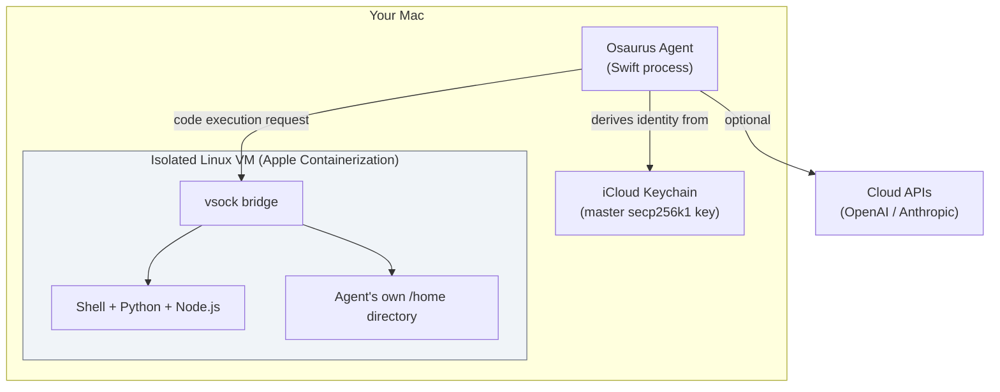

## The Question That Started Everything

When Terence Pae — formerly a software engineer at Tesla and Netflix — built Dinoki, a desktop AI companion for Mac, his early users kept asking the same uncomfortable question: *Why should I pay you for an app if I still have to pay for tokens every time I use it?*

Tokens are the metered units AI companies charge for processing your prompts and generating responses. Every question you ask, every document you summarize, every line of code you generate — each one draws down a balance at OpenAI, Anthropic, or Google. For a personal assistant that runs all day, the bill adds up. More importantly, every interaction travels across the internet to a server you do not control, in a data center you cannot inspect.

That question sent Pae down a different path. The result is **Osaurus** — an open-source, Apple Silicon–native application that landed in the TechCrunch spotlight in May 2026 after accumulating over 112,000 downloads, and that represents one of the clearest signals yet that the long-promised era of *private, local AI* is finally arriving for everyday developers and privacy-conscious professionals.

---

## Not Just Another Ollama

The local LLM landscape has a few familiar names: Ollama, LM Studio, llama.cpp. Each lets you download and run open-weight models locally. Osaurus does that too — but that description undersells what it actually is.

Osaurus bills itself as an **AI harness**: a control layer that manages agents, memory, tools, inference engines, and identity — all on your Mac, all under your control. Where Ollama gives you an inference server with a REST API, Osaurus gives you the entire operational stack that a production AI agent needs to be useful day after day.

Think of the difference this way:
- **Ollama** is like installing a database engine.
- **Osaurus** is like installing a database engine *plus* an ORM, a migration manager, a connection pool, a schema validator, and a query UI — pre-wired together.

Both are useful. But one takes you from zero to agent much faster.

---

## The MLX Engine Under the Hood

The foundation of Osaurus's local inference is **Apple's MLX framework**, an array computation library designed specifically for Apple Silicon's unified memory architecture.

Most computing systems — including standard laptops — maintain a hard boundary between CPU memory and GPU memory. When you run a language model, data has to shuttle back and forth across that boundary constantly, incurring copy overhead and bandwidth costs. Apple Silicon's M-series chips dissolve that boundary entirely: the CPU, GPU, and Neural Engine all share the same physical pool of memory. An MLX tensor computed by the CPU can be handed to the GPU without copying a single byte.

The practical consequence for language model inference is significant:

- On a **Mac mini M4 Pro with 64GB**, running Qwen3-Coder-30B-A3B through MLX delivers approximately **130 tokens per second**. The same model through Ollama's llama.cpp backend achieves about 43 tokens per second — roughly **3× slower**.
- Apple's **M5** Neural Accelerators push this further, delivering up to **4× improvement** over M4 baselines for time-to-first-token on 14B+ parameter models, pushing generation under 10 seconds for dense 14B models and under 3 seconds for 30B MoE variants.

Osaurus also integrates with **Apple Foundation Models** (the on-device models Apple ships with iOS and macOS) and **Liquid AI's LFM family**, giving users model choices that go beyond the Hugging Face catalog.

---

## The Harness Architecture: Agents, Memory, and Tools

Raw inference — generating text from a prompt — is only the first layer. What makes AI agents genuinely useful is everything that surrounds that inference: remembering previous conversations, having access to real tools, being able to execute code, and operating with a stable identity over time. Osaurus builds all of that.

### Persistent Agent Memory

Each agent in Osaurus carries a three-layer memory system:

1. **Identity layer**: who the agent is, its personality, its persistent knowledge about you.
2. **Pinned facts**: things you have explicitly told the agent to always remember ("I'm on a high-protein diet," "our production database is PostgreSQL 15").
3. **Per-session episodes**: a running log of recent conversations, distilled at session end so the agent can refer back to past interactions without loading thousands of tokens every time.

The typical memory injection at the start of a session is around **800 tokens or fewer**. For topics the agent hasn't encountered before, it injects zero. This keeps context windows from filling up with stale information while still making agents feel like they actually know you.

### MCP Integration

Osaurus speaks the **Model Context Protocol** — the open standard Anthropic introduced in late 2024 and subsequently donated to the Linux Foundation, which has since been adopted by OpenAI, Google DeepMind, and is now running in production at 78% of enterprise AI teams.

MCP is essentially a standardized way for AI agents to call external tools: fetch a web page, search a codebase, update a calendar event, query a database. Osaurus functions as both an MCP **server** (exposing your local tools to external MCP-compatible clients) and an MCP **client** (connecting to ~25 remote MCP providers, including GitHub, Linear, Notion, Vercel, and others, with OAuth 2.1 authentication).

---

## A Sandbox for the Paranoid (Reasonably So)

Giving an AI agent access to your file system and shell raises an obvious concern: what stops it from doing something catastrophic? Osaurus's answer is a hardware-isolated **Linux VM**, created using Apple's own Containerization framework.

When an agent needs to execute code, it does so inside a minimal Linux environment isolated from the rest of your Mac via a vsock bridge and VirtioFS mount. Each agent gets its own Linux user account and home directory with a full development environment — Python, Node.js, compilers — but it cannot reach outside its container without explicit permission. Your actual Mac files are not accessible unless you explicitly expose them.

This is a materially different approach from simply asking the model to be careful. It uses kernel-level process isolation enforced by hardware virtualization. The threat model is: even if a model behaves unexpectedly or a prompt injection attack tries to exfiltrate data, the sandbox limits the blast radius.

### Cryptographic Identity

Osaurus also takes an unusual step for a desktop app: every participant (users, agents) receives a **secp256k1 address** derived from a master key stored in iCloud Keychain. This creates a verifiable chain of trust — you can issue revocable credentials to agents, limit which agents can access which tools, and audit what each agent has done. It is the beginning of an architecture where agents are first-class security principals, not just prompts with a memory.

---

## Local, Cloud, or Both — Your Choice

One of Osaurus's design decisions that sets it apart from pure local-inference tools is that it does not treat cloud APIs as the enemy. Instead, it treats them as *another inference provider* — one you can opt into for tasks that benefit from frontier-scale reasoning, while keeping sensitive data and everyday tasks on-device.

The model router lets you set per-agent or per-task preferences:

- **Fully local**: for sensitive documents, legal drafts, personal health notes, or simply to avoid token costs.
- **Cloud when needed**: for tasks requiring frontier-model reasoning — complex multi-step analysis, cutting-edge code generation — routed to OpenAI or Anthropic.
- **Hybrid**: local agent orchestration with selective cloud calls for specific subtasks, which means only the specific subtask leaves your machine, not the entire conversation history.

This flexibility resolves the tension that most local AI setups force you into: either you accept the performance ceiling of on-device models, or you send everything to the cloud. Osaurus lets you draw the line wherever your privacy requirements and performance needs intersect.

---

## Why This Matters Beyond Developers

Osaurus is currently aimed squarely at technical users — its 64GB RAM requirement and open-source nature make it a developer's tool first. But the founders are already thinking about enterprise verticals where the privacy-first architecture is not just a nice-to-have; it is a regulatory requirement.

**Healthcare**: HIPAA-regulated patient data cannot be sent to a third-party API without a Business Associate Agreement and a clear audit trail. Running a clinical documentation assistant locally eliminates those concerns by construction.

**Legal**: Attorney-client privilege attaches to every conversation between a lawyer and client. Routing those conversations through a cloud AI provider introduces third-party access that complicates privilege claims. A local agent with no telemetry is a cleaner answer.

**Financial services**: SEC and FINRA regulations govern how firms handle non-public information. On-premise AI is increasingly the compliance department's preferred answer.

Beyond regulated industries, there is a simpler economics argument: cloud AI has **zero marginal cost per query** once the hardware is paid for. For teams running hundreds of queries per day, the math eventually favors on-device inference — especially as open-weight models continue closing the quality gap with proprietary frontier models.

---

## The Bigger Shift Osaurus Represents

Osaurus did not appear in a vacuum. It is the product of a specific confluence:

- **Apple Silicon** has made consumer hardware capable of running 30B+ parameter models at useful speeds, for the first time without requiring a dedicated GPU rack.
- **MLX** gave Apple a framework that extracts the maximum from that hardware, and Ollama adopting MLX as its default backend in March 2026 validated that MLX is now the correct inference stack for the platform.
- **Open-weight models** have closed most of the quality gap with proprietary APIs for a wide range of tasks.
- **MCP** created a standard protocol for agents to interact with the outside world — meaning a local agent can now plug into the same tool ecosystem as a cloud-hosted one.

The result is that the technical barriers to running a full-capability AI agent on your own machine — privately, persistently, cheaply — have fallen far enough that a two-person startup can build a polished implementation and attract 112,000 downloads without a major marketing budget.

That is the real story Osaurus tells. Not just "you can run AI locally on a Mac," but: the infrastructure gap between consumer hardware and production AI deployment has collapsed faster than most people expected. The question is no longer *whether* AI can run on your device. It is *what you build on top of it*.

---

## Sources

- [Osaurus GitHub Repository — osaurus-ai/osaurus](https://github.com/osaurus-ai/osaurus)
- [Osaurus brings both local and cloud AI models to your Mac — TechCrunch](https://techcrunch.com/2026/05/15/osaurus-brings-both-local-and-cloud-ai-models-to-your-mac/)
- [Osaurus: Open-Source macOS AI App for Running Local LLMs Offline — Firethering](https://firethering.com/osaurus-open-source-macos-ai-app-local-llm-offline/)
- [MLX: An array framework for Apple Silicon — GitHub](https://github.com/ml-explore/mlx)
- [Exploring LLMs with MLX and the Neural Accelerators in the M5 GPU — Apple Machine Learning Research](https://machinelearning.apple.com/research/exploring-llms-mlx-m5)
- [Ollama Goes MLX: What Apple's Framework Changes for Local LLMs vs. Foundry Local — Sebastian Gingter](https://gingter.org/2026/04/23/ollama-goes-mlx/)
- [Introducing the Model Context Protocol — Anthropic](https://www.anthropic.com/news/model-context-protocol)
- [Production-Grade Local LLM Inference on Apple Silicon: A Comparative Study of MLX, MLC-LLM, Ollama, llama.cpp, and PyTorch MPS — arXiv 2511.05502](https://arxiv.org/abs/2511.05502)
- [Local AI vs Cloud AI: What's Actually Happening in 2026? — Qubrid AI](https://www.qubrid.com/blog/local-ai-vs-cloud-ai-whats-actually-happening-in-2026)
- [Osaurus — Native macOS AI infrastructure for local and cloud models — Aitoolnet](https://www.aitoolnet.com/osaurus)
